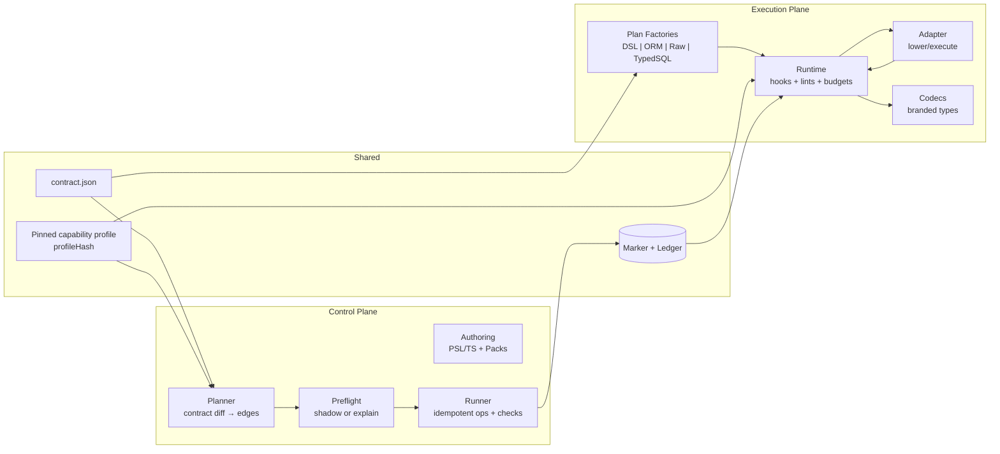
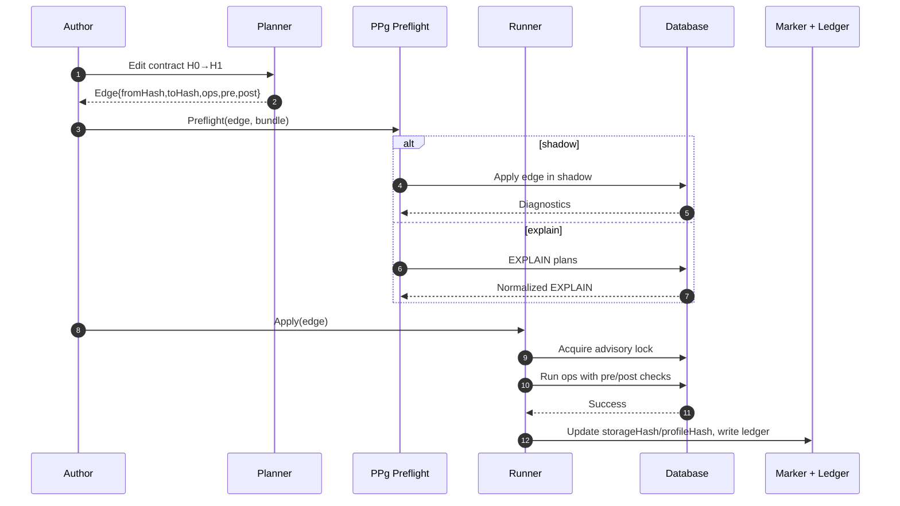
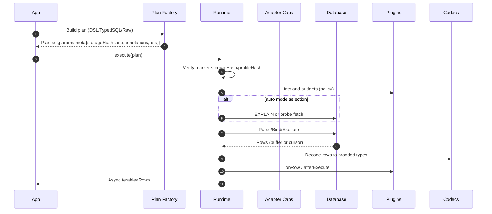
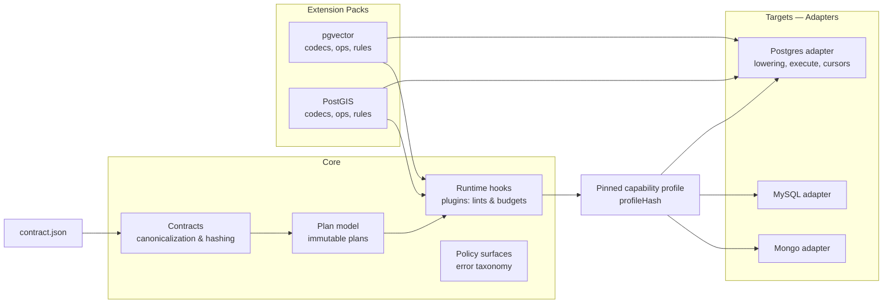

# Prisma Next — Architecture Overview

## Agent-First ORM

Prisma Next is an ORM designed for software agents. Agents need deterministic surfaces, machine-readable structure, and tight feedback loops. Prisma Next makes every operation explicit and inspectable so agents—and the humans working alongside them—always know what will happen, why it is safe, and how to adapt it.

This architecture focuses on three outcomes:

- **Deterministic behavior:** Declarative artifacts define every execution path, and verification happens before data is touched
- **Explicit, machine-readable contracts:** The data contract sets the system boundary, describing schema, capabilities, and policies for both queries and migrations
- **Guardrails with frequent feedback:** Authoring tools, PPg, and the runtime surface the intent, validation, and policy impact of each operation before it can cause drift

Prisma Next also addresses the largest weakness in Prisma 7: a monolithic, tightly coupled codebase. By modularizing responsibilities, new behaviors are introduced by composing modules and capability packs instead of patching core implementation.

## Guiding Principles

### Contract-first
The contract is the center of gravity. A single canonical `contract.json` defines what exists, what’s allowed, and what’s expected. Both planes ingest the same deterministic data and verify `storageHash` and `profileHash` against the database marker before acting. Contracts carry no executable logic; they are data that gates execution (ADR 006, ADR 010, ADR 021)

### Plans are the product
We don’t execute intent directly; we compile it into immutable Plans. Every query plan lowers to one statement for predictability and guardrails, and every migration is a contract→contract edge with verifiable pre and post conditions. Plans are hashable, auditable, and portable across environments (ADR 002, ADR 003, ADR 001, ADR 011)

### Thin core, fat targets
Keep the core small and stable—contracts, plan model, runtime lifecycle, and policy surfaces—while adapters and extension packs carry dialect and capability logic. Capabilities are declared in the contract and verified against the database so behavior is explicit and swappable without touching core (ADR 005, ADR 112, ADR 117)

### The framework provides affordances; targets implement specifics
The framework's job is to encode behaviour as *affordances* — interfaces, abstract base classes, shape constraints, SPI contracts (`IRNode`, `Namespace`, `Storage`, `ContractSerializer`, `SchemaVerifier`, `AuthoringContributions.entities`). Targets fill in *specifics* — rendering, dialect quirks, native types, target-only kinds. A target author who reaches for an affordance falls into the framework's intended shape by construction; the framework never branches on target identity, never carries target-shape fields on framework types, and never implements behaviour the target should implement. The three-layer polymorphic IR (framework interface → family abstract base → target concrete classes) and the entities contribution mechanism are the structural reifications of this principle. See [Three-layer polymorphic IR](architecture%20docs/patterns/three-layer-polymorphic-ir.md) and [SPI at the lowest consuming layer](architecture%20docs/patterns/spi-at-lowest-consuming-layer.md).

### Familiar with one target, fluent in another
Because every target consumes the same framework affordances, a developer fluent in one target reads any other target the same way. Learning the second target is learning its *specifics*, not a new architecture: the verifier interface is the same shape across SQL and Mongo families; the hydrator dispatches the same way; the namespace mental model carries even though the underlying object differs (Postgres `schema`, MySQL `database`, Mongo `db`). The framework's affordances produce a common form; the targets fill in their content. This is what makes ecosystem extensibility scale — third-party targets (Cockroach extending Postgres, MongoDB Atlas extending Mongo) inherit the form without inventing a new architecture.

### Domain-first surfaces
User-facing APIs speak in application-domain terms — models, fields, relations, identity — not in storage terms. Database-specific details (table names, column types, index configurations, FK constraint names) are available but secondary: they appear in explicit overlay stages or target-specific packs rather than being interleaved with domain intent. This keeps contracts readable as domain documentation and portable across targets (ADR 178, ADR 172)

### Explicit over implicit
No hidden multi round-trips, fallbacks, or adapter heuristics. Strategies are chosen explicitly via hints, annotations, and capability checks; raw SQL carries annotations so guardrails still apply. Multi-step behavior is expressed as explicit pipelines or transactions, not implicit client behavior (ADR 003, ADR 012, ADR 018, ADR 022)

### Compose, don’t configure
Behavior comes from adapters, extension packs, and runtime plugins, not global flags or magic modes. The ORM is optional and built on the relational DSL; packs contribute codecs, functions, and ops without changing core implementation (ADR 014, ADR 015, ADR 112)

### Modular, composable packages
All packages are modular and composable with strict tree‑shakability: only imported components end up in the bundle. Exports are curated and side‑effect free with named, per‑module entry points. We ship ESM‑compatible packages and TypeScript source to maximize modern bundler support and DX.

### Feedback before execution
Fast, targeted feedback at authoring, planning, and execution time. AST-first lints (SQL domain) and budgets inspect `plan.ast` when present; preflight in CI and marker checks catch risks early and explain what to fix, with stricter defaults in staging and production (ADR 022, ADR 029, ADR 051, ADR 021, ADR 115, ADR 162)

## Architecture at a Glance

Prisma Next is organized around two planes that share the contract and a pinned capability profile

- **Control Plane** (build time): authoring, planning, verifying, and applying contract changes
- **Execution Plane** (runtime): authoring, validating, and executing query plans against live data

Both planes operate on the same shared artifacts (produced and consumed via a small Common "shared" plane):

- **Data Contract:** Generated from PSL + TypeScript builders + extension manifests and distributed as JSON alongside TypeScript definitions, including `storageHash` and optional `executionHash` for execution defaults
- **Capability profile:** The contract declares required capabilities (and optional adapter pins) and emits a pinned `profileHash`. The runner verifies the database satisfies the contract and writes the same `profileHash` to the marker (ADR 117, ADR 021)
- **Plan Factories:** Compile declarative inputs into deterministic plans with hash-stamped metadata (DSL, ORM, Raw SQL, TypedSQL)
- **Guardrail Plugins:** Applied during plan creation, preflight, and runtime execution
- **Marker and ledger:** Database marker storing `storageHash` and `profileHash` plus an append-only ledger of applied edges for verification and audit (ADR 021, ADR 001)

### Diagram — System map



## Subsystems Index

Quick links to detailed subsystem specifications:

- [Data Contract](architecture%20docs/subsystems/1.%20Data%20Contract.md) — Canonical contract (`contract.json`) and types; hashing, capabilities, and marker verification
- [Contract Emitter & Types](architecture%20docs/subsystems/2.%20Contract%20Emitter%20&%20Types.md) — PSL/TS parsing, canonicalization, hashing, and `.d.ts` surface
- [Query Lanes](architecture%20docs/subsystems/3.%20Query%20Lanes.md) — Authoring surfaces (SQL DSL, raw SQL, ORM, TypedSQL) compiling to unified Plans
- [Runtime & Middleware Framework](architecture%20docs/subsystems/4.%20Runtime%20&%20Middleware%20Framework.md) — Execution pipeline, hooks, lints, budgets, and middleware
- [Adapters & Targets](architecture%20docs/subsystems/5.%20Adapters%20&%20Targets.md) — Adapter SPI for lowering and capability discovery
- [Ecosystem Extensions & Packs](architecture%20docs/subsystems/6.%20Ecosystem%20Extensions%20&%20Packs.md) — Pack model, function/operator registry, and branded codecs
- [Migration System](architecture%20docs/subsystems/7.%20Migration%20System.md) — Contract→contract edges, planner/runner, checks, and idempotency
- [Preflight & CI Integration](architecture%20docs/subsystems/8.%20Preflight%20&%20CI%20Integration.md) — Shadow/EXPLAIN, policy gates, and CI flows
- [No-Emit Workflow](architecture%20docs/subsystems/9.%20No-Emit%20Workflow.md) — TS-first authoring, watch plugins, and CI trust model
- [MongoDB Family](architecture%20docs/subsystems/10.%20MongoDB%20Family.md) — Mongo-specific contract, query, and runtime path
- [CLI](architecture%20docs/subsystems/11.%20CLI.md) — `prisma-next` distribution, command surface, init flow, and programmatic API
- [Error Handling](Error%20Handling.md) — Shared taxonomy (failures vs operational errors vs bugs) and boundary conversion patterns

## Control Plane — Self-Verifying Change

**Authoring**

- Contract authors update PSL or TypeScript builders
- Extension packs contribute capability manifests and code hooks

**Planning**

- Planner computes graph edges between contract revisions
- Each migration edge produces an immutable plan `{ edgeId, fromHash, toHash, ops, tasks, preconditions, postconditions }`

**Verification**

- Plans simulate locally via preflight to answer "Will this migration do what I expect?"
- Pre and post checks, capability gates, and policy checks run before apply

**Execution**

- Runner executes operations idempotently
- Drift detection ensures the database marker matches the expected `from` hash

**Feedback loop**

- Postconditions verify effects; PPg ledger records contract hashes and applied migrations
- Failures emit diagnostics tied back to contract statements or extension hooks

### Diagram — Migration preflight and apply



## Domains and Responsibilities

- Framework: Target‑agnostic core (contract base types, plan model, runtime SPI, tooling/CLI).
- SQL (Target‑Family): Dialect‑agnostic SQL family building blocks (contract shape/types, operations specs, emitter hook, lanes). This domain defines how SQL targets integrate but does not include a concrete dialect.
- Extensions: Concrete target and ecosystem packs (e.g., Postgres adapter/driver, codec packs, compat layers). Extensions implement Framework/Family SPIs and are dynamically composed.

Notes
- Family vs Target: “Target‑family” (SQL) applies to any SQL dialect; “target” is a concrete dialect (Postgres, MySQL). Family code lives in the SQL domain; dialect code lives in Extensions.
- Repository layout: concrete targets (dialects), adapters, and drivers live under `packages/3-targets/**`. Adapters commonly expose multiple entrypoints from a single package — `./adapter` (shared core), `./control` (migration), `./runtime` (runtime) — mapped to planes via subpath globs in `architecture.config.json`.
- Plane boundaries: Shared plane hosts type‑only code and validators safe for both planes. Migration and Runtime must not import code across planes; runtime consumes artifacts and shared‑plane types only.
## Execution Plane — Runtime Assertions

**Authoring**

- Queries are defined through a relational DSL, TypedSQL, or generated functions from extension packs
- Authoring surfaces capability annotations so agents understand available operations

**Planning**

- Every query compiles to a plan `{ sql, params, meta: { storageHash, optional profileHash, lane, annotations, refs } }`
- Plans are immutable and executable across environments

**Verification**

- Runtime verifies marker `storageHash` and `profileHash` equality with the contract and applies lint rules and budgets configured by policy
- Extensible linting highlights potential issues before execution
 - Runtime validates declared codec `typeId` coverage: if the contract declares a per-column `typeId` (via extension decoration), a matching codec must be present in the composed registry or execution fails with a stable error

**Execution**

- Runtime streams results through adapters while extension codecs decode branded types deterministically
- Results are exposed as `AsyncIterable<Row>` with pre‑emission buffer vs stream selection based on adapter capabilities and configured thresholds (ADR 124, ADR 125)
- Guardrail plugins observe execution for telemetry, throttling, or policy enforcement
 - Query lanes infer result types from `contract.d.ts` (or builder generics in no‑emit mode) and do not depend on runtime registries for typing; runtime owns encode/decode implementations

**Feedback loop**

- Immediate feedback on query success or failure, capability mismatches, or contract drift
- Plans and results are logged in machine-readable formats for agents and observability tooling

### Raw lane parity

- Raw SQL authoring uses `root.raw\`...\`` or `root.raw(text, options)` to build the same immutable Plans as the DSL. Plans are normalized to a stable fingerprint (ADR 024) so telemetry, caching, and guardrails apply uniformly across lanes.

### Diagram — Query execution


## Guardrails and Feedback Matrix

| Stage            | Control Plane                                                  | Execution Plane                                                     |
|------------------|------------------------------------------------------------------|-----------------------------------------------------------------|
| Authoring        | Contract builders validate schema intent and capability usage.   | DSL annotations and TypedSQL expose capabilities and policies. |
| Planning         | Planner simulates edges; hash-stamps preconditions and outcomes. | Plan factories attach lint/budget annotations. |
| Preflight/Verify | PPg answers “Will this migration do what I expect?” and enforces policy gates. | Runtime verifies marker equality and applies guardrail plugins. |
| Execution        | Runner enforces idempotency, markers, and extension requirements. | Streaming execution monitored by guardrail plugins and budgets. |
| Post-feedback    | PPg ledger, drift detectors, and diagnostics inform authors.     | Policy outcomes and drift indicators feed back to authoring tools. |
## Modularity and Extensibility

Prisma 7 required touching multiple layers of a monolithic Rust/TypeScript codebase to add features. Prisma Next treats the core as a stable execution kernel and exposes extension hooks instead.

- **Extension packs** supply capabilities, migration operations, codecs, and policies in manifest-driven bundles
- **Adapters** implement database-specific behavior behind capability interfaces
- **Plugins** compose runtime guardrails (budgets, telemetry, policy enforcement) without altering the executor
- **Capability discovery** ensures new behavior is discoverable and opt-in through explicit contract declarations

Contributors extend behavior by publishing packs or adapters. Core recompilation is not required.

## Package Layout & Families

To make the "thin core, fat targets" principle enforceable in code, the repository is organized by rings (clean architecture) and by target family (e.g., SQL and Mongo). See ADR 140 for details.

Key points:
- Core owns contracts, plan model, and a target-agnostic runtime kernel.
- Family packages (e.g., `sql/`) contain family-specific contract types/emitter hooks, lanes, and runtime implementation. Concrete adapters and targets live in the `targets/` domain.
- CLI is family-agnostic: framework CLI reads config and calls family-provided helpers; pack assembly logic lives in family packages, not the framework CLI.
- No long-lived transitional shims are maintained; there are no external consumers. Short-lived internal bridges are allowed only during migration.

Example layout (with numbered prefixes for visual hierarchy):

```
packages/
  1-framework/           # Domain 1: Framework (target-agnostic)
    0-foundation/
      contract/          # contract types + plan metadata
    1-core/
      control-plane/     # control plane domain actions
      execution-plane/   # execution plane types
      operations/        # target-neutral operation registry + helpers
    2-authoring/
      contract/          # shared authored storage descriptor types
    3-tooling/
      cli/               # framework CLI (config-only, family-agnostic)
      emitter/           # contract emitter with family hooks
  2-sql/                 # Domain 2: SQL family
    1-core/
      contract/          # SQL contract types (shared plane)
      operations/        # SQL operation types (shared plane)
      schema-ir/         # SQL schema IR types
    2-authoring/
      contract-ts/       # SQL TS authoring surface
    3-tooling/
      emitter/           # SQL emitter hook
      family/            # SQL family descriptor and helpers
    4-lanes/
      relational-core/   # schema + column builders, operation attachment
      sql-lane/          # relational DSL + raw lane
      orm-lane/          # ORM builder, includes, relation filters
      query-builder/     # query builder lane
    5-runtime/           # SQL runtime extending RuntimeCore from framework-components
  2-mongo-family/        # Domain 2: Mongo family
    1-foundation/
      mongo-contract/    # Mongo contract types + validation
    2-authoring/
      contract-psl/      # Mongo PSL interpretation
      contract-ts/       # Mongo TS authoring surface
    3-tooling/
      emitter/           # Mongo emitter hook
    4-query/
      query-ast/         # Mongo query plan + filter AST
    5-query-builders/
      orm/               # Mongo ORM client
      query-builder/     # Mongo query builder (reads + writes + find-and-modify)
    6-transport/
      mongo-lowering/    # lowering interfaces and transport contracts
      mongo-wire/        # wire commands and result types
    7-runtime/           # Mongo runtime extending RuntimeCore from framework-components
    9-family/            # Mongo family descriptor and family pack
  3-mongo-target/        # Domain 3: Mongo target packages
    1-mongo-target/      # Mongo target pack
    2-mongo-adapter/     # Mongo adapter
    3-mongo-driver/      # Mongo driver
  3-targets/             # Domain 3: Targets
    3-targets/
      postgres/          # Postgres target descriptor
    6-adapters/
      postgres/          # Postgres adapter (multi-plane: shared, migration, runtime)
    7-drivers/
      postgres/          # Postgres driver
  3-extensions/          # Domain 3: Extensions
    pgvector/            # pgvector extension pack
```

`packages/3-targets/**` remains the canonical generic target domain for dialect-scoped target, adapter, and driver packages such as Postgres. `packages/3-mongo-target/**` is the Mongo-specific counterpart under the same broader target concept, and contributors should keep following the repo's `{domain}/{subdomain}` naming pattern when adding new package groups.

Dependency direction is strictly one-way: `core → authoring → tooling → lanes → runtime → adapters`. Numbered prefixes reinforce the hierarchy: lower numbers can be imported by higher numbers, never the reverse. Enforce with Dependency Cruiser using data-driven configuration from `architecture.config.json`.

### Diagram — Thin core, fat targets


## Role of Prisma Postgres (PPg)

PPg is a contract-aware Postgres service that amplifies determinism and feedback.

- **Preflight service:** answers "Will this migration do what I expect?" by simulating plans against staged data
- **Contract ledger:** records contract hashes and applied edges to detect drift instantly

PPg is optional, but using it delivers zero-touch guardrails for teams and agents.

## Operating the System

- **Drift handling:** Marker checks, plan hashes, and contract verification detect drift at startup, before queries, and throughout migration workflows
- **Environment policies:** Development environments allow automatic reconciliation while staging and production enforce strict guardrails and human approval
- **Observability:** Plans, guardrail outcomes, and contract changes are logged in machine-readable formats for agents and dashboards

## Roadmap Snapshot

1. **MVP:** Postgres support, contract emit, plan factories, runtime guardrails, PPg preflight previews
2. **Pilot:** Rename/drop with policy hints, richer diagnostics, pack catalog
3. **GA:** Hardened runtime, policy packs, additional database adapters, contributor-friendly extension tooling
