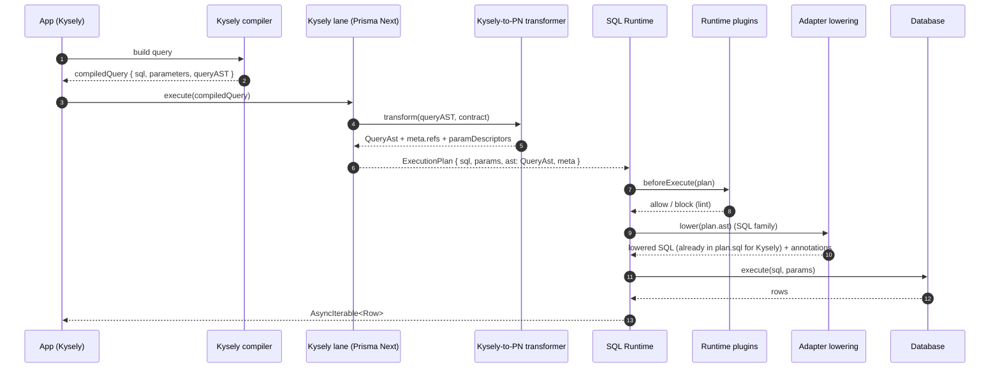

# ADR 162 — Kysely lane emits PN SQL AST for plugin inspection

> **Status:** Superseded. The Kysely lane was removed from Prisma Next. This ADR is retained for historical context only. See [ADR-INDEX.md](../ADR-INDEX.md) for the current lane set.




## Context

We added a **Kysely query lane** to Prisma Next. This is appealing because it lets users write queries using Kysely’s fluent builder while still executing through the Prisma Next runtime.

Prisma Next’s runtime plugin system (budgets, lints, telemetry, etc.) is intended to be **lane-agnostic** and to operate on **Prisma Next-native plan structure**, not on authoring-library internals.

Today, the Kysely lane executes compiled SQL, but it does not attach a Prisma Next SQL AST to the plan (`plan.ast` is missing). As a result, runtime plugins cannot reliably inspect the query’s structure to apply guardrails (for example, “DELETE without WHERE”).

## Problem

We need Kysely-authored plans to be **first-class Prisma Next plans**:

- plugins must be able to inspect query structure without parsing SQL strings
- lowering must remain in the Prisma Next SQL family (adapter SPI), not embedded in lanes
- the plan must contain **PN-native references** (`meta.refs`) and parameter descriptors (`meta.paramDescriptors`) consistent with DSL/ORM plans

In other words: Kysely can be an authoring surface, but the plan must speak Prisma Next.

## Constraints and principles

- **Plans are the product** (ADR 002, ADR 011): plans must be immutable, auditable artifacts that can be inspected before execution.
- **Lane-agnostic plugin interface** (ADR 014): plugins should not depend on a specific authoring library (Kysely) or branch on `meta.lane` to function.
- **No Kysely-shaped AST in PN**: Prisma Next AST must remain **lane-neutral** and usable by multiple lanes (DSL, ORM, Kysely, future lanes).
- **Thin core, fat targets** (ADR 005) and **adapter SPI for lowering** (ADR 016): dialect-specific SQL rendering belongs in adapters/targets, not in the AST model or lanes.
- **Resolved refs**: the lane must emit **canonical** `{ table, column }` references aligned with the contract, not best-effort strings.
- **Forcing function**: unsupported constructs should throw rather than silently degrade to “raw SQL heuristics”.

## Decision

### 1) Kysely lane attaches Prisma Next SQL AST (`QueryAst`) to plans

The Kysely lane will transform Kysely’s `compiledQuery.query` AST into Prisma Next’s SQL-family AST and attach it at:

- `ExecutionPlan.ast: QueryAst`

The lane also sets:

- `ExecutionPlan.meta.lane = 'kysely'` for observability only

Plugins remain lane-agnostic and primarily key off:

- `plan.ast` (structure)
- `plan.meta.refs` (canonical references)
- `plan.meta.paramDescriptors` (parameter metadata)

### 2) Expand the PN SQL AST to support the demo/Kysely surface (lane-neutral)

The current PN SQL AST is intentionally minimal. We will extend it where needed to represent the subset of SQL used by:

- `examples/prisma-next-demo/src/queries` (as the acceptance scope), and
- the Kysely equivalents we add under `examples/prisma-next-demo/src/kysely`

Key additions include (non-exhaustive):

- boolean composition (`and` / `or`) for WHERE/ON clauses
- additional predicate operators (at minimum `like`, `in`)
- list literals / value lists for `IN (...)`
- join ON expressiveness beyond `eqCol`
- preserving “selectAll intent” (even if normalized to explicit projection)

### 3) Kysely lane emits PN-native refs and prevents ambiguity

The lane must populate `plan.meta.refs` with **canonical** references and prevent plans where refs cannot be deterministically resolved.

Minimum guardrails:

- If multiple tables are in scope (e.g. joins), reject unqualified column references.
- Reject ambiguous `selectAll()` / `select *` in multi-table scope unless it is explicitly scoped.

If ambiguity still reaches the transformer (raw fragments, new Kysely node shapes, etc.), we throw rather than emitting best-effort refs.

### 4) Param mapping + param descriptors are first-class

The lane must ensure that:

- `plan.params` matches Kysely’s positional parameters (`compiledQuery.parameters`)
- the PN AST uses parameter references (`ParamRef.index`) aligned with `plan.params`
- `plan.meta.paramDescriptors` is populated so runtime encoding and plugins can understand which columns parameters relate to when possible

To keep shared plan metadata lane-neutral, we add a lane-generic param source marker:

- extend `ParamDescriptor.source` to include a generic lane value (e.g. `'lane'`), and rely on `meta.lane` for the specific lane id (`'kysely'`)

### 5) Prove the concept by implementing an AST-first lints plugin and migrating it to SQL domain

We will:

- reimplement the lints plugin to lint SQL plans via `plan.ast` + `plan.meta` (not by regexing SQL)
- use this as the proof that Kysely plans are compatible with Prisma Next runtime plugin analysis and PN SQL lowering
- migrate the lints plugin out of framework into a SQL-owned location and export it from a SQL surface

Minimum lint rules to validate the approach:

- block **DELETE without WHERE**
- block **UPDATE without WHERE**
- flag **unbounded SELECT** where detectable from the AST (`SelectAst.limit`)
- preserve and lint **select-all intent** (even if lowered/normalized)

### 6) Lowering equivalence expectation

For supported query constructs, lowering the transformed PN SQL AST should produce SQL that is:

- **string-equal** to Kysely’s compiled SQL where deterministic and practical, or
- **semantically equivalent** when exact string equality is not practical (for example due to harmless aliasing/formatting differences)

“Semantically equivalent” here means the statement has the same execution meaning for Prisma Next runtime purposes (same statement kind, source tables, predicates, ordering, limits, mutation targets, and returning shape).

## Responsibilities (who owns what)

- **Kysely lane**:
  - compiles via Kysely to `{ sql, parameters, queryAST }`
  - runs ambiguity guardrails
  - transforms Kysely AST → PN `QueryAst`
  - constructs `ExecutionPlan` with PN-native `meta.refs` and `meta.paramDescriptors`
- **SQL family (core + adapters)**:
  - owns the PN SQL AST model (`QueryAst`)
  - owns lowering rules and SQL rendering (ADR 016)
  - remains free of Kysely-specific node shapes
- **Runtime plugins**:
  - inspect `plan.ast` and `plan.meta` in a lane-agnostic way
  - should not depend on Kysely’s AST or branch on `meta.lane` for correctness

## Naming choices

- **`meta.lane = 'kysely'`**:
  - chosen for observability/debugging and telemetry attribution
  - not intended as a behavioral switch for plugins
- **“PN-native refs”** means **canonical `{ table, column }` pairs** aligned with contract keys in `meta.refs`, not SQL-quoted identifiers or Kysely’s identifier nodes.
- **`ParamDescriptor.source = 'lane'`** (proposed) indicates the param metadata was produced by a lane (neither `'dsl'` nor `'raw'`), with the lane id captured separately in `meta.lane`.
- **“Equivalent SQL”** means semantic equivalence for execution and plugin analysis, not byte-for-byte string identity in every case.

## Consequences

### Benefits

- Plugins can safely inspect Kysely-authored plans without SQL parsing or Kysely coupling.
- Kysely becomes a true authoring lane: plans remain Prisma Next-native artifacts.
- The PN SQL AST is validated against real-world authoring needs (demo parity), improving robustness.

### Costs

- We must expand the PN SQL AST and update adapter lowering accordingly.
- We must define and enforce ambiguity guardrails for Kysely authoring.
- We must migrate and rework the lint plugin (and potentially adjust how “selectAll intent” is represented).

## Alternatives considered

- **Keep Kysely AST in plans and teach plugins Kysely**: rejected (breaks lane-agnostic plugin goal; couples runtime to authoring library).
- **Heuristic SQL parsing for all lanes**: rejected (brittle; undermines “plans are inspectable artifacts”).
- **Best-effort refs with “unknown” markers**: rejected for MVP (we want refs to be trustworthy; ambiguity throws).

## Worked example (conceptual)

```ts
// Kysely authoring
const compiled = db.selectFrom('user').selectAll().where('id', '=', userId).limit(1).compile();

// Kysely lane emits PN-native plan
const plan: ExecutionPlan = Object.freeze({
  sql: compiled.sql,
  params: compiled.parameters,
  ast: {
    kind: 'select',
    from: { kind: 'table', name: 'user' },
    project: [/* expanded projection */],
    where: { kind: 'bin', op: 'eq', left: { kind: 'col', table: 'user', column: 'id' }, right: { kind: 'param', index: 1 } },
    limit: 1,
  },
  meta: {
    lane: 'kysely',
    // ...
    refs: { tables: ['user'], columns: [{ table: 'user', column: 'id' }] },
    paramDescriptors: [{ index: 1, source: 'lane', refs: { table: 'user', column: 'id' } }],
  },
});
```

## Related ADRs

- ADR 002 — Plans are Immutable
- ADR 011 — Unified Plan Model
- ADR 014 — Runtime Hook API
- ADR 016 — Adapter SPI for Lowering
- ADR 012 — Raw SQL Escape Hatch (the fallback when AST is absent)
- ADR 013 — Lane Agnostic Plan Identity
- ADR 022 — Lint Rule Taxonomy

