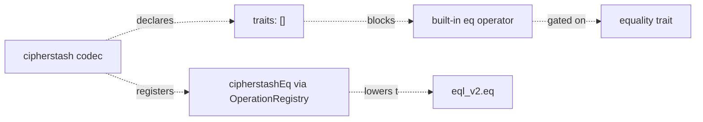
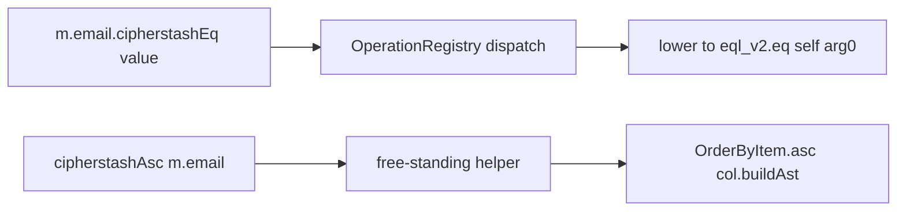

# ADR 214 — Extension operator surface: namespaced replacement operators and the predicate/helper split

## Status

Accepted. The namespaced-replacement-operator pattern landed with the initial `@prisma-next/extension-cipherstash` release alongside the original `cipherstashEq` / `cipherstashIlike` surface, and was extended with the predicate/helper split when the encrypted-codec catalogue grew to cover numbers, dates, booleans, and JSON ([TML-2375](https://linear.app/prisma-company/issue/TML-2375)). This ADR records both decisions in one place; the cipherstash extension is the canonical worked example.

## At a glance

Extensions whose codec output cannot back a framework built-in operator's wire semantics must (i) declare zero of the relevant codec traits so the built-in is not synthesised on the codec, and (ii) ship a **namespaced replacement** that lowers to the extension-correct SQL. The cipherstash codec declares no `equality` trait so `m.email.eq(...)` is unreachable (it would lower to SQL `=` against a randomized EQL ciphertext and silently return zero rows); the namespaced replacement `m.email.cipherstashEq(...)` lowers to `eql_v2.eq(...)` which short-circuits through the per-column EQL index.



The operator surface itself decomposes along the framework's predicate/non-predicate split. Predicate operators (return boolean) register as column methods through the `OperationRegistry` and flow through trait-dispatched `QueryOperationTypes`. Non-predicate operators (return non-boolean shapes like `OrderByItem` for sort or codec-typed `Expression` for SELECT-expression accessors) ship as **free-standing helper functions** exported from the extension's runtime entry, not as column methods. The two surfaces are typed and dispatched differently because their dispatch contracts differ.



## Context

The framework's query surface composes from two layers:

- **Codec traits** (per [ADR 202 — Codec trait system](./ADR%20202%20-%20Codec%20trait%20system.md)). Each codec declares the semantic traits its values back at the wire level (`equality`, `order`, `numeric`, `textual`, `boolean`). Operators are gated on these traits — the built-in `eq` operator is *synthesised* on any column whose codec carries the `equality` trait, and its lowering is plain SQL `=`. The trait set is a contract: it says "for codecs that declare this trait, SQL `=` is the correct lowering."
- **Operation registry** (per [ADR 113 — Extension function & operator registry](./ADR%20113%20-%20Extension%20function%20%26%20operator%20registry.md) and [ADR 206 — Operations as TypeScript functions](./ADR%20206%20-%20Operations%20as%20TypeScript%20functions.md)). Operations are first-class TS functions whose signature is the type surface and whose body builds the AST. The registry is a flat method-keyed map; the model accessor walks the registry per-column and synthesises the corresponding column methods through `QueryOperationTypes`.

Extensions that ship encrypted, geographic, vector, or otherwise specially-encoded column types face a problem the built-in operator surface cannot solve directly. The cipherstash case is the load-bearing example:

- An EQL `eql_v2_encrypted` payload contains a randomized per-encrypt nonce. Two encrypts of the same plaintext produce different byte sequences. SQL `=` over the JSONB column will *always* return `false` for two encrypted values — even when the underlying plaintexts are equal.
- The correct equality check is `eql_v2.eq(left, right)`, which short-circuits through the per-column `unique` EQL index emitted by the codec lifecycle hook (per [ADR 213 — Codec lifecycle hooks](./ADR%20213%20-%20Codec%20lifecycle%20hooks.md)). The function returns the right semantic answer.

If the cipherstash codec declared the `equality` trait, the framework's built-in `m.email.eq(...)` would synthesise on cipherstash columns and lower to SQL `=` — a wrong-SQL footgun. Conversely, *suppressing* the built-in `eq` without offering a replacement leaves the user without an equality check. The codec is therefore forced to take both steps: declare zero traits to block the built-in *and* offer a namespaced replacement that lowers to the correct EQL function.

The same pattern surfaced when the extension grew non-boolean operators (sort over encrypted columns; JSON SELECT-expression accessors over encrypted JSON). These don't fit the column-method dispatch contract the predicate operators use — `ORDER BY` takes `OrderByItem` values, not columns; JSON accessors return `Expression` values that are themselves usable as input to follow-on operators. Trying to register them through the operator registry collapses to an empty surface (the registry's non-predicate path keys chainable methods off the *return* codec's traits, and cipherstash codecs declare none) and forcing a column-method shape would require widening the registry's return-type contract or introducing non-uniform per-operator return-type machinery — both larger framework changes.

## Decision

### Part A — Namespaced replacement operators

When an extension's codec output cannot back a framework built-in operator's wire semantics:

1. **Declare zero of the relevant codec traits** on the codec descriptor. This is a contract statement: "for this codec, the framework's built-in lowering is incorrect." The framework's trait-gated synthesis then does not surface the built-in on columns using this codec.
2. **Ship a namespaced replacement operation** through the operation registry. The operation's name must not shadow the framework built-in — `cipherstashEq`, not a re-binding of `eq`. The flat method-keyed `OperationRegistry` enforces this structurally (operator overriding is disallowed by [ADR 113](./ADR%20113%20-%20Extension%20function%20%26%20operator%20registry.md)).
3. **The replacement lowers to the extension-correct SQL.** For cipherstash, this is the corresponding `eql_v2.*` function family.

The naming convention is `<extensionPrefix><BuiltInName>` (e.g. `cipherstashEq`, `cipherstashIlike`, `pgvectorDistance`). The prefix flags the divergence at the call site — a user reading `m.email.cipherstashEq(plaintext)` sees that this is *not* the framework built-in, that the wire-level semantics differ, and that the dispatch routes through the cipherstash extension.

The trait-removal half is regression-pinned per package (cipherstash has `test/equality-trait-removal.test.ts` asserting that every cipherstash codec advertises only `cipherstash:`-namespaced traits, never the framework `equality` trait). The flat-keyed-registry half is structurally enforced by the framework — there is no API to bind a name twice.

### Part B — Predicate / non-predicate split

Extension operators decompose along the framework's natural split between *predicate operators* (return a codec carrying the `boolean` trait) and *non-predicate operators* (everything else: sort comparators, SELECT-expression accessors, computed projections).

| Shape | Surface | Dispatch contract | Example |
|---|---|---|---|
| Predicate operator | Column method (`m.col.opName(...)`) registered via the operation registry | Trait- or codec-id-keyed `QueryOperationTypes` entry; synthesised on columns whose codec carries the required trait | `m.email.cipherstashEq(value)`, `m.salary.cipherstashGt(value)` |
| Non-predicate operator | Free-standing helper function (`opName(col, ...)`) exported from the extension's runtime entry | Typed at the function's declaration site; no registry participation | `cipherstashAsc(m.salary)`, `cipherstashJsonbPathQueryFirst(m.profile, '$.theme')` |

The trade-off is two import sites for the operator surface (column-accessor autocomplete for predicates, named imports for non-predicates). This is acceptable because the type system enforces the boundary naturally — `OrderByItem` is not assignable to `Expression<ScopeField>` and vice versa — and the alternative shapes have worse properties:

- **Forcing non-predicates through column-method registration** would require widening the registry's return-type contract to admit non-boolean returns and threading the return type through `QueryOperationTypes`-style dispatch tables. The framework's model-accessor synthesis keys chainable comparison methods off the *return codec's* traits; cipherstash codecs declare empty traits to close the wrong-SQL footgun, so the chainable-methods object for a non-predicate result collapses to empty. No useful surface results.
- **Forcing predicates through free-standing helpers** loses the column-accessor autocomplete (`m.email.<tab>`) that makes the framework's authoring surface productive. The trait dispatch the model accessor performs against the column codec's trait set lets the predicate appear *only* on columns whose codec advertises the operator's required trait — the right ergonomics for boolean predicates that live in `WHERE` clauses.

Free-standing helpers construct AST primitives directly without introducing new framework concepts. Sort helpers return `OrderByItem.asc(col.buildAst())` (the framework's `OrderByItem` constructor; bare-column ordering is its default shape). JSON SELECT-expression helpers use `buildOperation({ method, args, returns, lowering })` with a `function`-strategy template — the same framework primitive that powers the predicate registrations. Zero framework changes; the helpers are entirely additive within the extension package.

### Part C — Multi-codec dispatch via namespaced traits

When an extension ships multiple codecs that should share a predicate (e.g. cipherstash's `Gt` / `Gte` / `Lt` / `Lte` apply to four codecs — string, double, bigint, date — that all carry the order-and-range capability), dispatch through a **codec-namespaced trait** rather than enumerating codec ids per operator. The cipherstash extension declares `cipherstash:equality`, `cipherstash:order-and-range`, `cipherstash:free-text-search`, and `cipherstash:searchable-json`; predicates target the trait, and a codec that carries the trait surfaces the operator automatically.

Namespaced traits sit *outside* the framework's closed `CodecTrait` union ([ADR 202](./ADR%20202%20-%20Codec%20trait%20system.md)) deliberately:

- The framework union is closed for the built-in trait set so the trait-gated synthesis can reason exhaustively.
- Extension traits are open-ended — they're per-extension capability declarations the framework does not need to recognise.
- Keeping them outside the union preserves the wrong-SQL-footgun guarantee from Part A: a cipherstash codec advertising `cipherstash:equality` does *not* satisfy the framework's `equality`-trait gate, so the built-in `eq` does not surface.

The cast from extension trait names to the framework-internal `CodecTrait` array shape is localised to one site per extension with a rationale comment (per the workspace's typesafety rules). In cipherstash this lives at `src/extension-metadata/constants.ts` with an 18-line block citing the framework type, the model-accessor's `readonly string[]` widening at the dispatch site, and the wrong-SQL-`eq` footgun rationale.

### Part D — Exhaustivity of the codec set

When an extension ships multiple codecs and an operator implementation dispatches on the codec id (e.g. the cipherstash `asEncryptedParam` operator helper needs to know which envelope subclass to wrap the user's plaintext in), the dispatch table is typed `Readonly<Record<CodecId, Coercer>>` over a closed-union `CodecId` type derived from the extension's stable-order codec-id tuple:

```ts
const CIPHERSTASH_CODEC_IDS = [
  CIPHERSTASH_STRING_CODEC_ID,
  CIPHERSTASH_DOUBLE_CODEC_ID,
  CIPHERSTASH_BIGINT_CODEC_ID,
  CIPHERSTASH_DATE_CODEC_ID,
  CIPHERSTASH_BOOLEAN_CODEC_ID,
  CIPHERSTASH_JSON_CODEC_ID,
] as const;
type CipherstashCodecId = (typeof CIPHERSTASH_CODEC_IDS)[number];

function isCipherstashCodecId(codecId: string): codecId is CipherstashCodecId {
  return (CIPHERSTASH_CODEC_ID_SET as ReadonlySet<string>).has(codecId);
}

const ENVELOPE_COERCERS: Readonly<Record<CipherstashCodecId, EnvelopeCoercer>> = {
  [CIPHERSTASH_STRING_CODEC_ID]: coerceToEncryptedString,
  // … one entry per codec id in the tuple
};
```

Adding a new codec id to the tuple without a matching dispatch-table entry becomes a TS error at the declaration site. The runtime fallback diagnostic lives on the `isCipherstashCodecId` guard's negative branch with the same wording the legacy `if`-chain would have produced — a hostile caller that hands in a non-cipherstash codec id still gets an actionable error.

## Consequences

### Positive

- **Wrong-SQL footgun closed by construction.** The trait-removal half ensures the framework's built-in lowering is not reachable on the extension's columns; the namespaced-replacement half offers the correct lowering at a distinct name. A user calling `m.email.eq(...)` on a cipherstash column gets a `no such method` error at the model accessor (compile-time + runtime) rather than a silently-wrong query result.
- **Both halves of the operator surface use the same dispatch contracts the framework already ships.** Predicates flow through the existing `OperationRegistry` + `QueryOperationTypes` + model-accessor synthesis. Non-predicate helpers are pure functions exported from the runtime entry; they consume the framework's existing `OrderByItem` / `Expression` primitives without introducing new framework concepts.
- **Namespaced traits scale without re-opening the framework union.** A future extension can declare its own `<extension>:<capability>` traits and target them from its operators without coordinating a change in the framework's closed `CodecTrait` union. The cipherstash extension is the first user of this pattern; others can adopt it freely.
- **Exhaustivity over the codec set is compile-time-enforced.** New codecs that join the extension's tuple must wire their dispatch entries in the same diff or the package fails to typecheck. The closed-union `CodecId` type localises the discoverability of the codec set to one constant declaration.

### Trade-offs

- **Two import sites for the operator surface.** Predicates surface through column-accessor autocomplete; non-predicate helpers come in via named imports from the extension's runtime entry. The framework cannot offer a single uniform surface here because the dispatch contracts genuinely differ. Documented in package READMEs and worked-example tests.
- **The naming-convention prefix is per-extension.** No mechanical guarantee enforces that an extension uses its declared prefix on every namespaced replacement; the framework's flat-keyed registry only enforces uniqueness across all loaded packs. Extension authors are responsible for their own naming hygiene. Linear team-level review is the backstop.
- **Cast from extension trait names to the framework's `CodecTrait` array.** Localised per-extension to one rationale-anchored site; the alternative (widening `CodecTrait` to `string`) would compromise the framework's closed-union safety for built-in consumers.
- **Type-system enforcement of "this trait is namespaced, not framework"** rests on the framework's `CodecTrait` union staying closed. If the framework ever widens to admit arbitrary string traits, the wrong-SQL-`eq` footgun protection erodes. Pinned per-extension regression test (cipherstash: `equality-trait-removal.test.ts`) catches the regression at the package boundary.

### Non-goals

- **Operator-name overriding.** Extensions cannot rebind a framework built-in operator's name to their own lowering; the registry's flat-keyed shape disallows it by construction. An extension that wants a different equality story for its codec ships a namespaced replacement and accepts the additional name at the call site.
- **Cross-extension trait coordination.** Two extensions declaring the same `<namespace>:<capability>` trait name is a registry-level collision and is rejected at pack-load. Extensions choose their own namespace prefix (`cipherstash:`, `pgvector:`, etc.).

## Worked example — cipherstash

The cipherstash extension is the canonical worked example for this ADR. Both halves of Part B (predicate vs free-standing helper) ship in `@prisma-next/extension-cipherstash`:

```ts
import {
  cipherstashAsc,
  cipherstashDesc,
  cipherstashJsonbPathQueryFirst,
  cipherstashJsonbGet,
} from '@prisma-next/extension-cipherstash/runtime';

// Predicate operators — column-method surface, registry-dispatched
const customers = await db.orm.User
  .where((u) =>
    and(
      u.email.cipherstashIlike('%@example.com'),
      u.salary.cipherstashGt(50_000),
      u.birthday.cipherstashLt(new Date('1990-01-01')),
    ),
  )
  // Non-predicate helpers — free-standing function surface, declaration-typed
  .orderBy((u) => [cipherstashAsc(u.salary), cipherstashDesc(u.email)])
  .all();
```

The predicate operators (`cipherstashIlike`, `cipherstashGt`, `cipherstashLt`) surface on the column accessor via the operation registry and the trait-gated `QueryOperationTypes` entries. The helpers (`cipherstashAsc`, `cipherstashDesc`) are pure functions consuming column expressions and returning `OrderByItem` values. The two surfaces compose at the query-builder layer without either needing to know about the other.

Per-codec coverage and per-operator lowering details live in the package's behavioural-invariant tests (`packages/3-extensions/cipherstash/test/operator-lowering.test.ts`, `test/helpers.test.ts`) and in the README's operator-surface tables.

## Related

- [ADR 113 — Extension function & operator registry](./ADR%20113%20-%20Extension%20function%20%26%20operator%20registry.md) — the registry mechanism the namespaced replacements register through.
- [ADR 202 — Codec trait system](./ADR%20202%20-%20Codec%20trait%20system.md) — the trait gating that makes "declare zero traits to block the built-in" the right move.
- [ADR 203 — Trait-targeted operation arguments](./ADR%20203%20-%20Trait-targeted%20operation%20arguments.md) — the trait-based argument dispatch the multi-codec predicates use.
- [ADR 206 — Operations as TypeScript functions](./ADR%20206%20-%20Operations%20as%20TypeScript%20functions.md) — the per-operator authoring shape the predicates instantiate.
- [ADR 213 — Codec lifecycle hooks](./ADR%20213%20-%20Codec%20lifecycle%20hooks.md) — the per-column index emission that the cipherstash predicates depend on at execute time.
- [ADR 215 — Runtime middleware lifecycle: `beforeExecute` fires before `encodeParams`](./ADR%20215%20-%20Runtime%20middleware%20lifecycle%20beforeExecute%20before%20encodeParams.md) — the runtime ordering that makes the cipherstash predicates' param-mutation path possible.
