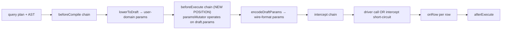

# ADR 215 — Runtime middleware lifecycle: `beforeExecute` fires before `encodeParams`

## Status

Accepted ([TML-2375](https://linear.app/prisma-company/issue/TML-2375)). Lands as a refinement of the runtime middleware contract introduced with the family-runtime split in [ADR 204 — Single-tier runtime](./ADR%20204%20-%20Single-tier%20runtime.md). The change is internal to the framework's family runtime composition; the `RuntimeMiddleware` SPI shape (`{ beforeCompile?, beforeExecute?, intercept?, onRow?, afterExecute? }`) is unchanged. Only the firing position of `beforeExecute` moves.

## At a glance

`RuntimeMiddleware.beforeExecute(plan, ctx, paramsMutator?)` now fires *after* the family runtime lowers the query plan into a draft execution plan (parameters present in user-domain form) but *before* the runtime encodes those parameters to driver wire format. Mutations the hook makes through `paramsMutator` are visible to the subsequent encode step. The hook previously fired *after* encode, which made parameter-mutating middleware structurally impossible to implement correctly.



## Context

Before this ADR the SQL family runtime composed the execution lifecycle as:

```text
runBeforeCompile(plan)           // middleware AST rewrites
 → lower(plan)                   // lowerSqlPlan + encodeParams in one call
 → runWithMiddleware(exec, ...)  // beforeExecute → intercept → onRow → afterExecute
```

The `runWithMiddleware` helper (in `@prisma-next/framework-components`) owned four chains. `beforeExecute` fired with a `paramsMutator` constructed from the *post-encode* `exec.params` — wire bytes — which is too late for any middleware that wants to compute or mutate parameter values in their user-domain shape.

This blocked the cipherstash bulk-encrypt middleware end-to-end. The middleware's design: walk the plan's `ParamRef` nodes, find every cipherstash envelope sitting in a parameter slot, group them by `(table, column)` routing key, issue one `sdk.bulkEncrypt(...)` per group, and write the resulting ciphertexts back onto the envelope handles. The codec's `encode(envelope, ctx)` body reads `handle.ciphertext` to produce the wire-format payload and throws if it's undefined (a deliberate strict guard — a codec asked to encode an envelope without a ciphertext has no correct answer). When `beforeExecute` fired post-encode:

- `encodeParams` ran first, walked every `ParamRef`, called the cipherstash cell codec's `encode` per envelope, and threw `cipherstash codec: envelope has no ciphertext at encode time` because the bulk-encrypt middleware that would have populated ciphertexts had not yet run.
- The strict guard was correct; the lifecycle ordering was wrong.

The same problem applies to any future param-mutating middleware (server-side request-id stamping, deterministic-encryption codec adapters, value-elaboration policies, etc.). It is not cipherstash-specific.

Three alternatives were considered:

1. **Relax the cipherstash codec's `encode` guard** so a missing ciphertext defers to a runtime hook. Pushes cipherstash-specific assumptions into framework primitives and breaks the principle that codec `encode` is a pure function of `(value, ctx)`. Rejected.
2. **Encode parameters in two passes** — first a "soft" encode that tolerates missing ciphertexts, then `beforeExecute`, then a "hard" re-encode. Doubles the encode cost on every query for the benefit of one middleware family. Rejected.
3. **Reorder the lifecycle so `beforeExecute` fires between lower and encode** with a `paramsMutator` over pre-encode user-domain values. Touches one seam at one framework layer; no codec changes; no SPI shape changes. **Accepted.**

The reorder is safe because every existing `beforeExecute` consumer falls into one of two categories:

| Consumer | What it does | Reorder impact |
|---|---|---|
| Cipherstash bulk-encrypt middleware | Walks `plan.ast`, finds envelope `ParamRef`s, calls SDK, mutates handle ciphertexts via `paramsMutator.replaceValues(...)` | Unblocked — now sees pre-encode envelopes |
| `@prisma-next/middleware-telemetry` | Reads `plan.meta` for telemetry tagging | Neutral — meta is unchanged across the seam |
| SQL runtime `budgets` middleware | Reads `plan.ast` and uses `plan` identity as a Map key for per-query budget accounting | Neutral — AST is unchanged; identity is preserved |
| SQL runtime `lints` middleware | Reads `plan.ast` for lint evaluation | Neutral — AST is unchanged across the seam |

The three observability middleware never touch `params`. The audit was independently confirmed by reviewer inspection before the reorder landed; an architectural reading also supports it: telemetry, budgets, and lints are by-design read-only over the plan shape. Param-mutation is a special-purpose contract that until cipherstash had no consumer.

## Decision

### Lifecycle reorder

The SQL family runtime (and, by template-method composition, every other family runtime) composes the per-query lifecycle as:

```text
runBeforeCompile(plan)
 → lowerToDraft(plan)                // AST + user-domain params; no codec encode yet
 → runBeforeExecuteChain(            // NEW POSITION
     draft, middleware, ctx,
     paramsMutator over draft.params
   )
 → encodeDraftParams(draft', ctx)    // params through per-column codecs; wire format
 → runWithMiddleware(exec, ...)      // intercept → driver → onRow → afterExecute
```

The split between `lowerToDraft` (private, returns a draft with pre-encode `params`) and `encodeDraftParams` (private, renders the draft's params through the codec registry) replaces the prior single-call `lower()` shape. The pre-encode `paramsMutator` is a `SqlParamRefMutator` constructed over the draft's params; mutations are visible to `encodeDraftParams` through the mutator's `currentParams()` view.

### `runWithMiddleware` no longer owns `beforeExecute`

The `beforeExecute` chain is extracted from `runWithMiddleware` into a free function `runBeforeExecuteChain(plan, middleware, ctx, paramsMutator?)` exported from `@prisma-next/framework-components/execution`. `runWithMiddleware` now owns three chains (`intercept`, the row-source loop driving `onRow`, and `afterExecute`) and accepts no `paramsMutator` parameter — the one prior consumer of that parameter was the extracted chain.

The extraction preserves all SPI semantics:

- **Registration order** — middleware run in registration order across both `runBeforeExecuteChain` and `runWithMiddleware`.
- **Abort handling** — `checkAborted(ctx, 'beforeExecute')` short-circuits a chain entry when the caller has already aborted; an in-flight `beforeExecute` body's Promise is raced against `ctx.signal` via `raceAgainstAbort`. Both behaviours mirror the prior in-`runWithMiddleware` chain semantics byte-for-byte.
- **SPI shape** — `RuntimeMiddleware.beforeExecute(plan, ctx, params?) => void | Promise<void>` is unchanged. Existing middleware bodies compile and run without modification; JavaScript's positional-argument tolerance handles bodies that ignore the third parameter.

### `intercept` always observes a post-`beforeExecute` plan

The `beforeExecute` chain always fires, even when a later `intercept` short-circuits the driver call. This is the load-bearing semantic decision in the reorder:

- **Cache middleware (the canonical `intercept` consumer)** computes a content-hash over the plan to key cache entries. If `beforeExecute` were *skipped* on intercept hits, the content-hash on a cold path (where `beforeExecute` ran and mutated params) would differ from the content-hash on a warm path (where it didn't). The cache would never hit. Skipping is incorrect.
- **`afterExecute(completed: false)` semantics** continue to apply uniformly. A `beforeExecute` body that throws propagates the error out of `runBeforeExecuteChain`, the family runtime catches it, and the `afterExecute` chain in `runWithMiddleware` is *not* invoked because the runtime never reached `runWithMiddleware`. The contract `afterExecute(completed: false)` is reserved for middleware that observed the intent to execute — `beforeExecute` is part of that intent, not separate from it.

The alternative reading (`beforeExecute` skipped on intercept short-circuit) would have been principled if no middleware needed param-mutation semantics for caching purposes. The cipherstash case in particular needs ciphertexts populated before the content-hash is computed so the cache key reflects the actual driver-bound payload. The chosen reading is the defensible one.

### Template-method composition for non-SQL family runtimes

`RuntimeCore.execute` (in `@prisma-next/framework-components`) implements the same `lower → beforeExecute → encode → runWithMiddleware` interleaving as a default template. Family runtimes that override `execute` (the SQL runtime, today; future non-SQL families) inline the same interleaving at their own override site, calling the shared `runBeforeExecuteChain` helper. Family runtimes that do *not* override `execute` inherit the ordering by composition.

The SQL runtime overrides `execute` to thread its family-specific `SqlParamRefMutator` (constructed over the draft's params) and `SqlCodecCallContext` (carrying per-query `AbortSignal`) explicitly. The override site is also where the SQL runtime decides between the "pre-lowered fixture path" (caller hands in a `SqlExecutionPlan` directly; runtime still fires `beforeExecute` and then re-encodes to apply any mutations) and the standard AST → exec path. Both paths thread through the same `runBeforeExecuteChain` helper.

## Consequences

### Positive

- **Param-mutating middleware is now structurally possible.** The cipherstash bulk-encrypt middleware works end-to-end without changes to the cell codec's strict `handle.ciphertext === undefined` guard. Future param-mutating middleware (deterministic-encryption codec adapters, server-side value-elaboration policies, masked-column rewrites) inherit the same ordering.
- **No SPI change.** `RuntimeMiddleware.beforeExecute` retains its `(plan, ctx, params?)` shape and its registration semantics. Existing middleware bodies compile and run unchanged. The three observability middleware in tree (`middleware-telemetry`, `budgets`, `lints`) are reorder-neutral.
- **Cache content-hash stability.** Interceptors observe the fully-mutated plan, so the content-hash they compute is consistent between cold and warm paths. A naïve cache implementation works correctly with param-mutating middleware in the chain.
- **Template-method composition for non-SQL families.** The `runBeforeExecuteChain` helper is family-agnostic and composes into `RuntimeCore.execute`'s default template; family runtimes that don't override `execute` inherit the ordering automatically.
- **Pre-lowered fixture path preserved.** Test fixtures that hand in a `SqlExecutionPlan` directly (skipping the AST → draft lower step) still fire `beforeExecute` and then re-encode to apply any mutations. The fixture-path encoder runs a second encode in this branch, which is intentional — the alternative (skip the second encode and trust the fixture's pre-encoded params) would defeat any mutation the middleware made.

### Trade-offs

- **Param encoding cost on the fixture path.** The pre-lowered fixture path re-encodes params even when no middleware mutated them. The cost is proportional to the param count and codec complexity, negligible relative to a driver round-trip. Documented inline at the override site.
- **Two engagement points for `beforeExecute`.** The chain is invoked by `RuntimeCore.execute` (default template) *and* by family runtimes that override `execute` to thread their own mutators. A future family that forgets to call the helper at its override site silently skips `beforeExecute`. Mitigated by `RuntimeCore.execute`'s default template carrying the call (so a family that doesn't override gets it for free) and by the cipherstash bulk-encrypt middleware tests pinning the end-to-end behaviour.
- **Order semantics for `intercept` slightly more subtle.** Documented in the SPI JSDoc: interceptors see a post-`beforeExecute` plan. A middleware author who relied on the old ordering (`intercept` first, `beforeExecute` only on non-intercept paths) needs to update. The audit found no such in-tree consumer; external consumers (when this project ships outside the prototype) need release-notes coverage.

### Non-goals

- **No `paramsMutator` for `intercept`, `onRow`, or `afterExecute`.** Param mutation is a `beforeExecute`-only contract; once `encodeDraftParams` runs, the params are wire bytes and mutating them is not meaningful. The middleware SPI does not offer the mutator at later hooks.
- **No re-ordering between `intercept` and the row-source loop.** This ADR only moves `beforeExecute`. The four remaining chains (`beforeCompile`, `intercept`, `onRow`, `afterExecute`) retain their prior ordering and contracts.

## Worked example — cipherstash bulk-encrypt middleware

The cipherstash extension's bulk-encrypt middleware is the load-bearing worked example. Pre-ADR, the middleware was an aspirational shape that compiled but always threw at execute time. Post-ADR, the middleware works as designed:

```ts
// packages/3-extensions/cipherstash/src/middleware/bulk-encrypt.ts
export function bulkEncryptMiddleware(sdk: CipherstashSdk): SqlMiddleware {
  return {
    async beforeExecute(plan, ctx, params) {
      // 1. Walk `plan.ast` and find every cipherstash envelope sitting
      //    in a parameter slot. Each envelope's handle carries its
      //    routing key (table, column) — stamped at AST construction
      //    time by the cipherstash operators.
      const groups = collectByRoutingKey(plan, params);

      // 2. One SDK round-trip per (table, column) group.
      for (const [{ table, column }, batch] of groups) {
        const ciphertexts = await sdk.bulkEncrypt({
          routingKey: { table, column },
          values: batch.map((e) => e.expose().plaintext),
          signal: ctx.signal,
        });

        // 3. Write the ciphertexts back onto the envelope handles
        //    via the param-mutator. Encode then reads handle.ciphertext.
        batch.forEach((envelope, i) => {
          envelope.setHandleCiphertext(ciphertexts[i]);
          // params.replaceValues(envelope.paramRefId, envelope);  // identity-replace
        });
      }
    },
  };
}
```

When `beforeExecute` returns, the draft plan's `params` slot contains the same envelope references that entered, but each envelope's handle now has its ciphertext populated. `encodeDraftParams` then walks the params, dispatches to the cipherstash cell codec per envelope, and the codec's `encode` body reads `handle.ciphertext` successfully. The driver sees wire-format `eql_v2_encrypted` JSONB payloads in the param slots.

The same shape applies to any future param-mutating middleware: any middleware that wants to populate or rewrite parameter values in their user-domain form before encode runs the same lifecycle position.

## Mongo family: lifecycle parity and intentional placement asymmetries

Mongo execute ([`packages/2-mongo-family/7-runtime/src/mongo-runtime.ts`](../../../packages/2-mongo-family/7-runtime/src/mongo-runtime.ts)) now follows the same pre-resolve middleware lifecycle invariant as SQL: `beforeCompile` → structural draft (user-domain `MongoParamRef` leaves) → `beforeExecute` with a param mutator → resolve/encode params → `intercept` / driver → row hooks → `afterExecute`. Content hashing ([`content-hash.ts`](../../../packages/2-mongo-family/7-runtime/src/content-hash.ts)) runs only on the post-resolution wire command, so interceptors and cache keys observe the driver-bound payload after middleware mutations — the same load-bearing property ADR 215 establishes for SQL.

The SQL and Mongo stacks differ in *where* the two lowering phases and the param mutator live. Those differences are intentional family shape, not drift.

| Concern | SQL | Mongo |
|---|---|---|
| Two-phase lowering API | `lowerToDraft` / `encodeDraftParams` are **private** methods on `SqlRuntime` ([`packages/2-sql/5-runtime/src/sql-runtime.ts`](../../../packages/2-sql/5-runtime/src/sql-runtime.ts)); lowering walks the SQL adapter inside the runtime package. | `structuralLower` / `resolveParams` are **public** methods on the `MongoAdapter` SPI ([`packages/2-mongo-family/6-transport/mongo-lowering/src/adapter-types.ts`](../../../packages/2-mongo-family/6-transport/mongo-lowering/src/adapter-types.ts)); the target-owned implementation lives in [`@prisma-next/adapter-mongo`](../../../packages/3-mongo-target/2-mongo-adapter/). |
| Param mutator home | `SqlParamRefMutator` in [`packages/2-sql/4-lanes/relational-core`](../../../packages/2-sql/4-lanes/relational-core) (middleware module), composed by the SQL runtime. | `MongoParamRefMutator` in [`packages/2-mongo-family/7-runtime`](../../../packages/2-mongo-family/7-runtime/src/param-ref-mutator.ts) alongside `MongoMiddleware`, because Mongo has no `relational-core`-equivalent lanes layer — the runtime is the first layer that composes middleware and execute. |
| Pre-resolve draft type | Reuses `SqlExecutionPlan` for both the pre-encode draft and the post-encode exec (params slot mutates; same interface type). | Introduces a distinct `MongoLoweredDraft` union (not a wire command) for phase 1; `MongoExecutionPlan.command` is typed as `AnyMongoWireCommand` but holds the draft only during `beforeExecute` ([`mongo-execution-plan.ts`](../../../packages/2-mongo-family/7-runtime/src/mongo-execution-plan.ts)). Mongo's typology is the stricter, preferable shape: phase 1 cannot be mistaken for a driver-ready command at the type level. |

**Why the phase API is public on Mongo but private on SQL.** SQL structural lowering and param encoding are orchestrated entirely inside `@prisma-next/sql-runtime` against the generic SQL `Adapter` surface. Mongo lowering is target-owned: the runtime invokes `MongoAdapter` on the execution stack, and the two-phase contract must be auditable at the adapter SPI so implementors (`adapter-mongo`) and reviewers can see exactly where `MongoParamRef` resolution is deferred relative to middleware. Exposing `structuralLower` / `resolveParams` on the SPI documents that contract; hiding them inside the runtime would obscure the target boundary.

**Convenience `lower`.** `MongoAdapter.lower` remains the one-shot `resolveParams(structuralLower(plan))` for callers that do not need the split; production execute uses the split explicitly.

## Related

- [ADR 204 — Single-tier runtime](./ADR%20204%20-%20Single-tier%20runtime.md) — the runtime composition this ADR refines.
- [ADR 207 — Codec call context per-query AbortSignal and column metadata](./ADR%20207%20-%20Codec%20call%20context%20per-query%20AbortSignal%20and%20column%20metadata.md) — the per-query `AbortSignal` and `SqlCodecCallContext` shape threaded through `runBeforeExecuteChain`.
- [ADR 214 — Extension operator surface: namespaced replacement operators and the predicate/helper split](./ADR%20214%20-%20Extension%20operator%20surface%20namespaced%20replacement%20operators.md) — the cipherstash operator surface that depends on this lifecycle ordering at execute time.
- [ADR 213 — Codec lifecycle hooks](./ADR%20213%20-%20Codec%20lifecycle%20hooks.md) — the plan-time analogue of this ADR's runtime hook.
- [`@prisma-next/mongo-lowering`](../../../packages/2-mongo-family/6-transport/mongo-lowering/) — `MongoAdapter` two-phase SPI (`structuralLower` / `resolveParams`).
- [`@prisma-next/mongo-runtime`](../../../packages/2-mongo-family/7-runtime/) — Mongo execute wiring and `MongoParamRefMutator` ([TML-2376](https://linear.app/prisma-company/issue/TML-2376)).
