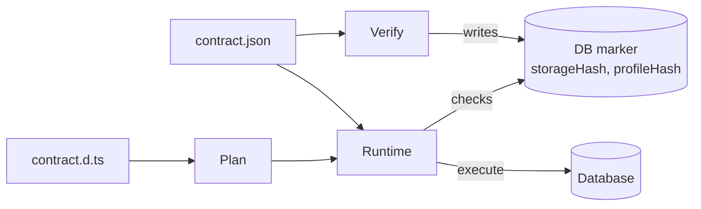

# Data Contract

## Overview

The data contract is the single, verifiable description of an application's data model and its storage layout. It is the system boundary that ties together:

- Application code (queries and runtime verification)
- Database state (contract marker in the DB)
- Migrations (contract‑to‑contract transitions)
- Tooling (preflight, advisors, CI checks)
- Agents (machine‑readable, deterministic inputs and outputs)

**Responsibilities:** models/relations; storage (tables, columns, indexes, FK/PK); type identifiers and branded types; capability flags; contract hashing; authoring via PSL or a TS builder through a contract source provider; deterministic emission to `contract.json` and `.d.ts` types.

**Defaults:** the contract supports literal defaults, database function defaults, and client-generated defaults (`kind: "generated"`). Generated defaults are applied by Prisma Next before writes and are not emitted as database defaults.

**Non‑goals:** data cataloging/governance beyond schema; RBAC/row‑level security; cross‑tenant schema federation; full polymorphic type inference across arbitrary expressions (handled at query level).



## Artifact & Determinism

This section defines the artifacts produced by the contract and the determinism guarantees that make them hashable, reproducible, and portable across environments.

### Artifact

The data contract consists of a canonical JSON description plus a companion TypeScript type surface that other subsystems consume.

- **contract.json:** canonical JSON describing models, storage, and capabilities
- **Types (contract.d.ts):** generated TS types for tables/columns/models, including branded types for extension values
- **Hashing:**
  - **storageHash:** hash of the meaningful schema storage (models, fields, relations, storage layout)
  - **executionHash:** hash of the execution defaults encoded under `execution` (when present)
  - **profileHash:** hash of the pinned capability profile declared by the contract (capability keys/variants and optional adapter pins; does not change meaning)
- **DB Marker:** a small schema in the database stores the current `storageHash`, `profileHash`, marker version, and a ledger of applied migrations/tasks

### Deterministic emission

To ensure stable hashing and reproducibility across machines and toolchains, emission follows strict canonicalization rules (see [ADR 010 — Canonicalization Rules](../adrs/ADR%20010%20-%20Canonicalization%20Rules.md)).

- **Canonicalization:** key ordering (lexicographic), normalized scalars (number/string/boolean), normalized defaults (e.g., `now()`), and stable array ordering where order has semantic meaning
- **Hash:** SHA‑256 (or equivalent) over the canonicalized JSON
- **Emission is deterministic across platforms and toolchains**

### Provenance is diagnostics-only

Canonical contract artifacts must not embed authoring provenance:

- No schema paths / `sourceId`s / spans in `contract.json`
- No top-level `sources` field in `contract.json`

If provenance is needed for error UX, it must be carried via diagnostics (CLI/editor output) and must not participate in hashing.

### Canonical contract vs planner hints

The canonical contract IR and its `storageHash`/`executionHash`/`profileHash` capture only **application expectations** (models, relations, storage layout, capabilities) and extension-owned metadata. Planner‑specific inputs such as rename hints or migration strategies are **not** part of the canonical contract and **do not** participate in hashing.

- Authoring layers (PSL or TypeScript contract authoring) may expose annotations like `@hint(was: "old_name")` to guide migration planning.
- These annotations are consumed by the migration planner alongside contracts and are recorded in **migration edges** as structured metadata (see the Migration System subsystem and [ADR 028 — Migration Structure & Operations](../adrs/ADR%20028%20-%20Migration%20Structure%20&%20Operations.md)).
- Downstream contract consumers such as the runtime, lanes, and query DSL treat `contract.json` as planner‑agnostic; they do not rely on or interpret planner hints.

## Authoring Modes

Two equivalent sources produce the same artifact. This keeps authoring flexible while preserving a single execution boundary (the Plan) and a thin core that stays free of dialect logic.

1. **PSL‑first:** today's schema syntax; parsed and emitted to `contract.json` + `.d.ts`
2. **TS‑first authoring:** an explicit API (e.g., `defineContract({ family, target, models, ... })`) that declares models, fields, relations, and storage with abstract scalars and facets

**Rules:**

- A repo/package declares one authoritative **contract source provider** (PSL or TS builder). The other form can be generated for reference, not as source of truth
- **Dev workflow:** bundler/dev‑server plugins (Vite/Next/esbuild) auto‑emit `contract.json` and `.d.ts` on import/watch; no visible "generate" step in day‑to‑day
- **CI:** explicit emit step validates determinism and pins artifacts

## Structure & Content

At a high level. The contract encodes what exists (models, storage), how it can be used (capabilities), and the identity used to verify plans and runtime state before execution. This enables early, deterministic feedback (linting, budgets, preflight) before data is touched.

```json
{
  "schemaVersion": "1",
  "targetFamily": "sql",
  "target": "postgres",
  "capabilities": { "postgres": { "jsonb": true, "lateral": true, "jsonAgg": true, "vector": false } },
  "roots": {
    "users": { "namespace": "public", "model": "User" },
    "posts": { "namespace": "public", "model": "Post" }
  },
  "domain": {
    "namespaces": {
      "public": {
        "models": {
          "User": {
            "fields": {
              "id": { "nullable": false, "codecId": "pg/int4@1" },
              "email": { "nullable": false, "codecId": "pg/text@1" },
              "active": { "nullable": false, "codecId": "pg/bool@1" }
            },
            "relations": {
              "posts": { "to": { "namespace": "public", "model": "Post" }, "cardinality": "1:N", "on": { "localFields": ["id"], "targetFields": ["userId"] } }
            },
            "storage": {
              "table": "user",
              "fields": { "id": { "column": "id" }, "email": { "column": "email" }, "active": { "column": "active" } }
            }
          },
          "Post": {
            "fields": {
              "id": { "nullable": false, "codecId": "pg/int4@1" },
              "userId": { "nullable": false, "codecId": "pg/int4@1" }
            },
            "relations": {
              "user": { "to": { "namespace": "public", "model": "User" }, "cardinality": "N:1", "on": { "localFields": ["userId"], "targetFields": ["id"] } }
            },
            "storage": {
              "table": "post",
              "fields": { "id": { "column": "id" }, "userId": { "column": "user_id" } }
            }
          }
        },
        "valueObjects": {}
      }
    }
  },
  "storage": {
    "storageHash": "sha256:…",
    "namespaces": {
      "public": {
        "id": "public",
        "entries": {
          "table": {
            "user": {
              "columns": {
                "id":     { "nativeType": "int4", "codecId": "pg/int4@1", "nullable": false },
                "email":  { "nativeType": "text", "codecId": "pg/text@1", "nullable": false },
                "active": { "nativeType": "bool", "codecId": "pg/bool@1", "nullable": false }
              },
              "primaryKey": { "columns": ["id"], "name": "user_pkey" },
              "uniques":    [ { "columns": ["email"], "name": "user_email_key" } ],
              "indexes":    [],
              "foreignKeys": []
            },
            "post": {
              "columns": {
                "id":      { "nativeType": "int4", "codecId": "pg/int4@1", "nullable": false },
                "user_id": { "nativeType": "int4", "codecId": "pg/int4@1", "nullable": false }
              },
              "primaryKey": { "columns": ["id"], "name": "post_pkey" },
              "foreignKeys": [ { "columns": ["user_id"], "references": { "namespaceId": "public", "tableName": "user", "columns": ["id"] }, "name": "post_user_id_fkey" } ],
              "indexes": [ { "columns": ["user_id"], "name": "post_user_id_idx" } ],
              "uniques": []
            }
          }
        }
      }
    }
  },
  "profileHash": "sha256:…"
}
```

**Notes:**

- **roots** map ORM accessor names to a model coordinate — an object pair `{ namespace, model }` (e.g., `"users": { "namespace": "public", "model": "User" }`)
- **domain** holds the application concepts the user defines, under `domain.namespaces.<namespaceId>.{ models, valueObjects }`. A model carries fields with `{ nullable, codecId }`, relations whose `to` is an object pair `{ namespace, model }`, and a `storage` bridge to the physical layer. The framework domain plane has **no** `types` member — codec aliases live on the SQL storage plane.
- **storage** holds the family-owned persistence projection. Each namespace carries an open `entries` dictionary keyed by entity kind — `storage.namespaces.<namespaceId>.entries[entityKind][entityName]` — plus plane-level metadata (`storageHash`). Built-in entity kinds are `table` (SQL family), `valueSet` (SQL family), `collection` (Mongo family); pack-contributed kinds (e.g. `type` for Postgres enum types) register via the serializer registry. Cross-namespace foreign-key references are object pairs `{ namespaceId, tableName, columns }`.
- **capabilities** surface target features that affect compilation/lowering (e.g., lateral)
- **Types (.d.ts)** expose branded TS types for contract type identifiers; at runtime, codecs provided by packs/adapters handle encode/decode ([ADR 114 — Extension codecs & branded types](../adrs/ADR%20114%20-%20Extension%20codecs%20&%20branded%20types.md))
- Authoring provenance (paths/source IDs/spans) is **diagnostics-only**; it is not embedded in canonical artifacts
- For the full rationale behind the three levels (domain, bridge, storage) and intentional redundancy, see [ADR 172](../adrs/ADR%20172%20-%20Contract%20domain-storage%20separation.md); for the two-plane namespaced shape this example uses, see [ADR 221](../adrs/ADR%20221%20-%20Contract%20IR%20two%20planes%20with%20uniform%20entity%20coordinate%20and%20pack-contributed%20entity%20kinds.md)

### Two planes, namespaced

Entity content lives under exactly two **planes** — `domain` (application concepts) and `storage` (family-owned persistence) — and never flat at the contract root. Each plane is shaped `{ …plane-level metadata?, namespaces: { <namespaceId>: … } }`, and every entity has the same four-part **coordinate** `(plane, namespaceId, entityKind, entityName)`. Because the namespace is part of the address, `auth.User` and `public.User` are two distinct models, exactly as `auth.user` and `public.user` are two distinct tables. The full rationale (why two planes, why the explicit `namespaces` segment, why object-pair cross-references, the pack-contributed entity-kind mechanism) is [ADR 221](../adrs/ADR%20221%20-%20Contract%20IR%20two%20planes%20with%20uniform%20entity%20coordinate%20and%20pack-contributed%20entity%20kinds.md).

Two consequences worth pinning here because consumers depend on them:

- **Identity is the coordinate, never a bare name.** The framework never collapses namespaces into a name-keyed bag for any identity-sensitive purpose (validation, canonicalization, diffing, hashing). A flat-by-name view (`db.User`, `db.sql.user`) is a *query-surface convenience* a consumer produces deliberately by resolving a bare name through the contract's namespace — not an identity primitive. A single-namespace projection is legitimate only when it names its precondition: the sole-namespace access helpers **throw** on a zero- or multi-namespace contract rather than silently merging or picking one.
- **The application-domain plane type is `ApplicationDomain`** (its per-namespace envelope is `ApplicationDomainNamespace`); the contract field stays `domain`. This is deliberately *asymmetric* with the storage segment type (`Storage`, not `StoragePlane`): "plane" is the abstract concept reserved by `EntityCoordinate.plane`, and "application domain" is the team's spoken term (vs "storage domain"). Ubiquitous language wins over type-name symmetry.

The default namespace a bare authored name lands in (`public` for Postgres, `__unbound__` for SQLite/Mongo) is a fact each **target owns on its descriptor**, consumed only by authoring; runtime resolves bare names from the contract's sole namespace and needs no per-target default. See [ADR 223 — Target-owned default namespace](../adrs/ADR%20223%20-%20Target-owned%20default%20namespace.md).

### In-memory representation: polymorphic IR class hierarchy

The on-disk JSON shape above is canonical for persistence, identity, and hashing. The **in-memory** representation of a contract is a polymorphic class hierarchy that round-trips through that JSON without ceremony. The hierarchy is layered:

- **Framework**: `interface IRNode { readonly kind?: string }`, `abstract class IRNodeBase` (centralises the `freezeNode(this)` discipline), `interface Namespace extends IRNode`, `interface Storage extends IRNode { readonly namespaces: Record<string, Namespace> }`, `interface ContractSerializer<TContract>`.
- **Family**: SQL ships `abstract class SqlNode extends IRNodeBase` and the family-shared concrete IR-node classes (`SqlStorage`, `SqlTable`, `SqlColumn`, `SqlForeignKey`, `SqlIndex`, `SqlPrimaryKey`, `SqlUnique`, `StorageValueSet`). Mongo ships `MongoSchemaNode extends IRNodeBase` and the family-shared collection/index/options classes.
- **Target**: Postgres / SQLite / Mongo target packages may ship concrete classes that extend family abstract bases, plus target-only kinds that extend `IRNodeBase` directly when no family parent fits (future `PostgresRlsPolicy`, `PostgresFunction`).

Per the [three-layer polymorphic IR](../patterns/three-layer-polymorphic-ir.md) and [frozen-class AST](../patterns/frozen-class-ast.md) patterns, class fields are plain readonly properties (JSON-clean by construction); concrete classes call `freezeNode(this)` in their constructor. The on-disk JSON envelope is reached through the per-target `ContractSerializer.serializeContract(contract): JsonObject` SPI method — runtime-only class fields (e.g. `MongoTargetStorage.namespaces`) stay enumerable on the in-memory instance and the serializer elides them on the way out. The inverse direction — `descriptor.contractSerializer.deserializeContract(json)` — is the typed hydration path that replaces the previous standalone `validateContract(json)` usage in framework-internal hydration call sites (the supported public surface remains the serializer API on the execution context).

**Polymorphic `storage.types`.** `Contract.storage.types[name]` is the inflection point where target-specific IR kinds and family-shared codec-typed entries can coexist. Today every entry is codec-typed (`kind: 'codec-instance'` — pgvector, decimal, varchar parameterized types) and hydrates through the `StorageTypeInstance` path; enums do not live here — they are domain entities paired with a storage `valueSet` entity (`StorageValueSet`, `kind: 'valueSet'`) enforced by a CHECK constraint. The hydration walker dispatches on shape/kind, so adding a target-specific IR kind — Postgres RLS policies, MongoDB Atlas-only collection options — slots in without touching the framework or family layers.

### Cross-family contract design

The contract's domain-level structure generalizes across database families. The MongoDB PoC (see [10. MongoDB Family](10.%20MongoDB%20Family.md)) validated that a shared `Contract<TStorage, TModels>` type is viable when domain and storage concerns are separated. Both `SqlContract` and `MongoContract` are type aliases for `Contract` parameterized by family-specific storage (see [ADR 182](../adrs/ADR%20182%20-%20Unified%20contract%20representation.md)).

**Design principles:**

1. **The domain model is self-describing.** Reading the `roots` and the `domain` plane (models and relations under `domain.namespaces.<ns>`) gives a complete picture of the application domain without consulting the storage block. The domain describes *what* the application models and how they relate; storage describes *how* they persist.
2. **Domain and persistence are separated.** Models describe the application domain (fields, relations, identity, polymorphism). Storage describes the database (tables, columns, collections, indexes). The bridge between them is `model.storage` — scoped and family-specific. The split is structural: `domain` is framework-shaped, `storage` is family-owned (see *Two planes, namespaced* above).
3. **Family-specific details are scoped.** The `domain` plane is family-agnostic. Family-specific persistence details live inside `model.storage` and the `storage` plane.
4. **The contract describes facts, not instructions.** The contract states what exists (models, fields, storage units, discriminators) — the ORM decides how to represent it at runtime. Persistence strategies (STI vs MTI) are emergent from the combination of domain declarations and storage mappings, not labeled.

**Key concepts:**

- **`roots`** — explicit aggregate roots mapping ORM accessor names to a model coordinate `{ namespace, model }` (e.g., `"users": { "namespace": "public", "model": "User" }`). Models not in `roots` are accessed through relations or variant relationships. See [ADR 174](../adrs/ADR%20174%20-%20Aggregate%20roots%20and%20relation%20strategies.md).
- **`model.fields`** — domain-level field descriptors as `Record<string, { nullable: boolean, codecId: string }>`. Both `nullable` and `codecId` are domain concepts. "Family-agnostic" describes the structure, not the values — codec ID values differ across families but the structure is identical. See [ADR 172](../adrs/ADR%20172%20-%20Contract%20domain-storage%20separation.md).
- **Polymorphism** — `discriminator` + `variants` on the base model, `base` on each variant. Persistence strategy (STI vs MTI) is emergent from storage mappings. Uses specialization/generalization terminology. See [ADR 173](../adrs/ADR%20173%20-%20Polymorphism%20via%20discriminator%20and%20variants.md).
- **Model ownership** — an owned model declares `"owner": "ParentModel"`, a domain fact about aggregate membership. Its data is co-located with the owner's storage (embedded document in Mongo, JSONB column in SQL). The parent's `storage.relations` maps the relation to its physical location. Relations to owned models are plain graph edges. See [ADR 177](../adrs/ADR%20177%20-%20Ownership%20replaces%20relation%20strategy.md).
- **Value objects** — typed data structures without identity, lifecycle, or framework capabilities (no query entry points, no hooks, no referential integrity). Defined under `domain.namespaces.<ns>.valueObjects` alongside `models`, using the same `{ nullable, codecId }` field shape. Fields reference value objects via `type` (mutually exclusive with `codecId`); unions of types use `union`. Value object support in SQL is capability-gated (requires JSONB-compatible columns). See [ADR 178](../adrs/ADR%20178%20-%20Value%20objects%20in%20the%20contract.md), [ADR 179](../adrs/ADR%20179%20-%20Union%20field%20types.md).

### Core entities vs pack extensions

Core represents portable relational structure, while extension packs add target-specific capabilities and constructs through a standardized encoding. This follows the thin core, fat targets principle (see [ADR 005 — Thin Core Fat Targets](../adrs/ADR%20005%20-%20Thin%20Core%20Fat%20Targets.md)).

Core defines portable entities in the contract; target- and adapter-specific storage types and logic are provided by adapters or extension packs.

- Core entities in the contract
  - Tables, columns, primary keys, unique constraints, foreign keys, and basic indexes
  - ForeignKey as first-class relation metadata consumable by lanes and ORM helpers
  - `foreignKeys` configuration (`{ constraints, indexes }`) controls whether FK constraints and backing indexes are emitted by the planner (see [ADR 161](../adrs/ADR%20161%20-%20Explicit%20foreign%20key%20constraint%20and%20index%20configuration.md))
  - Logical enums registry; columns reference enums via `logicalType`
  - Namespaces via `RelationId = { namespace?, name }` (e.g., Postgres schemas)
  - Capability keys referenced by the contract, not implemented by core

- Provided by adapters or packs (out of core)
  - Physical storage types and codecs (e.g., `int4`→`number`, branded `Geometry`, `Vector`)
  - Index methods and predicates (e.g., GIN/GiST, partial/filtered indexes)
  - Projection features (e.g., DISTINCT ON) and join flavors (lateral/semi/anti)
  - Distribution/shard keys and colocation policies
  - View definitions and materialization mechanics
  - Extension functions/operators and their deterministic lowering rules

- Separation of concerns
  - The contract stays target-agnostic; packs encode data centrally under `extensions.<namespace>` via decorations (augment core nodes by `ref`) and top‑level blocks (introduce extension-owned entities)
  - Capabilities are declared in the contract and verified against the database; adapters/packs own their keys and semantics
  - The capability profile is pinned by the contract via `profileHash`; the runtime does not compute a new profile at startup (see [ADR 004](../adrs/ADR%20004%20-%20Storage%20Hash%20vs%20Profile%20Hash.md), [ADR 021](../adrs/ADR%20021%20-%20Contract%20Marker%20Storage.md))
  - The migration runner's verify step checks that the remote database satisfies the contract's capability requirements and writes the pinned `profileHash` to the marker
  - Verification uses the contract hash; lowering and execution defer to the adapter, with codecs composed from adapters/packs

### Storage identity and verification semantics (v1)

The control plane verifies that a live database **satisfies** the contract’s storage requirements. For MVP, verification favors **semantic satisfaction** over strict, byte-for-byte equivalence.

- **Identity**: storage objects are identified by a stable semantic signature.
  - Primary keys: `(table, kind=primaryKey, columns[])`
  - Unique constraints: `(table, kind=unique, columns[])`
  - Indexes: `(table, kind=index, columns[])`
- **Names are metadata**: the contract records `name` for deterministic DDL and diagnostics, but names are **not identity** and do not need to match by default.
  - Deterministic naming rules are applied during emission (see [ADR 009 — Deterministic naming](../adrs/ADR%20009%20-%20Deterministic%20naming.md)).
- **Semantic satisfaction**:
  - Missing required objects are errors.
  - Harmless differences (for example, a different index name) do not fail verification by default.
  - An index with stronger properties may satisfy a weaker requirement (for example, a **unique** index may satisfy a required **non-unique** index on the same columns).
- **Future tightening**: strict equality can be added as an opt-in mode once richer index semantics (compound ordering, partial predicates, include columns, method/opclass) are modeled in the contract and introspected reliably.

Examples

Logical enum referenced by a column

```json
{
  "enums": [{ "name": "UserStatus", "values": ["active", "suspended"] }],
  "tables": {
    "public.user": {
      "columns": {
        "status": { "type": { "logical": "UserStatus" }, "nullable": false }
      }
    }
  }
}
```

Partial index via pack extension (decorations encoding)

```json
{
  "extensions": {
    "postgres": {
      "decorations": {
        "indexes": [
          {
            "ref": { "kind": "index", "table": "public.post", "name": "post_published_created_at_idx" },
            "payload": { "predicate": "published = true" }
          }
        ]
      }
    }
  }
}
```

Determinism

The following rules ensure that extension content is encoded and hashed consistently for reliable diffs and verification.
- Core fields follow [ADR 010 — Canonicalization Rules](../adrs/ADR%20010%20-%20Canonicalization%20Rules.md) ordering and normalization
- Extension decorations and blocks participate in profile hash per [ADR 004 — Storage Hash vs Profile Hash](../adrs/ADR%20004%20-%20Storage%20Hash%20vs%20Profile%20Hash.md) and [ADR 106 — Canonicalization for extensions](../adrs/ADR%20106%20-%20Canonicalization%20for%20extensions.md)
- Unknown extension namespaces are preserved round‑trip but not interpreted by core

## Compatibility Rules

Contract changes are classified to guide safe evolution, planning, and verification without surprising production behavior.

- **Additive changes** (add table/column, nullable field, new index) → compatible; produce new `storageHash`
- **Renames/drops/type changes** → require explicit planner hints (expressed in the authoring layer) and a migration plan; not auto‑compatible
- **Non‑null column addition** → needs default/backfill task; planner should fail fast without a task
- **Capability changes** (e.g., enabling `jsonAgg`) → affect `profileHash`; do not change meaning
- **Deprecation policy:** contract schema (`schemaVersion`) evolves under semver; breaking changes bump major

## Consumers & Flows

Multiple subsystems read the contract and apply it in different phases; each uses the artifact for verification, planning, or execution in a well-defined way. This powers tight feedback loops across the planes: plans embed `storageHash` (and `executionHash` when execution defaults are present), runtimes verify against markers, and PPg/CI preflight exposes issues before they reach production.

- **Query DSL & TypedSQL:** load `contract.json` + `.d.ts` to expose typed column/model references; embed `storageHash` in each Plan for verification
- **Runtime:** verifies `storageHash` and `profileHash` equality against the database marker; streams results as `AsyncIterable<Row>` with codecs applied per-row for extension types; lints/budgets enforced incrementally during streaming
- **Migrations:** planner diffs two contracts (from → to) to emit schema edges and node tasks; runner asserts DB marker matches `from.storageHash`
- **Preflight:** uses contract to validate referenced objects, policy checks, EXPLAIN expectations
- **PPg:** stores the DB marker; orchestrator and advisors use contract data to plan and analyze changes

### Profile-only update (no migration)

Use this flow to update the capability profile without changing logical schema (no DDL):

1. Edit the contract to add/remove capability keys or adjust adapter/profile pins that do not alter logical meaning
2. Emit artifacts (new `profileHash`, unchanged `storageHash`)
3. Verify against the remote database:
   - `prisma-next verify --db <url>` checks that observed capabilities satisfy the contract
   - On success, the runner writes the contract's `storageHash` and new `profileHash` to the marker (no migration edge)
4. Restart or hot-reload runtimes as needed: caches keyed by `(sqlFingerprint, storageHash, profileHash)` roll naturally

Notes:
- If enabling a capability requires infrastructure work (e.g., installing an extension), perform that change first, then run verify
- If a capability change alters logical semantics relied on by queries (e.g., collation that changes comparisons), treat it as a core change and plan a migration instead

### Default capabilities policy

Under the pinned capability profile model, ambient features are ignored until explicitly declared; the contract governs what lowerers may use.

- The contract is the source of truth for what capabilities lowerers may use
- Adapter baseline capabilities may exist in the environment but are not used unless declared in the contract
- `profileHash` is computed from declared capability keys/variants and explicit adapter pins; ambient, undeclared capabilities do not affect the hash
- When you decide to rely on a capability that used to be ambient, declare it in the contract; this changes `profileHash` and requires a profile-only verify

## Public APIs (library & CLI)

The contract library and CLI provide an explicit surface for emitting, validating, hashing, and verifying contracts in development and CI.

**Library:**

- `load(pathOrJson): Contract`
- `validate(contract: unknown): Contract`
- `hash(contract: Contract): { storageHash: string; executionHash?: string; profileHash: string }`
- `diff(a: Contract, b: Contract): ContractDiff` (models, storage, relations, capability deltas)
- `capabilities(contract): CapabilityFlags`
- `introspectRefs(plan): ReferencedObjects` (best‑effort mapping for diagnostics)

**CLI:**

- `prisma-next contract emit` (PSL/TS → `contract.json` + `.d.ts`)
- `prisma-next verify --db <url>` (assert DB marker hash vs contract)
- `prisma-next diff <from> <to>` (human‑readable and JSON output)

**Dev plugins:**

- Vite/Next/esbuild plugin that auto‑emits on import/watch and surfaces errors inline

## Extensions

Prisma Next's extension system enables domain-specific capabilities through installable packs that extend the data contract with additional types, functions, and storage constructs.

### Extension Encoding in Contract

Extensions are encoded in the contract under `extensions.<namespace>` with a fixed structure:

```json
{
  "extensions": {
    "pgvector": {
      "version": "1.2.0",
      "capabilities": { "ivfflat": true, "hnsw": false },
      "decorations": {
        "columns": [
          {
            "ref": { "kind": "column", "table": "document", "column": "embedding" },
            "payload": { "length": 1536, "distance": "cosine" }
          }
        ]
      },
      "constructs": {
        "operatorClasses": [
          {
            "name": "pgvector_ivfflat_cosine",
            "family": "ivfflat",
            "distance": "cosine"
          }
        ]
      }
    }
  }
}
```

### PSL and TS Authoring

Both PSL and TS authoring modes support extensions through pack-owned syntax, but the supported surface depends on the authoring path:

**PSL Syntax (with extension packs composed in `prisma-next.config.ts`):**
```prisma
types {
  Embedding1536 = pgvector.Vector(1536)
}

model Document {
  id        Int     @id @default(autoincrement())
  content   String
  embedding Embedding1536?
}
```

**TS Contract Syntax:**
```typescript
defineContract({
  family: sqlFamily,
  target: postgresPack,
  extensionPacks: { pgvector },
  models: {
    Document: model('Document', {
      fields: {
        id: field.column(int4Column).id(),
        embedding: field.column(vector(1536)),
      },
    }).sql({ table: 'document' }),
  },
})
```

### Capability Key Namespace and Stability

Capability keys follow a strict namespace and stability contract:

- **Core capabilities** (e.g., `lateral`, `jsonAgg`) are reserved and immutable
- **Extension capabilities** are prefixed by pack namespace (e.g., `pgvector.ivfflat`)
- **Reserved namespaces** include `prisma`, `core`, `internal`, and adapter names (`postgres`, `mysql`, `sqlite`)

See [Capabilities Reference](../../reference/capabilities.md) for the complete list of canonical capability keys.

### Canonicalization Rules for Extensions

Extension data follows deterministic canonicalization rules per ADR 106:

- **Key ordering**: Maps sorted lexicographically
- **Array ordering**: Preserved unless pack schema marks as sets
- **Reference stability**: Core node references use structured addressing
- **Version pinning**: Extension versions are pinned and immutable per contract

### ProfileHash Computation (Pinned Profile)

The `profileHash` is derived solely from the contract. It is a hash of the contract-declared capability requirements and any explicit adapter profile pins encoded in the contract (e.g., adapter name/version under an extension or target block). No runtime inputs are used when computing `profileHash`.

- **Declared capabilities**: Capability keys and chosen variants declared in the contract (including extension capabilities)
- **Adapter pins (optional)**: Explicit adapter/engine pins stated in the contract when teams want to lock to a version/profile

Verification flow:
- `prisma-next verify` connects to the remote database, checks that observed capabilities satisfy the contract's declared requirements, and on success writes the contract's `storageHash` and `profileHash` to the marker.
- The query runtime compares `storageHash` and `profileHash` from the contract (or plan meta) to the database marker and enforces equality.

Note: In the future, we may introduce a "floating mode" where environments can compute a runtime profile from discovered capabilities. That mode would remain additive; the default model stays pinned and contract-derived.

### Extension Validation

The emitter validates extensions against pack-provided schemas:

- **Namespace presence**: Extension must be pinned in `extensions` block
- **Schema validation**: Attribute arguments validated against pack JSON Schema
- **Capability gating**: Extension usage checked against adapter capabilities
- **Reference resolution**: Decorations must reference existing core nodes

## Pack-Owned Top-Level Blocks

Some extension-owned entities warrant first-class identity. Packs can introduce these as top-level blocks that are emitted and validated deterministically.

In addition to decorators (attributes) on core entities, packs can register entirely new **top-level blocks** that introduce first-class constructs like views, enums, and other domain-specific objects (see **ADR 126** for the formal SPI).

**Top-level blocks** are:
- Declared at the PSL file root (e.g., `pg.view MyActiveUsers { ... }`, `pg.enumType Status { ... }`)
- Owned and emitted by packs, not core
- Each produces a stable `id` computed from content hash and fully-qualified name
- Deterministically serialized to `contract.extensionPacks.<namespace>.<kind>[]`

**Examples:**

```prisma
extensions {
  postgres = "15.0"
}

// Top-level block provided by postgres pack
pg.view active_users {
  schema: "public"
  sql: """
    select id, email from "user" where active = true
  """
  shape: { id: Int, email: String }
}

pg.materializedView daily_stats {
  schema: "analytics"
  sql: """
    select date_trunc('day', created_at) as day, count(*) as signups
    from "user" group by 1
  """
  materialized: true
  refreshPolicy: { mode: "onDemand" }
  shape: { day: DateTime, signups: BigInt }
}

pg.enumType user_status {
  values: ["active", "suspended"]
}
```

**Emission:**

Top-level blocks emit deterministic JSON under `contract.extensionPacks.<namespace>.<kind>[]`:

```json
{
  "extensions": {
    "postgres": {
      "version": "15.0",
      "views": [
        {
          "id": "pg.view:public.active_users@sha256:abc123",
          "name": "active_users",
          "schema": "public",
          "sql": "select id, email from \"user\" where active = true",
          "shape": { "id": "int4", "email": "text" },
          "materialized": false
        }
      ],
      "enumTypes": [
        {
          "id": "pg.enumType:user_status@sha256:def456",
          "name": "user_status",
          "values": ["active", "suspended"]
        }
      ]
    }
  }
}
```

**Validation:**

- Packs provide JSON Schemas and validation functions for their blocks
- Emitter enforces:
  - Block syntax and grammar per pack parser
  - Semantic validity (e.g., view dependencies exist, SQL is non-empty)
  - Capability gating (e.g., materialized views require `postgres.view.materialized` capability)
  - Deterministic canonicalization per ADR 106

**Distinguish from decorators:**

- **Decorators** (e.g., `@pg.type("user_status")`, `@@pg.predicate("active = true")`) attach metadata to existing core entities (columns, indexes, tables)
- **Top-level blocks** (e.g., `pg.view`, `pg.enumType`) introduce new, addressable constructs with their own identity
- Both are pack-owned, but blocks are standalone while decorators augment core nodes

See [ADR 126 — PSL top-level block SPI](../adrs/ADR%20126%20-%20PSL%20top-level%20block%20SPI.md) for the full PSL top-level block SPI.

## Tagged literals

Tagged literals ([ADR 129 — Template-Tagged Literals for Extensions](../adrs/ADR%20129%20-%20Template-Tagged%20Literals%20for%20Extensions.md)) allow packs to attach structured payloads to decorations or blocks while preserving deterministic hashing. Tagged content is encoded under `extensions.<namespace>` as part of a decoration payload or a block definition (not as ad‑hoc inline blobs on core nodes). Payloads include a canonicalized body and `bodyHash` to enable stable diffing and planning.

## Extensibility (Thin Core, Fat Targets)

Adapters and extension packs extend the system at well-defined seams without changing core, keeping the center small and stable.

**Target adapters register:**

- Scalar mappings (`int4`→`number`, `timestamptz`→`Date`, etc.)
- Capability flags and lowering constraints
- Validation hooks (e.g., "FK requires equality index")

**Extension packs add:**

- New scalars (e.g., vector, geography) + codecs
- Storage constructs (e.g., PostGIS indexes) under capabilities and `storage.indexes.method`
- Function and operator registries for type-safe query building
- Migration operations for extension-specific DDL

**Mongo family:**

- Mongo is its own family (`familyId: "mongo"`), not a target under a "document" family — document databases don't share a common query interface the way SQL databases do
- `MongoContract` is a type alias for `Contract<MongoStorage, MongoModelStorage>` — same unified type, different storage parameters
- Same hashing and verification story; different execution pipeline and capabilities
- See [10. MongoDB Family](10.%20MongoDB%20Family.md) and [ADR 172](../adrs/ADR%20172%20-%20Contract%20domain-storage%20separation.md)

**Community contributions:**

- TS‑only package boundaries; stable adapter interfaces; documented JSON schema; conformance tests let external contributors add dialects, scalars, and validation rules

## Performance & Limits

Emit performance and artifact size targets keep the authoring workflow responsive and CI predictable as schemas grow.

- **Parse/emit budget:** fast enough to run on file save (<100 ms for small contracts, <1 s for large schemas)
- **Hashing:** O(size of JSON); cached in dev plugin
- **Watch mode:** debounce emissions; avoid rebuild storms

## Security & Privacy

Contracts contain structure, not data. Marker storage and diagnostics are designed to avoid secrets and to respect privacy policies.

- **contract.json** contains structure only—no data. Safe to commit to source control
- **DB marker/ledger** contain hashes and op metadata (no application data)
- **Diagnostics** redact identifiers as configured for logs; EXPLAIN plans may include table names—guard with env‑based redaction
- **Secrets** for DB verification/preflight are handled by the runtime/CI, not embedded in the contract

## Open Questions & Risks

Several areas remain under active consideration and require careful design to preserve determinism and safety guarantees.

- **Cross‑platform determinism:** ensure canonicalization produces identical hashes across Node versions and locales
- **Numeric/decimal precision** and default literal normalization—define a single canonical representation
- **Handling collations/encodings** in the contract (likely `profileHash` only)
- **Minimal Mongo v1 surface** that is credible but doesn't overreach
- **Backward‑compatible evolution** of models vs storage sections without duplication

## Test Strategy

Determinism and safety are enforced through a layered test strategy that covers schema conformance, hashing, diffs, and adapter behavior.

- **Schema conformance:** arktype schema validation; property tests for allowed/denied shapes
- **Determinism:** golden tests for PSL/TS → `contract.json` + `storageHash`/`executionHash`/`profileHash`
- **Round‑trip:** PSL→contract→PSL (rendered) sanity checks for information preservation (where applicable)
- **Diff tests:** known change sets (add column, add FK, rename with hint) → expected diffs
- **Adapter conformance:** per‑dialect suite validating codecs, capabilities, and validation hooks

## References

- **Subsystems consuming the contract:** Query DSL, TypedSQL, Runtime, Migrations, Preflight

## Summary

The data contract is the bedrock artifact of Prisma Next. It is deterministic, verifiable, and consumable by humans, machines, and agents. It enables safer queries, deterministic migrations, and a contract‑aware platform story with PPg—while keeping the core small, target adapters powerful, and the project open to community contribution.
