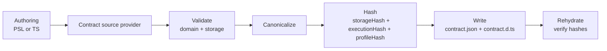

# Contract Emission — Canonicalization, Types, Validation

## Overview

Contract emission turns an authored data model into two deterministic artifacts: a canonical JSON contract (`contract.json`) and a minimal set of TypeScript type definitions (`contract.d.ts`). While exposed as a single CLI command, emission is purposefully composed from separable primitives: **contract source providers** (PSL, TS, or future sources) that produce `Contract` directly, validation (domain + storage), canonicalization with hashing, serialization/deserialization, and rehydration verification.

This modular design reflects our guiding principles: thin core, explicit boundaries, and tight feedback loops that surface issues before execution.

**Purpose:** Provide a deterministic, verifiable representation of the application's data contract and lightweight types that downstream subsystems consume for planning, verification, and execution.

**Responsibilities:**
- Invoke a configured **contract source provider** to obtain framework-defined `Contract` (or structured diagnostics)
- Validate domain structure (roots, models, relations) and family-specific storage
- Canonicalize and compute `storageHash`, optional `executionHash`, and `profileHash`
- Emit `contract.json` and `contract.d.ts`; support lossless load/rehydration
- Verify that rehydrated contracts reproduce embedded hashes

**Non‑goals.** Migration planning, query compilation/lowering, runtime capability discovery, and policy enforcement. Emission prepares artifacts; other subsystems act on them.

### Example

```prisma
// PSL authoring (excerpt)
model User {
  id        Int      @id @default(autoincrement())
  email     String   @unique
  active    Boolean  @default(true)
  createdAt DateTime @default(now())
}

model Post {
  id     Int   @id @default(autoincrement())
  title  String
  user   User  @relation(fields: [userId], references: [id])
  userId Int
  @@index([userId])
}
```

Emitting produces:
- `contract.json` — canonical JSON with models, storage, capabilities, and embedded `storageHash`/`executionHash`/`profileHash`
- `contract.d.ts` — a types‑only surface used by the query builder DSLs without shipping runtime code

Emitted contract.json (excerpt):

```json
{
  "schemaVersion": "1",
  "targetFamily": "sql",
  "target": "postgres",
  "capabilities": { "postgres": { "jsonAgg": true, "lateral": true } },
  "roots": {
    "users": "User",
    "posts": "Post"
  },
  "models": {
    "User": {
      "fields": {
        "id": { "nullable": false, "codecId": "pg/int4@1" },
        "email": { "nullable": false, "codecId": "pg/text@1" },
        "active": { "nullable": false, "codecId": "pg/bool@1" },
        "createdAt": { "nullable": false, "codecId": "pg/timestamptz@1" }
      },
      "relations": {
        "posts": { "to": "Post", "cardinality": "1:N", "on": { "localFields": ["id"], "targetFields": ["userId"] } }
      },
      "storage": {
        "table": "user",
        "fields": {
          "id": { "column": "id" },
          "email": { "column": "email" },
          "active": { "column": "active" },
          "createdAt": { "column": "created_at" }
        }
      }
    },
    "Post": {
      "fields": {
        "id": { "nullable": false, "codecId": "pg/int4@1" },
        "title": { "nullable": false, "codecId": "pg/text@1" },
        "userId": { "nullable": false, "codecId": "pg/int4@1" }
      },
      "relations": {
        "user": { "to": "User", "cardinality": "N:1", "on": { "localFields": ["userId"], "targetFields": ["id"] } }
      },
      "storage": {
        "table": "post",
        "fields": {
          "id": { "column": "id" },
          "title": { "column": "title" },
          "userId": { "column": "user_id" }
        }
      }
    }
  },
  "storage": {
    "storageHash": "sha256:…",
    "namespaces": {
      "__unbound__": {
        "id": "__unbound__",
        "entries": {
          "table": {
            "user": {
              "columns": {
                "id": { "nativeType": "int4", "codecId": "pg/int4@1", "nullable": false },
                "email": { "nativeType": "text", "codecId": "pg/text@1", "nullable": false },
                "active": { "nativeType": "bool", "codecId": "pg/bool@1", "nullable": false },
                "created_at": { "nativeType": "timestamptz", "codecId": "pg/timestamptz@1", "nullable": false }
              },
              "primaryKey": { "columns": ["id"], "name": "user_pkey" },
              "uniques": [ { "columns": ["email"], "name": "user_email_key" } ],
              "indexes": [],
              "foreignKeys": []
            },
            "post": {
              "columns": {
                "id": { "nativeType": "int4", "codecId": "pg/int4@1", "nullable": false },
                "title": { "nativeType": "text", "codecId": "pg/text@1", "nullable": false },
                "user_id": { "nativeType": "int4", "codecId": "pg/int4@1", "nullable": false }
              },
              "primaryKey": { "columns": ["id"], "name": "post_pkey" },
              "foreignKeys": [ { "columns": ["user_id"], "references": { "namespaceId": "__unbound__", "tableName": "user", "columns": ["id"] }, "name": "post_user_id_fkey" } ],
              "indexes": [ { "columns": ["user_id"], "name": "post_user_id_idx" } ],
              "uniques": []
            }
          }
        }
      }
    }
  },
  "profileHash": "sha256:…"
}
```

### Diagram — Emission pipeline



This pipeline is orchestrated by the CLI for developer ergonomics, but each stage is a single‑responsibility primitive that can be executed independently in tooling and tests or utilized by ecosystem authors.

## Contract source providers (decoupling authoring from the framework)

Authoring begins in PSL or through a TypeScript builder, but the framework/CLI does not “know PSL” or “know TS” by hard-coded config unions. Instead, config supplies an async **contract source provider** that returns framework-defined `Contract` (or diagnostics). This keeps the framework source-agnostic while still enforcing shared meaning via validation + canonicalization.

Both paths target the same semantic shape and must produce byte‑identical `contract.json` for equivalent intent (see [ADR 006 — Dual Authoring Modes](../adrs/ADR%20006%20-%20Dual%20Authoring%20Modes.md)).

At the type level, the provider shape is:

```ts
export type ContractSourceProvider =
  (context: ContractSourceContext) => Promise<Result<Contract, ContractSourceDiagnostics>>;
```

### PSL provider (example responsibilities)

The PSL provider recognizes a fixed grammar: top‑level blocks, properties, and attributes. It parses namespaced attributes and namespaced top‑level blocks without allowing packs to extend the lexer or parser. It returns `Contract` and produces structured diagnostics with source spans. Interpretation of extension payloads is deferred until framework validation.

### TypeScript provider (TS-first authoring)

Teams may choose a typed builder (e.g., `defineContract(...)`) to construct the same authoring AST/IR in code. Like the PSL provider, this path must maintain parity and determinism: for equivalent intent it must produce the same canonical `contract.json`.

## Contract — the single canonical representation

Contract source providers return `Contract<TStorage, TModels>` directly — there is no separate intermediate representation. `Contract` is the single canonical type used throughout the system: authoring surfaces produce it, validation operates on it, canonicalization normalizes it, and the emitter serializes it to `contract.json` + `contract.d.ts`. Providers resolve model↔storage mappings, expand defaults, materialize relations and constraint identities deterministically, and fold extension decorations and top‑level constructs into namespaced areas. The design follows the thin‑core, fat‑targets principle from the Architecture Overview: core captures portable relational structure while extensions contribute target‑specific semantics. See [ADR 182](../adrs/ADR%20182%20-%20Unified%20contract%20representation.md).

## Validation — Core Semantics and Extension Packs

Validation enforces correctness without touching a database. Core checks ensure structural soundness (e.g., FK target existence, uniqueness soundness, nullability propagation). Extension packs register schemas and canonicalization rules for their namespaced attributes, top‑level blocks, and tagged literals. During validation, the emitter resolves namespaces to packs, validates payloads, and performs reference checks. Capability gating is enforced using pack‑declared capability keys; failures are deterministic and actionable. See [ADR 104 — PSL extension namespacing & syntax](../adrs/ADR%20104%20-%20PSL%20extension%20namespacing%20&%20syntax.md) and [ADR 105 — Contract extension encoding](../adrs/ADR%20105%20-%20Contract%20extension%20encoding.md).

Common error classes include unknown namespace/kind, unknown attribute, schema violation, unsupported capability, canonicalization failure, duplicate identities within a module, and invalid references in decorations. These diagnostics are tied back to PSL source spans or TS call sites to reinforce the feedback loop.

## Canonicalization and Hashing

Deterministic emission requires canonical JSON and stable hashing. Canonicalization applies stable key ordering, normalized scalars and defaults, and well‑defined array ordering rules for both core and extension payloads (see [ADR 010 — Canonicalization Rules](../adrs/ADR%20010%20-%20Canonicalization%20Rules.md) and [ADR 106 — Canonicalization for extensions](../adrs/ADR%20106%20-%20Canonicalization%20for%20extensions.md)).

Canonical artifacts must not contain authoring provenance:

- No schema paths / `sourceId`s / spans in `contract.json`
- No top-level `sources` field in `contract.json`
- Diagnostics may include provenance for CLI/editor UX, but provenance must be diagnostics-only and must not participate in hashing

Hashes are computed and embedded in `contract.json`:
- `storageHash` — captures the logical meaning of the schema storage (models, fields, relations, storage layout)
- `executionHash` — captures execution defaults under `execution` (when present)
- `profileHash` — derived from declared capability keys and optional adapter pins; it pins the capability profile without changing meaning (see [ADR 004 — Storage Hash vs Profile Hash](../adrs/ADR%20004%20-%20Storage%20Hash%20vs%20Profile%20Hash.md))

Any changes to the structure of the database which would require a migration are reflected in the `storageHash`. Changes to execution defaults are reflected in the `executionHash`. Changes to the application's capability requirements are reflected in the `profileHash`. This enables non-structural modifications to the contract without a migration.

The runtime uses `storageHash`/`profileHash` to verify that the connected database was verified against the running contract, and the migration system uses `storageHash` to locate a connected database in the migration graph.

## Serialization, Types Generation, and Rehydration

### Writing and reading

Serialization writes canonical `contract.json` and emits `contract.d.ts`. Deserialization loads `contract.json` back into an in‑memory `Contract` suitable for re‑canonicalization and verification. The process is lossless; rehydrated contracts must recompute the same hashes.

### Types surface (`contract.d.ts`)

The types are pure declarations to keep bundles lean and editor feedback fast. No runtime objects are generated; the query DSL constructs its query interface at runtime from `contract.json`. Extension values appear as branded types with codecs supplied by packs at runtime (see [ADR 114 — Extension codecs & branded types](../adrs/ADR%20114%20-%20Extension%20codecs%20&%20branded%20types.md)).

The emitted `.d.ts` defines a `Contract` type parameterized by storage and models, with codec/operation type maps for type-safe query building. The framework owns the template (`generateContractDts()`); each family provides storage-specific type fragments via `EmissionSpi` callbacks.

Minimal excerpt (SQL):

```typescript
// ⚠️  GENERATED FILE - DO NOT EDIT
import type { CodecTypes as PgTypes } from '@prisma-next/target-postgres/codec-types';
import type { OperationTypes as PgOps } from '@prisma-next/adapter-postgres/operation-types';

import type { ContractWithTypeMaps, TypeMaps as TypeMapsType } from '@prisma-next/sql-contract/types';
import type {
  Contract as ContractType,
  NamespaceId,
  StorageHashBase,
  ProfileHashBase,
} from '@prisma-next/contract/types';

export type StorageHash = StorageHashBase<'sha256:…'>;
export type ProfileHash = ProfileHashBase<'sha256:…'>;

export type CodecTypes = PgTypes;
export type OperationTypes = PgOps;
export type TypeMaps = TypeMapsType<CodecTypes, OperationTypes, QueryOperationTypes>;

type ContractBase = Omit<
  ContractType<{ readonly storageHash: StorageHash; readonly namespaces: { readonly public: { readonly tables: { /* … storage tables with columns, PKs, FKs, indexes … */ } } } }>,
  'roots' | 'domain'
> & {
  readonly target: 'postgres';
  readonly targetFamily: 'sql';
  readonly roots: { readonly users: { readonly namespace: 'public' & NamespaceId; readonly model: 'User' } };
  readonly domain: { readonly namespaces: { readonly public: { readonly models: { readonly User: { /* … fields / relations / storage bridge … */ } }; readonly valueObjects: {} } } };
  readonly capabilities: { /* … */ };
  readonly profileHash: ProfileHash;
};

export type Contract = ContractWithTypeMaps<ContractBase, TypeMaps>;

export type Namespaces = Contract['storage']['namespaces'];
```

Both planes are namespaced: storage entities live under `storage.namespaces.<ns>.entries[entityKind][entityName]` (e.g. `entries['table']['user']`) and models under `domain.namespaces.<ns>.models` (see [Data Contract § Two planes, namespaced](1.%20Data%20Contract.md#two-planes-namespaced) and [ADR 221](../adrs/ADR%20221%20-%20Contract%20IR%20two%20planes%20with%20uniform%20entity%20coordinate%20and%20pack-contributed%20entity%20kinds.md)). Consumers read a namespace's models directly — `Contract['domain']['namespaces']['public']['models']` (or `[keyof …['namespaces']]` for the sole-namespace case). See [ADR 223 — Target-owned default namespace](../adrs/ADR%20223%20-%20Target-owned%20default%20namespace.md) for the runtime/emitter fail-loud split.

### Codec type map emission (types‑only)

At emit time, the emitter generates codec and operation type intersections in `contract.d.ts` by collecting type imports from composed adapters and extension packs:

1. The control stack assembles `codecTypeImports` and `operationTypeImports` from all composed component descriptors (adapter + extension packs).
2. Imports are de‑duplicated and sorted deterministically.
3. The `.d.ts` emits type aliases that intersect the contributed type maps, e.g.:

```ts
import type { CodecTypes as PgTypes } from '@prisma-next/target-postgres/codec-types';
import type { CodecTypes as PgVectorTypes } from '@prisma-next/extension-pgvector/codec-types';

export type CodecTypes = PgTypes & PgVectorTypes;
```

Notes:
- `contract.json` remains code‑free; no registry contents are embedded.
- Codecs without custom type rendering fall back to `CodecTypes[codecId]['output']`.

### Parameterized codecs and the unified descriptor

Parameterized codecs (e.g. `pg/vector@1`, `arktype/json@1`) ship a `CodecDescriptor<P>` with `paramsSchema: StandardSchemaV1<P>`, optional `renderOutputType: (params: P) => string`, and a curried `factory: (params: P) => (ctx: CodecInstanceContext) => Codec`. The descriptor unifies what previous iterations split across the codec object's optional `paramsSchema?` / `init?` / `renderOutputType?` slots and per-codec hand-rolled column-helper factories. Non-parameterized codecs are the degenerate `P = void` case authored as `class extends CodecDescriptorImpl<void>` with a constant factory that returns the same shared codec instance for every column (see [ADR 208](../adrs/ADR%20208%20-%20Higher-order%20codecs%20for%20parameterized%20types.md) for the unified authoring pattern). The descriptor map is the single read source for codec-id-keyed metadata across both shapes.

The emit path consults `renderOutputType` via the framework's `CodecLookup`. Inline `field.type.typeParams` always wins when present; the framework only consults the resolver as a fallback for `typeRef`-backed columns whose inline `typeParams` is absent. The family-specific emitter (e.g. SQL) implements `EmissionSpi.resolveFieldTypeParams(modelName, fieldName, model, contract)` to walk `model.storage.fields → storage.namespaces.<ns>.entries['table'][tableName]` and return the named instance's `typeParams`, so typeRef-backed columns render with the same fidelity as inline-`typeParams` columns. Mongo and other families that don't use named storage types simply don't implement the optional hook.

### Rehydration via the per-target `ContractSerializer` SPI

In-memory contracts are class hierarchies (see [Data Contract § In-memory representation](1.%20Data%20Contract.md#in-memory-representation-polymorphic-ir-class-hierarchy)). Hydration from JSON and serialization back to JSON both go through the per-target `ContractSerializer<TContract>` SPI exposed on the target descriptor:

- `descriptor.contractSerializer.deserializeContract(json: unknown): TContract` — replaces the previous standalone `validateContract(json)` function at every framework-internal call site. Family-shared arktype validation lives on `SqlContractSerializerBase` / `MongoContractSerializerBase`; per-target subclasses construct the concrete class instances via protected hooks.
- `descriptor.contractSerializer.serializeContract(contract: TContract): JsonObject` — owns the on-disk JSON envelope shape. Runtime-only class fields (fields that exist on the in-memory IR for behaviour but should not appear on disk; current example: `MongoTargetStorage.namespaces`) stay enumerable on instances and the serializer elides them.

The framework's `canonicalizeContractToObject` accepts the target's `serializeContract` as an optional hook (threaded from the descriptor at the CLI) and uses it to convert in-memory class instances to a plain `JsonObject` before applying the family-agnostic key-ordering / default-omission / sort steps. Targets that gain runtime-only IR fields in future work override `serializeContract` to construct the persisted shape; they do not reach for non-enumerable property tricks on the class layer.

The user-facing facade (`postgres<Contract>(...)`) wraps the SPI call so end-users continue to write `postgres({ contractJson, … })` without seeing the SPI directly.

### Rehydration verification

`prisma-next verify` loads `contract.json`, re‑canonicalizes, recomputes `storageHash`/`executionHash`/`profileHash`, and fails if they differ from embedded values. This command is used locally as a sanity check and in CI to pin deterministic inputs. It contributes directly to the tight feedback loops emphasized in the Architecture Overview by catching issues before queries or migrations run.

## Extension Encoding and Sources

Extensions integrate through a grammar‑fixed SPI. Packs register attribute identifiers with schemas (decorations on core nodes), top‑level block kinds with schemas (pack‑owned constructs like views), and tagged literal handlers. During emission, validated payloads are encoded deterministically under `extensions.<namespace>`.

Decorations encode as lists of `{ ref, payload }`, where `ref` uses structured addressing to reference core nodes. Top‑level blocks serialize to arrays with stable identities computed from qualified name and content hash. Packs may optionally provide **types-only** surfacing for pack-owned blocks (e.g., views) so lanes can offer type-safe querying without adding a canonical top-level registry field in `contract.json`. See [ADR 126 — PSL top‑level block SPI](../adrs/ADR%20126%20-%20PSL%20top-level%20block%20SPI.md).

## CLI Surface and Configuration

The CLI composes these primitives into clear, deterministic commands that support development speed and CI rigor:

- `prisma-next contract emit` — parse/build → validate → canonicalize → hash → write artifacts
- `prisma-next verify` — deserialize → canonicalize → recompute → compare hashes
- `prisma-next diff <from.json> <to.json>` — produce human/JSON diffs for planning inputs

Projects configure authoring mode and artifact output in a small config file. Naming and target pins keep emission stable across environments. Emission plugins in dev servers watch inputs to provide on‑save feedback, while CI runs explicit commands to assert determinism.

### Emitter I/O is caller-owned

The emitter itself does not perform file I/O. `emit()` simply returns an `EmitResult` (containing the canonical JSON, the generated `.d.ts`, `storageHash`, optional `executionHash`, and `profileHash`) so callers can decide when and where to write files, report diagnostics, or reuse the strings for streaming/CI workflows. This keeps the core deterministic and easy to test; CLI code or custom tools can freely write the artifacts (`contract.json`, `contract.d.ts`) and any auxiliary metadata without forcing the emitter into side effects (the implementation is in `@prisma-next/emitter`).

## Determinism, Diagnostics, and Feedback

Determinism is a first‑class requirement: it underpins the contract hashing model and enables agents and humans to trust that results are reproducible across environments. Emission surfaces high‑quality diagnostics tied to source spans and pack contexts, so authors can fix issues quickly. Performance targets ensure emission fits save‑time workflows; golden tests and property checks defend canonicalization and hashing rules.

This subsystem directly advances the framework’s core goal—tight feedback loops—by making contract errors, capability mismatches, and extension schema issues visible immediately during authoring, long before plans execute against a database.

## Open Questions

- Exact boundary between `storageHash` and `profileHash` for collations/encodings
- Minimal `.d.ts` surface for model‑level computed fields without implying runtime codegen
- Optional back‑generation of PSL from the TS builder to assist teams migrating authoring modes

