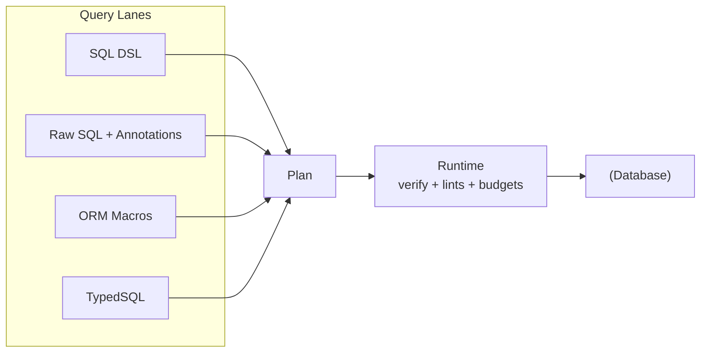

# Query Lanes

## Overview

Query lanes are the authoring surfaces that turn user intent into query plans. They exist because one query API cannot be good at every shape of work: a fluent DSL is pleasant for composition, raw SQL is still the clearest form for some advanced statements, ORM macros are useful for relationship traversal, and TypedSQL can be a better fit for teams that already organize query logic around `.sql` files.

The tradeoff would be dangerous if every lane owned its own execution semantics. Prisma Next avoids that. A lane compiles intent into a family-specific `QueryPlan`; the runtime verifies, lowers, budgets, lints, executes, and streams rows through one pipeline. Lanes are where authoring ergonomics vary. Runtime behavior is where they converge.

Lanes do not execute queries, negotiate capabilities, or manage migrations. That boundary is intentional: if a lane starts deciding target behavior, the same query can mean different things depending on how it was authored. That would make guardrails dishonest.



## What's a Lane?

A lane is a compiler from one authoring surface to the plan contract understood by the runtime. The input can be a builder chain, raw SQL with annotations, an ORM collection call, or a `.sql` file. The output is always structured enough for the runtime to answer the questions that matter before execution: which storage contract is this pinned to, what tables and columns are referenced, what row shape is expected, and which capability-gated features are being requested.

This means developers can choose the least awkward lane per query without changing the safety model. If a raw SQL query bypassed budgets while a DSL query triggered them, raw mode would become a loophole. If an ORM macro lowered to multiple statements while the DSL lowered to one, observability and rollback expectations would drift. The lane abstraction keeps those differences out of the executable boundary.

## Responsibilities and Non-goals

Responsibilities:

- Provide multiple authoring surfaces without moving dialect or capability decisions into those surfaces.
- Compile input into `QueryPlan` metadata with refs, projection, annotations, and a phantom row type where the lane can infer it.
- Expose extension operators and functions through lane APIs without making policy enforcement parse SQL text.

Non-goals:

- Execution, policy outcomes, contract marker verification, or capability negotiation. Those belong to the runtime, adapter, and contract.
- Dialect heuristics inside lane code. Target-specific lowering lives behind adapter SPI.
- Multi-statement orchestration. The one-query one-statement rule exists so humans and agents can reason about cost, policy, and failure precisely.

## Design Principles

1. **Ergonomics can vary; semantics cannot.** A DSL query, an ORM query, and a raw SQL query should be inspectable by the same middleware and subject to the same contract checks.
2. **Lanes produce plans, not effects.** A lane should be easy to test because it is a pure authoring-to-plan boundary. Effects begin when the runtime executes an `ExecutionPlan`.
3. **Adapters own dialect detail.** Lanes can express operations in AST or annotations, but they do not decide whether Postgres uses `LATERAL`, whether SQLite expands a view as a CTE, or whether a capability is available.
4. **Raw mode is explicit, not magical.** When a lane cannot provide an AST, it must provide annotations. The system should know less, but it should never pretend to know more than it does.

## The Lanes

All lanes compile to the same runtime boundary. Choose the lane that makes a query easiest to write and review; the runtime should not care which lane produced it.

- **SQL DSL lane:** a TypeScript builder backed by the contract. It produces a relational AST first, which makes refs, projection, and type inference cheap to derive. This is the default for day-to-day CRUD and composed predicates.
- **Escape hatch lane:** raw SQL plus typed params and explicit annotations. It is for queries where SQL is the clearest artifact. The cost is more annotation burden because the core path does not parse arbitrary SQL.
- **ORM lane:** ergonomic macros over the DSL. It is for relationship traversal and common collection operations, but it still compiles to the same relational AST and follows one call → one statement.
- **TypedSQL lane:** an optional CLI path for `.sql` files. It validates parameters and result types, then emits plan factories. This fits teams that want SQL files in review rather than long TypeScript builder chains.

### Quick example

```typescript
const tables = db.schema.tables

const plan = db.sql
  .from(tables.user)
  .where(tables.user.columns.active.eq(true))
  .select({ id: tables.user.columns.id, email: tables.user.columns.email })
  .limit(100)
  .build()
```

This is the boring case, and that is the point. The lane gives the runtime enough structure to derive refs and projection. The runtime still owns marker checks, lints, budgets, lowering, parameter encoding, row decoding, and streaming.

## Unified Plan Model

The plan model has two levels. A lane produces a `QueryPlan<Row>`: pre-lowering metadata plus the family-specific structure that represents the query. The runtime lowers that into an `ExecutionPlan<Row>`: the executable wire shape for the target family. SQL is the concrete example: `SqlQueryPlan` carries an AST and params; `SqlExecutionPlan` carries rendered SQL text and encoded params. See [ADR 011](../adrs/ADR%20011%20-%20Unified%20Plan%20Model.md).

```typescript
export interface QueryPlan<Row = unknown> {
  readonly meta: PlanMeta
  readonly _row?: Row
}

export interface SqlQueryPlan<Row = unknown> extends QueryPlan<Row> {
  readonly ast: AnyQueryAst
  readonly params: readonly unknown[]
}

export interface SqlExecutionPlan<Row = unknown> extends ExecutionPlan<Row> {
  readonly sql: string
  readonly params: readonly unknown[]
  readonly ast?: AnyQueryAst
}
```

`PlanMeta` carries the stable facts every policy needs: `target`, `targetFamily`, `storageHash`, optional `profileHash`, the lane id, and structured annotations. The richer lane-specific data stays in the family plan type. This avoids the common mistake of forcing SQL-shaped fields onto non-SQL lanes just because SQL shipped first.

Plans are immutable in practice and in tests. Mutation after construction would make hashing, lint attribution, and middleware behavior hard to trust.

## Consistent Execution Semantics

All lanes execute through the same runtime contract and return `AsyncIterable<Row>` by default. Consumers can iterate rows incrementally or collect them, independent of which lane produced the plan. This consistency matters more than it looks: middleware can sample rows, telemetry can report the same lifecycle, and callers do not need a separate mental model for raw SQL versus ORM calls.

## SQL DSL Lane

The SQL DSL is the most direct structured lane. It gives developers a type-safe builder over contract tables and columns, then emits a relational AST. That AST is valuable because the runtime can inspect it without reverse-engineering SQL text.

### Surface

- Constructed from the validated contract at runtime.
- Column-centric API with fluent expressions.
- Produces AST-backed plans, so refs and projection are derived rather than hand-authored.

```typescript
import { sql, makeT } from '@prisma/sql'
import contract from './contract.json'

const t = makeT(contract)

const plan = sql()
  .from('user')
  .where(t.user.active.eq(true))
  .select({ id: t.user.id, email: t.user.email })
  .limit(100)
  .build()
// lane = 'dsl', ast present, refs and projection derived automatically
```

### Nested Projection Shaping

The DSL supports nested object literals in `.select()` because nested result types are easier to consume than flat alias bags. However, SQL rows are flat. The lane resolves that mismatch by flattening nested aliases at runtime while preserving the nested shape in the compile-time row type.

```typescript
import { sql, makeT } from '@prisma/sql'
import contract from './contract.json'

const t = makeT(contract)

const plan = sql()
  .from(t.user)
  .innerJoin(t.post, (on) => on.eqCol(t.user.id, t.post.userId))
  .select({
    name: t.user.name,
    post: {
      title: t.post.title,
      content: t.post.content,
    },
  })
  .build()

// ResultType<typeof plan> infers: { name: string; post: { title: string; content: string } }
// Runtime returns flat rows with flattened aliases: { name: string, post_title: string, post_content: string }
```

**Aliasing strategy:** Nested paths are flattened with underscore separators, for example `post.title` → `post_title`. The builder detects alias collisions and throws `PLAN.INVALID` instead of silently overwriting a field.

**Runtime behavior:** The runtime returns flat JavaScript objects keyed by flattened aliases. It does not materialize nested objects at runtime. That is a deliberate tradeoff: result shaping stays cheap and deterministic, while callers that want nested objects can transform the flat row explicitly.

**Limitations:** This is projection shaping only. Nested aggregation needs `json_agg` / `LATERAL` and is capability-gated separately. See [Brief 06 - SQL Lane Nested Projection Shaping](../../briefs/06-SQL-Lane-Nested-Projection-Shaping.md) for details.

### Nested Array Includes (includeMany)

The DSL supports `includeMany` for 1:N relationships that return one row per parent with a nested array field for children. This is the place where ergonomics become expensive: the adapter needs `LATERAL` and `json_agg` to keep the query as one statement without falling into N+1 execution. For that reason, `includeMany` is available only when the contract declares both `lateral` and `jsonAgg`.

```typescript
import { sql, makeT } from '@prisma/sql'
import contract from './contract.json'

const t = makeT(contract)

const plan = sql()
  .from(t.user)
  .includeMany(
    t.post,
    (on) => on.eqCol(t.user.id, t.post.userId),
    (child) => child
      .select({ id: t.post.id, title: t.post.title })
      .where(t.post.published.eq(true))
      .orderBy(t.post.createdAt.desc())
      .limit(10),
    { alias: 'posts' }
  )
  .select({
    id: t.user.id,
    name: t.user.name,
    posts: true,  // Boolean true references the include alias
  })
  .build()

// ResultType<typeof plan> infers: { id: number; name: string; posts: Array<{ id: number; title: string }> }
// Runtime returns: { id: 1, name: "Alice", posts: [{ id: 1, title: "Post 1" }, ...] }
```

**API design decisions:**

- **Boolean `true` for include references:** Using `true` in the projection, for example `{ posts: true }`, distinguishes include references from column projections. A more magical API would be shorter, but ambiguity here would be expensive.

- **Explicit alias selection:** Includes must be explicitly selected in the projection. Large nested arrays should never appear because a helper quietly decided to include them.

- **Child builder API:** The child builder supports `.select()`, `.where()`, `.orderBy()`, and `.limit()` so child rows can be filtered, sorted, and capped independently of the parent query.

- **Capability gating:** TypeScript and runtime checks agree: `includeMany` requires both `lateral` and `jsonAgg`. The contract says whether the target can lower the feature; lane code does not guess.

**Lowering strategy:**

- **LATERAL + json_agg:** The adapter lowers `includeMany` to a `LEFT JOIN LATERAL` with a subquery that uses `json_agg(json_build_object(...))` to aggregate child rows into a JSON array. The `ON` condition from the include moves into the `WHERE` clause of the lateral subquery.

- **Single statement:** This preserves the one query → one statement rule from [ADR 003](../adrs/ADR%20003%20-%20One%20Query%20One%20Statement.md) and avoids N+1 query patterns.

**Runtime behavior:**

- **Plan meta marker:** Include aliases are marked in `meta.projection` with the special marker `include:alias`, for example `{ posts: 'include:posts' }`. The runtime can then decode include aliases differently from regular scalar columns.

- **JSON array decoding:** The runtime detects the `include:alias` marker and parses the JSON array from the wire value. If the driver has already parsed JSON, the runtime uses the parsed array directly.

- **Empty array for null:** When no children match, the database returns `NULL` for the `json_agg` result. The runtime converts this to `[]`, so the result type stays `Array<ChildShape>` rather than `Array<ChildShape> | null`.

- **No codec entries:** Include aliases are excluded from `meta.annotations.codecs` because they are JSON arrays, not scalar values that need codec decoding.

**Type inference:**

- **Array type:** `includeMany` infers `Array<ChildShape>` by tracking include aliases at the type level. The builder maintains a type-level map from include alias to child projection type, so `InferNestedProjectionRow` can recover the array element type.

**Limitations:**

- Requires both `lateral` and `jsonAgg` capabilities to be `true` in the contract
- Child WHERE/ORDER BY/LIMIT are scoped to the lateral subquery only

See [Brief 07 - SQL Lane IncludeMany LATERAL JsonAgg](../../briefs/07-SQL-Lane-IncludeMany-Lateral-JsonAgg.md) for detailed implementation notes.

### Type Inference

- Result type comes from the select projection, including nested projection shaping.
- Nullability propagates across joins.
- Compile-time typing precedence:
  - If a projected column has a declared `typeId`, map to `CodecTypes[typeId].output` from `contract.d.ts` (or builder generics in no‑emit mode)
  - Otherwise, map storage scalar → JS type per target family
  - Column nullability in storage propagates to the projected type
- Lanes do not consume runtime codec registries for typing and are not passed the runtime in the typing path.

## First-class Relationship Traversal in the Core AST

Relationship traversal is represented by compact nodes in the core `QueryAST`. The point is not to make the AST "ORM-shaped"; the point is to preserve enough structure for adapters to lower relationships safely without making every lane reinvent the same traversal logic. Each compiled query still lowers to a single SQL statement. See [ADR 003](../adrs/ADR%20003%20-%20One%20Query%20One%20Statement.md).

Adapters lower these nodes in a single pass based on capabilities (e.g., `jsonAgg`, `lateral`) and preserve the one call → one statement rule.

## Namespace-qualified identifier rendering

The contract IR is namespaced on both planes (`storage.namespaces.<ns>.tables`; see [ADR 221](../adrs/ADR%20221%20-%20Contract%20IR%20two%20planes%20with%20uniform%20entity%20coordinate%20and%20pack-contributed%20entity%20kinds.md)), so every table identifier a lane emits is qualified by the namespace that owns it — Postgres renders `"public"."user"`, SQLite renders the unqualified `"user"` (single namespace, no schema concept), and Mongo addresses the collection in the right namespace's database.

The load-bearing rule is **resolve once, carry the coordinate, never re-derive at render time.** When the DSL proxy (`db.sql.<table>`) or the ORM accessor (`db.<Model>`) resolves a bare name to its namespace, it stamps the resolved namespace coordinate on the relational AST table node (`TableSource.namespaceId`). The family adapter then renders qualification through the namespace concretion's `qualifyTable(tableName)` — Postgres's `PostgresSchema.qualifyTable` (the same path the DDL/migration emitter uses), SQLite's a `"name"` no-op. The renderer does **not** re-look-up the bare name in the contract, because re-deriving it default-first would diverge from the proxy's choice for colliding names and would have to be torn out by the explicit namespace-aware DSL. The carried coordinate is the seam that explicit per-namespace selection ([TML-2550](https://linear.app/prisma-company/issue/TML-2550)) extends rather than replaces. Column references in SELECT lists stay alias-qualified, unchanged.

The flat-by-name surface is preserved: `db.sql.user` / `db.User` keep working because a bare name resolves through the contract's sole namespace. The default namespace a bare authored name lands in is a fact each target owns on its descriptor (`public` for Postgres, `__unbound__` for SQLite/Mongo), consumed only by authoring — runtime needs no per-target default. See [ADR 223 — Target-owned default namespace](../adrs/ADR%20223%20-%20Target-owned%20default%20namespace.md).

## Escape Hatch Lane

The escape hatch exists because hand-written SQL is sometimes the honest representation of a query. Hiding that behind a weak builder API would make the code harder to review. However, raw SQL is also where safety can disappear fastest, so raw plans must carry annotations and, when possible, refs and projection. See [ADR 012](../adrs/ADR%20012%20-%20Raw%20SQL%20Escape%20Hatch.md).

### Intent

- Let developers and agents ship hand-written SQL while still participating in verification, guardrails, budgets, and auditing.
- Avoid core SQL parsing. Required annotations provide the minimum structure policy checks need.

### Minimal API

```typescript
import { raw } from '@prisma/sql/raw'
import { type } from 'arktype'

const plan = raw({
  sql: `select u.id, u.email from "user" u where u.active = $1 limit 100`,
  params: [true],
  // Required annotations for guardrails when AST is absent
  annotations: {
    intent: 'read',
    isMutation: false,
    hasWhere: true,
    hasLimit: true
  },
  // Strongly-typed projection and refs unlock better linting and DX
  refs: { tables: ['user'], columns: [{ table: 'user', column: 'id' }, { table: 'user', column: 'email' }] },
  projection: { id: 'user.id', email: 'user.email' },
  // Optional codecs for runtime value checks
  codecs: { row: type({ id: 'number', email: 'string' }) }
})
```

### Guardrails with Raw SQL

- The runtime enforces policy from annotations when no AST is present: `mutation-requires-where`, `limit-required`, `maxRows`, and `maxLatencyMs`.
- Adapters may parse or run `EXPLAIN` to enrich refs and projection. That is optional enrichment, not part of the core lane contract.

Guardrails and capability checks apply against the contract-pinned capability profile validated at connect time. See [ADR 004](../adrs/ADR%20004%20-%20Storage%20Hash%20vs%20Profile%20Hash.md) and [ADR 117](../adrs/ADR%20117%20-%20Extension%20capability%20keys.md).

## ORM Lane

The ORM lane is a macro layer over the DSL. It exists for the query shapes where users think in models and relations rather than tables and joins. The important boundary is that ORM calls still compile to the same relational AST, then to SQL through the adapter. See [ADR 015](../adrs/ADR%20015%20-%20ORM%20as%20an%20optional%20extension%20over%20the%20DSL.md).

### Intent

- Provide ergonomic include and relation traversal on top of the DSL.
- Keep ORM concepts out of the DSL core.
- Lower to the same relational AST, then to SQL through the adapter.

### Surface Sketch

```typescript
import { orm } from '@prisma-next/sql-orm-lane/orm'
const o = orm<Contract, CodecTypes>({ contract, adapter, codecTypes })

// Model registry proxy: orm.user(), orm.post(), etc.
const plan = o.user()
  .include.posts((child) => child
    .select({ id: t.post.id, title: t.post.title })
    .limit(10)
  )
  .select({ id: t.user.id, email: t.user.email })
  .findMany()
// lane = 'orm', ast present, refs/projection derived
```

### Implementation Details

- **Entrypoint**: `orm.<model>()` with model registry proxy for discoverability
- **Read Operations**: `findMany()` and `findFirst()` for predicate-based reads; unique-key helpers require explicit uniqueness metadata
- **Chained Methods**: `where()`, `orderBy()`, `take()`, `skip()`, `select()`
- **Relation Filters**: `where.related.<relation>.some/none/every(predicate)` compile to EXISTS/NOT EXISTS subqueries
- **Includes**: `include.<relation>(child => ...)` compile to SQL lane `includeMany()` (capability-gated: requires `lateral: true` and `jsonAgg: true`)
- **Base-Model Writes**: `create(data)`, `update(where, data)`, `delete(where)` compile to SQL lane DML operations
- **Model-to-Column Mapping**: Automatically maps model field names to column names using contract mappings

### Lowering (Postgres)

- **1:N nested** via LEFT JOIN LATERAL (...) and json_agg per parent row
- **Relation filters** via EXISTS/NOT EXISTS subqueries with join conditions derived from relation metadata
- **DML operations** via INSERT, UPDATE, DELETE statements with model-to-column mapping
- **One call → one statement** remains the rule

The ORM is optional and layered on top of the SQL DSL query-builder lane (`db.sql` / `sql()`). That layering keeps the escape hatch clear: if the ORM surface becomes awkward for a query, the user can drop to the DSL or raw lane without changing runtime semantics.

### Id-less tables and primary-key fallback

`storage.namespaces.<ns>.tables.<t>.primaryKey` is optional in the SQL contract. Id-less SQL tables are emittable from PSL (`model X { ... }` without `@id`/`@@id`) and from introspection. This is not a general restriction on ORM collection operations: predicate-based reads and writes such as `where(...).first()`, `where(...).update(...)`, and `where(...).delete()` can target id-less tables because the caller provides the row-matching predicate explicitly. The SQL DSL query-builder lane (`db.sql` / `sql()`) is also safe for the same reason: callers state the table, predicates, and projection directly. The unsafe case is primary-key fallback behavior, such as mutation reloads, default upsert conflict columns, count helpers that select the primary-key column before mutating, or `findUnique`-style APIs. Those helpers must either require an explicit unique predicate or be gated by a per-model capability.

### Shared Collection interface across families

The ORM's `Collection` class with fluent chaining is a shared architectural pattern across database families, not a SQL-only idea. SQL and Mongo differ in terminal compilation, but the consumer-facing surface is fundamentally the same:

- **`Collection` chaining API** — `.where().select().include().orderBy().take().skip().all().first()` with immutable method chaining
- **`CollectionState`** — family-agnostic state bag (filters, includes, orderBy, selectedFields, limit, offset) accumulated through chaining; terminal methods compile to family-specific query plans
- **Row type inference** — `model.fields[f].codecId` → `CodecTypes[codecId]['output']` with nullable handling
- **Custom collection subclasses** — `class UserCollection extends Collection<Contract, 'User'>` with domain methods
- **Include interface** — `include('relation', refineFn?)` with cardinality-aware coercion

Family-specific concerns are bounded to terminal compilation (`CollectionState` → `SqlQueryPlan` vs `MongoQueryPlan`), include resolution strategy (`LATERAL` joins vs `$lookup`), where expression output (SQL AST vs filter documents), and mutation compilation.

See [ADR 175 — Shared ORM Collection interface](../adrs/ADR%20175%20-%20Shared%20ORM%20Collection%20interface.md).

## TypedSQL Lane (Optional CLI)

TypedSQL is an optional CLI lane for teams that want SQL files as the reviewed artifact. It validates `.sql` files and emits plan factories, rather than moving SQL parsing into the runtime. See [ADR 019](../adrs/ADR%20019%20-%20TypedSQL%20as%20Separate%20CLI.md).

- Reads `.sql` files and validates parameter and result types against a live DB or the contract.
- Emits factories that return plans with `lane = 'typed-sql'`.
- Omits `ast` unless light parsing can provide one; refs and projection come from parsing or developer hints.
- Keeps SQL as source while preserving the same runtime safety boundary.

Example header annotations:

```sql
-- @param vector: pgvector/vector(length=1536)
-- @intent read
-- @extension pgvector.fn.distance
SELECT pgvector_distance(embedding, $1) as dist
FROM items
WHERE pgvector_distance(embedding, $1) < 0.8
ORDER BY embedding <-> $1
LIMIT 10;
```

## Selecting from Views

Views and other read-only sources are exposed through the DSL like tables, with type safety and read-only enforcement. The authoring surface should feel boring; the contract and adapter carry the distinction. Mutations on read-only sources are blocked by lints and at runtime. See [ADR 126](../adrs/ADR%20126%20-%20PSL%20top-level%20block%20SPI.md).

```typescript
const plan = sql()
  .from(t['public.active_users'])
  .select({ id: t['public.active_users'].id, email: t['public.active_users'].email })
  .limit(100)
  .build()
```

Adapters lower queries against views based on capabilities, for example native view access versus expand-as-CTE. Lanes do not need to know which strategy is used.

## Extension Functions and Operators

Packs can register domain-specific functions and operators that integrate with the DSL. The lane exposes these through a registry with type-safe signatures, and the plan records structured references so guardrails can enforce policy without parsing SQL. See [ADR 113](../adrs/ADR%20113%20-%20Extension%20function%20&%20operator%20registry.md) and [ADR 117](../adrs/ADR%20117%20-%20Extension%20capability%20keys.md).

Extension packs and adapters describe `operations[]` in their manifest, binding a `typeId` to method names, argument and return specs, lowering templates, and optional capability keys. The SQL lane assembles these manifests into an `OperationRegistry` and attaches matching methods to each `ColumnBuilder` whose column metadata matches a registered `typeId` (`packages/2-sql/4-lanes/relational-core/src/operations-registry.ts`). Calling a registered method emits an `OperationExpr` with deterministic lowering, keeps refs accurate, and can expose further operations on the result type. Capability-gated operations become available only when the contract declares the required keys; otherwise attempts surface as compile-time errors when literals are available, or as `PLAN.UNSUPPORTED` diagnostics.

```typescript
import { sql, op, makeT, param } from '@prisma/sql'

const t = makeT(contract)
const query = param.vector('q')

const plan = sql()
  .from(t.document)
  .select({ id: t.document.id, distance: op('pgvector', '<->', t.document.embedding, query) })
  .orderBy(op('pgvector', '<->', t.document.embedding, query))
  .limit(10)
  .build()
```

See [Capability-gated query features](#capability-gated-query-features) for branching guidance.

## Runtime Pipeline

All lanes share the same execution model. The one-query one-statement rule is the load-bearing constraint: each plan maps to one statement, so lint and budget plugins can attribute warnings precisely, and the runtime can reason about cost and policy before touching data. See [ADR 003](../adrs/ADR%20003%20-%20One%20Query%20One%20Statement.md), [ADR 022](../adrs/ADR%20022%20-%20Lint%20Rule%20Taxonomy.md), and [ADR 023](../adrs/ADR%20023%20-%20Budget%20Evaluation.md).

1. **Compile.** DSL and ORM plans carry AST structure that the adapter lowers to SQL while preserving refs and projection. Raw SQL and TypedSQL provide SQL text, params, and annotations directly.
2. **Before execute.** The runtime verifies `storageHash` and the pinned profile, then applies lints, budgets, and policy config.
3. **Execute.** The driver starts streaming rows as `AsyncIterable<Row>`.
4. **On row.** Middleware can observe rows as they stream, for telemetry or sampling.
5. **After execute.** Middleware receives aggregated stats when the stream completes or the consumer stops iterating.
6. **On error.** Diagnostics and redaction run through the same runtime path.

The result is always `AsyncIterable<Row>`, where `Row` comes from the plan's projection and phantom row type. Middleware observes the executable plan irrespective of lane.

## Extensibility Model

Extensions can create new lanes by compiling to a plan and tagging `meta.lane`. The hard requirement is not the shape of the authoring API; it is honoring the plan contract. A new lane must preserve contract hashes, refs and projection when it can infer them, annotations when it cannot, and row typing when the authoring surface has enough information.

Extension functions and operators integrate through the registry system with type safety and capability gating. Alternate runtimes are allowed, but they must verify `storageHash`, respect plan immutability, and document hook semantics. Adapters keep SQL lowering out of lane code; dialect specifics live behind the adapter SPI.

## Capability-gated query features

Some AST features require explicit capability keys for lowering on specific targets. Branching consults the contract's pinned capability profile, not ambient target names or driver behavior. This is the same thin-core, fat-targets rule in a smaller form: features are declared in the contract and verified against the runtime environment before they are used.

- Joins
  - Always available in the AST.
  - Lowered features are gated by `join.lateral`, `join.semi`, `join.anti` capability keys.

- Projection features
  - `.distinct()` requires `projection.distinct`.
  - `.distinctOn()` requires `projection.distinctOn` (e.g., Postgres-only).

- Advisors and lints
  - Index coverage checks for equality joins when a corresponding FK exists in the contract.
  - Rules consult `meta.refs` and adapter capabilities.

- Extension operators
  - Packs register operators and functions through the registry (ADR 113).
  - DSL and TypedSQL lanes consume these with type-safe signatures and capability gating.

Cross-references

- [ADR 016 — Adapter SPI for Lowering](../adrs/ADR%20016%20-%20Adapter%20SPI%20for%20Lowering.md)
- [ADR 113 — Function & Operator Registry](../adrs/ADR%20113%20-%20Extension%20function%20&%20operator%20registry.md)
- [ADR 020 — Result Typing Rules](../adrs/ADR%20020%20-%20Result%20Typing%20Rules.md)

## ADRs

- **ADR 011** — Unified Plan model across lanes
  - One Plan contract for all lanes with optional ast and optional annotations
  - Plan carries sql, params, meta.storageHash, refs, projection, lane
  - Immutability reaffirmed and enforced by tests
  - Why an ADR: cements the integration surface every lane and runtime must honor

- **ADR 012** — Raw SQL escape hatch with required annotations
  - Define the minimal annotations a raw Plan must provide for policy checks (intent, isMutation, hasWhere, hasLimit)
  - Optional structured refs, projection, and codecs for stronger guardrails
  - No core SQL parsing required; adapters may enrich as an optional add-on
  - Why an ADR: sets safety bar and prevents "raw mode" from bypassing verification

- **ADR 013** — Lane-agnostic Plan identity and hashing
  - Plan hashing and change detection ignore lane and focus on (sql, params, normalized meta)
  - What metadata participates and what is excluded for stability
  - Why an ADR: avoids accidental hash churn when authors swap lanes

- **ADR 014** — Runtime hook API v1 (lane-neutral)
  - Hooks: beforeCompile, beforeExecute, afterExecute, onError with Plan in/out guarantees
  - Error semantics, budgets, and lint levels
  - Why an ADR: locks the extension surface for guardrails and telemetry independent of lane

- **ADR 015** — ORM as an optional extension over the DSL
  - One call → one statement rule
  - Lowering strategy responsibility lives in adapter profiles, not in the DSL core
  - Why an ADR: prevents ORM concerns from leaking into the base builder

- **ADR 016** — Adapter SPI for lowering relational AST
  - Capability flags (e.g., lateral, jsonAgg) and deterministic lowering requirements
  - Golden SQL testing obligations and stability guarantees
  - Why an ADR: formalizes where dialect logic lives so lanes stay portable

- **ADR 017** — Extension and alternate runtime compatibility policy
  - What third-party lanes and runtimes must do: honor Plan contract, verify storageHash, respect immutability, document hooks
  - Versioning and compatibility matrix
  - Why an ADR: encourages ecosystem contributions without fragmenting safety

- **ADR 018** — Plan annotations schema and validation
  - Canonical JSON schema for annotations and validation rules at build time and runtime
  - Reserved keys vs annotations.ext for custom claims
  - Why an ADR: keeps raw Plans verifiable and lets policies evolve safely

- **ADR 019** — TypedSQL as a separate CLI that emits Plan factories
  - Out-of-tree tool, not a core lane
  - Validates params/result types, stamps storageHash, produces factories returning Plans
  - Why an ADR: captures the integration contract without re-introducing client codegen

- **ADR 020** — Result typing and projection inference rules
  - How DSL and ORM compute result types from projections and joins
  - Nullability propagation rules for LEFT JOIN and aggregates
  - Why an ADR: stabilizes type inference so agents and users can rely on it

- **ADR 036** — TypedSQL header annotation spec
  - Formal grammar for `-- @param`, `-- @intent`, sensitivity, and optional refs/projection hints
  - Extension parameter and function annotations

- **ADR 065** — Adapter capability schema & negotiation v1
  - Canonical capability keys, optional features, negotiation flow at connect time
  - How lanes/plugins branch on capabilities rather than target strings

- **ADR 113** — Extension function & operator registry
  - Registry assembly from packs, type-safe function/operator usage, capability gating
  - Deterministic rendering hooks scoped to adapter profiles
