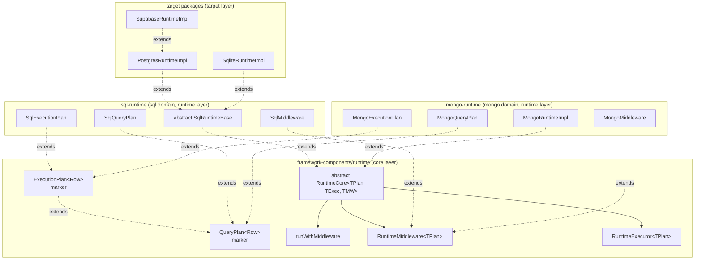
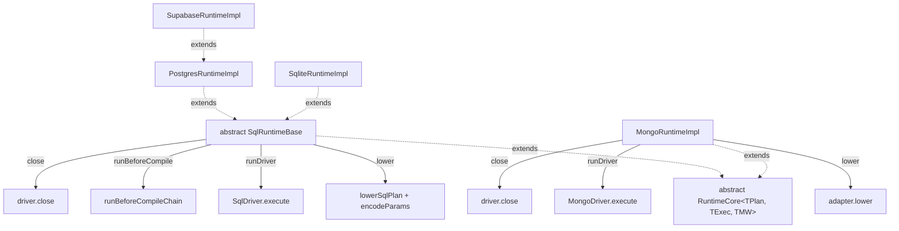
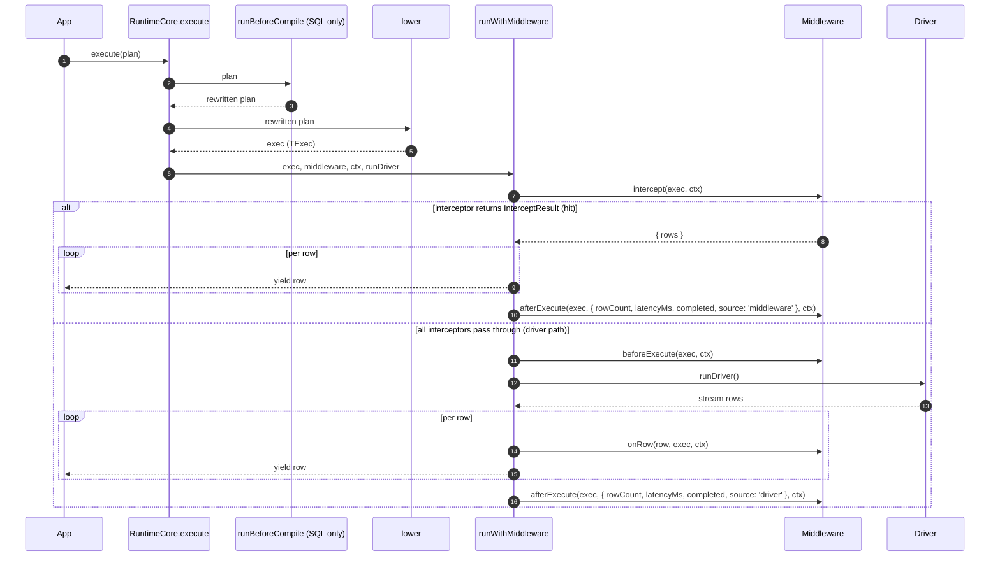

# Runtime & Middleware Framework

The runtime is the executable core of Prisma Next. Its job is to execute query plans and deliver tight feedback loops as it does so. Like the other subsystems, the runtime is simply an orchestrator of composable, primitive components responsible for execution, verification, and the middleware system.

Every query is compiled into a Plan, every Plan passes through the family-agnostic middleware lifecycle defined by `RuntimeCore`, and post-lowering middleware orchestration is delegated to a single canonical helper. This makes behavior explicit and problems easy to diagnose.

The "one query, one statement" rule simplifies both verification and debugging. When a Plan fails verification or a middleware raises a violation, the surface area is small and the cause is clear.

Results stream as `AsyncIterable<Row>` so applications can start processing immediately without buffering entire result sets. For typical small queries, consumers can opt into simple collection; the streaming model is the default, not a requirement.

The middleware system keeps logic out of the core and makes behavior composable. First-party and community middleware can implement lints, budgets, telemetry, and AST rewrites. Every Plan is presented to middleware before execution so policies and checks run consistently across families.

The runtime also verifies the contract against the database marker before it executes, and it executes Plans via family drivers while composing codecs from adapters and packs to decode rows precisely.

The runtime does not orchestrate migrations or unit-of-work semantics, does not contain dialect lowering logic (which lives in adapters), does not parse arbitrary SQL beyond the structure provided by lanes, and does not allow disabling contract verification in production. This separation of concerns reflects a thin-core, fat-targets philosophy that keeps the core predictable and extensions explicit.

## Single-Tier Runtime Model

Prisma Next has a single-tier runtime model: each family runtime is a single class that extends an abstract framework base. There is no separate target-agnostic "runtime executor" package any more — the framework owns the lifecycle template and the middleware orchestrator, and family runtimes own their family-specific overrides. See [ADR 204 — Single-tier runtime: collapse `runtime-executor` into `framework-components`](../adrs/ADR%20204%20-%20Single-tier%20runtime.md) for the rationale and the dependency direction it establishes.

The cross-family abstractions live in [`@prisma-next/framework-components/runtime`](../../../packages/1-framework/1-core/framework-components/src/exports/runtime.ts):

- Plan markers — `QueryPlan` and `ExecutionPlan` (see [`query-plan.ts`](../../../packages/1-framework/1-core/framework-components/src/query-plan.ts)).
- Middleware SPI — `RuntimeMiddleware<TPlan>`, `RuntimeMiddlewareContext`, `AfterExecuteResult` (see [`runtime-middleware.ts`](../../../packages/1-framework/1-core/framework-components/src/runtime-middleware.ts)).
- Executor SPI — `RuntimeExecutor<TPlan>` (same module).
- Abstract base — `RuntimeCore<TPlan, TExec, TMiddleware>` (see [`runtime-core.ts`](../../../packages/1-framework/1-core/framework-components/src/runtime-core.ts)).
- Lifecycle helper — `runWithMiddleware` (see [`run-with-middleware.ts`](../../../packages/1-framework/1-core/framework-components/src/run-with-middleware.ts)).

The class hierarchy has three layers: framework → family → target. Target classes are where construction happens (via target factories) and where target-specific runtime behaviour lives.



## Plan Markers: `QueryPlan` and `ExecutionPlan`

`QueryPlan<Row>` and `ExecutionPlan<Row>` are content-free framework-level marker interfaces. They exist so generic SPIs (`RuntimeExecutor`, `RuntimeMiddleware`, the abstract base, the orchestrator helper) can be parameterized over a plan type without naming any family-specific shape.

```typescript
// packages/1-framework/1-core/framework-components/src/query-plan.ts
export interface QueryPlan<Row = unknown> {
  readonly meta: PlanMeta;
  readonly _row?: Row;
}

export interface ExecutionPlan<Row = unknown> extends QueryPlan<Row> {}
```

`QueryPlan` is the **pre-lowering** marker — what a query lane builds. `ExecutionPlan` is the **post-lowering** marker — what a family runtime hands to the driver. Each family extends them with its concrete payload:

- `SqlQueryPlan` — AST + meta (no SQL text yet). Lives in [`@prisma-next/sql-relational-core`](../../../packages/2-sql/4-lanes/relational-core/src/plan.ts) (lanes layer; lanes can build it without a runtime dependency).
- `SqlExecutionPlan` — `{ sql, params, ast?, meta, _row? }`. Lives in [`@prisma-next/sql-relational-core`](../../../packages/2-sql/4-lanes/relational-core/src/sql-execution-plan.ts) and is re-exported from `@prisma-next/sql-runtime` via `./plan`. Co-located with `SqlQueryPlan` so lane utilities (`RawTemplateFactory`, `RawFactory`, `SqlPlan`) can compose against the executable shape without depending on the runtime layer.
- `MongoQueryPlan` — typed Mongo command shape; lives in [`@prisma-next/mongo-query-ast`](../../../packages/2-mongo-family/4-query/query-ast/src/query-plan.ts).
- `MongoExecutionPlan` — `{ command, meta, _row? }`. Lives in [`@prisma-next/mongo-runtime`](../../../packages/2-mongo-family/7-runtime/src/mongo-execution-plan.ts) (runtime layer; the wire-command shape lives in transport, which the lanes layer cannot depend on).

The framework domain owns no SQL- or Mongo-shaped concrete plan type. The previous SQL-shaped `ExecutionPlan` that lived in `@prisma-next/contract/types` has been replaced by these family-specific subtypes.

The phantom `_row` on every plan lets type-level utilities recover the row type from a plan value (`type Row = ResultType<typeof plan>`), and lets `RuntimeExecutor.execute<Row>(plan: TPlan & { readonly _row?: Row })` thread a caller-supplied `Row` into the result stream.

## Abstract `RuntimeCore` Lifecycle Template

`RuntimeCore<TPlan, TExec, TMiddleware>` defines the entire `execute(plan)` template in exactly one place. Concrete subclasses implement only the family-specific overrides; the orchestration around them is fixed.

```typescript
// packages/1-framework/1-core/framework-components/src/runtime-core.ts
export abstract class RuntimeCore<
  TPlan extends QueryPlan,
  TExec extends ExecutionPlan,
  TMiddleware extends RuntimeMiddleware<TExec>,
> implements RuntimeExecutor<TPlan> {
  protected runBeforeCompile(plan: TPlan): TPlan | Promise<TPlan> {
    return plan;
  }

  protected abstract lower(plan: TPlan): TExec | Promise<TExec>;

  protected abstract runDriver(exec: TExec): AsyncIterable<Record<string, unknown>>;

  abstract close(): Promise<void>;

  execute<Row>(plan: TPlan & { readonly _row?: Row }): AsyncIterableResult<Row> {
    // 1. runBeforeCompile (default identity; SQL overrides)
    // 2. lower (abstract)
    // 3. runWithMiddleware(exec, middleware, ctx, () => runDriver(exec))
    //    — orchestrates intercept → beforeExecute → runDriver loop → onRow → afterExecute
  }
}
```

The concrete `execute()` runs four steps in order:

1. **`runBeforeCompile(plan)`** — concrete; defaults to identity. SQL overrides this to run its `beforeCompile` middleware-hook chain (typed AST rewrites, see [`before-compile-chain.ts`](../../../packages/2-sql/5-runtime/src/middleware/before-compile-chain.ts)). Mongo does not override it today.
2. **`lower(plan)`** — abstract. Each family produces its `*ExecutionPlan` (SQL via `lowerSqlPlan`, Mongo via `adapter.lower`). Raw-SQL plans (already lowered) bypass this in `SqlRuntimeBase` via the existing branch in `executeAgainstQueryable`.
3. **`runWithMiddleware(exec, middleware, ctx, () => runDriver(exec))`** — concrete; the canonical post-lowering orchestrator. Iterates the `intercept` chain (a non-`undefined` return short-circuits the driver call); otherwise runs `beforeExecute` and consumes `runDriver()`. See [`runWithMiddleware` Helper](#runwithmiddleware-helper) and [Intercepting Execution](#intercepting-execution) below.
4. **`runDriver(exec)`** — abstract. Yields raw rows from the underlying transport. Skipped on the intercepted hit path.

`close()` is abstract; subclasses dispose family-specific resources (driver pool, sockets).

The ordering is fixed: every family runtime sees the same `runBeforeCompile → lower → runWithMiddleware(intercept → beforeExecute → driver loop → onRow → afterExecute)` sequence.

## Family and Target Inheritance Pattern

Each family runtime binds the three generics to concrete family types and implements the family-specific overrides. Target classes extend the family class to add target-specific runtime behaviour; there is no two-layer composition — no outer "family runtime" wrapping an inner "runtime core" instance.



**SQL family.** [`SqlRuntimeBase extends RuntimeCore<SqlQueryPlan, SqlExecutionPlan, SqlMiddleware>`](../../../packages/2-sql/5-runtime/src/sql-runtime.ts) is **abstract** and overrides:

- `lower(plan: SqlQueryPlan): SqlExecutionPlan` — runs `lowerSqlPlan(adapter, contract, plan)` and codec-encodes parameters.
- `runDriver(exec: SqlExecutionPlan): AsyncIterable<Record<string, unknown>>` — the default driver invocation (production execution paths override the queryable target via `executeAgainstQueryable` to support `connection()` / `transaction()`).
- `runBeforeCompile(plan: SqlQueryPlan): Promise<SqlQueryPlan>` — runs the `beforeCompile` chain over the plan's draft (AST + meta), returning a rewritten plan when middleware mutates the AST.
- `close()` — closes the driver pool.

`SqlRuntimeBase` also wraps the inherited `execute` path with codec row-decoding, marker verification (via `RuntimeFamilyAdapter`), and telemetry fingerprinting (via `computeSqlFingerprint`); these stay SQL-side rather than living in the abstract base.

`SqlRuntimeBase` also exposes two `protected` seams for target subclasses that need to issue SQL outside the middleware chain — see [Raw Connection Seam](#raw-connection-seam) below.

**SQL target classes.** [`PostgresRuntimeImpl`](../../../packages/3-extensions/postgres/src/runtime/postgres-runtime.ts) and [`SqliteRuntimeImpl`](../../../packages/3-extensions/sqlite/src/runtime/sqlite-runtime.ts) extend `SqlRuntimeBase` and are currently identity-thin — their value is structural. Future Postgres-specific runtime behaviour (prepared-statement caching, `LISTEN`/`NOTIFY`, etc.) lands on `PostgresRuntimeImpl` and flows into `SupabaseRuntimeImpl` by inheritance.

Target factories (`postgres()`, `sqlite()`, `supabase()`) construct their concrete target class; app code receives the `Runtime` interface and never sees the class hierarchy.

**Mongo family.** [`MongoRuntimeImpl extends RuntimeCore<MongoQueryPlan, MongoExecutionPlan, MongoMiddleware>`](../../../packages/2-mongo-family/7-runtime/src/mongo-runtime.ts) overrides:

- `lower(plan: MongoQueryPlan): MongoExecutionPlan` — runs `adapter.lower(plan)` and wraps the wire command.
- `runDriver(exec: MongoExecutionPlan): AsyncIterable<Record<string, unknown>>` — drives `driver.execute(exec.command)`.
- `close()` — closes the driver.

Mongo does not override `runBeforeCompile`; the base's identity default is sufficient because Mongo has no typed AST-rewrite chain today.

Adding a new family runtime requires one constructor and at most three method overrides (`lower`, `runDriver`, `close`; `runBeforeCompile` only when the family wants typed pre-lowering rewrites). No other extension points are required.

## Raw Connection Seam

`SqlRuntimeBase` exposes two `protected` primitives for target subclasses that need to run SQL outside the middleware chain — for example, to apply session-scoped Postgres settings before a typed query runs.

```ts
protected acquireRawConnection(): Promise<SqlConnection>

protected executeAgainstQueryable<Row>(
  plan: SqlExecutionPlan<Row> | SqlQueryPlan<Row>,
  queryable: SqlQueryable,
  options?: RuntimeExecuteOptions,
): AsyncIterableResult<Row>
```

`acquireRawConnection()` returns a raw `SqlConnection` from the driver. SQL issued directly on it (e.g. via `conn.query(...)`) runs outside the middleware/codec/telemetry pipeline. The caller owns the connection's lifecycle (`release`/`destroy`/`beginTransaction`).

`executeAgainstQueryable()` runs a typed plan through the full middleware/codec/telemetry pipeline against a caller-supplied queryable. Passing the raw connection from `acquireRawConnection` lets a subclass issue its setup SQL first, then hand the same connection to `executeAgainstQueryable` for the typed query.

**Why below-middleware matters.** SQL issued on the raw connection runs before `runWithMiddleware` sees the typed plan. User middleware cannot observe, reorder, or strip it. This makes setup SQL structurally non-bypassable — the property that makes Postgres RLS role enforcement sound.

[`SupabaseRuntimeImpl`](../../../packages/3-extensions/supabase/src/runtime/supabase-runtime.ts) is the canonical user: its `openRoleSession` method acquires a raw connection and issues `SELECT set_config('role', ...)` and `SELECT set_config('request.jwt.claims', ...)` before handing the connection to the typed query path.

## `runWithMiddleware` Helper

`runWithMiddleware` is the single canonical implementation of the middleware orchestration loop around a driver iteration. Family runtimes never reimplement it, and source-level `for ... of middleware` patterns inside family `execute` paths are limited to constructor compatibility checks and the SQL `beforeCompile` chain.

```typescript
// packages/1-framework/1-core/framework-components/src/run-with-middleware.ts
export function runWithMiddleware<TExec extends ExecutionPlan, Row>(
  exec: TExec,
  middleware: ReadonlyArray<RuntimeMiddleware<TExec>>,
  ctx: RuntimeMiddlewareContext,
  runDriver: () => AsyncIterable<Row>,
): AsyncIterableResult<Row>;
```

The lifecycle, in order:

1. **`intercept`** — for each middleware in registration order, `await mw.intercept?.(exec, ctx)`. The first non-`undefined` return value short-circuits execution; subsequent middleware's `intercept` does not fire. On a hit, steps 2 (`beforeExecute`) and the driver-side parts of step 3 (`runDriver` + `onRow`) are skipped, and the rows from the returned `InterceptResult` flow directly into the row loop. On all-passthrough (every interceptor returns `undefined` or omits the hook), execution continues normally. See "Intercepting Execution" below for the full semantics.
2. **`beforeExecute`** — driver path only. For each middleware in registration order, `await mw.beforeExecute(exec, ctx)`. Used for lints, budgets, annotations checks.
3. **Row loop** — for each row from the row source (`runDriver()` on the driver path; the intercepted `rows` on the hit path): on the driver path, for each middleware in registration order, `await mw.onRow(row, exec, ctx)`; then yield the row to the consumer; increment `rowCount`. `onRow` is suppressed on the intercepted hit path — those rows did not originate from the driver stream.
4. **`afterExecute` (success)** — when the row loop completes without error, for each middleware in registration order, `await mw.afterExecute(exec, { rowCount, latencyMs, completed: true, source }, ctx)`. `source` is `'driver'` on the passthrough path and `'middleware'` on the intercepted hit path.
5. **`afterExecute` (error path)** — if any hook or the row loop throws: for each middleware in registration order, `await mw.afterExecute(exec, { rowCount, latencyMs, completed: false, source }, ctx)`. Errors thrown by `afterExecute` during the error path are swallowed so they do not mask the original error. The original error is then rethrown.

Error-path swallowing is intentional and observable: telemetry middleware records `completed: false` for failed executions even though the user-visible error is the driver / lint / budget / interceptor failure that caused the abort.

The `source` field on `AfterExecuteResult` lets observers (telemetry, lints, budgets) distinguish driver-served from middleware-served executions without needing their own out-of-band signal. Observers that don't care about the distinction can ignore the field.

## Intercepting Execution

`RuntimeMiddleware.intercept` is the optional hook that lets a middleware short-circuit query execution and supply rows directly. It runs inside `runWithMiddleware`, after the orchestrator receives the lowered plan and before any `beforeExecute` hook fires. Use cases include caching, mocks for testing, rate limiting, and circuit breaking — anything that needs to answer the query without round-tripping the driver.

```typescript
export interface RuntimeMiddleware<TPlan extends QueryPlan = QueryPlan> {
  // ... name, familyId, targetId, beforeExecute, onRow, afterExecute (existing) ...
  intercept?(plan: TPlan, ctx: RuntimeMiddlewareContext): Promise<InterceptResult | undefined>
}

export interface InterceptResult {
  readonly rows:
    | AsyncIterable<Record<string, unknown>>
    | Iterable<Record<string, unknown>>
}
```

**Chain semantics.** Middleware run in registration order. The first to return a non-`undefined` `InterceptResult` wins; subsequent middleware's `intercept` does not fire. A middleware that returns `undefined` (or omits the hook) signals passthrough — the chain continues with the next interceptor, or to the driver path if every interceptor passed through.

**Hit path.** On a hit, `runWithMiddleware`:

1. Skips the `beforeExecute` loop entirely (`beforeExecute` semantically means "about to hit the driver"; on a cache or mock hit, the driver is never invoked).
2. Skips the `runDriver()` factory call. For factories that lazily produce async generators this is a no-op, but factories that do eager work (acquiring a connection, sending a query) must not run on the intercepted hit path.
3. Iterates the intercepted `rows` (handling both `Iterable` and `AsyncIterable` — `for await` natively supports both via `Symbol.asyncIterator` / `Symbol.iterator` fallback, so the orchestrator does not branch).
4. Skips `onRow` — intercepted rows did not originate from a driver row stream — but still yields each row to the consumer.
5. Fires `afterExecute` once with `source: 'middleware'`.
6. Emits a `middleware.intercept` debug event via `ctx.log.debug` naming the winning middleware (mirrors the `middleware.rewrite` event from the SQL `beforeCompile` chain).

**Row shape.** `InterceptResult.rows` carries untyped `Record<string, unknown>` rows — the same shape `onRow` already sees and the same shape the driver loop yields. The SQL runtime's `decodeRow` pass wraps the orchestrator output, so intercepted rows go through the same codec decoding as driver rows on the way to the consumer. Interceptors store and return raw (undecoded) wire-format rows.

**Verification ordering.** Contract-marker verification happens upstream of `runWithMiddleware` (in `SqlRuntimeBase.executeAgainstQueryable`, and would in any other family that needs it). A stale-schema query still throws `contract/hash-mismatch` before any interceptor sees it. The `intercept` hook does not bypass verification.

**Error path.** Errors thrown by a middleware inside `intercept` propagate as raw `Error`s like `beforeExecute` errors do. `afterExecute` fires with `completed: false` and `source: 'middleware'` — the failure originated in the intercept chain, not in the driver. Errors thrown by `afterExecute` during the error path remain swallowed (existing semantics, unchanged).

**Plan-identity invariant.** Interceptors that need per-execution scratch space (the cache middleware's miss buffer, request-coalescing pending sets, etc.) commonly key a private `WeakMap<exec, …>` on the post-lowering plan object. This relies on each call producing a fresh `exec` identity. Both family runtimes satisfy this today: SQL `executeAgainstQueryable` constructs a fresh `Object.freeze({...lowered, params: ...})` on every call; Mongo lowers fresh per call. If a future plan-memoization change ever recycles `exec` objects across calls, these middleware would silently leak rows between concurrent executions — which is what the cache middleware's concurrency regression test catches. See [ADR 025 — Plan caching & memoization](../adrs/ADR%20025%20-%20Plan%20Caching%20Memoization.md).

**Family-agnostic by construction.** `intercept` lives on `RuntimeMiddleware` in `framework-components`, not on `SqlMiddleware` or `MongoMiddleware`. Both family runtimes inherit it via `RuntimeCore.execute → runWithMiddleware`; no per-family wiring is required. The first-party cache middleware ([`@prisma-next/middleware-cache`](../../../packages/3-extensions/middleware-cache/)) is the canonical interceptor example and works against both SQL and Mongo runtimes day one — see its README for the full design (opt-in via annotations, transaction-scope guard, pluggable `CacheStore`, TTL/LRU semantics).

## Annotations

Annotations are a typed, namespaced way to attach per-query metadata that middleware can read. They are the opt-in mechanism the cache middleware uses ("cache this read for 60 seconds"), the audit middleware would use ("attribute this write to this actor"), and any future per-query policy hook will reuse.

The framework provides three pieces:

- `OperationKind = 'read' | 'write'` — the binary discriminator that gates which terminals an annotation can attach to. Finer-grained kinds (`'select' | 'insert' | …`) are deferred; widening is additive.
- `defineAnnotation<Payload>()({ namespace, applicableTo })` — curried two-step factory. The first call takes `Payload` explicitly; the second takes the runtime options and infers `Kinds` from `applicableTo` via a `const` type parameter, so the operation kinds appear once at the call site rather than being repeated as a type argument. The returned handle is a **callable function**: `handle(value)` produces an `AnnotationValue<Payload, Kinds>`. The function also carries `namespace`, `applicableTo: ReadonlySet<Kinds>` (frozen), and `read(plan)` as properties. Both `applicableTo` (off the handle and off each value) feed the type-level and runtime applicability gates.
- `ValidAnnotations<K, As>` — mapped tuple type consumed by lane terminals. Resolves any tuple element whose declared `Kinds` does not include the terminal's `K` to `never`, surfacing the mismatch as a type error at the call site.

```typescript
// packages/1-framework/1-core/framework-components/src/annotations.ts
import { defineAnnotation } from '@prisma-next/framework-components/runtime'

// Read-only annotation. Kinds inferred as 'read'.
export const cacheAnnotation = defineAnnotation<{ ttl?: number }>()({
  namespace: 'cache',
  applicableTo: ['read'],
})

// Write-only annotation (illustrative). Kinds inferred as 'write'.
export const auditAnnotation = defineAnnotation<{ actor: string }>()({
  namespace: 'audit',
  applicableTo: ['write'],
})

// Applicable to both kinds (e.g. tracing). Kinds inferred as 'read' | 'write'.
export const otelAnnotation = defineAnnotation<{ traceId: string }>()({
  namespace: 'otel',
  applicableTo: ['read', 'write'],
})
```

**Lane integration.** SQL DSL and ORM `Collection` adopt different surface shapes appropriate to their idioms; both gate by the terminal's operation kind `K`:

- SQL DSL — `.annotate(...)` is a variadic chainable method on every builder kind: `SelectQueryImpl` / `GroupedQueryImpl` accept `'read'`-applicable annotations; `InsertQueryImpl` / `UpdateQueryImpl` / `DeleteQueryImpl` accept `'write'`-applicable. The variadic parameter is constrained by `As & ValidAnnotations<K, As>`. The intersection is load-bearing — TypeScript's variadic-tuple inference is too forgiving with `ValidAnnotations<K, As>` alone, but the intersection pins `As` to the call-site tuple AND requires assignability to the gated form.
- ORM `Collection` and `GroupedCollection` — every terminal accepts an optional `configure: (meta: MetaBuilder<K>) => void` callback as its last argument. The user calls `meta.annotate(annotation)` (chainable, returns the builder) once per annotation; the conditional `K extends Kinds ? AnnotationValue<P, Kinds> : never` parameter type rejects inapplicable annotations at the call site. There is no chainable `Collection.annotate()` — annotations attach via the configurator only. The callback shape (rather than the variadic shape SQL DSL uses) is deliberate at the ORM layer: a terminal's last argument grows over time (future per-call options), and a callback configurator is extension-friendly where a variadic forecloses on additional arguments. The callback also drops the load-bearing `As & ValidAnnotations<K, As>` intersection — taking one annotation at a time avoids variadic-tuple inference entirely.

**Runtime applicability check.** SQL DSL `.build()` and the ORM `MetaBuilder.annotate(...)` both call `assertAnnotationsApplicable(...)` against the annotation(s) and the terminal's kind. The helper throws `RUNTIME.ANNOTATION_INAPPLICABLE` naming the namespace and terminal on any annotation whose `applicableTo` set lacks `kind`. This is belt-and-suspenders: the type system fails closed for type-aware callers, and the runtime check fails closed for casts / `any` / dynamic invocations. ORM terminals construct the meta builder via `createMetaBuilder(kind, terminalName)` and let the builder's `annotate` perform the gate eagerly; lane code does not re-validate after the user callback returns.

**Storage.** Applied annotations land under `plan.meta.annotations[namespace]` as branded `AnnotationValue<Payload, Kinds>` objects. Multiple `.annotate()` chain calls (SQL DSL) or `meta.annotate(...)` calls inside the configurator (ORM) compose; duplicate namespaces use last-write-wins. Reading via `handle.read(plan)` defensively checks the `__annotation` brand so framework-internal metadata (e.g. `meta.annotations.codecs` written by the SQL emitter) is not mistaken for a user annotation.

**Reserved namespaces.** `codecs` is consumed by the SQL emitter (`meta.annotations.codecs[alias] = 'pg/text@1'`) and read by the SQL runtime's `decodeRow`; it must not be used by user handles. Target-specific keys such as `pg` are similarly reserved. `defineAnnotation` does not structurally prevent a user from naming a reserved namespace — handles are namespaced strings, not branded types — but the framework makes no compatibility guarantees about handles that do.

**Runtime context: `contentHash` and `scope`.** Two `RuntimeMiddlewareContext` fields support the annotation-driven middleware ecosystem:

- `contentHash(exec): Promise<string>` — the family runtime returns an opaque, bounded digest identifying the `(storage, statement, params)` tuple of an execution. SQL composes `meta.storageHash + '|' + exec.sql + '|' + canonicalStringify(exec.params)` and pipes through `hashContent` (SHA-512); Mongo composes `meta.storageHash + '|' + canonicalStringify(exec.command)` and pipes the same way. Two semantically equivalent executions return the same digest. Used by middleware that need per-execution identity (caching, request coalescing). The cache middleware uses the returned string directly as a `Map` key — it is not (and should not be) further hashed by callers.
- `scope: 'runtime' | 'connection' | 'transaction'` — discriminates the queryable surface the execution is running under. Top-level `runtime.execute` populates `'runtime'`; `connection.execute` and `transaction.execute` derive a context with `'connection'` / `'transaction'`. Middleware that should only act at the top level (e.g. the cache middleware) read this field to bypass non-runtime scopes.

## ORM Client Integration

The SQL ORM client ([`@prisma-next/sql-orm-client`](../../../packages/3-extensions/sql-orm-client/src/types.ts)) consumes the canonical executor interface rather than declaring a parallel hierarchy. The integration is anchored on a small `RuntimeScope` slice exported from the lanes layer so both the ORM client and the SQL runtime depend on the same source of truth:

```typescript
// packages/2-sql/4-lanes/relational-core/src/runtime-scope.ts
import type { RuntimeExecutor } from '@prisma-next/framework-components/runtime';
import type { SqlExecutionPlan } from './sql-execution-plan';
import type { SqlQueryPlan } from './plan';

export type SqlOrmPlan = SqlExecutionPlan | SqlQueryPlan;
export type RuntimeScope = Pick<RuntimeExecutor<SqlOrmPlan>, 'execute'>;
```

```typescript
// packages/3-extensions/sql-orm-client/src/types.ts
import type { RuntimeScope, SqlOrmPlan } from '@prisma-next/sql-relational-core';

export interface RuntimeQueryable extends RuntimeScope {
  connection?(): Promise<RuntimeConnection>;
  transaction?(): Promise<RuntimeTransaction>;
}

export interface RuntimeConnection extends RuntimeScope { /* release?, transaction? */ }
export interface RuntimeTransaction extends RuntimeScope { /* commit?, rollback? */ }
```

`RuntimeQueryable` is `RuntimeScope` plus optional SQL-domain `connection()` / `transaction()` methods; `RuntimeConnection` and `RuntimeTransaction` extend `RuntimeScope` with their lifecycle methods. The structural compatibility with `RuntimeExecutor<SqlOrmPlan>` is asserted by the type test at [`runtime-queryable.types.test-d.ts`](../../../packages/3-extensions/sql-orm-client/test/runtime-queryable.types.test-d.ts).

The SQL `Runtime` interface returned by target factories such as `postgres()` (in [`@prisma-next/sql-runtime`](../../../packages/2-sql/5-runtime/src/sql-runtime.ts)) extends the same `RuntimeScope` from `@prisma-next/sql-relational-core`; the type test pins this invariant.

## Example

```typescript
import postgres from '@prisma-next/postgres/runtime'
import { schema } from '@prisma-next/sql-relational-core/schema'
import { validateContract } from '@prisma-next/sql-contract/validate'
import type { Contract } from './contract.d'
import contractJson from './contract.json' with { type: 'json' }

const contract = validateContract<Contract>(contractJson)

const db = postgres({ url: process.env.DATABASE_URL, contract })
await db.connect()

const tables = schema(db.context).tables

const plan = db.sql
  .from(tables.user)
  .where(tables.user.columns.active.eq(true))
  .select({ id: tables.user.columns.id, email: tables.user.columns.email })
  .build()

for await (const row of db.runtime().execute(plan)) {
  console.log(row.id, row.email)
}
```

### Sequence (high level)

This sequence shows the runtime's tight feedback loop at execution time: the runtime first runs `runBeforeCompile` and lowers the plan, then verifies its loaded contract against the database marker on the first execute (unless `verifyMarker: false`), emitting a structured `warn`-level log on drift and proceeding with the query, middleware apply policy and budgets deterministically, and the driver streams rows back while middleware observe per-row and aggregate outcomes.



## Plans, Identity, and Verification

Plans are immutable execution units produced by lanes. A `SqlExecutionPlan` carries `sql`, `params`, an optional `ast`, and `meta`; a `MongoExecutionPlan` carries `command` and `meta`. Treating Plans as the product — rather than executing intent directly — keeps behavior explicit, hashable, and auditable across environments. See the unified Plan model in Query Lanes and [ADR 011 — Unified Plan model across lanes](../adrs/ADR%20011%20-%20Unified%20Plan%20Model.md).

```typescript
type PlanMeta = {
  target: string
  storageHash: string
  profileHash?: string
  lane?: string
  refs?: { tables: string[]; columns: Array<{ table: string; column: string }> }
  projection?: Record<string, string>
  annotations?: Record<string, unknown>
}

interface SqlExecutionPlan<Row = unknown> extends ExecutionPlan<Row> {
  readonly sql: string
  readonly params: readonly unknown[]
  readonly ast?: AnyQueryAst   // optional; present for DSL/ORM lanes
}

interface MongoExecutionPlan<Row = unknown> extends ExecutionPlan<Row> {
  readonly command: AnyMongoWireCommand
}
```

AST is optional and present only for SQL lanes that build one (DSL/ORM). Raw and TypedSQL lanes omit it and rely on annotations and refs.

Verification compares the runtime's loaded contract to the database marker. Both `storageHash` and `profileHash` are enforced:

- The runtime reads marker `{ storageHash, profileHash }` and compares them to the loaded contract's hashes.
- A mismatch results in `contract/hash-mismatch` or `contract/marker-missing`, depending on configuration. See [ADR 021](../adrs/ADR%20021%20-%20Contract%20Marker%20Storage.md).
- `profileHash` is derived solely from the contract and written by the migration runner; the runtime does not compute a new profile or "negotiate" a new hash. See [ADR 004 — Storage Hash vs Profile Hash](../adrs/ADR%20004%20-%20Storage%20Hash%20vs%20Profile%20Hash.md).

## Execution Pipeline

The runtime executes Plans through the small set of well-defined stages defined by `RuntimeCore.execute`. SQL's AST-backed lanes participate in `runBeforeCompile`; both families lower into their `*ExecutionPlan` via `lower`; both families then orchestrate middleware around the driver via `runWithMiddleware`. This structure keeps behavior explicit (1q1s for SQL AST lanes), enables early failure with actionable errors, and minimizes overhead.

```text
TPlan (e.g. SqlQueryPlan with AST + meta, no SQL yet)
  └─▶ runBeforeCompile        // SQL: middleware may rewrite the AST; default: identity
       └─ lower               // family-specific lowering (SQL: lowerSqlPlan + encode params; Mongo: adapter.lower)
           └─ ▶ TExec (e.g. SqlExecutionPlan with sql + params, MongoExecutionPlan with command)
  └─▶ contract verification   // SQL: marker hash check on first execute (verifyMarker: false to skip)
  └─▶ runWithMiddleware
        ├─ intercept          // first non-undefined return wins; on hit, skip beforeExecute / driver / onRow
        ├─ beforeExecute      // driver path only: lints, budgets, annotations checks (in registration order)
        ├─ row loop           // driver path: per row: onRow (in registration order); yield row
        │                     // hit path: yield intercepted rows directly (onRow suppressed)
        └─ afterExecute       // success: completed: true; error: completed: false then rethrow
                              // source: 'driver' on passthrough; 'middleware' on intercepted hit
```

- AST lanes lower to a single SQL statement (1q1s) for predictability and guardrails; multi-step behavior is expressed explicitly outside the runtime. See [ADR 016 — Adapter SPI for lowering](../adrs/ADR%20016%20-%20Adapter%20SPI%20for%20Lowering.md) and the Architecture Overview's "Plans are the product".
- Results are `AsyncIterable<Row>` by default; an `AsyncIterableResult.toArray()` helper can collect.
- Budgets (row/latency) enforce incrementally and can terminate streaming early ([ADR 023](../adrs/ADR%20023%20-%20Budget%20Evaluation.md)).
- Prefer reading lane/adapter refs and annotations over parsing SQL text; behavior is explicit, not inferred.

## Connection Lifecycle

The runtime does not own pooling or sockets; it delegates to a target driver. This thin-core approach keeps the runtime simple and stable while adapters and packs carry dialect and capability logic.

**Lifecycle:** instantiate stack with driver → connect at boundary → create runtime ([ADR 159](../adrs/ADR%20159%20-%20Driver%20Terminology%20and%20Lifecycle.md)).

1. Create
   - `createSqlExecutionStack({ target, adapter, driver, extensionPacks })` - Creates SQL descriptor stack.
   - `createExecutionContext({ contract, stack })` - Creates context from contract and descriptors-only stack. Context creation uses descriptor `SqlStaticContributions` (codecs, operation signatures, parameterized codecs) — no instantiation required.
   - `instantiateExecutionStack(stack)` - Instantiates all components including driver (unbound).
   - Caller resolves binding from options and calls `driver.connect(binding)` at the boundary where env is available.
   - Target factory (e.g. `postgres()`) constructs `new PostgresRuntimeImpl({ context, adapter, driver, verifyMarker, middleware })` — a concrete subclass of `SqlRuntimeBase` / `RuntimeCore`. There is no family-level `createRuntime` factory.
   - Validates `contract.json` and caches `storageHash` / `profileHash` (contract is already validated before being passed to context).
   - Discovers environment capabilities to validate against the contract's pinned capability profile; does not compute a new `profileHash` ([ADR 065 — Adapter capability schema & negotiation](../adrs/ADR%20065%20-%20Adapter%20capability%20schema%20&%20negotiation%20v1.md)).
   - Uses `ExecutionContext` for contract, codec, and operations registries (decoupled from runtime).
   - Validates middleware compatibility (familyId / targetId) via `checkMiddlewareCompatibility` and registers middleware in order.
2. Warmup
   - Optional `driver.warmup()` and built-in contract verification if configured.
   - Codecs and operations are composed in `ExecutionContext` from adapter and extensions programmatically ([ADR 030](../adrs/ADR%20030%20-%20Result%20decoding%20&%20codecs%20registry.md), [ADR 114](../adrs/ADR%20114%20-%20Extension%20codecs%20&%20branded%20types.md)).
3. Acquire
   - On first execute, the driver acquires a pooled connection / session.
4. Execute
   - The runtime executes a single Plan through `RuntimeCore.execute → runBeforeCompile → lower → runWithMiddleware`. `runWithMiddleware` then runs the `intercept` chain; on a hit, intercepted rows flow to the consumer and `runDriver` is skipped, otherwise `beforeExecute → runDriver → onRow → afterExecute` runs as usual.
5. Release
   - The driver returns the connection to the pool.
6. Shutdown
   - `runtime.close()` closes the driver and disposes middleware resources.

## Transactions

Target clients expose a callback-based `transaction(callback)` API for grouping operations into an atomic unit. Implementation lives once in `@prisma-next/sql-runtime` as `withTransaction(...)`; family clients (e.g. `PostgresClient`) re-export it as `db.transaction(...)` and may override with custom semantics if needed.

```typescript
const result = await db.transaction(async (tx) => {
  await tx.orm.account.where({ id: fromId }).update({ balance: fromBalance - amount })
  await tx.orm.account.where({ id: toId   }).update({ balance: toBalance   + amount })

  const plan = tx.sql.from(tables.auditLog).insert({ action: 'transfer', amount }).build()
  await tx.execute(plan)

  return /* anything */
})
```

The callback receives a `TransactionContext` (`tx`) with three slots, all bound to the same transaction-scoped connection:

- `tx.orm` — ORM client (same `Collection<...>` shape as `db.orm`).
- `tx.sql` — SQL builder (same `Db<TContract>` shape as `db.sql`).
- `tx.execute(plan)` — runtime `execute` against the transaction's connection.

`tx` deliberately does **not** carry a `transaction` method — nesting is a compile-time error.

### Lifecycle and connection scoping

The runtime acquires a connection (auto-connecting lazily, like `db.runtime()`), issues `BEGIN`, runs the callback, and either commits and resolves with the callback's return value or rolls back and re-throws the original error. The connection is released in both branches — including when the callback hangs or the process crashes — via `finally` semantics. If `COMMIT` itself fails, the promise rejects with the commit error. If `ROLLBACK` fails after a callback throw, the rollback error wraps the original.

ORM nested mutations (`withMutationScope` in the SQL ORM mutation executor) detect that they are running inside a transaction context and reuse the transaction's `RuntimeQueryable` instead of acquiring a new connection. This is why `RuntimeConnection` and `RuntimeTransaction` extend the same `RuntimeScope` slice that `RuntimeQueryable` does — both compose against one canonical surface (see [ORM Client Integration](#orm-client-integration) above).

### `AsyncIterableResult` and transaction scope

Because every `tx.execute(plan)` returns an `AsyncIterableResult<Row>` that implements `PromiseLike<Row[]>`, the common patterns are safe:

```typescript
const posts = await db.transaction((tx) => tx.orm.posts.all())   // PromiseLike drains via .then()
const rows  = await db.transaction((tx) => tx.execute(plan))     // Same — drained inside the callback
```

The hazardous case is returning an unconsumed iterable from the callback so it escapes the transaction's connection scope. The transaction handles this by **invalidating** its `RuntimeQueryable` on commit/rollback. Any post-transaction pull from a `tx.execute(...)` result throws a clear, actionable error rather than silently buffering rows or producing partial reads. `execute()` semantics stay identical inside and outside transactions (always lazy); the connection scope is what becomes invalid, not the result wrapper. See the design notes on the Postgres wire-protocol behaviour analysis for why this is correctness-safe (mutations always execute fully regardless of streaming; unconsumed SELECTs mean unread data, not suppressed errors or incorrect commits).

### Non-goals

Default isolation level only (typically `READ COMMITTED` on Postgres); savepoints / nested transactions; automatic retry on serialization failures; an interactive `db.begin()` API; built-in transaction timeouts; and Mongo-family transactions. Each is an explicit deferral with its own follow-up. Users who need any of these wrap `transaction(...)` themselves or use the lower-level `RuntimeTransaction` SPI directly.

## Middleware API

Middlewares are async and run in registration order. Any middleware may block execution by throwing a structured error. See [ADR 014 — Runtime hook API](../adrs/ADR%20014%20-%20Runtime%20Hook%20API.md) and [ADR 027 — Error envelope & stable codes](../adrs/ADR%20027%20-%20Error%20Envelope%20Stable%20Codes.md).

```typescript
// packages/1-framework/1-core/framework-components/src/runtime-middleware.ts
export interface RuntimeMiddleware<TPlan extends QueryPlan = QueryPlan> {
  readonly name: string
  readonly familyId?: string    // restrict to a family ('sql', 'mongo')
  readonly targetId?: string    // restrict to a target ('postgres', 'sqlite')

  intercept?(plan: TPlan, ctx: RuntimeMiddlewareContext): Promise<InterceptResult | undefined>
  beforeExecute?(plan: TPlan, ctx: RuntimeMiddlewareContext): Promise<void>
  onRow?(row: Record<string, unknown>, plan: TPlan, ctx: RuntimeMiddlewareContext): Promise<void>
  afterExecute?(
    plan: TPlan,
    result: {
      rowCount: number
      latencyMs: number
      completed: boolean
      source: 'driver' | 'middleware'
    },
    ctx: RuntimeMiddlewareContext,
  ): Promise<void>
}
```

- **Generic middleware** (no `familyId`): works across all families. Examples: telemetry, rate limiting, the cache middleware.
- **Family-specific middleware** (`familyId: 'sql'`): uses narrowed plan/context types. Example: SQL lints, budgets, the SQL `beforeCompile` rewriters.
- **Compatibility validation:** `checkMiddlewareCompatibility()` runs during runtime construction; mismatched middleware throws `RUNTIME.MIDDLEWARE_FAMILY_MISMATCH` / `RUNTIME.MIDDLEWARE_TARGET_MISMATCH` with a clear message.
- Plans are immutable; middleware must not mutate in place. See [ADR 011](../adrs/ADR%20011%20-%20Unified%20Plan%20Model.md).
- Behavior is composed, not configured: middleware make policy explicit and testable; the only global tuning is a transparent `mode` (`strict` / `permissive`).
- `intercept` is optional and lets a middleware short-circuit execution and supply rows directly. See "Intercepting Execution" above.
- `beforeExecute` runs on the driver path only and is where verification and guardrails live. On the intercepted hit path it is skipped.
- `onRow` is optional and called for each streamed row on the driver path; intercepted rows skip `onRow`. `afterExecute` receives aggregates including the `completed` flag (success vs error path) and the `source` field (`'driver'` vs `'middleware'`).
- `RuntimeMiddlewareContext` carries `contentHash(exec)` (a bounded opaque digest of the execution identity) and `scope` (`'runtime' | 'connection' | 'transaction'`) for middleware that need per-execution identity or scope-aware behavior.

### Family-Specific Middleware Interfaces

- `SqlMiddleware` (in `@prisma-next/sql-runtime`): extends `RuntimeMiddleware<SqlExecutionPlan>` with `familyId: 'sql'`, `SqlMiddlewareContext`, and an additional `beforeCompile` hook for AST rewrites (see below).
- `MongoMiddleware` (in `@prisma-next/mongo-runtime`): extends `RuntimeMiddleware<MongoExecutionPlan>` with `familyId: 'mongo'`, `MongoMiddlewareContext`.

## Rewriting ASTs (SQL family)

`SqlMiddleware` offers one hook beyond the generic lifecycle: `beforeCompile`. It runs on the pre-lowering `SqlQueryPlan` so middleware can inspect and rewrite the query AST before the adapter turns it into SQL. This is the mechanism behind cross-cutting concerns like soft-delete, tenant isolation, and audit-row scoping — each expressed as a composable middleware rather than a bespoke wrapper around the lane.

```typescript
interface DraftPlan {
  readonly ast: AnyQueryAst   // typed SQL AST from sql-relational-core
  readonly meta: PlanMeta
}

interface SqlMiddleware extends RuntimeMiddleware<SqlExecutionPlan> {
  beforeCompile?(draft: DraftPlan, ctx: SqlMiddlewareContext): Promise<DraftPlan | undefined>
  // ... plus beforeExecute / onRow / afterExecute inherited semantics
}
```

`SqlRuntimeBase.runBeforeCompile` overrides the abstract base's identity default to delegate to `runBeforeCompileChain` ([source](../../../packages/2-sql/5-runtime/src/middleware/before-compile-chain.ts)), which iterates the registered middleware in order.

**Chained composition.** Middleware run in registration order; each sees the output of the previous. A soft-delete middleware registered before a tenant-isolation middleware means tenant isolation sees the already-soft-deleted draft and can combine its predicate with the existing `WHERE`. The runtime registers no ordering metadata — the array order is the source of truth.

**Passthrough is free.** Returning `undefined` (or a draft whose `ast` reference equals the input's) signals no rewrite: the chain continues with the same draft, no log event, no state change. `adapter.lower()` runs exactly once after the chain completes, regardless of how many middleware participated.

**Traceability.** When a middleware returns a draft with a new `ast` reference, the runtime emits a `middleware.rewrite` event via `ctx.log.debug` naming the middleware. No annotation is attached to the plan — logs are the audit trail.

**Working example — soft-delete.**

```typescript
import { AndExpr, BinaryExpr, ColumnRef, LiteralExpr } from '@prisma-next/sql-relational-core/ast'
import type { SqlMiddleware } from '@prisma-next/sql-runtime'

export const softDelete: SqlMiddleware = {
  name: 'softDelete',
  familyId: 'sql',
  async beforeCompile(draft) {
    if (draft.ast.kind !== 'select') return
    const notDeleted = BinaryExpr.eq(
      ColumnRef.of('users', 'deleted_at'),
      LiteralExpr.of(null),
    )
    const nextWhere = draft.ast.where
      ? AndExpr.of([draft.ast.where, notDeleted])
      : notDeleted
    return { ...draft, ast: draft.ast.withWhere(nextWhere) }
  },
}
```

**AST toolkit.** Use `AstRewriter`, `SelectAst.withWhere` / `.withJoins` / `.withLimit`, and the frozen-node factories (`BinaryExpr.eq`, `AndExpr.of`, `ColumnRef.of`) from `@prisma-next/sql-relational-core/ast`. Every node is immutable; `with*` methods return new instances.

**Security note.** Predicates built via `BinaryExpr` / `AndExpr` and literals via `LiteralExpr.of` are lowered through the adapter's parameterization — no SQL-injection surface is introduced by the hook itself. The one risk to flag in authoring guides: constructing `LiteralExpr.of(userInput)` from untrusted input bypasses parameterization. Use `ParamRef.of(userInput, ...)` for any value originating from user input.

**Error handling.** A middleware that throws inside `beforeCompile` surfaces via the standard `runtimeError` envelope — no silent swallow. Invalid ASTs (e.g. tables not in the contract) are caught downstream at lowering or contract verification time; the spec does not add a pre-lowering validation layer — middleware authors are responsible for producing structurally valid AST.

**Raw SQL lanes.** `beforeCompile` only runs when the lane produces a `SqlQueryPlan` (AST present). Raw SQL plans — which arrive as fully-lowered `SqlExecutionPlan` — bypass the hook entirely (the SQL runtime's `executeAgainstQueryable` branches on plan shape).

**Scope.** `beforeCompile` is the current AST-rewrite surface for SQL. Mongo has no typed `beforeCompile` chain today; the abstract base's `runBeforeCompile` defaults to identity for it. Short-circuiting the query with a static result is provided by the cross-family `intercept` hook (see "Intercepting Execution" above); user-authored query annotations are provided by the framework `defineAnnotation` helper plus lane-side `.annotate(...)` (see "Annotations" above) — both are family-agnostic and live on `RuntimeMiddleware` / lane terminals rather than in the SQL `beforeCompile` chain.

## Guardrails via Middleware

Guardrails are applied by a deterministic middleware pipeline that runs before, during (per-row), and after execution. With zero middleware, the runtime only verifies the contract and executes the Plan. When middleware are present, lints and budgets enforce policy while telemetry records outcomes. This keeps behavior composable and explicit, with middleware executing in registration order and clear failure semantics.

The **lints middleware** is implemented in the SQL domain ([`packages/2-sql/5-runtime/src/middleware/lints.ts`](../../../packages/2-sql/5-runtime/src/middleware/lints.ts)) and exported from `@prisma-next/sql-runtime`. It inspects `plan.ast` when present (AST-first), applying structural rules rather than SQL string parsing. When `plan.ast` is missing, it falls back to raw heuristic guardrails or skips linting, configurable via `fallbackWhenAstMissing`.

- Lints (defaults depend on mode)
  - `no-select-star` (selectAll intent)
  - `mutation-requires-where`
  - `no-missing-limit` for unbounded reads
  - `no-unindexed-predicate` using `meta.refs` and contract indexes when available
  - See [ADR 022](../adrs/ADR%20022%20-%20Lint%20Rule%20Taxonomy.md)

- Budgets
  - Row budget and latency budget enforced incrementally during streaming ([ADR 023](../adrs/ADR%20023%20-%20Budget%20Evaluation.md)).

- Telemetry
  - Emits `planId`, `sqlFingerprint`, `latencyMs`, `rowCount`, `errorCode` to configured sinks ([ADR 024 — Telemetry schema & privacy](../adrs/ADR%20024%20-%20Telemetry%20Schema.md)).

## Capabilities, Packs, and Codecs

Adapters report capabilities at connect time; the contract only declares requirements. Packs contribute capability manifests and codecs; adapters implement lowering and driver integration. Descriptor-level `SqlStaticContributions` (codecs, operation signatures, parameterized codecs) are the source of truth for codec and operation composition during context creation. At runtime, the adapter's reported capabilities are validated against the contract's declared requirements; capabilities are adapter-reported / negotiated, not target-defined. Shared adapter capability keys use the `sql.*` namespace. Codecs from adapters and packs are composed to decode branded values per row without bloating core logic.

- Adapters report / negotiate capabilities at connect time; the contract declares requirements. Missing required capabilities fail fast with `adapter/capability-missing`. The runtime does not recompute `profileHash` ([ADR 065](../adrs/ADR%20065%20-%20Adapter%20capability%20schema%20&%20negotiation%20v1.md), [ADR 004](../adrs/ADR%20004%20-%20Storage%20Hash%20vs%20Profile%20Hash.md)).
- Codecs are composed from app, packs, and the adapter for per-row decode / encode ([ADR 030](../adrs/ADR%20030%20-%20Result%20decoding%20&%20codecs%20registry.md), [ADR 114](../adrs/ADR%20114%20-%20Extension%20codecs%20&%20branded%20types.md)).
- Extension guardrails consult adapter-negotiated capability flags to avoid false positives and enforce pack-specific policies ([ADR 115](../adrs/ADR%20115%20-%20Extension%20guardrails%20&%20EXPLAIN%20policies.md)).

## Error Taxonomy

Errors are structured and machine-readable ([ADR 027](../adrs/ADR%20027%20-%20Error%20Envelope%20Stable%20Codes.md)):

```text
category/code
  contract/hash-mismatch
  contract/target-mismatch
  contract/marker-missing
  policy/annotations-missing
  lint/no-select-star
  lint/mutation-missing-where
  budget/rows-exceeded
  budget/latency-exceeded
  adapter/capability-missing
  compile/lowering-failed
  driver/query-failed
  runtime/unexpected
```

Family-specific runtime errors raised by the abstract base's middleware compatibility check (`RUNTIME.MIDDLEWARE_INCOMPATIBLE`, `RUNTIME.MIDDLEWARE_FAMILY_MISMATCH`, `RUNTIME.MIDDLEWARE_TARGET_MISMATCH`) follow the same envelope.

Policy determines whether a violation blocks (`error`) or logs (`warn`). A global `mode` can tune defaults (e.g., `strict` vs `permissive`).

## Performance and Caching

The runtime aims to keep guardrails on by default without noticeable overhead. We cache where identity is stable (e.g., per-adapter lowering and per-pool verification), stop work on the first blocking violation, and prefer lane-supplied metadata over SQL parsing to keep checks O(1) or near-constant.

Targets:

- < 5 % overhead on p95 latency for CRUD-class Plans with lints and budgets enabled.
- < 1 ms median overhead for the hook pipeline with first-party middleware enabled and no EXPLAIN issued.
- Zero-middleware runtime adds ~0.2–0.4 ms median on a local driver baseline.

Strategies:

- Keep contract verification O(1) via a single hash comparison and cache the result per pool.
- Cache adapter lowering by `(sqlFingerprint, adapter.version)` for AST lanes.
- Short-circuit the hook chain on first blocking violation.
- Prefer precomputed `meta.refs` from lanes for lints; avoid SQL parsing.
- See [ADR 025 — Plan caching & memoization](../adrs/ADR%20025%20-%20Plan%20Caching%20Memoization.md).

## Testing Strategy

Tests ensure the middleware contract remains stable, plan identity is preserved, and guardrails produce deterministic outcomes under different modes and capability sets. Benchmarks validate that feedback remains tight without sacrificing performance.

- `runWithMiddleware` unit tests (registration order, error path with `completed: false`, error swallowing in `afterExecute` during the error path, zero-middleware passthrough, and the full `intercept` matrix: first-wins semantics, hit path skipping `beforeExecute` / `runDriver` / `onRow`, hit + `source: 'middleware'` on `afterExecute`, miss-path zero-change regression, mixed chains, interceptor-throw paths, and the `Iterable` / `AsyncIterable` row-source variants).
- `RuntimeCore` mock-family tests demonstrate that a minimal subclass with concrete `lower` / `runDriver` / `close` (and nothing else) typechecks, constructs, and exercises the lifecycle.
- Cross-family proof: the same generic middleware observes queries from both SQL and Mongo runtimes, **and** the same generic interceptor short-circuits queries from both runtimes via inherited `runWithMiddleware` (preserved and extended from `cross-family-middleware-spi`).
- Annotations: unit + type tests for `defineAnnotation`, `ValidAnnotations<K, As>` (positive + negative on both kinds), `assertAnnotationsApplicable` (cast-bypass coverage), and lane-side `.annotate(...)` on every SQL DSL builder kind plus every ORM terminal.
- Family `contentHash` implementations: SQL and Mongo unit tests cover stability across object-key order, discrimination on `storageHash` and params/command, fixed-size opaque output (`sha512:HEXDIGEST`), and round-trip determinism.
- Cache middleware: package unit tests (opt-in semantics, hit/miss paths, scope guard, key composition incl. user-supplied `key` override and Mongo-style mock parity, store mechanics — LRU + TTL with injected clock) plus integration tests against real Postgres covering the April stop condition (driver invocation count = 1 on a repeated annotated read), composition with a `beforeCompile` rewriter (cache key reflects rewritten SQL), composition with telemetry (`source` round-trip), and concurrency (parallel executes do not cross-talk via the per-exec `WeakMap` buffer).
- SQL runtime scope plumbing: `connection.execute` and `transaction.execute` populate `ctx.scope` correctly; round-trips through `runtime → connection → transaction → runtime` route to the right scope each time.
- Golden SQL and hash stability tests to ensure Plan immutability and identity do not drift.
- Violation matrix ensuring built-in rules behave consistently under `strict` and `permissive` modes.
- Benchmarks to validate overhead budgets.
