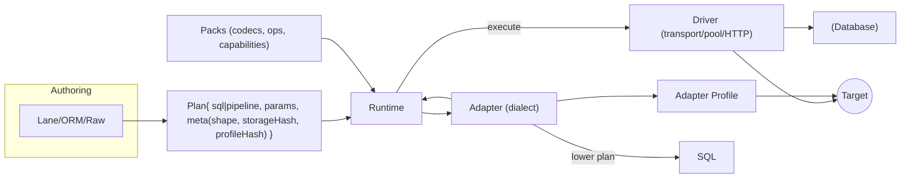
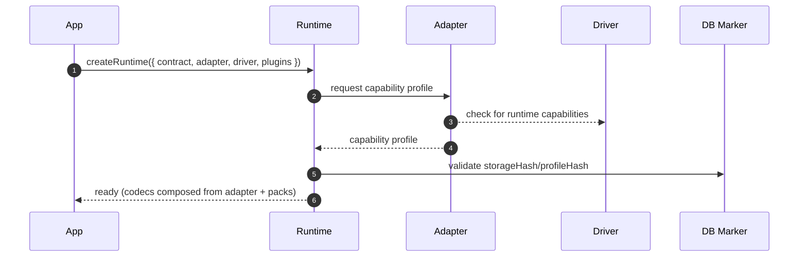
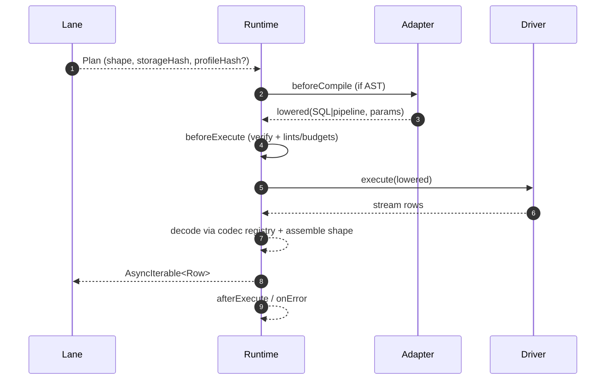

# Adapters & Targets

## Overview

Adapters and targets keep dialect‑ and database‑specific logic out of the runtime, core and query lanes. A Target is a stable identifier for a database engine/dialect family (for example, `postgres`, `mysql`, `sqlite`, `mongodb`). An Adapter implements the Target’s dialect concerns through a stable SPI: it advertises capabilities, lowers lane ASTs to deterministic wire payloads, normalizes EXPLAIN, and maps engine errors into the runtime’s stable error envelope. The Runtime remains thin: it orchestrates verification and plugins, composes codecs from adapters and packs, and executes Plans through a Driver that owns transport and connections.

This document defines the abstractions and boundaries that make the core portable across targets, describes the adapter SPI and capability model, and explains how plans execute as one execution unit per call with consistent guardrails and verification across engines.


## Architecture overview



## Goals

- Make it straightforward to add a new SQL dialect or a non-SQL target without touching core
- Keep the contract core thin and push target-specific behavior into adapters
- Preserve the unified Plan contract so lanes remain portable and runtime guardrails function across lanes
- Provide a conformance kit so community adapters can certify behavior and safety

## Responsibilities and non-goals

Subsystem responsibilities
- Define a stable, transport‑agnostic Adapter SPI for capability discovery, deterministic lowering, EXPLAIN normalization, and error mapping
- Keep dialect/engine specifics out of lanes and runtime via the adapter boundary
- Enforce one call → one execution unit across targets with consistent verification and guardrails

Component responsibilities
- **Runtime:** orchestrate plans, verify contract vs marker, validate pinned profile, compose codecs from adapter + packs, run hooks, stream rows
- **Adapter:** implement the SPI for a target; advertise capabilities; lower AST → SQL/pipeline deterministically; normalize EXPLAIN; map engine errors
- **Driver:** own transport (pool/connection/HTTP) and expose execute/explain/close; no dialect lowering
- **Packs:** contribute capability keys, codecs, operators/functions
- **Lanes:** produce Plans with projection/shape; no execution or capability discovery
- **Composition helpers:** live in extensions and compose runtime + target descriptors into app-facing entrypoints (for example, `@prisma-next/postgres` exposing the SQL DSL and ORM lanes from one helper)

Non-goals
- Owning pooling/sockets/HTTP transport in the runtime or adapter
- Implicit multi‑statement splitting in the adapter; multi‑step flows emit multiple Plans
- Mutating the contract artifact or recomputing `profileHash` at runtime

## Principles

- **Thin core, fat targets:** Core defines stable abstractions and validation, adapters implement specifics
- **Branch on capabilities, not on target:** Adapters declare what they can do via capabilities, lanes and the runtime remain unaware of the target DB or dialect
- **Deterministic lowering:** Given the same contract, AST, and profile, an adapter must render the same wire payload
- **One call → one execution unit:** Plans map to a single execution unit for predictability and guardrails (SQL statement for SQL targets; single aggregation pipeline for Mongo family)

## Glossary & terminology

- **Target**: stable identifier for a database engine/dialect family (e.g., `postgres`, `mysql`, `sqlite`, `mongodb`). Targets appear in the contract and in `plan.meta.target`; they are identifiers, not instantiatable objects
- **Adapter**: module that implements lowering, capability discovery, EXPLAIN normalization, and error mapping for a Target. Adapters are transport‑agnostic
- **Adapter profile**: adapter‑advertised, versioned profile id (e.g., `postgres/default@1`) describing the adapter’s semantics bundle (lowering/normalization/explain/error mapping). Diagnostic only: runtime does not branch on id/version and it is not part of `profileHash`. Contracts declare capability keys; runtime validates capability satisfaction against the pinned profile (see [ADR 004](../adrs/ADR%20004%20-%20Storage%20Hash%20vs%20Profile%20Hash.md))
- **Driver**: transport implementation (pool, single connection, HTTP) that provides `execute`, optional `explain`, and `close`. The application constructs the driver and passes it to the runtime
- **Runtime**: orchestrator that verifies the contract against the DB marker, validates capabilities, composes codecs from adapter and packs, runs hooks, and streams rows. It contains no dialect or transport logic
- **Packs**: extension packages contributing capability keys, codecs, operators/functions
- **Lane**: authoring surface (DSL/ORM/Raw/TypedSQL) that compiles to a Plan and stamps shape/projection; lanes do not execute
- **Plan**: immutable execution artifact `{ sql|pipeline, params, meta }` with `meta` including shape/projection, refs, target, `storageHash`, and optional `profileHash`
- **One execution unit**: each Plan executes as a single SQL statement or a single aggregation pipeline
- **Codec registry**: registry composed by the runtime from adapter and packs; used to decode driver values into typed results

## Example

```ts
import contract from './contract.json'

// Construct domain types from the contract (lane/helper)
const t = makeT(contract)

// Transport (pool) → Driver
// Replace SqlPool/createSqlDriver with a concrete pool/driver implementation (names illustrative)
const pool = new SqlPool({ connectionString: process.env.DATABASE_URL })
const driver = createSqlDriver({
  acquire: async () => await pool.connect(),
  release: async (conn) => conn.release(),
  close: async () => await pool.end()
})

// Target adapter (dialect), constructed per target
const adapter = createAdapter({ profileId: 'postgres/default@1' })

// Runtime composes contract + adapter + driver
const rt = createRuntime({ contract, adapter, driver, plugins: [] })

// Build a Plan via a lane (DSL or ORM)
const plan = sql()
  .from(t.user)
  .where(t.user.active.eq(true))
  .select({ id: t.user.id, email: t.user.email })
  .limit(100)
  .build()

// Execute as an AsyncIterable<Row>
for await (const row of rt.execute(plan)) {
  console.log(row.id, row.email)
}

// Shutdown
await rt.end()
```

## Separation of concerns

The runtime, adapter, driver, packs, and lanes each have a single clear responsibility.

**Runtime**
- Orchestrates Plans through verification and hooks; validates `storageHash`/`profileHash` against the DB marker; composes the codec registry from adapter and packs; streams rows to callers. Contains no dialect or transport logic

**Adapter**
- Advertises capabilities via a profile; lowers AST to SQL/pipelines deterministically; normalizes EXPLAIN output; maps engine errors to the stable error envelope (see [ADR 068](../adrs/ADR%20068%20-%20Error%20mapping%20to%20RuntimeError.md)). Transport‑agnostic

**Driver**
- Owns transport and connection management (pool, single connection, HTTP). Exposes `execute`, optional `explain`, and `close`. The application constructs the driver and passes it to the runtime

**Packs**
- Contribute capability keys and codecs/operators; participate in capability validation and codec composition

**Lanes**
- Provide AST/projection/shape and emit Plans; do not execute or negotiate capabilities

## Target descriptor as SPI aggregator

The target descriptor (`SqlControlTargetDescriptor`, the Mongo equivalent, …) is the seam through which IR-time and runtime SPIs reach the framework. Each SPI lives as a named property next to `migrations`:

- `migrations: { createPlanner, createRunner, contractToSchema }` — existing control-plane SPIs.
- `contractSerializer: ContractSerializer<TContract>` — the JSON ⇄ class boundary for the contract IR (see [Contract Emitter § Rehydration via the per-target ContractSerializer SPI](2.%20Contract%20Emitter%20&%20Types.md#rehydration-via-the-per-target-contractserializer-spi)).
- `schemaVerifier: SchemaVerifier<TContract, TSchema>` — per-target verifier that walks the target's concrete IR classes natively, dispatched from the framework's contract-space aggregate.
- `controlAdapter: <Family>ControlAdapter` — the family-level adapter SPI the family's `ControlFamilyInstance` dispatches through for wire-level operations (marker reads/writes, introspection). The Mongo family adopts this surface as a sibling of SQL's; family packages carry zero target/adapter/driver runtime deps.

The descriptor IS the aggregator — there is no separate `Target<TContract, TSchema>` interface. Framework consumers depend on the framework SPI interfaces (`ContractSerializer<TContract>`, `SchemaVerifier<TContract, TSchema>`); they reach a target's implementation through the descriptor property. Adding a new SPI in future work grows the descriptor by one named property; existing implementers and consumers are untouched.

Extension authors that want to swap one SPI subclass that one SPI implementer and inject the override into their descriptor:

```ts
class CockroachContractSerializer extends PostgresContractSerializer {
  protected constructTargetContract(validated): CockroachContract { /* … */ }
}

const cockroachControlTargetDescriptor: SqlControlTargetDescriptor<'cockroach', …> = {
  ...postgresTargetDescriptorMeta,
  migrations: { createPlanner, createRunner, contractToSchema },
  contractSerializer: new CockroachContractSerializer(…),  // overridden
  schemaVerifier:     new PostgresSchemaVerifier(…),        // inherited as-is
};
```

This is the affordance the framework provides for cross-target inheritance: target packs descendant from Postgres carry the Postgres family-shape SPI implementations until they need to diverge, and the divergence is scoped to one SPI at a time.

### Pack-contributed entity authoring

Target packs contribute new IR kinds through the `entities` namespace on `AuthoringContributions` ([`packages/1-framework/1-core/framework-components/src/shared/framework-authoring.ts`](../../../packages/1-framework/1-core/framework-components/src/shared/framework-authoring.ts)). Each entity descriptor carries a factory `(input, ctx) => IRNode` that constructs the IR-class instance; pack-bag-driven type narrowing surfaces the contributed kind at `helpers.entities.<entityName>(input)` in the TS DSL with full type narrowing on `input`. PSL syntax for the same kind lowers through the same descriptor.

The mechanism is the authoring counterpart of the IR's target-extensibility — once the target's IR admits a new kind (Postgres schemas, future RLS policies), the authoring surface admits it too without hand-edited family-layer construction sites. The family contract-builder holds no reference to target IR classes; it holds a reference to the pack-contributed factory and dispatches to it.

The pattern's worked example is the SQL family's domain enum: the family contributes the `enum` entity descriptor, the authoring surface (PSL `enum` block / TS `enumType` + `member`) lowers through it into a domain enum entity plus a storage `StorageValueSet`, the SQL verifier walks the resulting value-set check natively, and the planner generates and reconciles the CHECK constraint. Future target-specific entity kinds (RLS policies, custom functions, views) follow the same recipe.

## Adapter SPI overview

An adapter implements three concerns

- **Profile & capabilities**: Expose capability flags and codec registry behavior. Contract extensions are provided by packs under `extensions.<namespace>`; adapters do not mutate contract artifacts
- **Lowering & compilation**: Turn relational AST or target-native AST into a deterministic wire payload (SQL string + params for SQL targets, JSON pipeline for Mongo family)
- **Driver execution**: Execute a Plan and return typed rows according to registered codecs

## Minimal TypeScript SPI

```ts
export type CapabilityMap = {
  transactionalDDL: boolean
  savepoints: boolean
  lateral: boolean
  jsonAgg: boolean
  partialIndex: boolean
  deferrableConstraints: boolean
  explainFormat: 'text' | 'json'
  // extensible
}

export interface AdapterProfile {
  id: string                     // e.g. "postgres/default@1"
  target: 'postgres' | 'mysql' | 'sqlite' | 'mongodb'
  capabilities: CapabilityMap
}

export interface Lowerer {
  target: AdapterProfile['target']
  lower(query: QueryAST, contract: ContractCore): Lowered // deterministic
}

// Lowered payloads are opaque to the runtime; adapters/driver pairs define their own body types
export interface Lowered<Body = unknown> {
  profileId: string                      // diagnostic only; no branching
  body: Body                             // adapter-defined; opaque to runtime
  annotations?: Record<string, unknown>  // optional adapter hints for plugins
}

export interface Driver<Body = unknown> {
  execute(lowered: Lowered<Body>, codecs: CodecRegistry): Promise<AsyncIterable<unknown>>
  explain?(lowered: Lowered<Body>): Promise<ExplainResult>
  connect(): Promise<void>
  close(): Promise<void>
}

export interface MigrationOps {
  apply(op: DDLOp, ctx: ApplyContext): Promise<void>
  precheck(op: DDLOp, ctx: ApplyContext): Promise<CheckResult>
  postcheck(op: DDLOp, ctx: ApplyContext): Promise<CheckResult>
}
```

The runtime wires these pieces into the Plan pipeline and plugin hooks

## Codec registry and row composition

Plans carry projection and may carry explicit shape descriptors for nested selections (e.g., relation aliases). The runtime composes a codec registry from the adapter and installed packs and applies it while streaming rows from the driver.

- Scalar decoding: values are decoded using the selected codec for the projected column type
- Shape‑aware composition: when a projection includes a relation alias (e.g., `posts` as an array of fields), the Plan stamps a shape descriptor. The runtime parses the aggregated payload produced by lowering (e.g., JSON aggregation) and applies per‑field codecs inside the nested items to assemble the requested shape
- Raw SQL lane: without a stamped shape, relation composition is not inferred; authors either project flat fields or provide annotations that lanes can convert into a shape

Example shape fragment (illustrative):

```ts
plan.meta.projection = { id: 'user.id', email: 'user.email', posts: 'json' }
plan.meta.shape = {
  posts: { kind: 'array', item: { id: 'post.id', title: 'post.title' } }
}
```

## Transport constraints and guardrails

Engine, transport, and policy constraints are handled at explicit boundaries to keep behavior predictable and portable:

- Engine/dialect constraints are exposed as adapter capabilities (for example, maximum bind parameters). Lanes and plugins branch or error based on capabilities (see [ADR 065](../adrs/ADR%20065%20-%20Adapter%20capability%20schema%20&%20negotiation%20v1.md))
- Runtime budgets and lints can enforce maximum SQL size (bytes) and parameter count in `beforeExecute` to fail fast with actionable errors (see [ADR 023](../adrs/ADR%20023%20-%20Budget%20evaluation%20&%20EXPLAIN%20policy.md) and [ADR 022](../adrs/ADR%20022%20-%20Lint%20rule%20taxonomy%20%26%20configuration%20model.md))
- Transport constraints (HTTP payload limits, proxy behavior) are driver concerns; the driver may stream/compress or return structured errors that map to the runtime error envelope
- No implicit multi‑statement splitting occurs inside adapters. If a single query exceeds limits, higher‑level macros should emit multiple Plans to preserve the one call → one execution unit rule

## Transactions

Transactions are handled at the transport boundary and governed by explicit capabilities and policies. Responsibilities are split to keep semantics predictable and portable:

- **Adapter (capabilities):** Advertises transaction-related capabilities (for example, `transactionalDDL`, `savepoints`) and informs DDL semantics for migrations. Adapters do not own transaction lifetimes
- **Driver (ownership):** Owns connections and transaction lifetimes (begin/commit/rollback), including serverless/HTTP-specific constraints. A driver may expose a "run in transaction" primitive or accept an ambient session context
- **Runtime (orchestration):** Executes one Plan per statement. Multiple Plans can run within a driver-managed transaction boundary; hooks (`beforeExecute`/`onRow`/`afterExecute`) run per Plan inside that boundary. The runtime does not manage pools/sockets and does not synthesize transactions
- **Migrations (DDL):** The migration runner uses adapter-provided DDL operations and `txSemantics` with compensations or fallback when `transactionalDDL` is unavailable (see [ADR 037](../adrs/ADR%20037%20-%20Transactional%20DDL%20Fallback.md) and [ADR 028](../adrs/ADR%20028%20-%20Migration%20Structure%20&%20Operations.md))
- **Serverless/HTTP:** If the driver/target does not support multi-statement transactions, capability checks fail fast when a transactional scope is requested

One call → one execution unit remains in force; multi-step units of work are composed as multiple Plans within a driver-owned transaction, not by splitting a single Plan

## SQL adapter specifics

SQL targets lower the relational AST to a single SQL statement with deterministic rendering and safe parameterization. The adapter is responsible for dialect‑specific details and stability.

Lowering responsibilities:
- Quote and escape identifiers deterministically
- Normalize aliases and whitespace for stable hashing and golden tests
- Render JOINs, GROUP BY, ORDER, LIMIT according to dialect
- Emit safe parameter placeholders and parameter order

DDL execution:
- Provide op executors for the migration runner with txSemantics and compensations
  See [ADR 037](../adrs/ADR%20037%20-%20Transactional%20DDL%20Fallback.md) and [ADR 028](../adrs/ADR%20028%20-%20Migration%20Structure%20&%20Operations.md)
- The runner protocol applies per space through a single `execute({ driver, perSpaceOptions })` entry point so adapters fully participate in the per-space planner / runner / verifier introduced in [ADR 212 — Contract spaces](../adrs/ADR%20212%20-%20Contract%20spaces.md). Adapters expose `readAllMarkers` / `readMarkerForSpace` SPI methods alongside the single-row `readMarker`. There is no "extension dependencies" introspection node — the previous `pg_extension` -> `postgres.extension.<extname>` mapping was removed when [ADR 154](../adrs/ADR%20154%20-%20Component-owned%20database%20dependencies.md) was superseded.

EXPLAIN:
- Return a normalized structure the budget plugin can consume
  For JSON explainers, adapters normalize common fields such as total cost or row estimates


## Mongo family (document targets)

Document targets share `targetFamily = "document"`. Plans map to a single aggregation pipeline, and the adapter defines an opaque lowered body that the driver executes. Branching uses declared capabilities; lanes favor intent. See [ADR 070](../adrs/ADR%20070%20-%20Non-SQL%20Plan%20body%20kinds%20&%20execution%20semantics.md) for the non‑SQL plan model.

### Contract extensions

The contract is extended via packs under `extensions.<namespace>`; adapters advertise capabilities and codecs but do not mutate contract artifacts:
- Collections map to storage units with JSON schema hints
- Indexes capture compound, unique, partial, and TTL behaviors
- Types add objectId, date, decimal128, and nested documents
- Capabilities include aggregation stages supported, transactions, and explain formats

Example contract extension snippet

```json
{
  "target": "mongodb",
  "collections": {
    "users": {
      "schema": {
        "properties": {
          "_id": { "type": "objectId" },
          "email": { "type": "string" },
          "active": { "type": "boolean" }
        },
        "required": ["_id", "email"]
      },
      "indexes": [
        { "keys": { "email": 1 }, "unique": true }
      ]
    }
  },
  "capabilities": { "mongo": { "transactions": true, "stages": ["match","lookup","project","limit","sort"] } }
}
```

### Capabilities (document)

Document targets expose stage/function capabilities via canonical keys (see [ADR 065](../adrs/ADR%20065%20-%20Adapter%20capability%20schema%20&%20negotiation%20v1.md)), e.g., `stages.match`, `stages.lookup`, `stages.project`, `stages.sort`, `stages.limit`, and `transactions`. Extension capabilities are namespaced by pack.

### Example

```ts
// Build a simple pipeline plan using a lane helper
const plan = dsl()
  .from(t['users'])
  .where(t['users'].active.eq(true))
  .select({ id: t['users']._id, email: t['users'].email })
  .limit(100)
  .build()
```

### Query lanes

Two options, both producing a Plan the runtime understands:
- Relational DSL lowered to Mongo. A limited mapping for simple projections, filters, and 1:N lookups using $lookup. Suitable for teams that want a cross-target lane
- Mongo DSL lane. Target-native builder that constructs an Aggregation Pipeline AST and lowers to an adapter-defined opaque body consumed by the driver

Both lanes stamp the same annotations and participate in the same plugin hooks for lints, budgets, and telemetry.

### Lowering (opaque body)

Common mappings include: filters → `$match`, projections → `$project`, ordering/limit → `$sort`/`$limit`, and 1:N lookups via `$lookup` with nested pipelines. Parameters are bound safely; the lowered body is adapter-defined and opaque to the runtime (see [ADR 070](../adrs/ADR%20070%20-%20Non-SQL%20Plan%20body%20kinds%20&%20execution%20semantics.md)).

### Execution

The Mongo driver executes a single aggregation pipeline and decodes results using registered codecs.

### Migrations

Migration ops are document-specific but follow the same edge model (see [ADR 028](../adrs/ADR%20028%20-%20Migration%20Structure%20%26%20Operations.md) and [ADR 188](../adrs/ADR%20188%20-%20MongoDB%20migration%20operation%20model.md)):
- createCollection, dropCollection, createIndex, dropIndex
- addField with updateMany backfills
- Validator updates and advisory checks (transactions gated by `transactions` capability)

### Portability & limitations

Relational DSL lowering to document targets is intentionally limited to a credible subset (simple projections/filters and 1:N lookups). Lanes should favor expressing intent; when a construct lacks capability support, the adapter raises an actionable error rather than attempting lossy rewrites.

## Target alignment

The contract, adapter, and driver must agree on the target:

- The contract declares `target` (and `targetFamily`) as part of its core identity
- The adapter and driver expose `familyId` and `targetId` via their control/runtime descriptors
- The runtime verifies `contract.target === targetDescriptor.targetId` and enforces that adapter/driver descriptors are compatible with the same `(familyId, targetId)` pair

Specific adapter/driver selection is runtime configuration and is not encoded in the contract. `profileHash` derives from declared capability keys/variants; `storageHash` includes the target selection but not adapter/driver details. See [ADR 151](../adrs/ADR%20151%20-%20Control%20Plane%20Descriptors%20and%20Instances.md) for the control-plane descriptor and instance pattern, and [ADR 152](../adrs/ADR%20152%20-%20Execution%20Plane%20Descriptors%20and%20Instances.md) for the execution/runtime-plane descriptor and instance pattern.

## Adapter capabilities and discovery

Adapters declare or discover supported capabilities through a standardized schema (see [ADR 065](../adrs/ADR%20065%20-%20Adapter%20capability%20schema%20&%20negotiation%20v1.md)):

### Capability Declaration
```typescript
interface AdapterCapabilities {
  [namespace: string]: {
    [capability: string]: boolean | string | object | array
  }
}

// Example PostgreSQL adapter capabilities
const postgresCapabilities = {
  postgres: {
    lateral: true,
    jsonAgg: true,
    returning: true,
    partialIndex: true,
    deferrableConstraints: true,
    savepoints: true,
    transactionalDDL: true,
    explainFormat: 'json'
  },
  pgvector: {
    ivfflat: true,
    hnsw: false,
    vector: { dim: 'any', distance: ['cosine', 'l2', 'inner'] }
  }
}
```

### Capability discovery flow
1. **Adapter discovery/Discovery**: Adapter reports capabilities at startup; it may probe the target via the driver if needed for dynamic features
2. **Contract Requirements**: Runtime checks contract-declared capabilities against adapter capabilities
3. **Extension Pack Loading**: Loads installed packs and validates capability requirements
4. **Pinned profile validation**: Runtime validates environment satisfies the contract‑pinned capability profile; no `profileHash` recomputation (see [ADR 004](../adrs/ADR%20004%20-%20Storage%20Hash%20vs%20Profile%20Hash.md))
5. **Early Failure**: Missing required capabilities cause connection failure

Notes:
- Runtime branches solely on declared capabilities. Adapter profile id/version are diagnostic and MUST NOT influence branching or verification
- `profileHash` is derived only from declared capability keys/variants; adapter ids/versions and driver/transport are not included in the contract

### Capability stability contract
- **Core capabilities** (e.g., `lateral`, `jsonAgg`) are reserved and immutable
- **Extension capabilities** are prefixed by pack namespace (e.g., `pgvector.ivfflat`)
- **Reserved namespaces** include `prisma`, `core`, `internal`, and adapter names

### Capability flags (examples)

Adapters publish a stable capability set so lanes and plugins can make safe choices. Lanes and plugins branch on these keys, not target strings.

Examples:
- **returning**: adapter supports RETURNING clauses for DML operations (INSERT, UPDATE, DELETE)
- **transactionalDDL**: engine supports wrapping DDL in a transaction
- **savepoints**: savepoint support for fine-grained rollback
- **lateral**: lateral joins are available
- **jsonAgg**: aggregate to JSON at the engine
- **partialIndex**: partial or filtered indexes supported
- **deferrableConstraints**: DEFERRABLE constraints supported
- **explainFormat**: preferred EXPLAIN output for budgets and diagnostics

### Capability schema and lowering/tests

- Capability schema
  - Canonical keys for join (`join.lateral`, `join.semi`, `join.anti`), projection (`projection.distinct`, `projection.distinctOn`), distribution (`distribution.shardKey`), and partial indexes (`index.partial`). See [ADR 065](../adrs/ADR%20065%20-%20Adapter%20capability%20schema%20&%20negotiation%20v1.md) and capabilities reference

- Lowering and tests
  - Golden SQL/pipeline rendering for capability-gated branches; ensure deterministic output with capabilities on/off
  - Conformance kit cases cover pack features that depend on declared capabilities

Cross-references
- ADR 065 adapter capability schema and discovery
- ADR 026 conformance kit and levels
- ADR 067 lowering determinism and golden tests

## Branching on capabilities (no adapter coupling)

Lanes and runtime components branch on standardized capability keys rather than adapter or target strings. Capabilities follow a canonical schema (see [ADR 065](../adrs/ADR%20065%20-%20Adapter%20capability%20schema%20&%20negotiation%20v1.md)):

First, prefer intent over branching. Lanes express the author’s intent in the AST (for example, use distinct on, use lateral join). The adapter lowers or errors based on declared capabilities. When branching is necessary in lanes or macros, use the canonical capability keys:

- Core capability keys are stable across targets (for example, `join.lateral`, `join.semi`, `projection.distinctOn`, `index.partial`)
- Extension capability keys are namespaced by packs (for example, `pgvector.ivfflat`) and defined by the pack, not a single adapter

This pattern avoids coupling to adapter-specific strings. Legitimate coupling to extensions happens via their namespaced capability keys and typed helpers those packs export. Provide typed helpers (for example, `caps.has('join.lateral')`) to avoid magic strings in code. Most capability decisions should live in the adapter; lanes branch only when there are genuinely alternate authoring paths.

## Lowering and Portability

**Lowering lives in adapter profiles, lanes remain portable:**

- **Adapter-specific lowering**: SQL generation, type mapping, and capability-specific optimizations
- **Lane portability**: Query DSL, TypedSQL, and ORM lanes work across adapters
- **Capability branching**: Lanes branch on capabilities rather than target strings
- **Extension integration**: Extension functions/operators integrate through adapter capabilities

## Testing & conformance

Community adapters and new targets must pass the conformance kit to claim support levels.

Levels
- L0 Execute: Connect, compile, execute SELECT with filters, order, limit, simple codecs, Plan hashing stability
- L1 Schema: Additive migrations, index creation, contract marker storage, EXPLAIN integration for budgets
- L2 Advanced: Transactions or compensation strategy, partial indexes, advisory locks, pre/post checks, phased not-null, backfill orchestration
- L3 Extensions: Extension capability gating, function/operator rendering, codec integration, migration operations, guardrails enforcement

See ADR 026 for certification levels.

Fixture packs
- Contract fixtures canonical contract.json sets per target with golden Plans and outputs
- Query fixtures relational and target-native ASTs with expected lowered payloads
- Migration fixtures op sequences and expected pre/post outcomes

Golden tests
- SQL adapters must pass golden SQL rendering tests with normalized whitespace and aliasing
- Mongo adapters must pass golden pipeline rendering tests with normalized stage ordering where deterministic

Budget & lint tests
- Adapters must provide EXPLAIN samples that budget evaluators can consume
- Lints run over lowered payloads and annotations to ensure rule parity across targets

Error envelope

All adapters must map engine errors into the stable RuntimeError shape from ADR 027.


## Lifecycle and sequences
### Startup/Connect


### Execute


### Concurrency, streaming, and cancellation

The runtime executes each Plan as an AsyncIterable of rows. Concurrency and transport are owned by the driver; the runtime remains transport‑agnostic.

- Concurrency
  - Pool driver: each `execute` acquires a connection; streams can run in parallel
  - Single‑connection driver: serializes or rejects overlapping executes per its policy
  - HTTP driver: parallel HTTP requests per `execute`

- Streaming and backpressure
  - The driver streams rows to the runtime; the runtime applies codecs and shape and yields rows to the consumer iteratively
  - Row and latency budgets can stop a stream early based on policy (see [ADR 023](../adrs/ADR%20023%20-%20Budget%20evaluation%20&%20EXPLAIN%20policy.md))

- Cancellation (consumer stops iterating)
  - When the consumer breaks/returns from the `for await` or stops pulling, the runtime signals the driver to cancel/close the server‑side cursor/statement and releases the connection
  - Drivers must implement an idempotent close/cancel for in‑flight streams to avoid resource leaks

These semantics keep one call → one execution unit while allowing multiple concurrent streams under a pool or HTTP driver without coupling the runtime to sockets or sessions.

### Adapter lifecycle in runtime
1. Negotiation: Adapter advertises profile id/version and capabilities; runtime validates capability satisfaction against the contract‑pinned capability profile hash (no recomputation)
2. Lowering: Lane produces a target-agnostic AST or a target-native AST which the adapter lowers deterministically
3. Plan formation: Runtime builds a Plan with body from the lowered payload, plus annotations and hashes
4. Hooks: Plugins run beforeCompile, beforeExecute, onRow, afterExecute, onError with lints, budgets, and telemetry
5. Execute: Driver executes and decodes with the contract’s codecs
6. After hooks: Telemetry and budgets record outcomes, errors are normalized


## Adding a new SQL dialect

Checklist
- Implement AdapterProfile with capability flags
- Provide lower and compile for SQL rendering and parameterization
- Implement driver with execute and explain
- Add DDL op executors and map txSemantics
- Pass L0 and L1 suites, target L2 for production readiness
- Provide golden tests for rendering and EXPLAIN normalization


## Adding a new non-SQL family

Checklist
- Define contract extensions for storage constructs and types in the profile
- Provide a target-native lane or a lowering from the relational DSL subset
- Implement a driver with execute and explain analogs
- Implement migration ops for the family and pass L1 schema suite
- Validate Plan annotations parity so guardrails apply consistently


## Community contribution path
- Publish adapters as `@org/prisma-adapter-<target>` packages
- Include `adapter-manifest.json` with profile id, version, capability summary, and conformance level badges
- Run the open conformance kit in CI and attach results to releases
- Adopt ADR 016 determinism guarantees and ADR 011 unified Plan contract


## Open questions
- How far should the relational DSL lower into Mongo before it becomes misleading for users
- Should we ship a small “compat” lane that normalizes pagination across targets
- Do we allow adapters to enrich Plans post-lowering with explain-time annotations, or keep explain external only

The adapter and target model outlined here lets us grow the ecosystem without bloating core, keep safety and determinism measurable, and welcome community contributions across SQL and non-SQL families
