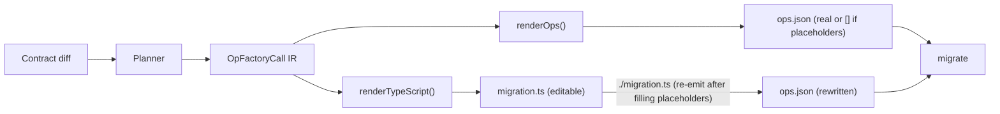
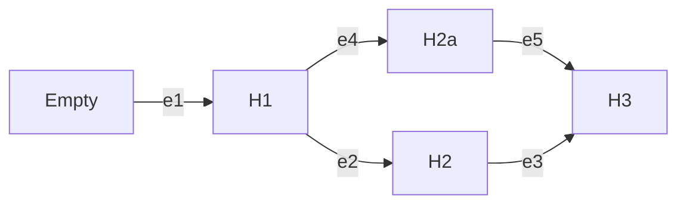

# Migration System

> **Conceptual domain reference.** For the conceptual model of the migration system — ubiquitous language, entities, operations, mental model, and CLI mapping — see [`docs/design/10-domains/migration/`](../../design/10-domains/migration/). This subsystem doc focuses on *implementation*: planner, runner, emitter, on-disk structure, ADR cross-references.

## Overview

The migration subsystem turns data contract changes into deterministic, verifiable state transitions in a database. Each migration is an edge from one contract state to another. Safety comes from explicit preconditions and postconditions, idempotent operations, and a verifiable contract marker in the database.

**Constitutional principle:** `ops.json` is the migration contract — the authoritative artifact that gets attested, hash-verified, and replayed by the runner. `migration.ts` is authoring sugar — a TypeScript file that the developer edits and that *emits* `ops.json` when evaluated. No TypeScript runs at apply time. See [ADR 192 — ops.json is the migration contract](../adrs/ADR%20192%20-%20ops.json%20is%20the%20migration%20contract.md).

The system is designed for tight feedback loops between authoring and verification. The planner makes it cheap to produce an edge from an origin contract to a destination contract. Pre- and post-operation checks make migrations self-verifying. When verification fails, errors direct agents toward concrete remedies — never "drop database" — and the graph model prevents typical catastrophic operations.

### Mental model: Git as the analog

The CLI surface is deliberately Git-shaped. Where the model maps cleanly, the vocabulary borrows from Git rather than inventing parallel names:

| Git | Prisma Next |
|---|---|
| Commit / tree | **Contract** (with `storageHash` as identity) |
| Commit hash | `storageHash` |
| Parent edge + computed diff | **Migration** (we make the edge explicit and addressable) |
| `git format-patch` output | **Migration package** (the cleanest Git analog) |
| Ref / branch | **Ref** (environment-named: `production`, `staging`) |
| HEAD's tree | The emitted `contract.json` |
| Working tree | The **live database** |
| `git checkout <ref>` | `prisma-next migrate --to <ref>` |
| `git log` | `prisma-next migration log` (executed) and `prisma-next migration list` (on disk) |
| Short-SHA prefix matching | Hash-prefix matching in the contract / migration reference grammars |
| `<commit>^` | `<migration-dir-name>^` (the migration's `from`-contract) |

**Key divergence from Git:** a migration is a *patch*, not a commit. Git has no first-class addressable-patch object; we do. That means the verb for "produce a migration" cannot borrow `commit` from Git — `migration plan` is closer to `format-patch` than to `commit`.

See [the glossary](../../glossary.md#migration--database-lifecycle) for the full vocabulary.


## Example

Consider adding a `user` collection to an empty MongoDB database. The planner computes a single edge from `H∅` to `H1` with one operation `createCollection(users, ...)`. The runner verifies the database marker equals `H∅`, acquires a lock (via CAS for MongoDB), applies the op with pre/post checks, and updates the marker to `H1`.


The migration directory on disk:

```
migrations/
  20260118T1205_add_users/
    migration.ts            # authoring surface — the developer edits this
    migration.json          # manifest: from/to hashes, migrationHash
    ops.json                # the actual operations as JSON
    start-contract.json     # source contract snapshot (omitted on the root migration)
    start-contract.d.ts     # TypeScript types for the source contract
    end-contract.json       # destination contract snapshot
    end-contract.d.ts       # TypeScript types for the destination contract
```

`migrate` reads `migration.json` and `ops.json`. It never loads `migration.ts`.

References: [ADR 001 — Migrations as Edges](../adrs/ADR%20001%20-%20Migrations%20as%20Edges.md); [ADR 021 — Contract Marker Storage](../adrs/ADR%20021%20-%20Contract%20Marker%20Storage.md); [ADR 039 — Migration graph path resolution & integrity](../adrs/ADR%20039%20-%20Migration%20graph%20path%20resolution%20&%20integrity.md); [ADR 169 — On-disk migration persistence](../adrs/ADR%20169%20-%20On-disk%20migration%20persistence.md); [ADR 190 — CAS-based concurrency and migration state storage for MongoDB](../adrs/ADR%20190%20-%20CAS-based%20concurrency%20and%20migration%20state%20storage%20for%20MongoDB.md).


## Authoring Pipeline

The canonical pipeline from contract change to applied migration:



1. **Plan.** The planner diffs origin and destination contracts and produces an `OpFactoryCall[]` IR — a discriminated union of frozen AST classes, one per factory function. See [ADR 195 — Planner IR with two renderers](../adrs/ADR%20195%20-%20Planner%20IR%20with%20two%20renderers.md).

2. **Render.** The IR renders to a `PlannerProducedMigration` — a `Migration` subclass that also implements `MigrationPlanWithAuthoringSurface`. Two renderers consume the IR: one materializes runnable operations (`renderOps`), the other emits TypeScript source (`renderTypeScript`). The plan carries its own authoring surface; no separate scaffolding SPI is needed. See [ADR 194 — Plans carry their own authoring surface](../adrs/ADR%20194%20-%20Plans%20carry%20their%20own%20authoring%20surface.md).

3. **Scaffold.** The CLI calls `plan.renderTypeScript()` and writes the result to `migration.ts`. The destination contract is snapshotted into the migration directory so queries are typed against the schema at planning time. See [ADR 197 — Migration packages snapshot their own contract](../adrs/ADR%20197%20-%20Migration%20packages%20snapshot%20their%20own%20contract.md). Unfilled slots (data-transform bodies the planner can't derive) use `placeholder(slot)` — a `never`-returning function that throws a structured `PN-MIG-2001` error at emit time. See [ADR 200 — Placeholder utility for scaffolded migration slots](../adrs/ADR%20200%20-%20Placeholder%20utility%20for%20scaffolded%20migration%20slots.md).

4. **Edit.** The developer opens `migration.ts`, replaces placeholders with real queries, and iterates by running the file directly (`./migration.ts` or `node migration.ts`) thanks to the shebang and `Migration.run(...)`.

5. **Emit.** Every migration package is **fully attested on disk**: `migration plan` writes `migration.ts`, `migration.json` (with a content-addressed `migrationHash`), and `ops.json` (the planned ops, or `[]` if the planner could not lower any calls because of unfilled placeholders). After the developer fills any `placeholder(...)` slots, **self-emission** rewrites `ops.json` and the `migrationHash`: running the file via `./migration.ts` (shebang) or `node migration.ts` causes `Migration.run(...)` to detect it is the main module and re-emit artifacts in-process. See [ADR 196 — In-process emit for class-flow targets](../adrs/ADR%20196%20-%20In-process%20emit%20for%20class-flow%20targets.md).

6. **Apply.** `migrate` reads `ops.json` and `migration.json`, **rehashes `(manifest, ops)` per bundle and confirms it matches the stored `migrationHash`** (defense in depth — catches FS corruption, partial writes, and post-emit hand edits before touching the database), then executes via the runner's three-phase loop — dispatching DDL through visitor SPIs and DML through the standard adapter+driver transport. See [ADR 198 — Runner decoupled from driver via visitor SPIs](../adrs/ADR%20198%20-%20Runner%20decoupled%20from%20driver%20via%20visitor%20SPIs.md).

The authored `migration.ts` — a `Migration` subclass (or a default-exported factory returning an object with a `plan()` method) — is the canonical authoring surface for every target. See [ADR 193 — Class-flow as the canonical migration authoring strategy](../adrs/ADR%20193%20-%20Class-flow%20as%20the%20canonical%20migration%20authoring%20strategy.md) for the historical record of this decision.


## Model

### Edges, Node Tasks, and Marker

An edge is a state transition from one contract storage hash (`from`) to another (`to`). The full source and destination contract IRs live next to the manifest as sibling `start-contract.json` and `end-contract.json` snapshots — the manifest itself records only the storage-hash bookends, not the contracts themselves. The contract marker stores the current `storageHash` per contract space (one row per loaded space — application plus each schema-contributing extension; see [Pinned per-space artefacts on disk](#pinned-per-space-artefacts-on-disk) below); the runner compares the relevant space's marker against the edge's `from` hash before apply. See [ADR 021 — Contract Marker Storage](../adrs/ADR%20021%20-%20Contract%20Marker%20Storage.md) and [ADR 212 — Contract spaces](../adrs/ADR%20212%20-%20Contract%20spaces.md).

Edges on disk form a directed graph from the empty contract to the current one. The graph tolerates cycles (e.g., rollback migrations like C1→C2→C1) — the pathfinder uses BFS with visited-node tracking to select the shortest path. When multiple shortest paths exist, tie-breaking is deterministic (`createdAt` → `to` → `migrationHash`). Named refs (`migrations/<space>/refs/<name>.json`) allow commands to target specific contract hashes for multi-environment workflows (e.g., staging at C2 while production stays at C1). See [ADR 039 — Migration graph path resolution & integrity](../adrs/ADR%20039%20-%20Migration%20graph%20path%20resolution%20&%20integrity.md) and [ADR 169 — On-disk migration persistence](../adrs/ADR%20169%20-%20On-disk%20migration%20persistence.md).



## Planner

The planner diffs two canonical contracts and produces an IR (intermediate representation) that can be rendered into both runnable operations and an editable TypeScript file.

### Planner IR

The planner produces `OpFactoryCall[]` — a discriminated union of frozen AST classes, one per migration factory function (`CreateIndexCall`, `DropIndexCall`, `CreateCollectionCall`, `DropCollectionCall`, `CollModCall`). Each call carries the factory name, arguments, `operationClass`, and `label`. A visitor interface provides exhaustive dispatch. See [ADR 195 — Planner IR with two renderers](../adrs/ADR%20195%20-%20Planner%20IR%20with%20two%20renderers.md).

Two renderers consume the IR:
- **Operation renderer** (`renderOps`): calls the factory functions to produce `MigrationPlanOperation[]` — runnable, serializable to `ops.json`.
- **TypeScript renderer** (`renderTypeScript`): produces a complete, runnable `migration.ts` file that imports and calls the same factories.

Planner-derived semantics (`operationClass`, `label`) ride on the IR because only the planner has the origin context needed for classification (e.g., whether a `collMod` is `widening` vs `destructive`). The renderers read these values; they don't re-derive them.

### Offline planning via contract-to-schema

`migration plan` is fully offline (no database connection). Each target's migrations capability provides `contractToSchema(contract, options): TSchema` that converts the "from" contract to that target's structural schema IR (`SqlSchemaIR` for Postgres, `MongoSchemaIR` for MongoDB), then feeds it into the target's planner. This reuses the same planner that `db init` and `db update` use — no second diff engine is required.

The conversion is intentionally lossy (for example drops runtime codec details), but the planner only needs structural information.

For Postgres the schema covers tables, columns, and indexes. For MongoDB the same role is played by collections, indexes, JSON Schema validators and collection options. See [ADR 169](../adrs/ADR%20169%20-%20On-disk%20migration%20persistence.md) and [ADR 187](../adrs/ADR%20187%20-%20MongoDB%20schema%20representation%20for%20migration%20diffing.md).

Schema-contributing extensions own their own contract spaces, not a node in the application's `SqlSchemaIR`. See [Per-space planner / runner / verifier](#per-space-planner--runner--verifier) below and [ADR 212 — Contract spaces](../adrs/ADR%20212%20-%20Contract%20spaces.md) for how extension schema is planned and verified.

Planner hints come from the **authoring layer** (for example, PSL/TS annotations such as `@hint(was: "old_name")` or equivalent configuration), not from `contract.json` itself. The canonical contract IR stays planner-agnostic and hash-stable; it only encodes application expectations as described in the Data Contract subsystem.

Additive structure is covered by core operations: create table, add nullable column, add index/unique, add foreign key, set column default (SQL); create collection, create index, set validation (Mongo). Renames, drops, and other destructive changes require explicit hints and policies; the planner will fail fast without them. See [ADR 028 — Migration Structure & Operations](../adrs/ADR%20028%20-%20Migration%20Structure%20&%20Operations.md) and [ADR 161 — Explicit FK constraint and index configuration](../adrs/ADR%20161%20-%20Explicit%20foreign%20key%20constraint%20and%20index%20configuration.md).

### `migration plan`

`prisma-next migration plan` diffs a `from` contract against a `to` contract and writes one or two attested migration packages. It is fully offline — no database connection. See [ADR 218](../adrs/ADR%20218%20-%20Refs%20with%20paired%20contract%20snapshots%20and%20universal%20graph-node%20invariant.md).

**Default `from` resolution** ([`resolveFromForPlan`](../../../packages/1-framework/3-tooling/cli/src/utils/plan-resolution.ts)):

1. Explicit `--from <ref-or-hash>` — ref name, full hash, prefix, migration directory, `<dir>^`, or filesystem path.
2. No `--from` — resolve the `db` ref via `migrations/app/refs/db.json`.
3. No `db` ref — resolve `from` to the `null` empty-graph sentinel (greenfield).

The from-contract materialises from the ref's paired snapshot (ref-resolved `from`) or from a bundle's `end-contract.json` (hash-resolved `from` on a graph node).

**Default `to` resolution:** when `--to` is omitted, the destination is the emitted `contract.json`. When `--to <ref-or-hash>` is supplied, the same [contract-reference grammar](#refs-environment-targets) as `--from` applies (hash / prefix, ref name, migration directory, `<dir>^`, or filesystem path); the resolved contract becomes the planner destination and the source of `end-contract.json` / `.d.ts`. Use `--to <migration-dir>^` to plan a reverse (rollback) edge toward a predecessor state.

**Emission cases:**

| Case | Condition | Output |
|---|---|---|
| Greenfield | Graph empty, `from` = `null` | One bundle: `null → to_contract` |
| Auto-baseline | Graph empty, `from` non-null, paired snapshot available | Two bundles: baseline `null → from` + delta `from → to_contract` |
| Normal delta | Graph non-empty, `from` is a graph node | One bundle: `from → to_contract` |
| Forgot-the-flag | Graph non-empty, `from` not a graph node | Refuse: `MIGRATION.HASH_NOT_IN_GRAPH` |
| Snapshot missing | `from` non-null, no contract source | Refuse: `MIGRATION.SNAPSHOT_MISSING` |

When `--to` is omitted, `to_contract` is the emitted contract; when `--to` is supplied, `to_contract` is the resolved destination.

Plan-time refuse diagnostics name the resolved hash, list refs pointing at graph nodes, and suggest `--from <reachable-ref>`. Snapshot-missing diagnostics suggest `db update --advance-ref <name>` to repopulate or `ref delete <name>` to clear an orphan pointer.

## Authoring Surface

`migration.ts` is the user-editable authoring surface for a migration package. See [ADR 193 — Class-flow as the canonical migration authoring strategy](../adrs/ADR%20193%20-%20Class-flow%20as%20the%20canonical%20migration%20authoring%20strategy.md) for the historical record of this decision.

### Authoring a migration.ts

`migration.ts` accepts two authoring shapes. Both funnel through `plan()` at emit time.

**Shape 1: Class subclass.** A class that extends `Migration` (a framework base class that `implements MigrationPlan`). The class overrides `plan()` to return an array of migration operations, and `describe()` to return manifest metadata (`from`, `to` hashes). The plan *is* the class — no separate data structure.

```ts
#!/usr/bin/env -S node
import { createIndex, dataTransform } from '@prisma-next/target-mongo/migration'
import { Migration } from '@prisma-next/family-mongo/migration'

class M extends Migration {
  override describe() {
    return { from: 'sha256:abc', to: 'sha256:def' }
  }

  override plan() {
    return [
      createIndex('users', [{ field: 'email', direction: 1 }], { unique: true }),
    ]
  }
}

export default M
Migration.run(import.meta.url, M)
```

The file is itself runnable (shebang + `Migration.run(...)` at the bottom). Running it directly produces `ops.json` and `migration.json`. The `Migration.run(...)` side-effect is guarded to fire only when the file is the main module — when the CLI imports it, the guard doesn't fire. See [ADR 196 — In-process emit for class-flow targets](../adrs/ADR%20196%20-%20In-process%20emit%20for%20class-flow%20targets.md).

**Shape 2: Factory function.** A default-exported function (sync or async) that returns an object with a `plan()` method. This is a lightweight alternative for simple migrations that don't need the full `Migration` base class:

```ts
import { createCollection } from '@prisma-next/target-mongo/migration'

export default () => ({
  plan() {
    return [createCollection("users")]
  }
})
```

At emit time, the target's `emit` capability calls the factory, validates the result has a `plan()` method, then calls it — the same dispatch as the class path. See [ADR 196](../adrs/ADR%20196%20-%20In-process%20emit%20for%20class-flow%20targets.md).

### Data transforms

Data transforms are migration operations that modify data alongside structural DDL. They use the same three-phase envelope as DDL operations (`precheck[]`, `run[]`, `postcheck[]`) but carry `operationClass: 'data'`. The `run` array contains `MongoQueryPlan` objects (aggregations, updateMany, etc.) instead of DDL commands.

Both DDL and data-transform checks share a unified shape: `{ description, source, filter, expect }`. DDL checks use inspection commands (`ListIndexesCommand`, `ListCollectionsCommand`) as the source; data-transform checks use `MongoQueryPlan` objects. Both are evaluated by the same `FilterEvaluator` path. See [ADR 188 — MongoDB migration operation model](../adrs/ADR%20188%20-%20MongoDB%20migration%20operation%20model.md) (amended for unified checks).

A `dataTransform` factory derives both precheck and postcheck from a single `check` configuration — the user specifies `{ source, filter?, expect? }` and the factory flips `expect` for the postcheck. This gives idempotency and verification from one check specification.

### Contract snapshot

When a migration is scaffolded (`migration plan` / `migration new`), the source contract is copied into the migration directory as `start-contract.json` / `start-contract.d.ts` and the destination contract as `end-contract.json` / `end-contract.d.ts`. The data-transform body in `migration.ts` imports the typed handles from these files, so the migration's authored code keeps working even if the project's root schema evolves further after the migration is written.

These snapshots are author-time conveniences, not structural runtime inputs (see "Runner-side independence from contract snapshots" below). For complex data transforms that need queries typed against an intermediate schema state, the user can create additional contracts within the migration directory. See [ADR 197 — Migration packages snapshot their own contract](../adrs/ADR%20197%20-%20Migration%20packages%20snapshot%20their%20own%20contract.md).

### Placeholder safety

Scaffolded `dataTransform` operations use `placeholder(slot)` for slots the planner can't fill (e.g., `check.source` and `run`). `placeholder()` is a `never`-returning function that throws a structured `PN-MIG-2001` error when called at emit time. This makes the scaffold-then-emit handoff safe — evaluating an unfilled scaffold produces a precise diagnostic rather than silent nonsense. See [ADR 200 — Placeholder utility for scaffolded migration slots](../adrs/ADR%20200%20-%20Placeholder%20utility%20for%20scaffolded%20migration%20slots.md).


## Runner

### Responsibilities

The runner computes a path in the migration graph, acquires a lock, validates each edge against the marker, executes operations idempotently with postcondition checks, and updates the marker and ledger on success. This enables tight feedback loops: drift is detected before apply, safety is enforced during apply, and audit is written after apply.

### Decoupled from the driver

The runner depends on abstract visitor interfaces and a `MarkerOperations` interface — not on the concrete database driver (`Db`, `pg.Client`, etc.). Concrete executors stay in the adapter package; composition happens at the family descriptor. DDL commands dispatch via `command.accept(executor)`. DML execution (data transforms) goes through `Adapter.lower()` → `Driver.execute()` — the same transport used by runtime queries. See [ADR 198 — Runner decoupled from driver via visitor SPIs](../adrs/ADR%20198%20-%20Runner%20decoupled%20from%20driver%20via%20visitor%20SPIs.md).

### Three-phase execution

Each operation follows the same three-phase loop: evaluate prechecks → execute → evaluate postchecks. DDL and data-transform operations use the same loop; only the command dispatch differs. See [ADR 191 — Generic three-phase migration operation envelope](../adrs/ADR%20191%20-%20Generic%20three-phase%20migration%20operation%20envelope.md).

### Hash verification

Per [ADR 192 — Apply-time verification](../adrs/ADR%20192%20-%20ops.json%20is%20the%20migration%20contract.md), `migrate` performs two checks before executing operations:

1. **On-disk consistency.** For every loaded bundle, recompute `migrationHash` from the on-disk manifest + `ops.json` (`verifyMigrationBundle`) and compare against the stored `migrationHash`. A mismatch aborts apply with a structured runtime error pointing at the offending directory and asks the developer to re-emit the package (`node migrations/<dir>/migration.ts`) or restore from version control. This catches FS corruption, partial writes, and post-emit hand edits before the runner touches the database.
2. **Emit-drift detection.** When `migration.ts` is present, re-emit in-memory and compare against `ops.json`. *(Architecturally required; not yet implemented — tracked as a follow-up.)*

### Pre-DDL marker drift check

Before invoking the runner, `migrate` reads the live DB marker and compares it against on-disk graph membership ([`migrate.ts`](../../../packages/1-framework/3-tooling/cli/src/commands/migrate.ts)). When the marker's storage hash is not a graph node, the command refuses with `MIGRATION.MARKER_MISMATCH` ([`errorMarkerMismatch`](../../../packages/1-framework/3-tooling/cli/src/utils/cli-errors.ts)) — naming the marker hash, reachable graph hashes, and graph tip. This check lives at the CLI layer, not inside the runner ([ADR 198](../adrs/ADR%20198%20-%20Runner%20decoupled%20from%20driver%20via%20visitor%20SPIs.md)).

When path resolution fails, `MIGRATION.PATH_UNREACHABLE` payloads include actionable `fix` text suggesting `migration plan --from <fromHash> --to <targetHash>`. See [Recovery affordances](#recovery-affordances).

### Opt-in ref advancement

`migrate --advance-ref <name>` writes the named ref and paired snapshot to the post-apply marker hash after successful apply. There is **no implicit** `db` ref advancement — unlike `db init` / `db update`. Use `--advance-ref db` to advance the dev ref in the same step, or run `db update` afterward to refresh it.

### Advisory Locks and Concurrency

For Postgres, the runner uses `pg_advisory_lock` with deterministic keys to prevent concurrent applies. See [ADR 043 — Advisory lock domain & key strategy](../adrs/ADR%20043%20-%20Advisory%20lock%20domain%20&%20key%20strategy.md). For MongoDB, concurrency is handled via compare-and-swap (CAS) on the marker document. See [ADR 190 — CAS-based concurrency and migration state storage for MongoDB](../adrs/ADR%20190%20-%20CAS-based%20concurrency%20and%20migration%20state%20storage%20for%20MongoDB.md).

### Idempotency

Every operation declares its idempotency class with explicit pre/post invariants. Replays that find postconditions already satisfied are treated as already-applied and skipped; true conflicts halt with a structured error. Destructive changes require explicit guards. See [ADR 038 — Operation idempotency classification & enforcement](../adrs/ADR%20038%20-%20Operation%20idempotency%20classification%20&%20enforcement.md) and transactional DDL fallback in [ADR 037 — Transactional DDL Fallback](../adrs/ADR%20037%20-%20Transactional%20DDL%20Fallback.md).

### Runner Phases

1. Resolve: read marker; reconstruct graph; compute path
2. Preflight (optional): dry-run in shadow; emit report
3. Apply: lock; verify `from`; apply ops with three-phase loop; **post-apply schema verification** (Mongo only — see below); update marker and ledger
4. Report: emit telemetry and diagnostics

#### Post-apply schema verification (MongoDB)

After the operation loop and before writing the marker / ledger, the Mongo runner introspects the live schema and runs the same pure `verifyMongoSchema` that backs `prisma-next db verify --schema-only`. On drift the runner returns `SCHEMA_VERIFY_FAILED` with structured `meta.issues` and the marker stays at its origin. The two surfaces agree on "matches the contract" by construction — both compose the same primitive rather than each implementing their own diff. See [ADR 204 — Domain actions vs composable primitives in the control plane](../adrs/ADR%20204%20-%20Domain%20actions%20vs%20composable%20primitives%20in%20the%20control%20plane.md) for why the runner composes `family.introspect` + `verifyMongoSchema` instead of calling the peer `family.schemaVerify` action, and [ADR 198](../adrs/ADR%20198%20-%20Runner%20decoupled%20from%20driver%20via%20visitor%20SPIs.md) for the introspection-via-deps pattern that keeps the runner decoupled from the driver.

The verification step is skipped on the no-op short-circuit (zero operations executed and marker already matches), matching Postgres. An optional `strictVerification` flag (defaults to `true`) lets tests and lenient tooling treat out-of-band structure as warnings. Postgres has historically relied on its surrounding transaction + advisory lock for this guarantee; the post-apply verify is the Mongo analogue and the seed of an eventual framework-level hoisting (tracked separately).


## File Layout

```
migrations/
  20260118T1205_add_users/
    migration.ts            # authoring surface — TypeScript the developer edits
    migration.json          # from/to hashes, migrationHash — no inlined contracts
    ops.json                # serialized operations (the contract)
    start-contract.json     # source-side contract snapshot
    start-contract.d.ts     # TypeScript types for the source contract
    end-contract.json       # destination-side contract snapshot
    end-contract.d.ts       # TypeScript types for the destination contract
  20260119T0830_add_email_index/
    migration.ts
    migration.json
    ops.json
    start-contract.json
    start-contract.d.ts
    end-contract.json
    end-contract.d.ts
  refs/
    db.json                 # named ref pointer (see § Refs)
    db.contract.json        # paired contract snapshot
    db.contract.d.ts
```

The folder name is human-friendly; identity lives in `migration.json`. The optional `graph.index.json` is a lockfile-style cache and can be regenerated deterministically (see ADR 039). Most teams won't need it with squash-first hygiene (ADR 102).

### Runner-side independence from contract snapshots

The `*-contract.json` and `*-contract.d.ts` files are **author-time conveniences**, not structural inputs to the runner. Their job is to give `migration.ts` data-transform code a typed handle on the contract states it bridges, and to let `prisma-next migration plan` read the predecessor's destination contract when computing the next diff.

The runner and the surrounding apply / verify pipelines depend on **`migration.json` + `ops.json` only** for each migration package, plus the project-root / per-space `contract.json` for current head state. A user who keeps only those two files per migration directory (and the project-root contract) can still run `prisma-next migrate` end-to-end. The property is pinned by a regression test in `@prisma-next/migration-tools` that constructs a migration package containing exactly `migration.json` + `ops.json` on disk and asserts the loader accepts it.

The migration identity (`migrationHash`) is anchored on the storage-hash bookends (`from`, `to`) and the ops payload — never on the full contract IRs — so dropping the snapshot files (or evolving them) cannot perturb a migration's identity. See [ADR 199 — Storage-only migration identity](../adrs/ADR%20199%20-%20Storage-only%20migration%20identity.md).

### Graph-based ordering

Migrations form a directed graph (not necessarily acyclic) via their `from` / `to` edges. Cycles are valid — a rollback path like `C1 -> C2 -> C1` is a legal graph shape. Ordering is determined by BFS shortest-path traversal from a source hash to a target hash, with deterministic tie-breaking when multiple shortest paths exist (`createdAt` ascending → `to` lexicographic → `migrationHash` lexicographic). The pathfinder uses visited-node tracking to terminate in cyclic graphs. Branch detection: when the set of reachable branch tips from the current marker contains more than one node and no explicit target is specified, the system reports `MIGRATION.AMBIGUOUS_TARGET` and requires explicit resolution. See [ADR 169 — On-disk migration persistence](../adrs/ADR%20169%20-%20On-disk%20migration%20persistence.md).

### Refs (environment targets)

Refs map logical environment names to contract hashes in `migrations/<space>/refs/<name>.json` (e.g., `{ "hash": "sha256:...", "invariants": [] }`). They are version-controlled alongside migration artifacts. `migrate --to production` uses the ref hash as the target instead of the current contract. `migration status --to staging` reports state relative to that ref. Refs are managed at the top level via `prisma-next ref set <name> <contract>`, `prisma-next ref list`, and `prisma-next ref delete <name>`. See [ADR 169 — On-disk migration persistence](../adrs/ADR%20169%20-%20On-disk%20migration%20persistence.md).

#### Paired contract snapshots

Each ref may carry a paired contract snapshot alongside its pointer file. See [ADR 218 — Refs with paired contract snapshots and universal graph-node invariant](../adrs/ADR%20218%20-%20Refs%20with%20paired%20contract%20snapshots%20and%20universal%20graph-node%20invariant.md).

```text
migrations/app/refs/
├── db.json
├── db.contract.json
├── db.contract.d.ts
├── production.json
├── production.contract.json
└── production.contract.d.ts
```

- `<name>.json` — pointer: `{ hash, invariants }`.
- `<name>.contract.json` — full contract IR at the ref's hash.
- `<name>.contract.d.ts` — typed import handle (same convention as migration bundle `end-contract.d.ts`).

**Write rule:** ref writes and deletes go through atomic paired primitives ([`writeRefPaired`](../../../packages/1-framework/3-tooling/migration/src/refs/snapshot.ts), [`deleteRefPaired`](../../../packages/1-framework/3-tooling/migration/src/refs/snapshot.ts)). A ref write always refreshes its snapshot; a ref delete cascades to snapshot files. Orphan-tolerant delete heals partial states (pointer without snapshot, or snapshot without pointer).

**Read rule:** when `migration plan` resolves `from` via a ref name, it reads the paired snapshot directly — no fallback to bundle `end-contract.json` for ref-resolved hashes.

The `db` ref records which contract hash the project's dev database has been brought up to. It is a default write target for dev-mode commands, not a reserved name.

#### Universal graph-node invariant (cross-cutting)

Any hash used as a `from` end — via explicit `--from`, default `db` ref resolution, ref-name resolution, or raw hash — must be a **node in the on-disk migration graph** (a hash appearing as `from` or `to` of any bundle, or the `null` sentinel), or the command refuses with a structured diagnostic. Enforcement uses [`isGraphNode`](../../../packages/1-framework/3-tooling/migration/src/graph-membership.ts) and planner-side checks in [`plan-resolution.ts`](../../../packages/1-framework/3-tooling/cli/src/utils/plan-resolution.ts). The auto-baseline emission path in `migration plan` is the one well-defined exception on an empty graph. `ref set` applies the same invariant to the hash being set.


## Edge Attestation and Migration Identity

Edited migrations must be content-addressed so tools and services can verify exactly what will run. Each edge includes a deterministic hash (`migrationHash`).

### Storage-only identity

`migrationHash` is computed from `(strippedManifest, ops)` only. The full contract IRs never enter the hash — they live next to the manifest as sibling `start-contract.json` / `end-contract.json` snapshots rather than inside it. This means non-storage contract changes (operation renames, docstring edits, codec metadata changes) don't invalidate the `migrationHash` — only changes to the `from`/`to` storage hashes or the operations themselves do.

`strippedManifest` contains: `from`, `to`, `providedInvariants`, `createdAt`. These plus `ops` are the full input to the hash. `from` is `string | null`: a non-null value is the prior-state storage hash, and `null` denotes a baseline edge with no prior storage state. `to` carries the destination storage-projection commitment. `providedInvariants` participates in identity because it captures which routing-visible data transforms the migration declares; changing the set changes which refs the migration satisfies, so it is part of the migration's physical identity rather than metadata about it.

See [ADR 199 — Storage-only migration identity](../adrs/ADR%20199%20-%20Storage-only%20migration%20identity.md).


## Operation Model

Each migration operation is a data envelope with three phases — `precheck[]`, `execute[]`, `postcheck[]`. The phases are composed from existing AST primitives (DDL commands, inspection commands, filter expressions for Mongo; SQL statements for Postgres) that serialize naturally to JSON. The envelope carries no behavior of its own; the semantic richness lives in the commands and expressions inside it.

### DDL operations

DDL operations carry commands like `CreateIndexCommand`, `CreateCollectionCommand`, etc. Checks use inspection commands (`ListIndexesCommand`, `ListCollectionsCommand`) as the source, with `MongoFilterExpr` for client-side filtering and `'exists' | 'notExists'` for expectation. See [ADR 188 — MongoDB migration operation model](../adrs/ADR%20188%20-%20MongoDB%20migration%20operation%20model.md).

### Data transform operations

Data transforms carry `operationClass: 'data'` and use the **same three-phase envelope** as DDL operations. The runner has a single execution loop; there is no DT-specific dispatch path. The two families fill the envelope with their own query shapes:

- **Postgres.** The `dataTransform` factory lowers the user-authored `check` / `run` query plans into the standard envelope at factory time. `precheck` is `[{ sql: 'SELECT EXISTS (<check.sql>) AS ok', params: <check.params>, … }]` (asserts "work to do"); `execute` carries the run plans as `SqlMigrationPlanOperationStep` entries with `params` threaded through `driver.query`; `postcheck` is `[{ sql: 'SELECT NOT EXISTS (<check.sql>) AS ok', params: <check.params>, … }]` (asserts "work done"). Idempotent re-apply uses the same pre-satisfied-skip path that DDL ops already use — when the postcheck is already satisfied, the runner records a `postcheck_pre_satisfied` skip without re-running execute. Routing the run-plan parameters through the driver's parameter binder (rather than inlining values into SQL text) is strictly safer than rolling a per-driver literal serializer.
- **Mongo.** The `run` array carries `MongoQueryPlan` objects. Checks use the same `{ description, source, filter, expect }` shape as DDL checks, with `MongoQueryPlan` as the source type. Both are evaluated by the same `FilterEvaluator` path. DML commands execute through `Adapter.lower()` → `Driver.execute()` — the same transport as runtime queries.

The shared envelope means policy gating on `operationClass: 'data'` (CI checks, audit, "this run may not perform data work") is uniform across families and decoupled from how each family describes its check/run payload.

### Serialization

All AST nodes are frozen plain-property objects. `JSON.stringify` produces the persisted format directly. Deserialization walks the JSON, matches `kind` discriminants, validates structure with arktype schemas, and reconstructs live class instances. See [ADR 188](../adrs/ADR%20188%20-%20MongoDB%20migration%20operation%20model.md) and [ADR 191 — Generic three-phase migration operation envelope](../adrs/ADR%20191%20-%20Generic%20three-phase%20migration%20operation%20envelope.md).


## Extensions and Capability-Gated Ops

Custom, namespaced operations extend core behavior. They are validated against pack schemas, gated by declared capabilities, and use the same pre/post and idempotency semantics. See [ADR 116 — Extension-aware migration ops](../adrs/ADR%20116%20-%20Extension-aware%20migration%20ops.md) and [ADR 037 — Transactional DDL Fallback](../adrs/ADR%20037%20-%20Transactional%20DDL%20Fallback.md).

Schema-contributing extensions go further — they own a complete contract space (a `(contract.json, migrations, headRef)` triple) that the framework treats with the same per-space planner / runner / verifier the application uses. See [Per-space planner / runner / verifier](#per-space-planner--runner--verifier) and [ADR 212 — Contract spaces](../adrs/ADR%20212%20-%20Contract%20spaces.md). The legacy `databaseDependencies` mechanism (one-shot init SQL on the extension descriptor) was removed in TML-2397; [ADR 154](../adrs/ADR%20154%20-%20Component-owned%20database%20dependencies.md) is preserved for historical context.

## Per-space planner / runner / verifier

A Prisma Next application's database is the integration point for many parties: the application itself, plus every schema-contributing extension installed in `prisma-next.config.ts`. Each is a **contract space** — a disjoint `(contract.json, migration-graph, head-ref)` tuple — and the framework runs the same per-space machinery across all of them. See [ADR 212 — Contract spaces](../adrs/ADR%20212%20-%20Contract%20spaces.md) for the full design.

### Per-space planner

The planner runs per space. App-space diffs the prior pinned root contract against the new emitted root contract; each extension space diffs its prior pinned `migrations/<space-id>/contract.json` against its descriptor's current `contractJson`. The producer-side helpers (`planAllSpaces`, `concatenateSpaceApplyInputs`, `emitContractSpaceArtefacts`, `detectSpaceContractDrift`) live in `@prisma-next/migration-tools/exports/spaces` as target-agnostic primitives — the SQL family wires them at consumption sites. Plan-time codec hooks ([ADR 213 — Codec lifecycle hooks](../adrs/ADR%20213%20-%20Codec%20lifecycle%20hooks.md)) emit app-space-bound ops alongside the user's own structural ops.

### Per-space runner: `execute`

`SqlMigrationRunner` exposes two entry points (see the "Apply-time atomicity and ordering" section in [ADR 212](../adrs/ADR%20212%20-%20Contract%20spaces.md)):

- `execute({ driver, perSpaceOptions })` — the entry point; opens **one** outer transaction and calls `executeOnConnection` per space inside it. Failure on any space rolls back every space's writes. An apply that targets one space passes a one-element `perSpaceOptions` list.
- `executeOnConnection(options)` — runner body without `BEGIN`/`COMMIT`; caller owns the transaction lifecycle.

Cross-space ordering: extension spaces alphabetical-by-spaceId first, app-space last (the implicit dependency direction — application schema may reference extension-provided types).

The atomicity guarantee above is SQL-specific. The Mongo family runs **resumable per-space marker-level atomicity, gated on post-apply `db verify`** — cross-space transactions over MongoDB DDL are architecturally unavailable, so a failed space leaves earlier-succeeded sibling markers advanced and re-running converges. See [Subsystem 10 — Contract spaces / Per-space atomicity model](10.%20MongoDB%20Family.md#per-space-atomicity-model) for the Mongo-specific contract.

### Per-space verifier

`verifyContractSpaces` reports five structurally distinct violation kinds, each with an actionable remediation hint: `declaredButUnmigrated`, `orphanMarker`, `orphanPinnedDir`, `hashMismatch`, `invariantsMismatch`. The legacy `dependency_missing` SchemaIssue kind is gone; the same diagnostics are now reported through the per-space verifier (typically as `EXTENSION_HEAD_REF_DRIFT` / `EXTENSION_HEAD_REF_MISSING` at the CLI layer).

### Disjoint per-space ownership: schema-prune

When applying across spaces, the app-space planner is invoked against the *full* introspected live schema. To keep ownership disjoint, the consumer site (`@prisma-next/cli`'s `executePerSpaceDbApply`) calls `pruneSchemaByOtherSpaceContracts` to remove tables owned by extension spaces (read from on-disk pinned `contract.json`s — no descriptor imports) before passing the schema to the app-space planner. The verifier-side counterpart scopes `verifySqlSchema` to `space='app'` and lets `verifyContractSpaces` cover per-space integrity independently. Both layers enforce the same property (disjoint per-space ownership) at different pipeline stages.

### Descriptor self-consistency

At family-create time the framework asserts `hash(canonicalize(descriptor.contractSpace.contractJson)) === descriptor.contractSpace.headRef.hash`. Mismatch surfaces as `MIGRATION.DESCRIPTOR_HEAD_HASH_MISMATCH`. Catches the case where an extension author published an inconsistent descriptor (e.g. updated `contractJson` but forgot to regenerate `headRef.hash`).

### Pinned per-space artefacts on disk

Every `migrate` invocation overwrites the pinned per-space files from each loaded extension's descriptor:

```text
migrations/
├── 20260508T0942_user_init/         ← app-space migration
│   ├── manifest.json
│   ├── ops.json
│   └── contract.json
└── pgvector/                        ← extension-space root
    ├── contract.json                 ← pinned current contract
    ├── contract.d.ts                 ← pinned current typings
    ├── refs/head.json                ← pinned head ref
    └── 20240601T0000_install_vector/
        └── …
```

App-space's current `contract.json` continues to live at the project root (today's convention preserved). Apply-time and verify-time paths read **only** the user's repo — no descriptor module is imported, which means the system works in CI / production environments where the extension package may not be installed at all.


## Migration Lifecycle

Migrations progress through clear states. This lifecycle separates attestation (content addressing) from execution (preflight/apply) and supports tight, fast feedback loops.

### States

A migration always exists or it doesn't — there is no on-disk "draft" state. Every migration package on disk is fully attested: `migration.json` carries a non-null `migrationHash` content-addressed over `(manifest, ops)`, and `ops.json` is always written (as `[]` when the planner could not lower any calls because of placeholders).

- Attested: `migrationHash` matches current content (the only on-disk state)
- Preflighted: Shadow/PPg execution succeeded; proofs recorded in edge metadata
- Applied: Ledger shows edge applied; DB marker equals `to` hash

The planner exposes one transient hint, `pendingPlaceholders`, in the `migration plan` result envelope. It is a CLI-only signal that the on-disk migration encodes zero ops because the user still needs to fill in `placeholder(...)` slots; it is **not** persisted to the manifest. After filling in the slots, the developer re-emits the package (`node migrations/<dir>/migration.ts`) to compute the real ops and the corresponding `migrationHash`. Applying a placeholder-blocked migration will not advance the storage hash to the destination — the runner's destination-hash post-check surfaces this as a state mismatch.

### Authoring intermediate state

Between scaffolding and a migration that actually moves the database, a package can sit in an **authoring intermediate state**: a fully-attested directory whose `migration.ts` still contains unfilled `placeholder(...)` calls (or, in the custom flow, a hand-authored `migration.ts` that has not been self-emitted yet). The state is intentional — it lets the developer iterate on `migration.ts` with the planner's scaffolding before committing operations — but it has different observable behavior than a "real" migration, so it is worth naming.

#### Two on-disk shapes

Every migration directory on disk carries the same three core files (plus contract bookends); the difference between the two shapes is the *contents* of those files:

- **Empty / placeholder-bearing.** `migration.json` is present and fully attested over the empty op list, `ops.json` is the literal `[]`, and `migration.ts` either contains `placeholder(...)` calls (planner-led flow) or is the empty `emptyMigration` skeleton (custom flow). The package is real but performs no work.
- **Filled.** `migration.json` is attested over the real op list, `ops.json` is the serialized op list, and `migration.ts` contains the operation calls that produced it. Re-emitting `migration.ts` against this shape is a no-op.

There is no on-disk shape where `migration.ts` exists without a sibling `migration.json` / `ops.json`: both `migration plan` and `migration new` always write the manifest and `ops.json` (as `[]` when no ops can be lowered) alongside `migration.ts` in the same step. See [ADR 199 — Storage-only migration identity](../adrs/ADR%20199%20-%20Storage-only%20migration%20identity.md) for why an empty op list is still a legal, fully-attested migration.

#### Runner visibility rule

The runner enumerates packages by scanning for directories that contain a `migration.json` manifest; directories without one are silently skipped. `ops.json` is required to load a package once it has been picked up, but it is never used for visibility. In other words: **the manifest decides whether the runner sees a migration; the empty/filled split decides whether applying it does anything**.

A placeholder-bearing migration is therefore visible to the runner. Applying it executes zero ops; the destination-hash post-check then sees that the marker is still at the origin hash, not at `to`, and fails with a structured state-mismatch error rather than silently advancing the marker.

#### How the intermediate state arises

- **Planner-led flow with placeholders.** When `migration plan` lowers a planner IR that contains `DataTransformCall`s whose `check.source` / `run` slots the planner could not derive, accessing the rendered op list throws `PN-MIG-2001`. The CLI catches that, writes `ops.json` as `[]`, attests the manifest over the empty list, writes a `migration.ts` whose data-transform stubs use `() => placeholder("slot")`, and returns `pendingPlaceholders: true` in its result envelope.
- **Custom flow.** `migration new` always starts in the intermediate state by design: it scaffolds a manifest attested over `[]` and a `migration.ts` produced by the target's `emptyMigration` for hand-authoring.
- **Postgres class-flow specifics.** The walk-schema planner does not currently emit `DataTransformCall`s, so the placeholder-blocked variant is invisible until the issue-planner work lands; until then, `migration plan` for Postgres always produces the *filled* shape directly. The asymmetry is documented on `TypeScriptRenderablePostgresMigration` and is the reason `pendingPlaceholders` is treated as a forward-looking signal, not Mongo-specific.

#### Transition

The intermediate state ends when the developer runs the package's `migration.ts` directly — either via its shebang (`./migrations/<dir>/migration.ts`) or `node migrations/<dir>/migration.ts`. Class-flow self-emission (see [ADR 196 — In-process emit for class-flow targets](../adrs/ADR%20196%20-%20In-process%20emit%20for%20class-flow%20targets.md)) detects that the file is the main module, runs `Migration.run(...)`, calls `buildMigrationArtifacts` against the now-real op list, and **rewrites both `ops.json` and `migration.json`** in place — including the `migrationHash`, which is recomputed over the new `(strippedManifest, ops)`. Any unfilled `placeholder(...)` still in the file at this point throws `PN-MIG-2001` and aborts the rewrite, leaving the package in its previous (still-intermediate) shape; see [ADR 200 — Placeholder utility for scaffolded migration slots](../adrs/ADR%20200%20-%20Placeholder%20utility%20for%20scaffolded%20migration%20slots.md). There is no separate CLI command for this transition: the on-disk package is the source of truth, and running `migration.ts` is what materializes the filled `ops.json`.

#### Diagnostics

A user who is unsure whether a migration is in the intermediate state has several signals:

- `prisma-next migration plan` returns `pendingPlaceholders: true` and prints a `⚠` line whose body says *"edit migration.ts then run `node migration.ts` to self-emit"*. The same envelope is in the JSON output for tooling.
- `ops.json` literally contains `[]`, and `migration.ts` mentions `placeholder(...)` (planner-led) or has no operation calls in its `plan()` body (custom flow).
- Running `migration.ts` while a placeholder is still unfilled fails with `PN-MIG-2001` — the structured error names the slot.
- `prisma-next migrate` against a placeholder-blocked package will execute the lock + verify path but apply zero ops; the destination-hash post-check then surfaces `MIGRATION.POSTCHECK_FAILED` (state mismatch). This is the runner-side fallback diagnostic when an intermediate-state migration leaks past the CLI signals above.

The remedy in every case is the same: edit the slots in `migration.ts`, run the file to self-emit, and re-run `migrate`.


### Planner-led flow (default)

1. Edit contract
2. Plan: `prisma-next migration plan` (see `migration-plan.ts`) → writes a fully attested package (`migration.ts` + `migration.json` + `ops.json` + bookend contracts). If any operation still contains an unfilled `placeholder(...)`, the planner cannot lower it: `ops.json` is written as `[]`, `migrationHash` hashes over `(manifest, [])`, and the command returns a successful `pendingPlaceholders` envelope (a warning, not a failure) asking the developer to fill in the slots before re-emitting. `PN-MIG-2001` is **not** raised here — it is raised only at self-emit time when a placeholder is still unfilled.
3. Re-emit (when needed): after filling placeholders, run `./migration.ts` (or `node <dir>/migration.ts`) → rewrites `ops.json` with the real operations and rewrites `migrationHash` to match. Unfilled `placeholder(...)` calls fail here with `PN-MIG-2001`.
4. Preflight: `prisma-next preflight --mode=shadow` (or PPg bundle/submit) → proofs (Preflighted)
5. Commit/PR

### Custom flow (from scratch or heavy edits)

1. Scaffold: `prisma-next migration new [--from <hash> --to <hash>]` → writes an attested package whose `ops.json` is `[]` and whose `migration.ts` (produced via `planner.emptyMigration(context)`) is empty for the developer to fill in
2. Edit: author operations in `migration.ts` using factory functions and query builders
3. Emit: run `./migration.ts` (or `node <dir>/migration.ts`) → rewrites `ops.json` with the authored operations and rewrites `migrationHash` to match
4. Preflight: `prisma-next preflight --mode=shadow` (Preflighted)
5. Commit/PR; CI may require a green preflight


## Helpful Commands (synopsis)

Top-level verbs:

- `prisma-next migrate --db <url> [--to <contract>] [--advance-ref <name>]` — execute pending migrations against a live database. Ref advancement is **opt-in only** via `--advance-ref`; plain `migrate` does not advance any ref. The `<contract>` argument accepts the full [contract-reference grammar](#refs-environment-targets): hash / prefix, ref name, migration directory name, `<dir>^`, or filesystem path.
- `prisma-next db init --db <url> [--advance-ref <name>]` — bootstrap a database under contract control. When run against the default `--db` URL (no explicit `--db`), implicitly advances the `db` ref and writes its paired snapshot. With `--db <non-default-url>`, ref advancement is suppressed unless `--advance-ref` is explicit.
- `prisma-next db update --db <url> [--to <contract>] [--advance-ref <name>]` — reconcile a live database to the named (or emitted) contract via live introspection. Same implicit `db` ref default and `--db` opt-out as `db init`. Off-graph; dev-only.
- `prisma-next db sign --db <url> [<contract>]` (or `--contract <contract>`) — sign the marker with a contract the live DB already satisfies. With no argument, signs with the emitted `contract.json`.
- `prisma-next db verify --db <url>` — verify the live DB satisfies the contract (modes: `--schema-only`, `--marker-only`, `--strict`).
- `prisma-next ref set <name> <contract>` / `prisma-next ref list` / `prisma-next ref delete <name>` — manage named refs at the top level. `ref set` enforces the graph-node invariant and writes a paired snapshot synthesised from the matching bundle's `end-contract.json`. `ref delete` cascades to snapshot files.

Migration namespace (artifacts and graph):

- `prisma-next migration plan [--from <contract>] [--to <contract>] --name <slug>` — diff contracts and write a fully attested package (`migration.ts` + `migration.json` + `ops.json`) offline. Defaults `--from` to the `db` ref (falls back to greenfield when absent) and `--to` to the emitted contract. Both flags accept the full [contract-reference grammar](#refs-environment-targets). Re-run `./migration.ts` after filling any `placeholder(...)` slots to rewrite `ops.json` and the `migrationHash`.
- `prisma-next migration new [--from <hash> --to <hash>] --name <slug>` — scaffold an empty `migration.ts` for hand-authoring.
- `prisma-next migration status [--db <url>] [--to <contract>] [--from <contract>]` — path/pending question. Live (uses marker) or offline (uses `--from`).
- `prisma-next migration log --db <url>` — applied execution history (reads the marker; offline reading of the ledger is also supported).
- `prisma-next migration list` — enumerate migrations on disk in topological order. Offline.
- `prisma-next migration graph` — render the migration graph (ASCII tree by default; `--json` / `--dot` for other formats). Offline.
- `prisma-next migration show [<migration>]` — inspect a single migration's operations and metadata. The `<migration>` argument accepts the [migration-reference grammar](#refs-environment-targets).
- `prisma-next migration check [<migration>]` — verify artifact and graph integrity. Read-only filesystem; exit codes `0` / `2` / `4`; per-failure PN codes `PN-MIG-CHECK-001` through `015` (see [Integrity checks](#integrity-checks-migration-check) below).

**Future** (deferred to a separate project):

- `prisma-next migration preflight <migration>` — sandbox-execution feature to validate a migration against a shadow database. Out of scope for the migration-domain-model project; tracked separately.

### Removed-verb redirects

The CLI maintains a small lookup table for removed verbs and emits a targeted suggestion when one is invoked:

| Old invocation | Replacement |
|---|---|
| `prisma-next migration` `apply` (with or without flags) | `prisma-next migrate --to <contract>` |
| `prisma-next migration` `ref` (any of `set` / `list` / `delete`) | `prisma-next ref` (any of `set` / `list` / `delete`) |
| `prisma-next migration status` with `--graph` | `prisma-next migration graph` |
| `prisma-next migration status` with the removed all/limit flags | `prisma-next migration log` |
| `prisma-next migration status` with `--ref X` | `prisma-next migration status --to X` |

Each redirect is intercepted during the pre-parse argv scan, exits `2`, and prints a `Use \`prisma-next <new-form>\` instead.` line so operators discover the new surface without consulting docs.

### `--advance-ref` flag family

Three commands accept `--advance-ref <name>` to write a ref pointer and paired contract snapshot after success:

| Command | Default when flag omitted | Snapshot source |
|---|---|---|
| `db init` | `db` (when using default `--db` URL) | Post-command contract IR |
| `db update` | `db` (when using default `--db` URL) | Post-command contract IR |
| `migrate` | none — no implicit advancement | Post-apply marker hash contract IR |

Implicit default logic lives in [`computeRefAdvancementName`](../../../packages/1-framework/3-tooling/cli/src/utils/ref-advancement.ts): omitting both `--advance-ref` and `--db` yields `db`; supplying `--db <non-default-url>` without `--advance-ref` yields no advancement.

`ref set` always writes a paired snapshot (no flag — snapshot synthesis is part of the command contract).


## Recovery affordances

Structured diagnostics from plan-time and apply-time checks suggest concrete recovery paths. See [ADR 218](../adrs/ADR%20218%20-%20Refs%20with%20paired%20contract%20snapshots%20and%20universal%20graph-node%20invariant.md).

| Diagnostic | When | Suggested recovery |
|---|---|---|
| `MIGRATION.HASH_NOT_IN_GRAPH` | `migration plan` or `ref set`: resolved hash not in graph | `migration plan --from <reachable-ref>` (e.g. `--from production`) |
| `MIGRATION.SNAPSHOT_MISSING` | `migration plan`: ref pointer exists but paired snapshot absent | `db update --advance-ref <name>` to repopulate, or `ref delete <name>` to clear orphan pointer |
| `MIGRATION.MARKER_MISMATCH` | `migrate`: live marker hash not a graph node (pre-DDL check) | `migration plan --from <graph-tip>`, or `ref set db <marker-hash>` if on-disk graph is canonical |
| `MIGRATION.PATH_UNREACHABLE` | `migrate`: no path from marker to target in on-disk graph | Plan the missing edge with `migration plan --from <marker-or-reachable> --to <target> --name <slug>`, then apply with `migrate --to <target>`. For a rollback, use `--to <migration-dir>^` in both steps — the planned reverse edge applies and moves the marker back without editing contract source. Review destructive (`DROP`) ops in the plan before applying. When the space has no on-disk migrations yet, omit `--from` and use `migration plan --to <target> --name <slug>` first. |

After plain `migrate`, refresh a stale `db` ref with `db update` (no-op on DB when marker matches) or `migrate --advance-ref db` in the same invocation.


## Contract-space aggregate (the read model)

`ContractSpaceAggregate` is the single in-memory model of a project's on-disk migration state — the contract spaces, each with its migration packages, its refs, and the graph those packages induce. Every command that reads migration state loads it **once** and queries it; none re-derives that state from disk afterwards. The model and its loader live in `@prisma-next/migration-tools` ([`src/aggregate/`](../../../packages/1-framework/3-tooling/migration/src/aggregate/)). It is the in-memory realisation of the contract-space concept defined in [ADR 212 — Contract spaces](../adrs/ADR%20212%20-%20Contract%20spaces.md).

The aggregate exposes the application space plus the extension spaces (`AggregateContractSpace`, one per contract space) and query methods over them — `listSpaces()`, `hasSpace(id)`, `space(id)`, `spaces()`. Each space carries its raw on-disk `packages`, its user-authored `refs`, and a nullable `headRef`, plus two lazy memoised facets: `graph()` (the reconstructed `MigrationGraph`) and `contract()` (the deserialised contract).

### Build / query / judge are separate responsibilities

The model keeps three responsibilities apart that a load-time-validating constructor would fuse:

- **Build (tolerant).** Loading enumerates spaces and reads each space's raw packages and refs. It **never throws on disk content** — every integrity problem becomes a represented violation, not a load failure. A genuinely unparseable package is omitted per-package (it does not fail the whole aggregate); the only rejections are catastrophic I/O. `reconstructGraph` builds pure structure and does not throw on a `from === to` self-edge.
- **Query (lazy).** `graph()` and `contract()` are computed on first access and memoised — a pure cache (same disk → same result), not lifecycle state. A command pays only for the facets it reads: `list` reconstructs no graphs and deserialises no contracts.
- **Judge (integrity as a query).** `checkIntegrity(opts?)` walks the loaded model and returns the **full** `IntegrityViolation[]` — no first-failure bail. Config- and contract-dependent checks (layout drift, disjointness, target match, undeserializable contract) are produced only when the caller opts in via `declaredExtensions` / `checkContracts`.

Consumers apply their own policy to the violation list:

| Consumer | Integrity policy |
|---|---|
| `list` / `graph` / `log` / `show` | ignore — render what's on disk |
| `migration status` | report drift |
| `migration check` | render all → `PN-MIG-CHECK-*` (see below) |
| apply / verify (`migrate`, `db init`, `db update`, `db verify`) | refuse on the gating subset, then plan |

This split is why `migration check` reports *every* problem in one run rather than bailing after the first: the load no longer throws, so `checkIntegrity()` sees the whole model at once.

### Loading for read commands: `buildReadAggregate`

The CLI read commands (`list` / `graph` / `log` / `show`, plus the package-read seam of `db sign` / `db update` / `migration plan` / `ref`) build the aggregate through a shared `buildReadAggregate` helper ([`contract-space-aggregate-loader.ts`](../../../packages/1-framework/3-tooling/cli/src/utils/contract-space-aggregate-loader.ts)), which assembles the loader inputs (config → control stack → family `deserializeContract`) with no integrity gate. The loader requires an eager `appContract`, but a read command may run when the project's live contract can't be loaded (absent or undeserializable on disk). For that case the helper supplies an **identity-only app-contract stand-in**: read commands consume only its `storage.storageHash` and `target`, never its `models`, so an identity-only value is sufficient and no "contract required" behaviour is introduced. Control-stack / family bootstrap failures surface as a structured `CliStructuredError`, not a thrown crash.

Command-render view-models (e.g. `migration list`'s presentation entries) are CLI-private projections, not exported from `@prisma-next/migration-tools`; the mapping from the aggregate to a view lives in the consuming command.


## Integrity Checks (`migration check`)

`prisma-next migration check` validates artifact and graph integrity. Read-only over the filesystem; never connects to the database.

**Modes:**

- `migration check` — graph-wide. Walks every package, every graph edge, the refs index.
- `migration check <migration>` — per-migration. Validates a single named package via the [migration-reference grammar](#refs-environment-targets).

**Exit codes** (per the [CLI Style Guide § Exit Codes](../../CLI%20Style%20Guide.md#exit-codes)):

| Exit | Name | Meaning |
|---|---|---|
| `0` | `OK` | All checks passed. |
| `2` | `PRECONDITION` | CLI usage error — bad argument, named migration does not exist, malformed reference. |
| `4` | `INTEGRITY_FAILED` | One or more integrity checks reported a failure. |

**PN codes** discriminate within the `INTEGRITY_FAILED` bucket. The `--json` output carries the full envelope per the Style Guide:

| PN code | Meaning | Typical fix |
|---|---|---|
| `PN-MIG-CHECK-001 HASH_MISMATCH` | Recomputed migration hash disagrees with `migration.json`'s stored value. | Re-emit the migration package or restore from version control. |
| `PN-MIG-CHECK-002 MANIFEST_INCOMPLETE` | `migration.json` or `ops.json` missing on disk. | Re-emit or restore from version control. |
| `PN-MIG-CHECK-003 ORPHAN_MIGRATION` | Migration's `from`-contract is unreachable (no other migration produces it; not the empty sentinel). | Delete the orphan or re-emit the connecting migration. |
| `PN-MIG-CHECK-004 DANGLING_REF` | Ref points at a contract hash absent from the graph. | `prisma-next ref set <name> <valid-hash>` or `prisma-next ref delete <name>`. |
| `PN-MIG-CHECK-005 EDGE_MISMATCH` | Migration's `metadata.to` disagrees with its `end-contract.json` snapshot's `storageHash` — within-migration snapshot drift. | Re-emit the migration package so `migration.json` and `end-contract.json` agree. |
| `PN-MIG-CHECK-006 SNAPSHOT_UNREADABLE` | Migration's `end-contract.json` snapshot exists but cannot be parsed. | Re-emit the migration package to repair the snapshot file. |
| `PN-MIG-CHECK-007 SELF_EDGE` | A migration's source contract equals its target (`from === to`) with no data invariant — a true no-op self-edge. | Add a data operation if the self-edge was meant to carry a data invariant, or delete the migration if it is a true no-op. |
| `PN-MIG-CHECK-008 ORPHAN_SPACE_DIR` | A contract-space directory exists on disk but no extension declares it. | Remove the orphan directory, or declare the extension in `extensionPacks`. |
| `PN-MIG-CHECK-009 UNMATERIALISED_EXTENSION` | An extension is declared in `extensionPacks` but has no on-disk migrations directory. | Re-emit the extension contract-space artefacts and plan migrations, or remove the extension from `extensionPacks` if unused. |
| `PN-MIG-CHECK-010 HEAD_REF_MISSING` | A contract space is missing its `refs/head.json` head ref. | Re-emit the contract-space migrations and head ref artefacts, or restore `refs/head.json` from version control. |
| `PN-MIG-CHECK-011 HEAD_REF_NOT_IN_GRAPH` | A contract space's head ref points at a hash absent from that space's migration graph. | Re-emit the contract-space migrations, or restore the missing migration package. |
| `PN-MIG-CHECK-012 REF_UNREADABLE` | A contract space's ref file is corrupt or unparseable. | Repair or remove the corrupt ref file. |
| `PN-MIG-CHECK-013 TARGET_MISMATCH` | A contract space targets a different database than the project targets. | Update the extension to target the configured database, or change the project target. |
| `PN-MIG-CHECK-014 STORAGE_ELEMENT_CONFLICT` | A storage element is claimed by more than one contract space (spaces are not disjoint). | Update the contracts so each storage element is owned by exactly one contract space. |
| `PN-MIG-CHECK-015 CONTRACT_UNREADABLE` | A contract space's on-disk contract cannot be read or deserialized. | Re-emit the extension contract artefacts, or fix the descriptor producing the invalid contract. |

**Scope.** Codes `003`/`004`/`005`/`006` are app-space on-disk graph and snapshot checks. Codes `001`/`002` (hash and manifest integrity) are reported per package across **every** contract space: the app space via the on-disk pass, and extension or orphan spaces via the aggregate fold (which the app-only on-disk pass cannot reach). Codes `007`–`015` are the aggregate, cross-space checks that run only in the graph-wide form: the `from === to` self-edge (`007`) and the layout / head-ref / contract / disjointness drift (`008`–`015`), again across all spaces. The per-`<migration>` form runs only the single-package subset (`001`/`002`/`005`/`006`).

**Scope — within-migration snapshot drift.** `PN-MIG-CHECK-005` catches within-migration drift (one migration's two on-disk records of its own destination contradict each other). It does **not** detect cross-migration consistency (e.g. migration A's `end-contract.json` differs from the on-disk contract that migration B's `start-contract.json` should match). Cross-migration consistency requires shadow execution to verify the recorded snapshots produce the same physical schema; that is tracked under the future `migration preflight` work.


## Database Schema

The system uses target-native storage for migration metadata:

### Postgres

Two tables per [ADR 021 — Contract Marker Storage](../adrs/ADR%20021%20-%20Contract%20Marker%20Storage.md):

**Contract Marker (per-space)**

- `prisma_contract.marker(space text not null, core_hash text not null, profile_hash text not null, contract_json jsonb, canonical_version int, invariants text[] not null default '{}', updated_at timestamptz not null default now(), app_tag text, meta jsonb not null default '{}', primary key (space))`
- One row per loaded contract space (`'app'` plus each extension); see [ADR 212](../adrs/ADR%20212%20-%20Contract%20spaces.md). The original singleton (`id smallint primary key default 1`) was migrated to the per-space shape with an idempotent three-state migration; see [ADR 021](../adrs/ADR%20021%20-%20Contract%20Marker%20Storage.md).
- Authoritative for `{ core_hash, profile_hash, invariants }` per space; JSON is optional and diagnostic

**Migration Ledger (historical record)**

An append-only table that records applied edges for audit and visualization. Not required for pathfinding or apply.

### MongoDB

A single `_prisma_migrations` collection with a marker document (`_id: "marker"`) and append-only ledger documents (`type: "ledger"`). Concurrency is handled via compare-and-swap (CAS) on the marker document using MongoDB's document-level atomicity. See [ADR 190 — CAS-based concurrency and migration state storage for MongoDB](../adrs/ADR%20190%20-%20CAS-based%20concurrency%20and%20migration%20state%20storage%20for%20MongoDB.md).


## Squash and Baselines

To keep migration graphs manageable, teams can squash ranges or create baselines. The default hygiene is "squash-first": suggest squashing when the graph grows or ages; verify that a squashed edge produces the same result; preserve originals as archived for history. See [ADR 101 — Advisors Framework](../adrs/ADR%20101%20-%20Advisors%20Framework.md) and [ADR 102 — Squash-first policy & squash advisor](../adrs/ADR%20102%20-%20Squash-first%20policy%20&%20squash%20advisor.md). Optional committed graph index guidance is in [ADR 039 — Migration graph path resolution & integrity](../adrs/ADR%20039%20-%20Migration%20graph%20path%20resolution%20&%20integrity.md).


## Preflight and Drift Detection

Before apply, preflight validates edges in a shadow environment, runs checks, and surfaces diagnostics suitable for CI and PPg. During apply, the runner enforces marker equality and idempotency. After apply, postconditions and the updated marker confirm success. Recovery strategies for different drift types are documented in [ADR 123 — Drift Detection, Recovery & Reconciliation](../adrs/ADR%20123%20-%20Drift%20Detection,%20Recovery%20&%20Reconciliation.md). Shadow preflight semantics are defined in [ADR 029 — Shadow DB preflight semantics](../adrs/ADR%20029%20-%20Shadow%20DB%20preflight%20semantics.md).

### Migration Bundle (hosted preflight)

Provide:

- bundle.json — `{ target, storageHash, profileHash, edges[] }`
- contract.json — canonical data contract
- edges/<edgeId>/migration.json — manifests with ops and checks; optional tasks modules
- graph.index.json (optional) — committed graph index when enabled
- digests — content hashes for integrity

See [ADR 051 — PPg preflight-as-a-service contract](../adrs/ADR%20051%20-%20PPg%20preflight-as-a-service%20contract.md).


## Initialization & Adoption

### `db init`

`prisma-next db init` is the **bootstrap** entrypoint for bringing a database under contract control using **additive-only** operations. It plans missing schema objects across every loaded contract space (the application plus each schema-contributing extension), applies them, then verifies the post-state and writes one marker row per space.

When run against the project's default dev database URL (no explicit `--db`), `db init` implicitly advances the `db` ref and writes its paired contract snapshot via [`buildRefAdvancementFields`](../../../packages/1-framework/3-tooling/cli/src/utils/ref-advancement.ts) in apply mode. Override with `--advance-ref <name>`. With `--db <non-default-url>`, ref advancement is suppressed unless `--advance-ref` is explicit — reconciling a different database is not checkpointing this project's dev state.

Both `db init` and `db update` are per-space applications of [ADR 208 — Invariant-aware migration routing](../adrs/ADR%20208%20-%20Invariant-aware%20migration%20routing.md)'s `findPathWithDecision` primitive, fanned out across loaded spaces and concatenated in the cross-space ordering convention (extensions alphabetical first, app-space last):

- For each loaded space, look up the target ref (app-space: project-root contract; extension-space: pinned `migrations/<space-id>/refs/head.json`).
- Compute `effectiveRequired = ref.invariants − marker.invariants` per space.
- Run `findPathWithDecision(currentMarkerHash, ref.hash, effectiveRequired)` per space.
- Concatenate the per-space paths and apply them inside `execute` (single outer transaction).

For app-space, the existing `db init` synthetic-edge model is preserved: when no app-space migrations are on disk, the framework synthesizes a `∅ → head` edge from the contract IR. For extension-space, synthesis from the contract alone is impossible (the IR doesn't admit functions / operators / etc.), so the runner walks the explicit migration graph emitted under `migrations/<space-id>/`.

`db init` is intentionally conservative:

- If the database already has marker rows matching every loaded space's destination contract, it succeeds as a noop.
- If any space's marker does **not** match its destination contract, it fails rather than overwriting an incompatible state. Use your migration workflow to reconcile the database and marker.

For CLI usage, output formats, and common failure modes, see the canonical command reference in [`@prisma-next/cli` README](../../../packages/1-framework/3-tooling/cli/README.md).

Greenfield, brownfield-conservative, and brownfield-incremental paths are supported. Baselines help bootstrap fresh environments; incremental adoption expands contract coverage safely over time. See [ADR 122 — Database Initialization & Adoption](../adrs/ADR%20122%20-%20Database%20Initialization%20&%20Adoption.md).

### `db update` (live reconciliation)

`prisma-next db update` is the **reconciliation** entrypoint. It introspects the live database schema, diffs it against the destination contract, and applies the resulting operations. Same per-space `findPathWithDecision` recipe as `db init`, parameterised for "advance current marker → headRef.hash" semantics; the introspected schema is pruned of extension-owned tables before app-space planning so the planner doesn't emit `DROP TABLE` ops against extension-owned objects (see [Disjoint per-space ownership: schema-prune](#disjoint-per-space-ownership-schema-prune)).

When run against the default dev database URL, `db update` implicitly advances the `db` ref and refreshes its paired snapshot — this is the primary mechanism for recording "the contract hash this dev database has been brought up to" on disk for offline planning. Same `--advance-ref` override and `--db <non-default-url>` opt-out as `db init`. See [ADR 218](../adrs/ADR%20218%20-%20Refs%20with%20paired%20contract%20snapshots%20and%20universal%20graph-node%20invariant.md).

Unlike `migrate`, which replays serialized edges, `db update` always works from a live introspection. Plans produced by the planner carry `origin: null` (no prior-state assertion). The runner treats this as "trust the planner": operations are always applied regardless of marker state. This ensures `db update` can recover from schema drift — for example, when a DBA manually drops a column, the planner detects the missing column and re-adds it even though the contract marker already matches the destination hash.

By contrast, `migrate` constructs plans with `origin: { storageHash }` from the migration chain. When the marker matches the destination, the runner skips operations (the migration was already applied). This provides safe idempotent replays.

**NOT NULL columns without defaults.** The planner first resolves a temporary default by consulting codec hooks (for parameterized or extension-owned types) and then built-in fallbacks (`''` for text, `0` for integers, `false` for booleans, `'{}'` for arrays, `''::tsvector` for `tsvector`, length-aware zero literals for `bit(n)`, etc.). When a safe literal is available, it emits a reusable 2-step recipe: add the column with the temporary default, then drop the default immediately after. Existing rows permanently retain the backfilled value; future inserts must provide an explicit value. When no safe temporary default is known, the planner falls back to the empty-table precheck path.


## Multi-Service Namespacing

Per-service markers allow independent contracts within a single physical database (e.g., Postgres schemas). Each service has its own `prisma_contract.marker`; permissions and verification remain isolated. For engines without schemas, use separate databases. See namespacing notes in [ADR 021 — Contract Marker Storage](../adrs/ADR%20021%20-%20Contract%20Marker%20Storage.md).


## Profile-Only Updates (no DDL)

When the contract changes only capability declarations (no schema changes), the runner verifies the environment satisfies the contract and updates `profile_hash` in the marker without applying DDL. The `core_hash` remains the same. See the profile-only flow in the Data Contract subsystem and [ADR 021 — Contract Marker Storage](../adrs/ADR%20021%20-%20Contract%20Marker%20Storage.md).


## Error Taxonomy

Errors use the stable category/code envelope (see [ADR 027 — Error Envelope & Stable Codes](../adrs/ADR%20027%20-%20Error%20Envelope%20Stable%20Codes.md)):

**Runner errors** (`MIGRATION.*`):
- `MIGRATION.PRECHECK_FAILED` — preconditions not met
- `MIGRATION.POSTCHECK_FAILED` — postconditions not satisfied
- `MIGRATION.IDEMPOTENT_ALREADY_APPLIED` — safe no-op replay
- `MIGRATION.CONFLICT` — state differs in conflicting ways
- `MIGRATION.NON_TRANSACTIONAL_STEP` — requires compensation plan
- `MIGRATION.DIR_EXISTS` — migration directory already exists
- `MIGRATION.FILE_MISSING` — expected migration file (`migration.json` or `ops.json`) not found
- `MIGRATION.INVALID_JSON` — migration file contains malformed JSON
- `MIGRATION.INVALID_MANIFEST` — migration manifest missing required fields or has invalid values
- `MIGRATION.INVALID_NAME` — migration name/slug empty after sanitization
- `MIGRATION.SAME_SOURCE_AND_TARGET` — migration edge has `from === to` (graph invariant violation)
- `MIGRATION.AMBIGUOUS_TARGET` — multiple branch tips in migration graph (diverged branches)
- `MIGRATION.HASH_NOT_IN_GRAPH` — resolved hash is not a node in the on-disk graph (plan-time / `ref set`)
- `MIGRATION.SNAPSHOT_MISSING` — ref pointer exists but paired contract snapshot is absent (plan-time)
- `MIGRATION.MARKER_MISMATCH` — live DB marker hash is not a graph node (apply-time, pre-DDL)
- `MIGRATION.PATH_UNREACHABLE` — no migration path from marker to target (apply-time; improved `fix` payload)

**Authoring errors** (`PN-MIG-*`):
- `PN-MIG-2001` — unfilled placeholder in scaffolded migration
- `PN-MIG-2002` — `migration.ts` not found
- `PN-MIG-2003` — invalid default export (not a `Migration` subclass)
- `PN-MIG-2004` — `Migration.operations` is not an array
- `PN-MIG-2010` — plan does not support TypeScript authoring surface
- `PN-MIG-2011` — target has incomplete migration capabilities

**Infrastructure errors:**
- `CONTRACT.MARKER_MISSING` — DB not stamped with contract marker
- `CONTRACT.MARKER_MISMATCH` — DB marker hash differs from app


## Policy Knobs (CI/org)

- Require hash verification in all preflight runs
- Require PPg hosted preflight before promotion to staging/production
- Reject parallel edges (same `from`/`to`, different `edgeId`) unless a policy label is present
- Enforce advisory locks and idempotency class constraints per adapter


## Notes and Guardrails

- Any edit to `ops` changes `migrationHash`; re-run `./migration.ts` (or `node <dir>/migration.ts`) to re-attest. Non-storage contract edits do not change `migrationHash`. See [ADR 199](../adrs/ADR%20199%20-%20Storage-only%20migration%20identity.md).
- Preflight proofs should persist adapter profile, check outcomes, and timings; hosted runs enforce no-network/no-WASM constraints
- Runner halts if DB marker != `from`; after apply, it updates the marker atomically
