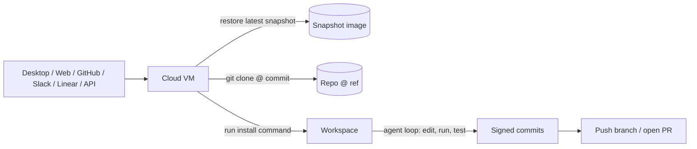

# Cursor Cloud Agents

Cursor Cloud Agents (formerly "background agents") run Cursor in an isolated VM that clones this repo from GitHub, runs an install script, and pushes signed commits back. This page explains how that works for `prisma-next`, where the config lives, how to change it, and how to debug it when it breaks.

If you only want the day-to-day operational rules for the agent itself (what tests to run, what to ask first), see the [`Cursor Cloud specific instructions`](../../AGENTS.md#cursor-cloud-specific-instructions) section in `AGENTS.md`. This doc is the contributor-facing setup and reference page.

## Mental model



1. You start a run from Cursor Desktop ("Cloud" in the model dropdown), the web dashboard, GitHub (`@cursor` on a PR or issue), Slack, Linear, or the [API](https://cursor.com/docs/cloud-agent/api/endpoints).
2. Cursor provisions an Ubuntu VM, restores the latest snapshot for this repo, `git clone`s the repo at the requested commit, and runs the **install** command from `.cursor/environment.json`.
3. The agent then has a shell plus the standard Cursor toolset (read/edit files, run commands, run MCP servers) and works the task.
4. When done, the agent commits (HSM-signed by Cursor), pushes a branch, and optionally opens a PR. You can resume the run or take it over from your desktop at any point.

## Where the config lives

| Concern | Location | Notes |
|---|---|---|
| Per-repo environment | [`.cursor/environment.json`](../../.cursor/environment.json) (committed) | Schema: <https://www.cursor.com/schemas/environment.schema.json> |
| Optional Dockerfile | `.cursor/Dockerfile` (only when explicitly un-ignored in `.gitignore`) | Only when you opt out of agent-driven snapshots; add a matching `!.cursor/Dockerfile` entry before committing |
| Optional hooks | `.cursor/hooks.json` (only when explicitly un-ignored in `.gitignore`) | Same hook system as desktop Cursor; add a matching `!.cursor/hooks.json` entry before committing |
| Cloud-only agent guidance | [`Cursor Cloud specific instructions`](../../AGENTS.md#cursor-cloud-specific-instructions) in `AGENTS.md` | Read by the cloud agent on every run |
| Snapshot ID | Personal or team config in dashboard | Tied to a Cursor account, not committed by default — see [Snapshot ownership](#snapshot-ownership) |
| Secrets, MCPs, network policy, defaults | Cursor dashboard (not in repo) | <https://cursor.com/dashboard/cloud-agents> |
| Codex equivalent (separate tool) | [`.codex/environments/environment.toml`](../../.codex/environments/environment.toml) | Source of truth for "what does a clean bootstrap look like" — autogenerated, keep in sync |

`.gitignore` ignores most of `.cursor/` (rules, commands, etc. are local-only) and currently un-ignores only `environment.json` (alongside `rules-footprint.config.json`). If you start using a `.cursor/Dockerfile` or `.cursor/hooks.json`, add a matching `!.cursor/<file>` entry to `.gitignore` so the file is committed alongside the rest of the cloud-agent config.

## What our `environment.json` does

```json
{
  "$schema": "https://www.cursor.com/schemas/environment.schema.json",
  "name": "prisma-next",
  "repositoryDependencies": [
    "https://github.com/prisma/ignite"
  ],
  "install": "set -euo pipefail; corepack enable >/dev/null 2>&1 || true; pnpm install --frozen-lockfile; IGNITE_DIR=\"$HOME/ignite\"; if [ ! -d \"$IGNITE_DIR/.git\" ]; then git clone https://github.com/prisma/ignite \"$IGNITE_DIR\"; else git -C \"$IGNITE_DIR\" fetch --quiet origin && git -C \"$IGNITE_DIR\" reset --quiet --hard origin/HEAD; fi"
}
```

Walk-through of the install command:

- `set -euo pipefail` — fails fast when any bootstrap step fails.
- `corepack enable >/dev/null 2>&1 || true` — activates the `packageManager`-pinned pnpm from `package.json` when Corepack is available, while staying idempotent on images where Corepack is already enabled or unavailable.
- `pnpm install --frozen-lockfile` — reproducible deps from `pnpm-lock.yaml`; fails if the lockfile is out of date.
- `IGNITE_DIR="$HOME/ignite"; ...` — ensures the Ignite repository exists at the documented cloud-agent path. The command clones `https://github.com/prisma/ignite` on first boot and fetches plus hard-resets to `origin/HEAD` on later boots so the checkout stays current and idempotent.

The `repositoryDependencies` entry declares the Ignite repository dependency to Cursor so cloud agents have the required repository access before the install command clones or refreshes it.

The `install` command **must be idempotent** because Cursor re-runs it on every boot after restoring the snapshot.

### Other fields you might add later

| Field | Purpose |
|---|---|
| `start` | Runs once after `install`. Use for one-shots like `sudo service docker start`. |
| `terminals[]` | Long-lived processes (e.g. `pnpm dev`) started in a tmux session shared with the agent. Not useful here — see [What cloud agents can't do](#what-cloud-agents-cant-do). |
| `ports[]` | Devcontainer-style port forwarding `{ name?, port }`. Add when the agent needs to expose an HTTP server. |
| `repositoryDependencies[]` | Extra repo URLs the GitHub token must include. We don't currently consume any private sibling repos. |
| `build` | Dockerfile build (`{ "dockerfile": "Dockerfile", "context": ".." }`). Paths are relative to `.cursor/`, **not** repo root. |
| `snapshot` | Snapshot ID. Usually populated by the onboarding wizard into personal/team config — see [Snapshot ownership](#snapshot-ownership). |
| `agentCanUpdateSnapshot` | Lets the agent itself update the snapshot at run end. |

## Lifecycle: where do I put X?

| Stage | When it runs | Cost model | Use it for |
|---|---|---|---|
| Snapshot | Once when you build/update the snapshot | Expensive but cached | System packages, language runtimes (Node 24), large fixture downloads, native compiler toolchains, Docker setup |
| `install` | Every boot, after snapshot restore | Cheap and idempotent | `pnpm install`, `pnpm build`, anything that depends on the current commit |
| `start` | Once after `install` | Cheap | Starting daemons (e.g. Docker), per-boot side effects |
| `terminals[]` | Long-lived, restarted per run | Always running | Watchers like `pnpm dev`, mock servers — only when the agent benefits from a hot process |

Rule of thumb: if a step doesn't depend on the commit, push it into the snapshot. If it must be re-run after a `git pull`, put it in `install`. Avoid `terminals` unless you have a concrete need; for a contract-first library monorepo, fresh builds per task are cheaper than maintaining a hot watcher in the cloud VM.

## How to make changes

### Cheap changes (e.g. adding a step to `install`)

1. Edit [`.cursor/environment.json`](../../.cursor/environment.json).
2. Run the new install command on a fresh clone locally and confirm it succeeds twice in a row (idempotency check).
3. Commit and push. The next cloud-agent run picks it up on its next boot.

### Snapshot changes (new system package, new Node, native deps)

1. Visit <https://cursor.com/onboard> with the repo selected.
2. Modify the snapshot interactively — install the missing thing, verify the build works.
3. Save the snapshot. Cursor stores the snapshot reference in your personal or team env config (see [Snapshot ownership](#snapshot-ownership)).
4. Future runs restore the new snapshot before running `install`.

### Adding secrets

1. Open <https://cursor.com/dashboard/cloud-agents> → **Secrets**.
2. Add the env var. Mark it **Redacted** if sensitive — Cursor scans tool output and refuses to leak it.
3. Reference it normally from scripts (`process.env.MY_VAR`).

Never put secrets in `environment.json`. The file is committed.

### Switching to a Dockerfile

Only do this when you need Docker-in-Docker, native compilers, or a non-Ubuntu base. Add `.cursor/Dockerfile` and set `build` in `environment.json`:

```json
{ "build": { "dockerfile": "Dockerfile", "context": ".." } }
```

`build.*` paths are relative to `.cursor/`, but `install` runs from the repo root. Don't `COPY` the project into the image — Cursor mounts the working tree at the right commit for you.

### Local validation

There's no local emulator. The closest options:

- Validate the JSON against the schema URL above (your editor will pick it up automatically via `$schema`).
- Run `bash -c "<install command>"` on a fresh clone, twice, to confirm idempotency.
- For Dockerfile mode: `docker build -f .cursor/Dockerfile .cursor`.
- The agent-driven onboarding flow at <https://cursor.com/onboard> is effectively the end-to-end test.

## Resolution order

When a cloud agent boots, environment config is resolved in this order (first match wins per field):

1. Repo `.cursor/environment.json`
2. Your personal env config (dashboard)
3. Your team env config (dashboard)

So this repo's `install` and `name` win for everyone. Snapshot references typically come from personal/team config.

### Snapshot ownership

The snapshot ID is **not** committed in this repo. Reasoning:

- Snapshots are tied to a Cursor account/workspace, not to git history. Pinning one user's snapshot ID in `environment.json` couples the repo config to that account.
- The agent-driven setup flow writes the snapshot reference into personal or team config by default. Per the resolution order above, your personal snapshot setting overrides the team setting when both are configured; the team setting applies as a fallback for accounts that have not set a personal snapshot.
- The `install` command stays in the repo (reproducible, reviewable). The snapshot stays in team config (mutable infra detail, can be rebuilt on demand).

If reproducibility-of-base-image ever matters more than account-portability, you can flip this by adding `"snapshot": "<id>"` to `environment.json`.

## Triggering a run

| Surface | How |
|---|---|
| Cursor Desktop | Switch the model dropdown to **Cloud**, describe the task |
| Web dashboard | <https://cursor.com/agents> |
| GitHub | `@cursor <task>` on a PR or issue |
| Slack / Linear | `@cursor <task>` |
| API | <https://cursor.com/docs/cloud-agent/api/endpoints> |

## MCP servers in cloud

MCPs are configured **per Cursor account** in the dashboard, not in this repo. Implications:

- Your local MCP set does not automatically follow you to the cloud. Configure cloud MCPs at <https://cursor.com/agents> → MCP dropdown.
- Prefer **HTTP transport** for cloud MCPs. Credentials live in Cursor's encrypted store and never enter the VM, which is safer than stdio MCPs that need creds inside the runtime.
- Some MCPs in this repo are inherently desktop-only and **will not work** in a cloud agent:
  - `cursor-ide-browser` — drives a real browser session attached to your IDE.
  - `cursor-app-control` — controls the local Cursor app process.
- The Linear MCP works in cloud over HTTP and is the most useful one to configure for cloud agents that drive project work.

## Debugging a failed run

Most failures fall into one of a few buckets. Check them in this order:

1. **Install logs.** The agent UI surfaces the `install` command's stdout/stderr. Re-read the failure line; the most common causes are lockfile drift (`pnpm install --frozen-lockfile` failed) and missing system deps (snapshot is stale).
2. **Attach to the tmux session.** The agent runs commands in a tmux session you can attach to from the run's "Terminals" panel. Re-run the failing command interactively, inspect env vars, run `which pnpm`, `node -v`, `corepack -v`.
3. **Re-run just the install command from the agent shell.** Faster than starting a whole new run. If it fails the same way twice, it's a config or snapshot issue, not flakiness.
4. **Snapshot drift.** Symptoms: CI passes, cloud agent fails on the same commit. Usually means the snapshot's installed `node_modules` or system packages don't match what the current `pnpm-lock.yaml` or `package.json` expects. Fix by rebuilding the snapshot from <https://cursor.com/onboard>.
5. **Burn the snapshot escape hatch.** When all else fails, delete the snapshot and rebuild it from scratch. You'll lose the cache but you'll know the next run starts from a known-good base.

If the failure looks like a Cursor platform issue (not a `prisma-next` issue), report it through the Cursor dashboard support flow rather than filing it as a repo bug.

## Husky and the `prepare` script

`package.json` has `"prepare": "husky"`, which runs on every `pnpm install` and installs the git hooks under `.husky/`. In a cloud VM this means:

- The `pre-commit` hook runs `pnpm lint-staged` on commits the agent makes.
- `lint-staged` runs `biome format --write`, `biome check --write`, and `lint-deps-focused.mjs` against staged files.
- Cloud-agent commits are therefore auto-formatted and dependency-cruiser-checked the same way human commits are.

You don't need to disable this. It's a feature: it keeps cloud-agent commits consistent with human commits.

## Lockfile updates from a cloud agent

`install` uses `--frozen-lockfile`, which is correct at boot. But if the agent runs `pnpm add` or `pnpm update` mid-task:

- The lockfile changes inside the VM.
- The agent **must commit `pnpm-lock.yaml` alongside any `package.json` change** or the next boot will fail with `ERR_PNPM_OUTDATED_LOCKFILE`.
- The lockfile-discipline rule applies in cloud the same as locally — never hand-edit the lockfile, always go through pnpm. Canonical guidance lives under [`AGENTS.md` § Cursor Cloud specific instructions](../../AGENTS.md#cursor-cloud-specific-instructions); a local-only mirror is also available at `.cursor/rules/no-direct-lockfile-edits.mdc` if you have one checked out.

## How this fits with other agent tooling in the repo

This repo intentionally supports multiple agent runtimes. The hierarchy:

| Path | Audience | Status |
|---|---|---|
| [`AGENTS.md`](../../AGENTS.md) (symlinked to `CLAUDE.md`) | All agent runtimes | **Source of truth.** Agent-agnostic. |
| `.cursor/environment.json` | Cursor cloud only | Committed; documented here. |
| `.cursor/rules/`, `.cursor/commands/` | Cursor desktop | Local-only (gitignored). |
| `.codex/environments/environment.toml` | Codex CLI | Committed; autogenerated; mirror of our install command. |
| `.claude/skills/`, `.claude/scripts/` | Claude Code | Committed where shared, `.claude/settings.local.json` is local-only. |
| `.agents/skills/`, `.agents/rules/` | Vendor-neutral skills/rules | Committed. |

Rule of thumb when changing agent guidance: **put it in `AGENTS.md` first.** Per-system files (`.cursor/`, `.codex/`, `.claude/`) carry only what is specific to that runtime. If you find yourself duplicating the same guidance into multiple per-system files, the duplication belongs in `AGENTS.md` and the per-system files should link to it.

## What cloud agents can't do

Sets expectations against your local desktop experience:

- **No access to your local files** outside the cloned repo. The VM is isolated.
- **No access to your local terminals, MCPs, or running services.** Desktop-only MCPs (see above) are unavailable.
- **No production deploys** unless you give them creds via dashboard secrets, and you almost never want to.
- **Long-running watchers (`pnpm dev`) aren't useful** since each run starts fresh from the snapshot. Use `pnpm build` once at boot instead.
- **No interactive prompts.** Anything that requires `stdin` (e.g. `pnpm publish` interactive flows, login prompts) will hang. Use non-interactive flags or skip entirely.

## Branch naming and concurrency

- Cursor names branches `cursor/<slug>-<id>` by default. You can rename before pushing.
- Multiple cloud agents can run on the same repo simultaneously on independent branches. Branch protection rules on `main` apply normally.
- Cloud-agent commits are HSM-signed by Cursor, so a "require signed commits" branch protection rule is fine — agents satisfy it automatically.

## Privacy and data

Account-level privacy mode applies to cloud agents. Run history is stored in Cursor's infra; signed commits are pushed to GitHub. For the full story on what's stored, network egress, and IP allow-lists, see Cursor's [security & network docs](https://cursor.com/docs/cloud-agent/security-network).

## CI autofix

Cursor can be invoked from a failing CI workflow via the [CI autofix capability](https://cursor.com/docs/cloud-agent/capabilities#ci-autofix) — the agent reads the failure logs and proposes a fix as a PR. We don't currently wire this into our GitHub Actions workflows; if you want to enable it, that's a separate setup step on top of what's documented here.

## prisma-next-specific notes

- **Node version**: pinned to `>=24` via `engines.node` in [`package.json`](../../package.json). If the snapshot ships an older Node, install Node 24 once during the snapshot step at <https://cursor.com/onboard>; do not put Node installation in `install` (it should stay cheap).
- **Sanity command**: `pnpm test:packages` is the cheapest end-to-end signal that the workspace is healthy — recommend it as a smoke test for any new snapshot.
- **Heavier suites**: `pnpm test:integration` and `pnpm test:e2e` need outside resources (Postgres, etc.). Provide credentials via dashboard secrets and confirm before invoking from a cloud agent.
- **Linting & layering**: prefer `pnpm lint`, `pnpm lint:deps`, `pnpm lint:rules`, `pnpm lint:docs`. Treat layering violations as errors to fix, never to bypass — see the layering rule under [`AGENTS.md` § Boundaries & Safety Rails](../../AGENTS.md#boundaries--safety-rails) (committed; the optional `.cursor/rules/import-validation.mdc` is a local-only mirror).
- **Fixtures**: use `pnpm fixtures:check` rather than ad-hoc emit-and-diff.
- **Codex parity**: when you change the install sequence in `environment.json`, update [`.codex/environments/environment.toml`](../../.codex/environments/environment.toml) to match. Both files describe the same bootstrap; we want them aligned.

## Reference

- [Setup](https://cursor.com/docs/cloud-agent/setup) — official setup guide
- [Capabilities](https://cursor.com/docs/cloud-agent/capabilities) — MCP, computer use, CI autofix
- [Security & network](https://cursor.com/docs/cloud-agent/security-network) — secrets, egress, IP ranges, signed commits
- [Best practices](https://cursor.com/docs/cloud-agent/best-practices)
- [Schema](https://www.cursor.com/schemas/environment.schema.json) — `environment.json` JSON Schema
- [API endpoints](https://cursor.com/docs/cloud-agent/api/endpoints)
- Dashboards: [`cursor.com/onboard`](https://cursor.com/onboard) (snapshot wizard), [`cursor.com/dashboard/cloud-agents`](https://cursor.com/dashboard/cloud-agents) (secrets/network/defaults), [`cursor.com/agents`](https://cursor.com/agents) (start runs, manage MCPs)
