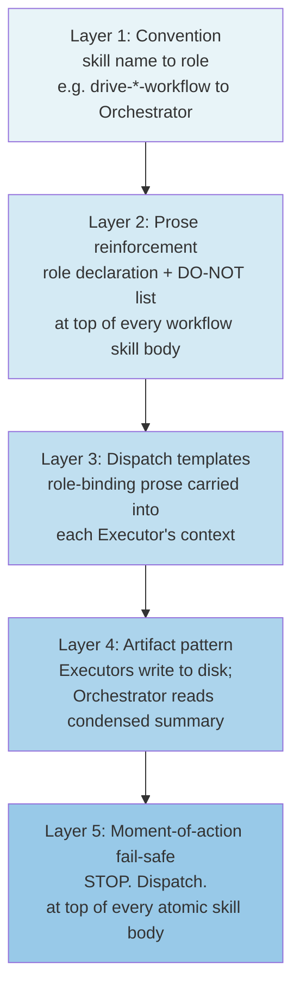

# Execution-layer roles: Orchestrator and Executor

This document defines the two **execution-layer roles** in the Drive framework — Orchestrator and Executor — and the layered mechanism that binds agents to those roles. It is the single discovery surface for the role distinction; a new contributor reading this document should need no other document to understand the role split, the binding layers, and the escape-hatch policy.

## How this document is used

**Workflow skill authors** read this document before writing or amending a `drive-*-workflow` skill body. It defines what a workflow skill's Orchestrator role declaration must say and which sections the skill body must carry (role declaration, DO-NOT list, escape-hatch policy, moment-of-action fail-safe).

**Atomic skill authors** read this document before writing or amending any `drive-*` skill that will be dispatched from a workflow skill. It defines the dispatch-framing prose each atomic skill must carry (the "STOP. Dispatch." fail-safe at the top) and how the skill should describe its expected invocation context.

**Orchestrators** read this document when assembling dispatch briefs. The role-variant table and registry pattern (§ [Role-variant table](#role-variant-table), § [Sub-agent registry pattern](#sub-agent-registry-pattern)) are the primary operational reference for dispatch decisions.

**Reviewers** use this document as the standard against which workflow-skill and atomic-skill compliance is evaluated. A skill that lacks the required prose sections, or a diff that adds direct execution calls to a workflow skill body, constitutes a compliance gap against this document.

> **Companion doc:** [`docs/drive/principles/roles-and-personas.md`](https://github.com/prisma/ignite/blob/main/docs/drive/principles/roles-and-personas.md) covers **process roles** (project owner / implementer / reviewer / orchestrator hat) — who owns what across a project's lifecycle. This document covers **execution-layer roles** — what structural constraint an agent is under when running inside a Drive workflow. The two layers are complementary: an Executor can wear the project-owner process role, and an Orchestrator can wear the tech-lead persona. Neither doc replaces the other.

---

## Table of contents

1. [The role split](#the-role-split)
2. [Role vs persona — orthogonality](#role-vs-persona--orthogonality)
3. [Five binding layers](#five-binding-layers)
4. [DO-NOT enumeration for the Orchestrator](#do-not-enumeration-for-the-orchestrator)
5. [Escape-hatch policy](#escape-hatch-policy)
6. [Why this matters — cited rationale](#why-this-matters--cited-rationale)
7. [Role-variant table](#role-variant-table)
8. [Sub-agent registry pattern](#sub-agent-registry-pattern)
9. [Alternatives considered](#alternatives-considered)

---

## The role split

Every actor running inside a Drive workflow is in one of two **structural roles**:

### Orchestrator

Runs `drive-*-workflow` skills. The Orchestrator's job is **routing and synthesis**: it reads condensed artifacts, evaluates verdicts, assembles briefs, dispatches Executor sub-agents, and synthesises their reports back to the operator. It does **not** perform execution work (file edits, searches, shell calls, write operations) directly from its own context — that work belongs to an Executor.

**The Orchestrator's five verbs**:

- **Delegate** — dispatch Executor sub-agents with well-bounded briefs.
- **Synthesize** — combine condensed sub-agent reports into a unified view.
- **Coordinate** — manage dispatch sequencing, branch state, project artifact organisation.
- **Decide** — issue verdicts, pick next actions, route escalations.
- **Author** — write project and slice artifacts directly: spec, plan, design notes, alternatives-considered, slice spec, slice plan, subagent-registry. These artifacts have inputs that live only in the Orchestrator's conversation context and cannot be cheaply re-derived by an Executor; the Orchestrator authors them.

The fifth verb — *author* — is the non-obvious one. It applies to a specific class of artifact: project and slice planning + design material. The underlying criterion is **re-derivation cost**: if a piece of work's inputs live only in the Orchestrator's context (a just-had discussion, an in-flight model decision), delegation requires the Executor to reconstruct the inputs from external prompts or transcript reads, suffering fidelity loss. If the inputs are well-bounded and externally encoded (a settled spec, a precise input/output contract), delegation is cheaper. Project + slice planning and design artifacts fall on the orchestrator-direct side of that line.

The mechanical consequence: **the Orchestrator's file writes never leave the project directory.** Spec, plan, design notes, alternatives-considered, slice spec, slice plan, subagent-registry — all live inside `projects/<current-project>/`. Touching files outside the project directory (source code, tests, durable docs, skill files, rules, configs) is the signal that the Orchestrator is doing the wrong thing — the work must be delegated to an Executor with the spec as their input contract. Reads outside the project directory are fine (research, context-gathering); writes are not. See [Layer 5 — Moment-of-action fail-safe](#layer-5--moment-of-action-fail-safe) for the file-path check that operationalises this rule.

### Executor

Runs atomic skills. The Executor's job is **execution**: it performs a bounded unit of work and persists the output to disk so the Orchestrator can read the condensed result. Three subtypes:

| Subtype | What it does |
|---|---|
| **Specialist** | Runs one atomic skill end-to-end (e.g. `drive-specify-project`, `drive-plan-slice`, `drive-triage-work`). Purpose: a contained, bounded deliverable. |
| **Implementer** | Edits product code within a slice. Reads source, writes edits, commits. |
| **Reviewer** | Reads code and review surfaces; writes review verdicts + findings to `code-review.md`. |

The key distinction: an Orchestrator holds a **broad view** across an entire project or workflow; an Executor holds a **narrow, deep view** of one atomic task. These are incompatible within a single context window — letting execution work into the Orchestrator's context degrades its broad view.

### Concrete examples

**An Orchestrator in `drive-deliver-workflow` (correct):**
1. Reads `projects/my-project/plan.md` to identify the next slice. *(Coordination: reading an owned artifact.)*
2. Assembles a dispatch brief for a `setup-specialist` to run `drive-specify-slice`. *(Coordination: assembling a brief from templates.)*
3. Dispatches the `setup-specialist` sub-agent. *(Coordination: initiating an Executor.)*
4. Receives the condensed report: "Slice spec written to `projects/my-project/slices/auth/spec.md`." *(Coordination: reading a summary.)*
5. Records the sub-agent ID in `projects/my-project/subagent-registry.md`. *(Coordination: updating the registry.)*

**The same workflow, incorrect:**
1. Reads `projects/my-project/plan.md`. *(Still OK.)*
2. Reads `docs/drive/principles/decomposition-and-cost.md` to understand dispatch sizing. *(Execution drift begins — now the Orchestrator's context contains implementation detail about how slices are sized.)*
3. Reads `packages/2-sql/5-runtime/src/codecs/encoding.ts` to understand what the slice will need to implement. *(Deep context pollution — the Orchestrator is now doing reconnaissance that the Implementer should do.)*
4. Writes the slice spec itself. *(Full execution — the Orchestrator has collapsed into an Implementer.)*

The incorrect version is not hypothetical. It is the default failure mode: each step feels locally justified ("I need to understand X to write a good brief for Y"), and the cumulative effect is an Orchestrator whose context window is full of implementation detail before the first Executor has been spawned.

---

## Role vs persona — orthogonality

Roles constrain **what** an actor does (structural). Personas frame **how** an actor reasons (attitudinal). Both coexist; neither determines the other.

| | Orchestrator | Executor (any subtype) |
|---|---|---|
| **tech-lead** persona | Default orchestrator framing: routing, synthesis, scope discipline | A Specialist running `drive-specify-project` with tech-lead framing |
| **architect** persona | Valid (e.g. design-discussion orchestration) | A Specialist running `drive-pr-local-review` with architect framing |
| **principal-engineer** persona | Valid (e.g. a code-review triage pass) | Default framing for a Reviewer |
| *(any persona)* | Role stays Orchestrator; persona only changes scrutiny frame | Role stays Executor; persona only changes scrutiny frame |

Loading a persona does **not** change the actor's role. An Orchestrator that loads the `tech-lead` persona is still an Orchestrator — it must still delegate execution. A Reviewer that loads `principal-engineer` is still an Executor — it still owns a bounded reading task. Personas are bias-frames worn on top of a fixed structural role, not a replacement for it.

The practical consequence: when an Orchestrator dispatches a Specialist to run `drive-specify-project`, the dispatch brief should specify both the **role** ("You are running as an Executor/Specialist") and the **persona** ("Adopt the `tech-lead` persona from `drive-agent-personas/SKILL.md`"). The role constrains the structural boundaries of what the Executor does; the persona shapes how it reasons within those boundaries. Omitting the role and specifying only the persona risks the Executor treating the persona as a license to range widely — a `tech-lead` persona without a role constraint might decide to do reconnaissance "because a tech lead would", collapsing the Executor into a second Orchestrator.

The complementary doc [`docs/drive/principles/roles-and-personas.md`](https://github.com/prisma/ignite/blob/main/docs/drive/principles/roles-and-personas.md) — which covers the *process roles* (project owner, implementer, reviewer, orchestrator hat) — also notes the role-vs-persona distinction, but from the process side: "the agile-orchestrator hat is about orientation, not seniority or model tier." Both docs are expressing the same underlying principle from different vantage points.

---

## Five binding layers

The Orchestrator/Executor split is enforced through five independent, defence-in-depth layers. Each layer is designed to be independently load-bearing so that degradation of any single layer (e.g. prose-discipline drift past ~100 turns) is caught by the next layer.

```
┌──────────────────────────────────────────────────────────┐
│  Layer 1: Convention (skill name → role assignment)       │
├──────────────────────────────────────────────────────────┤
│  Layer 2: Prose reinforcement (role declaration per skill)│
├──────────────────────────────────────────────────────────┤
│  Layer 3: Dispatch templates (role-binding in brief)      │
├──────────────────────────────────────────────────────────┤
│  Layer 4: Artifact pattern (outputs to disk; read summary)│
├──────────────────────────────────────────────────────────┤
│  Layer 5: Moment-of-action fail-safe (per-skill STOP)     │
└──────────────────────────────────────────────────────────┘
```



Each layer catches failures the layer above it misses. Convention fires before any reasoning; prose reinforcement fires during skill loading; dispatch templates fire when a new Executor is spawned; the artifact pattern fires when the Orchestrator receives output; the fail-safe fires at the moment of tool invocation. A session where all five layers are operating correctly will maintain the Orchestrator/Executor split for its entire lifetime. A session where prose discipline has drifted (layer 2 weakened) is still protected by layers 3–5.

### Layer 1 — Convention

**Rule:** Any `drive-*-workflow` skill puts its running agent in the **Orchestrator role** for the entire skill body.

**Rationale:** Skill name is the most durable signal available — it is set at spawn time, before any reasoning begins. If the naming convention holds, the Orchestrator's role is established before any prose is read. This is the outermost guard; it costs nothing to enforce at authoring time and is visible to any reader of the skill list.

### Layer 2 — Prose reinforcement

**Rule:** Every `drive-*-workflow` skill carries: (a) a role declaration at the top of the skill body, (b) an `## Orchestrator stop-and-delegate triggers` section with explicit DO-NOT enumeration (see below), and (c) the escape-hatch policy.

**Rationale:** Prose reinforcement closes the gap between the convention (skill-name → role) and the moment of action. Research on agent persona-drift (Wire, MAST) shows that even correctly-loaded personas degrade in long sessions — explicit prose that names specific forbidden actions is more durable than a role declaration alone, because it fires at each potential violation site rather than once at the top.

### Layer 3 — Dispatch templates

**Rule:** Every atomic-skill call from a workflow skill uses a template that carries role-binding prose explicitly into the dispatched Executor's context.

**Rationale:** The Orchestrator's role constraint does not automatically propagate to the Executors it spawns. Each Executor starts with a fresh context; the dispatch brief is the only reliable channel for carrying the role assignment. Templates make this carrier systematic and authoring-time-verified rather than ad hoc. The existing `delegate-implement.md` / `delegate-review.md` templates in `.claude/skills/drive-build-workflow/templates/` are the precedent; the same pattern extends to Specialist dispatches from `drive-start-workflow` and `drive-deliver-workflow`.

A well-formed dispatch brief for an Executor carries, at minimum:
1. **Role declaration** — "You are running as an Executor / Specialist. You are not an Orchestrator."
2. **Persona** — "Adopt the `tech-lead` persona" (or whichever persona the skill calls for).
3. **Atomic skill pointer** — "Follow the `drive-specify-slice` skill."
4. **Scope and context** — the specific inputs the Executor needs, assembled from the Orchestrator's planning artifacts (spec, plan, prior verdicts).
5. **Done condition** — what the Executor writes to disk and what condensed report it returns.

The Executor should not need to do its own project reconnaissance to understand its scope — that would be re-doing work the Orchestrator already holds. A brief that forces the Executor to reconstruct the project context from scratch is a signal the template is underspecified.

### Layer 4 — Artifact pattern

**Rule:** Sub-agents (Executors) persist their outputs to disk and return **condensed reports**. Orchestrators read the condensed reports, not the raw tool output or intermediate reasoning.

**Rationale:** If the Orchestrator consumed raw execution output (file contents, grep results, long test logs), its context would fill with execution detail and its broad-view capacity would degrade exactly as if it had performed the execution itself. The artifact pattern preserves the Orchestrator's context budget for what it uniquely does: routing, synthesis, and escalation. The pattern is already operative in `drive-build-workflow` (reviewer maintains `code-review.md`; implementer writes commits; orchestrator reads the review summary, not individual diffs).

### Layer 5 — Moment-of-action fail-safe

**Rule:** Every atomic skill carries a one-liner positioned at the top of the skill body (before the "When to use" section):

> _If you are about to call `Read` / `Grep` / `Glob` / `Shell` / `Write` / `StrReplace` directly from a workflow skill — **STOP. Dispatch.**_

**Rationale:** This layer fires at the precise moment of potential violation — when the Orchestrator is about to reach for an execution tool. It is the cheapest layer to add and the closest to where drift actually occurs. Its placement at the top of every atomic skill body means that an Orchestrator about to use an atomic skill *as a convenience wrapper* (rather than dispatching it to an Executor) will encounter the stop-signal before any execution begins.

The fail-safe's placement is deliberate. An Orchestrator that is drifting into execution will typically reach for an atomic skill that wraps an execution action — `drive-triage-work` to read a ticket, `drive-specify-slice` to author a file, `drive-pr-description` to run a git diff. Each of these skills is an execution unit. By placing the fail-safe at the top of every such skill, the stop-signal appears at the exact moment the drift would become irreversible. A workflow-skill invocation of an atomic skill directly (without dispatching) encounters the stop-signal as its very first input — there is no "partial execution" before the signal fires.

#### Orchestrator-side fail-safe — the file-path check

A complementary fail-safe operates on the Orchestrator side: **the Orchestrator's writes never leave `projects/<current-project>/`**. At the moment the Orchestrator is about to call a write tool (`Write`, `StrReplace`, `Edit`), the file path is the binary check — if the target lies outside the project directory, the Orchestrator stops and dispatches.

```text
Write target inside  projects/<current-project>/  →  orchestrator-direct (OK)
Write target outside projects/<current-project>/  →  delegate (STOP, dispatch)
```

This check is mechanically simple, harder to drift past than a soft "did I really need to do this myself?" prompt, and complementary to the atomic-skill STOP one-liner above: the atomic-skill check fires when an Orchestrator is about to invoke an atomic skill (which is itself a wrapper around execution tools); the file-path check fires when the Orchestrator is about to make a direct write call. Together, both ends of the action chain are guarded.

The deeper rationale is the same re-derivation-cost criterion introduced in [The role split / Orchestrator](#orchestrator): orchestrator-context-only artifacts live in the project directory; everything else has externally-encoded inputs and is Executor work.

---

## DO-NOT enumeration for the Orchestrator

The following actions constitute **execution** rather than coordination. An Orchestrator running a `drive-*-workflow` skill MUST NOT perform these directly:

| Action | Why it's execution |
|---|---|
| Calling `Read` on a source file | Populates the Orchestrator's context with implementation detail; degrades broad view |
| Calling `Grep` / `Glob` to search source | Same context-pollution mechanism as `Read` |
| Calling `Shell` to run build/test/lint commands | Execution gate; belongs in an Implementer's brief |
| Calling `Write` / `StrReplace` to edit files | Direct file modification; belongs in an Implementer or Scaffolder |
| Reading raw test output inline | Condensed summary (pass/fail + failure lines) via artifact; not raw stream |
| Inlining `git diff` output to reason over | Diff interpretation is a Reviewer task; Orchestrator reads the verdict |
| Running `pnpm` commands directly | Build/test execution belongs in an Executor brief |

**What the Orchestrator _may_ do directly:**
- Read project-level artifacts it owns: `projects/<x>/spec.md`, `projects/<x>/plan.md`, `projects/<x>/subagent-registry.md`, `projects/<x>/reviews/code-review.md` (to read a verdict — not to execute the review itself).
- Read drive context overlays: `drive/<category>/README.md`, `docs/drive/principles/`, skill bodies it is composing into briefs.
- Assemble dispatch briefs from templates and in-memory context.
- Write to project-level orchestrator-owned files (`spec.md`, `plan.md`, `design-notes.md`, slice `spec.md` / `plan.md`, `subagent-registry.md`, `reviews/code-review.md` updates, brief files) — see [The role split / Orchestrator](#orchestrator) for the full list and the file-path boundary rule.
- Read heartbeat files (liveness check during a dispatch loop — this is coordination, not execution).
- Make MCP calls for Linear/GitHub project management (routing and status, not code execution).

**The diagnostic question:** Before calling any tool from a workflow skill body, the Orchestrator should ask: *"Is this action producing an artifact the operator will consume, or is it coordinating the production of that artifact?"* Coordination (reading a spec to write a brief, querying Linear to route a ticket, reading a heartbeat to confirm liveness) stays in the Orchestrator. Production (editing a file, running tests, searching source code, writing a review verdict) belongs in an Executor.

---

## Escape-hatch policy

The Orchestrator **may act directly** when all three conditions are met:

1. **No dispatch shape serves** — the action is genuinely one-shot, synchronous, and too trivial to warrant spawning an Executor (e.g. a quick `rg` to verify a file path exists before writing a brief).
2. **The action is brief** — a single tool call or at most two; not a sustained investigation.
3. **The decision is coordination** — the purpose is to route or validate, not to produce an artifact the operator will consume.

When the escape hatch fires, the Orchestrator should note it explicitly (in its running log or heartbeat) so the pattern is visible and auditable. A project whose retros surface frequent escape-hatch use is a signal that the binding layers need reinforcement, not that the escape hatch should expand.

The escape hatch is deliberately narrow. Its existence is not a license to drift into execution; it is a last resort for cases where the dispatch-by-default model produces more ceremony than the action warrants.

**Examples of valid escape-hatch use:**
- `rg -c "some-function" drive/roles/README.md` to verify a file path exists before writing a dispatch brief — one call, coordination purpose, not producing an artifact the operator consumes.
- A quick `ls drive/` to check whether a directory exists before writing a scaffolding brief — trivial, synchronous, no Executor shape would be cheaper.

**Examples of invalid escape-hatch use:**
- Reading the source of a package to understand its API before writing a dispatch brief — this is reconnaissance that degrades the Orchestrator's broad view. The brief can reference the package; the Executor reads the source.
- Running `pnpm test:packages` to confirm the baseline before dispatching an Implementer — this is a validation gate that belongs in the Implementer's brief.
- Searching for all usages of a function across the codebase — this is an analytical task with a bounded deliverable. Dispatch a Specialist for it.

The pattern that distinguishes valid from invalid: valid escape-hatch use is **navigational** (finding a path, confirming existence, routing based on a known value). Invalid use is **investigative** (learning something new about the codebase's content or state).

---

## Why this matters — cited rationale

The layered Orchestrator/Executor binding addresses a cluster of observed failure modes in multi-agent Drive sessions:

**Persona-drift in long sessions.** Even correctly-loaded role declarations degrade in sessions past ~100 turns. Wire (sub-agent persona-drift measurements past ~100 turns) measured this; the Orchestrator's claimed coordination stance erodes and direct execution creeps in. Prose reinforcement alone (layer 2) is not sufficient — layered binding survives individual layer failures.

**"Disobey role specification" as a measured failure mode.** MAST: Measuring AI Agent Failure Modes ([arXiv:2503.13657](https://arxiv.org/abs/2503.13657)) categorises role-specification disobedience as a primary agent failure mode and shows it correlates with session length and context saturation. The moment-of-action fail-safe (layer 5) is a direct countermeasure — it fires at the exact moment of potential violation rather than relying on remembered role declarations.

**Orchestrator context pollution.** Rogov, *"Why Your AI Orchestrator Should Never Write Code"*, argues that even read-only reconnaissance (`Read`/`Grep`/`Glob`) in the Orchestrator's context pollutes the broad view that makes the Orchestrator uniquely valuable. Once the context fills with implementation detail, the Orchestrator's routing quality degrades — it reasons over the detail rather than the structure. The DO-NOT enumeration above includes read operations for this reason.

**Multi-agent research precedent.** Anthropic, *"How we built our multi-agent research system"*, documents the operational finding that subagent specialisation (narrow, deep execution) paired with orchestrator specialisation (broad, shallow coordination) outperforms single-agent monoliths in tasks requiring sustained strategic coherence. The Executor subtypes (Specialist / Implementer / Reviewer) map directly to this pattern.

**Why read-only reconnaissance is included in the DO-NOT list.** It might seem that `Read`/`Grep`/`Glob` are harmless since they don't modify state. Rogov's argument — confirmed operationally — is that context pollution from read-only reconnaissance degrades the Orchestrator's broad view just as effectively as execution: the Orchestrator's context fills with file contents, search results, and implementation detail, and its subsequent routing decisions are made from that polluted vantage point. The broad view that makes an Orchestrator valuable is *structural* — it sees the plan, the slice statuses, the review verdicts, the open decisions. Once the context shifts to holding source-code detail, the structural view compresses to make room, and routing quality degrades.

The layered binding is a direct response to these four failure mechanisms. Each layer addresses a different onset condition:

| Layer | Failure condition it guards against |
|---|---|
| Convention (skill name) | Initial role mis-assignment before any reasoning |
| Prose reinforcement | Forgotten role declaration mid-session |
| Dispatch templates | Role constraint not propagated to fresh Executors |
| Artifact pattern | Context pollution via raw execution output |
| Moment-of-action fail-safe | Role drift at the point of tool invocation |

### Detecting role drift in practice

The most reliable signal that an Orchestrator has drifted into execution is **context window composition**. An Orchestrator operating correctly should find, at any moment, that its context consists primarily of:
- Project-level planning artifacts (spec, plan, subagent-registry)
- Drive context overlays (principles docs, triage guides)
- Condensed executor reports (review verdicts, brief summaries, commit SHAs)
- Dispatch templates and their in-progress assembly

If the context instead holds source file contents, test output, grep results, or diff fragments — the Orchestrator has drifted. The fix is not to continue from the drifted state but to surface the drift to the operator (or, in an automated setting, to the project's retro mechanism) and re-establish the role boundary before proceeding.

---

## Role-variant table

Each Executor subtype has a small number of **named variants** with documented model tiers and persistence policies. Naming convention is slash-separated: `role/variant` (e.g. `implementer/fast`, `reviewer/thorough`).

| Role / variant | Purpose | Tier (default) | Persistence |
|---|---|---|---|
| **scaffolder** | Mechanical work: directory setup, MCP setup, sweep-style edits | fast | one-shot |
| **setup-specialist** | Authoring: project spec, project plan, spec amendments | thorough | persistent across project-setup phase |
| **implementer/fast** | Routine code edits within a slice | mid | persistent across rounds within a slice |
| **implementer/thorough** | Escalation for hard problems | thorough | spawned on escalation |
| **reviewer/fast** | Default per-round review verdicts | mid | persistent across rounds within a slice |
| **reviewer/thorough** | Escalation review for high-leverage rounds | thorough | spawned on escalation |

The Orchestrator dispatches by variant name; the variant name is the contract for which model tier and persistence policy the Executor will use. All consumers of this vocabulary must use the slash-separated convention consistently — `implementer/fast`, `reviewer/thorough`, etc. — when referencing variants in dispatch templates, skill bodies, and registry entries.

**Variant-switching is always a new sub-agent spawn.** The model tier is fixed at spawn time (this is a Cursor/Claude Code constraint on the model+resume interaction). Switching from `implementer/fast` to `implementer/thorough` spawns a fresh sub-agent with the new model tier — it does not upgrade the existing one in place. The registry records the new ID alongside the old one with a swap note.

**Why named variants?** Named variants make dispatch decisions reproducible across projects. Without them, each dispatch requires re-deriving which model tier and persistence policy to use — that decision gets made inconsistently and the per-project cost implications become opaque. With named variants, the Orchestrator dispatches by name and the documented tier is the contract.

---

## Sub-agent registry pattern

The per-project sub-agent registry is the Orchestrator's working record of which spawned sub-agent ID belongs to which role/variant. It enables ID resumption — calling the same sub-agent on a subsequent dispatch (rather than cold-spawning) to avoid re-deriving accumulated context.

### Location (working position)

Each project maintains its registry at `projects/<x>/subagent-registry.md`. This is the **working position** established by the slice that introduced the registry pattern; the final location (separate file vs. `code-review.md § Subagent IDs` vs. `spec.md`) is a slice-author decision. The rationale for the separate-file working position: the registry covers roles beyond `drive-build-workflow`'s implementer/reviewer scope (notably `setup-specialist` and `scaffolder` which operate in the project-setup phase, before `code-review.md` exists). Tying it to `code-review.md` would awkwardly co-locate unrelated artefacts.

See [Alternatives considered — registry location](#registry-location-q6-working-position) below for the full decision record.

### Why resumption matters

Cold-spawning a new sub-agent for every atomic-skill call pays a context re-derivation cost: the spec, plan, and prior discussion context must be re-pasted into each new prompt. At typical Drive project sizes (3–8k tokens of spec/plan content per sub-agent), three cold spawns in a setup chain costs 9–24k tokens in re-pasting alone. At thorough-tier pricing, this is material.

Resumption avoids that cost: the resumed sub-agent retains the full context it has already built — spec readings, prior commits, prior decisions, prior spec sections it produced — so the Orchestrator can dispatch the next step with a short brief rather than a full-context re-paste.

The registry is the mechanism that makes resumption reliable. Without a registry, the Orchestrator must re-derive the sub-agent ID from memory or pass it through the prompt chain (fragile). With a registry, the Orchestrator reads a single file and finds the ID it needs.

### ID-resumption mechanics

When an Orchestrator dispatches a role/variant for the first time in a project:
1. Spawn a fresh sub-agent with the variant's documented model tier.
2. Record the spawned sub-agent ID in `projects/<x>/subagent-registry.md` under the role/variant entry.

On subsequent dispatches with the same role/variant:
1. Look up the ID in the registry.
2. Resume the existing sub-agent (pass the stored ID to the Task tool's `resume` parameter).
3. The resumed sub-agent retains full prior context: spec/plan readings, prior commits, prior decisions.

**Swap note:** If a variant switch occurs (e.g. the Orchestrator escalates from `implementer/fast` to `implementer/thorough`), the old ID is retained in the registry with a status of `swapped` and the timestamp of the swap. The new ID is recorded as the active entry for that role. This preserves the audit trail and makes escalations visible in the project's history.

### Registry schema

```markdown
## Sub-agent registry

| Role / variant | Sub-agent ID | Tier | Status | Last used |
|---|---|---|---|---|
| setup-specialist | <agent-id> | thorough | active | 2026-05-15 |
| implementer/fast | <agent-id> | mid | active | 2026-05-18 |
| reviewer/fast | <agent-id> | mid | swapped → implementer/thorough | 2026-05-17 |
| implementer/thorough | <agent-id> | thorough | active | 2026-05-18 |
```

### Worked example: project-setup chain

The canonical example is the project-setup chain — `drive-create-project` → `drive-specify-project` → `drive-plan-project` — which flows through a single resumed `setup-specialist`:

1. **`drive-create-project`** dispatches a `setup-specialist` (thorough tier) to scaffold the project directory and author the initial `spec.md`. On return, the Orchestrator records the spawned ID in `projects/<x>/subagent-registry.md`.

2. **`drive-specify-project`** is the next call in the setup chain. Instead of cold-spawning a new thorough-class sub-agent (and paying the context re-derivation cost), the Orchestrator looks up the `setup-specialist` entry in the registry and resumes that sub-agent. The resumed `setup-specialist` already holds the project's purpose statement, scope decisions, and the spec structure it just produced — no re-pasting required.

3. **`drive-plan-project`** resumes the same `setup-specialist` again. The sub-agent now holds the full project-setup context: the spec it authored, the scope decisions it made, and the constraints it surfaced. The plan it produces is consistent with that context without requiring the Orchestrator to re-derive and re-paste it into a new sub-agent's prompt.

**Registry state after the setup chain:**

```markdown
## Sub-agent registry

| Role / variant | Sub-agent ID | Tier | Status | Last used |
|---|---|---|---|---|
| setup-specialist | abc-1234 | thorough | active | 2026-05-15 |
```

The Orchestrator looks up `setup-specialist` → `abc-1234` for each of the three calls. Only one entry exists; the ID is reused.

**Cost implication:** The three-call setup chain through one resumed `setup-specialist` avoids two cold-spawn context costs. At typical project-spec sizes, each cold-spawn requires pasting ~3–8k tokens of spec/plan/discussion content. At two avoided cold spawns, the registry pattern saves ~6–16k tokens in prompt cost for a single project-setup phase — material at the tier these calls use (thorough).

---

## Alternatives considered

### Runtime capability constraint — rejected

**Option:** Enforce the Orchestrator/Executor split by literally removing `Read` / `Grep` / `Glob` / `Shell` / `Write` / `StrReplace` from the Orchestrator's tool list at runtime — a "read-only" or "dispatch-only" capability profile.

**Rejected because:**
1. **No portable affordance.** There is no mechanism available across Cursor, Claude Code, and other harnesses the team uses that lets a skill file declare a capability constraint that the harness actually enforces. Any implementation would be harness-specific and fragile.
2. **Breaks the escape hatch.** Even a narrow escape hatch (the Orchestrator acts directly for one-shot synchronous responses) requires `Read` or `Shell` access. A hard capability constraint eliminates the escape hatch entirely, which is too rigid for the range of cases Drive workflows encounter.
3. **Convention carries the load.** The layered binding (five layers, each independently load-bearing) provides sufficient defence in depth without requiring harness cooperation. Removing a layer that's not portable in exchange for a capability constraint that is portable but doesn't exist is not a trade worth making.

The layered convention approach is strictly more portable and nearly as strong as a runtime constraint in practice, given the five-layer depth.

### Harness-specific affordances — rejected

**Option:** Use Cursor-specific affordances — specifically, custom subagent types declared under `.cursor/agents/` (e.g. `drive-orchestrator`, `drive-specialist`, `drive-implementer`, `drive-reviewer`) — to bind roles at the harness level.

**Rejected because:**
1. **Harness diversity is permanent.** The team runs Cursor, Claude Code, and at least one other harness. Any ship must work across all of them without harness-specific affordances. Anything that lands in `.cursor/agents/` is invisible to a Claude Code runner.
2. **Portability requirement is load-bearing.** Harness portability is not a nice-to-have — it is structural. Skills are the team's methodology; if a critical part of the binding only works under one harness, the methodology becomes harness-fragmented and the team accumulates a maintainability debt on every harness transition.
3. **Convention is sufficient.** The five-layer binding is harness-agnostic — it uses only skill bodies (markdown files), dispatch templates (markdown files), and per-project registry files. No harness cooperation required.

### Registry location — working position

**Options considered:**
- **(a) `projects/<x>/subagent-registry.md`** — separate file, Orchestrator-owned. *(Working position)*
- **(b) Extend `code-review.md § Subagent IDs`** — piggyback on the existing build-workflow precedent.
- **(c) A new section in `spec.md`** — co-locate with the project's source of truth.

**Working position: (a).** Rationale: the registry covers roles outside `drive-build-workflow`'s scope (notably `setup-specialist` and `scaffolder` which operate in the project-setup phase, before `code-review.md` exists). Co-locating with `code-review.md` would awkwardly merge unrelated artefacts. Co-locating with `spec.md` would pollute the project's immutable purpose statement with mutable operational data. A separate file keeps concerns separated and lets any workflow skill write the registry without touching the project's primary artifacts.

**Note:** This is a working position, not a confirmed decision. The final location belongs to the slice author at each project; the convention is that the registry is documented in `projects/<x>/subagent-registry.md` until a project-specific reason surfaces to change it.

---

## Related reading

- [`docs/drive/principles/roles-and-personas.md`](https://github.com/prisma/ignite/blob/main/docs/drive/principles/roles-and-personas.md) — process roles (project owner / implementer / reviewer / orchestrator hat). Covers *who owns what across a project lifecycle*, not the execution-layer structural constraint.
- [`docs/drive/principles/decomposition-and-cost.md`](https://github.com/prisma/ignite/blob/main/docs/drive/principles/decomposition-and-cost.md) — sub-agent continuity and role-variant design: the *why* (context preservation, cost optimization, named-roles-make-dispatch-reproducible). This doc covers the *how* (registry shape, ID-resumption mechanics, escape-hatch).
- [`.claude/skills/drive-agent-personas/SKILL.md`](../../.claude/skills/drive-agent-personas/SKILL.md) — persona library. Roles and personas are orthogonal; see the role-vs-persona table above for the interaction.
- [`drive/triage/README.md`](../triage/README.md) — triage heuristics and ticket-shape patterns. Triage determines which workflow skill runs, which determines which role the agent enters.
- [Linear: TML-2587](https://linear.app/prisma-data/issue/TML-2587) — the project ticket that introduced this vocabulary.
