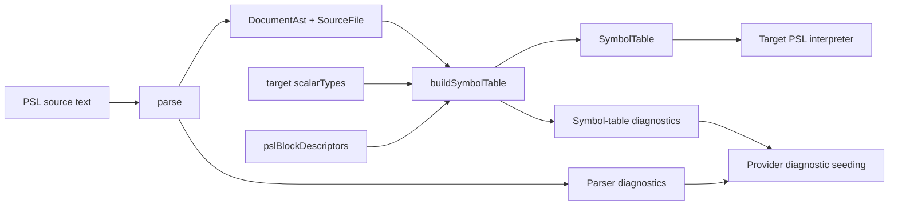

# @prisma-next/psl-parser

Reusable PSL parser for Prisma Next.

## Overview

`@prisma-next/psl-parser` parses Prisma Schema Language (PSL) source into a deterministic CST with source spans and stable machine-readable diagnostics, then offers shared symbol-table resolution for the target-agnostic semantics every PSL interpreter needs. Normalization to contract IR and emit integration stay in downstream target packages.

In the provider-based authoring model, PSL providers call `parse` to obtain the CST and then `buildSymbolTable` to obtain a scope-aware view, before returning `Result<Contract, ContractSourceDiagnostics>` to the framework emit pipeline.

## Responsibilities

- Parse PSL source text (`schema` + `sourceId`) with deterministic ordering.
- Return AST nodes with source spans for models, fields, enums, and `types { ... }`.
- Preserve raw PSL relation action tokens (for example `Cascade`) without semantic normalization.
- Return stable diagnostics (`code`, `message`, `span`, `sourceId`) for invalid and unsupported constructs.
- Enforce strict error behavior for unsupported syntax (no warning or best-effort mode).
- Parse attributes generically (namespaced or not), including optional argument lists; target semantics live downstream.
- Emit attribute nodes with explicit target (`field` / `model` / `namedType`), attribute name, and parsed argument list with spans.
- Build a scope-aware symbol table from the CST, including duplicate-declaration diagnostics, target-supplied scalar/type-alias classification, and descriptor-driven generic-block reconstruction.

## Attributes (generic parsing boundary)

`@prisma-next/psl-parser` parses attributes **generically**:

- Attributes may be **non-namespaced** (for example `@id`) or **namespaced** (for example `@vendor.option`).
- Attributes may include an **optional argument list**.
- Arguments are parsed into positional/named entries with preserved raw values and source spans.
- The parser owns **syntax + structure + spans**, not semantics.
- Example: `@default(uuid(7))` is preserved as a positional argument value `uuid(7)`; semantic lowering is handled downstream.

Interpretation/validation (for example `@prisma-next/sql-contract-psl`) is responsible for:

- mapping attributes to existing contract authoring shapes,
- enforcing strictness (unknown/unsupported attributes are errors),
- enforcing pack composition (using `@<ns>.*` without composing the pack fails), and
- ensuring parity with the TS authoring surface.

## Public API

- `parse(schema)` in `src/parse.ts` (also at `@prisma-next/psl-parser/syntax`) — the CST parser: returns the `DocumentAst`, its backing `SourceFile`, and syntactic diagnostics. The recursive-descent / lossless-CST path supersedes the legacy `parsePslDocument`.
- `buildSymbolTable({ document, sourceFile, scalarTypes, pslBlockDescriptors })` in `src/symbol-table.ts` — a pure, fault-tolerant pass over a parsed CST `DocumentAst` that returns a scope-aware `SymbolTable` (top-level namespaces / scalars / type-aliases / blocks / models / composite-types as keyed records discriminated by `kind`, namespace members and block fields nested under their owner, every symbol carrying its CST AST `node` plus its declaration `span`) plus its own duplicate-name diagnostics (`PSL_DUPLICATE_DECLARATION`, first-wins, colliding across kinds within one scope). `scalarTypes` is supplied by the target to classify `types { ... }` bindings, while `pslBlockDescriptors` is supplied from authoring contributions so generic/extension blocks can be reconstructed once into `BlockSymbol.block`. The pass also **resolves** the field/named-type read set once: each `FieldSymbol` carries the split type (`typeName`/`typeNamespaceId`/`typeContractSpaceId`), `optional`/`list`, `typeConstructor?`, rendered `attributes`, and `malformedType?` (set, with a `PSL_INVALID_QUALIFIED_TYPE` diagnostic, when the type is over-qualified); `ScalarSymbol`/`TypeAliasSymbol` carry the resolved binding (`baseType`/`typeConstructor`/`isConstructor`). Interpreters consume this resolved shape directly — there is no per-package field/attribute view layer.
- `readResolvedAttribute(s)` / `readResolvedConstructorCall` + the span maps
  (`nodePslSpan`, `rangeToPslSpan`, `keywordPslSpan`) in `src/resolve.ts` — the
  shared CST read helpers `buildSymbolTable` uses and that consumers (e.g.
  enum-block reconstruction) reuse, with `PslSpan` spans.
- `reconstructExtensionBlock` / `findBlockDescriptor` /
  `validateExtensionBlockFromSymbol` in `src/extension-block.ts` — reconstruct a
  descriptor-driven `PslExtensionBlock` from a CST `GenericBlockDeclarationAst`
  (a `BlockSymbol`) and run the framework's standalone `validateExtensionBlock`
  over it, building the ref-resolution context from the symbol table.
- `parseQuotedStringLiteral` / `getPositionalArgument` in `src/attribute-helpers.ts`.
- AST/diagnostic/span types live in `@prisma-next/framework-components/psl-ast`
  and are re-exported from this package's root entry for convenience.
- Subpath exports:
  - `@prisma-next/psl-parser/syntax`
  - `@prisma-next/psl-parser/tokenizer`

## Dependencies

- **Depends on**
  - No cross-domain runtime dependencies.
- **Used by**
  - PSL normalization/emission tooling (next milestone)
  - Potential language tooling and external parsers that need spans + diagnostics

## Architecture

## Package Boundaries

- This package does not perform file I/O.
- This package does not normalize to contract IR.
- This package does not emit `contract.json` or `contract.d.ts`.

## Related Docs

- `docs/Architecture Overview.md`
- `docs/architecture docs/subsystems/2. Contract Emitter & Types.md`
- `docs/architecture docs/adrs/ADR 163 - Provider-invoked source interpretation packages.md`
