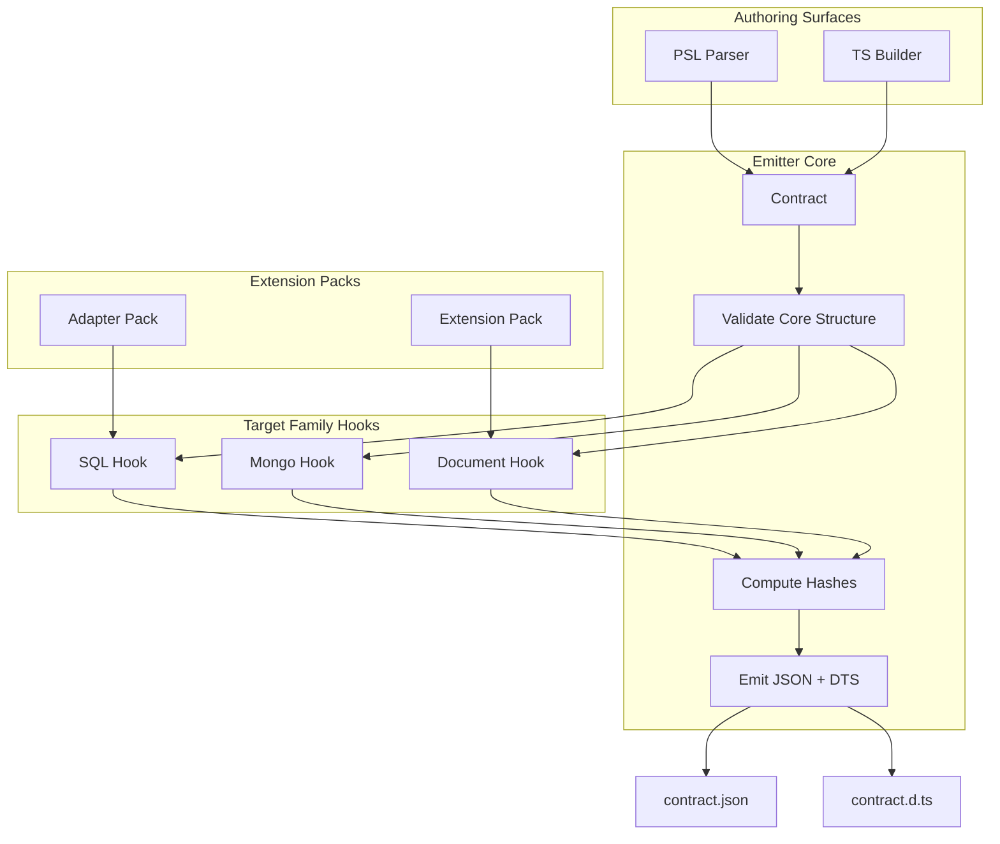

# @prisma-next/emitter

> **Internal package.** This package is an implementation detail of [`prisma-next`](https://www.npmjs.com/package/prisma-next)
> and is published only to support its runtime. Its API is unstable and may change
> without notice. Do not depend on this package directly; install `prisma-next` instead.

Contract emission engine that transforms authored data models into canonical JSON contracts and TypeScript type definitions.

## Overview

The emitter is the core of Prisma Next's contract-first architecture. It takes authored data models (from PSL or TypeScript builders) and produces two deterministic artifacts:

1. **`contract.json`** — Canonical JSON representation of the data contract with embedded `storageHash` and optional `executionHash`/`profileHash`. Callers may add `_generated` metadata field to indicate it's a generated artifact (excluded from canonicalization/hashing).
2. **`contract.d.ts`** — TypeScript type definitions used by query builders and tooling (types-only, no runtime code). Includes warning header comments generated by target family hooks to indicate it's a generated file.

The emitter is target-family-agnostic. The framework-owned `generateContractDts()` assembles the `.d.ts` template using shared domain utilities and delegates family-specific concerns to an `EmissionSpi` interface. This keeps the core thin while allowing SQL, Document, and other target families to extend emission behavior.

## Purpose

Provide a deterministic, verifiable representation of the application's data contract that downstream subsystems consume for planning, verification, and execution.

## Responsibilities

- **Parse**: Accept `Contract` values from authoring surfaces
- **Validate**: Core structure validation (family-specific validation is the caller's responsibility)
- **Canonicalize**: Compute `storageHash` (schema meaning), `executionHash` (execution defaults), and `profileHash` (capabilities/pins) from canonical JSON
- **Emit**: Generate `contract.json` and `contract.d.ts` with family-specific type generation
- **Descriptor-Agnostic**: The emitter is completely agnostic to how descriptors are produced. It receives pre-assembled `OperationRegistry`, `codecTypeImports`, and `extensionIds` from the CLI or family helpers—no pack manifest parsing happens inside the emitter.

**Note**: The emitter does NOT normalize contracts. Normalization must happen in the contract builder when the contract is created. The emitter assumes contracts are already normalized (all required fields present, including `schemaVersion`, `models`, `relations`, `storage`, `extensions`, `capabilities`, `meta`, and `sources`). All fields can be empty objects/arrays, but they must be present.

**Non-goals:**
- Migration planning or execution
- Query compilation or execution
- Runtime capability discovery
- Policy enforcement

## Architecture



## Components

### Core Emitter (`emit.ts`)
- Orchestrates hashing and type generation
- Returns contract JSON and TypeScript definitions as strings (no file I/O)
- Pure transformation function
- Accepts `targetFamily: EmissionSpi` as a required parameter (no global registry)

### Framework Template (`generate-contract-dts.ts`)
- Assembles the full `.d.ts` template using shared domain-level utilities from `domain-type-generation.ts`
- Delegates family-specific concerns to `EmissionSpi` callbacks:
  - `generateStorageType`: Generate the family-specific storage type literal
  - `generateModelStorageType`: Generate storage type for a single model
  - `generateModelsType` (optional): Override default domain model type generation
  - `getFamilyImports`, `getFamilyTypeAliases`, `getTypeMapsExpression`, `getContractWrapper`: Family-specific template fragments

### EmissionSpi (defined in `@prisma-next/framework-components/emission`)
- Focused interface for family-specific parts of contract type emission
- Authoring surfaces determine which SPI to use based on the contract's `targetFamily` field and pass it to `emit()`
- **Manifest-Agnostic**: The emitter receives pre-assembled context (type imports), not extension packs

**Known limitation**: The SQL emitter provides its own `generateModelsType` that derives field codecs from storage table columns (since SQL `model.fields.codecId` is not populated at authoring time). This means the shared `generateModelsType` utility is only used by Mongo. A future change to populate `model.fields.codecId` at authoring time would eliminate this override.

### Hashing (`hashing.ts`)
- `computeStorageHash`: SHA-256 of schema structure (models, storage, relations)
- `computeExecutionHash`: SHA-256 of execution defaults
- `computeProfileHash`: SHA-256 of capabilities and adapter pins

### Canonicalization (`canonicalization.ts`)
- `canonicalizeContract`: Normalizes contract into stable JSON string for hashing
- Excludes `_generated` metadata field from canonicalization to ensure determinism
- Sorts object keys, omits default values, and orders top-level fields consistently

**Note**: Extension pack descriptor wiring happens in the CLI/family layer. The emitter only sees the resulting type import arrays.

## Dependencies

- **`arktype`**: Runtime type validation for manifests

## Package Location

This package is part of the **framework domain**, **tooling layer**, **migration plane**:
- **Domain**: framework (target-agnostic)
- **Layer**: tooling
- **Plane**: migration
- **Path**: `packages/1-framework/3-tooling/emitter`

## Related Subsystems

- **[Contract Emitter & Types](../../../../docs/architecture%20docs/subsystems/2.%20Contract%20Emitter%20&%20Types.md)**: Detailed subsystem specification
- **[Data Contract](../../../../docs/architecture%20docs/subsystems/1.%20Data%20Contract.md)**: Contract structure and hashing

## Related ADRs

- [ADR 004 - Storage Hash vs Profile Hash](../../../../docs/architecture%20docs/adrs/ADR%20004%20-%20Storage%20Hash%20vs%20Profile%20Hash.md)
- [ADR 006 - Dual Authoring Modes](../../../../docs/architecture%20docs/adrs/ADR%20006%20-%20Dual%20Authoring%20Modes.md)
- [ADR 007 - Types Only Emission](../../../../docs/architecture%20docs/adrs/ADR%20007%20-%20Types%20Only%20Emission.md)
- [ADR 010 - Canonicalization Rules](../../../../docs/architecture%20docs/adrs/ADR%20010%20-%20Canonicalization%20Rules.md)
- [ADR 097 - Tooling runs on canonical JSON only](../../../../docs/architecture%20docs/adrs/ADR%20097%20-%20Tooling%20runs%20on%20canonical%20JSON%20only.md)

## Usage

```typescript
import { emit } from '@prisma-next/emitter';
import type { Contract } from '@prisma-next/contract/types';
import { createOperationRegistry } from '@prisma-next/operations';

// Determine target family SPI based on target family
import { sqlEmission } from '@prisma-next/sql-contract-emitter';
// or: import { mongoEmission } from '@prisma-next/mongo-emitter';

// Emit contract
const contract: Contract = {
  schemaVersion: '1',
  targetFamily: 'sql',
  target: 'postgres',
  // ... contract structure
};

// Pass pre-assembled context to emit() (pack loading happens in CLI layer)
const result = await emit(contract, {
  outputDir: './dist',
  operationRegistry: createOperationRegistry(), // Pre-assembled from packs
  codecTypeImports: [], // Extracted from packs (codec types)
  extensionIds: ['postgres', 'pg'], // Extracted from packs
}, sqlEmission);

// result.contractJson: string (JSON) - canonical JSON without _generated metadata
// result.contractDts: string (TypeScript definitions) - includes warning header
// result.storageHash: string
// result.executionHash?: string
// result.profileHash?: string
```

**Note**: The emitter returns canonical JSON without `_generated` metadata. Callers (e.g., CLI) may add `_generated` metadata to the JSON before writing to disk. The `_generated` field is excluded from canonicalization/hashing to ensure determinism.

## Test Utilities

When writing tests that create `Contract` objects, use the factory helpers from `@prisma-next/test-utils` or this package’s `test/utils` (`createTestContract`):

```typescript
import { createTestContract } from './test/utils';

const contract = createTestContract({
  storage: {
    tables: {
      user: {
        columns: {
          id: { codecId: 'pg/int4@1', nativeType: 'int4', nullable: false },
        },
      },
    },
  },
});
```

This ensures all required fields are present with sensible defaults. See `.cursor/rules/use-contract-ir-factories.mdc` for guidelines.

## Exports

- `.`: Main emitter API (`emit`, types, shared domain-level generation utilities)
- `./domain-type-generation`: Shared domain-level `.d.ts` generation utilities (used by family-specific emitter hooks)

