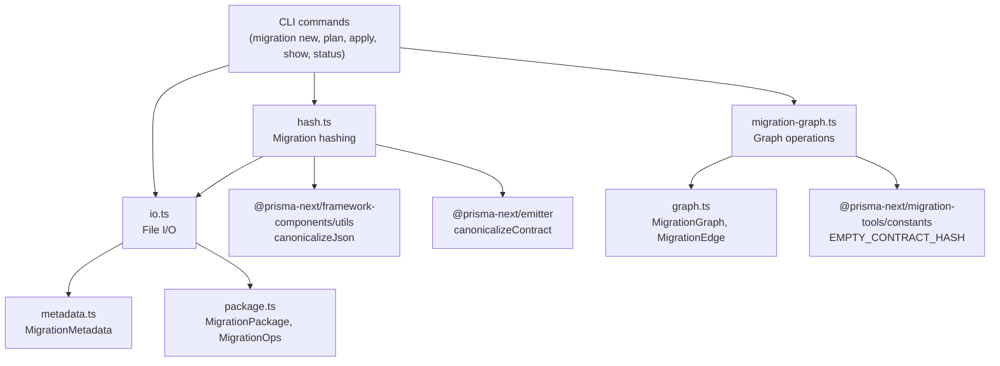

# @prisma-next/migration-tools

> **Internal package.** This package is an implementation detail of [`prisma-next`](https://www.npmjs.com/package/prisma-next)
> and is published only to support its runtime. Its API is unstable and may change
> without notice. Do not depend on this package directly; install `prisma-next` instead.

On-disk migration persistence, hash verification, and history reconstruction for Prisma Next.

## Responsibilities

- **Types**: Define the migration package shape (`MigrationMetadata`, `MigrationOps`, `MigrationPackage`, `MigrationGraph`)
- **I/O**: Read and write migration packages to/from disk (`migration.json` + `ops.json`)
- **Hashing**: Compute and verify content-addressed migration hashes for tamper detection
- **History reconstruction**: Reconstruct and navigate migration history (path finding, latest migration detection, cycle/orphan detection)

## Hash framing

`computeMigrationHash` in `hash.ts` uses explicit framing:

1. Strip the non-identity field (`migrationHash`) from
   the metadata envelope, then canonicalize the stripped envelope and the
   ops array.
2. SHA-256 each canonical part independently.
3. SHA-256 the canonical JSON tuple `[hash(metadata), hash(ops)]`.

This avoids delimiter-ambiguity and pins `migrationHash` to a 2-tuple over
the on-disk storage shape. Per [ADR 199 — Storage-only migration identity],
contracts are anchored by the storage-hash bookends (`from`, `to`) inside
the metadata envelope — the full contract IRs themselves are not part of
the manifest.

[ADR 199 — Storage-only migration identity]: ../../../docs/architecture%20docs/adrs/ADR%20199%20-%20Storage-only%20migration%20identity.md

## Ops validation boundary

`readMigrationPackage` performs intentionally shallow `ops.json` validation in `io.ts`:

- validates envelope fields (`id`, `label`, `operationClass`)
- does not fully validate operation-specific payload shape

Full semantic validation happens in target/family migration planners and runners at execution/planning time.

## What `ops.json` does NOT contain

`ops.json` carries the **post-lowering execution form** of every operation. The runner is a dispatcher, not a compiler — it does not invoke the lowerer, the codec system, the contract validator, or any other build-time pipeline at apply time. See [ADR 192 — ops.json is the migration contract](../../../docs/architecture%20docs/adrs/ADR%20192%20-%20ops.json%20is%20the%20migration%20contract.md) §"No compilation at apply time".

Concretely, an `ops.json` file does not contain:

- **TypeScript** or any other source code. `migration.ts` is authoring sugar; apply never imports it.
- **Codec metadata** (`codec`, `codecId`, `typeParams`). Codecs are resolved during lowering; their wire-format outputs land in `params[]` (SQL) or as literals in the structured command (Mongo). See [ADR 212 — AST-bound codec resolution](../../../docs/architecture%20docs/adrs/ADR%20212%20-%20AST-bound%20codec%20resolution.md).
- **Pre-lowering ASTs.** Every step is in the form the driver consumes — `(sql_template, params[])` for SQL, structured `kind`-discriminated commands for Mongo.
- **Contract references** that require resolution at apply time. The runner does not need the contract to execute steps (it reads it for marker/ledger bookkeeping, not for compilation).

Tampering and corruption are detected by `migrationId` (content-addressed hash of `migration.json` + `ops.json`; see [ADR 199](../../../docs/architecture%20docs/adrs/ADR%20199%20-%20Storage-only%20migration%20identity.md)). The "no apply-time compilation" invariant is what makes that hash meaningful: it pins what executes, not just what the author intended.

## Architecture



## Dependencies

| Package | Why |
|---|---|
| `@prisma-next/contract` | `Contract` type for embedded contracts in metadata |
| `@prisma-next/framework-components` | `MigrationPlanOperation` types (via `./control`) |
| `@prisma-next/emitter` | `canonicalizeContract` |
| `arktype` | Runtime shape validation for `migration.json` and `ops.json` |
| `@prisma-next/utils` | Workspace utility dependency (currently no direct runtime imports in this package) |
| `pathe` | Cross-platform path manipulation |

### Dependents

- `@prisma-next/cli` (M3) — CLI commands consume these functions

## Export Subpaths

| Subpath | Contents |
|---|---|
| `./metadata` | `MigrationMetadata` |
| `./package` | `MigrationPackage`, `MigrationOps` |
| `./graph` | `MigrationGraph`, `MigrationEdge` |
| `./io` | `writeMigrationPackage`, `readMigrationPackage`, `readMigrationsDir`, `formatMigrationDirName` |
| `./hash` | `computeMigrationHash`, `verifyMigrationHash` |
| `./migration-graph` | `reconstructGraph`, `findLeaf`, `findPath`, `detectCycles`, `detectOrphans` |
| `./errors` | `MigrationToolsError` |
| `./constants` | `EMPTY_CONTRACT_HASH` |

## On-Disk Format

Each migration is a directory containing two files:

```
migrations/
  20260225T1430_add_users/
    migration.json    # MigrationMetadata
    ops.json          # MigrationPlanOperation[]
```

See [ADR 028](../../../docs/architecture%20docs/adrs/ADR%20028%20-%20Migration%20Structure%20%26%20Operations.md) and [ADR 001](../../../docs/architecture%20docs/adrs/ADR%20001%20-%20Migrations%20as%20Edges.md) for design rationale.

## Commands

```bash
pnpm build       # Build with tsdown
pnpm test        # Run tests
pnpm typecheck   # Type-check
```
