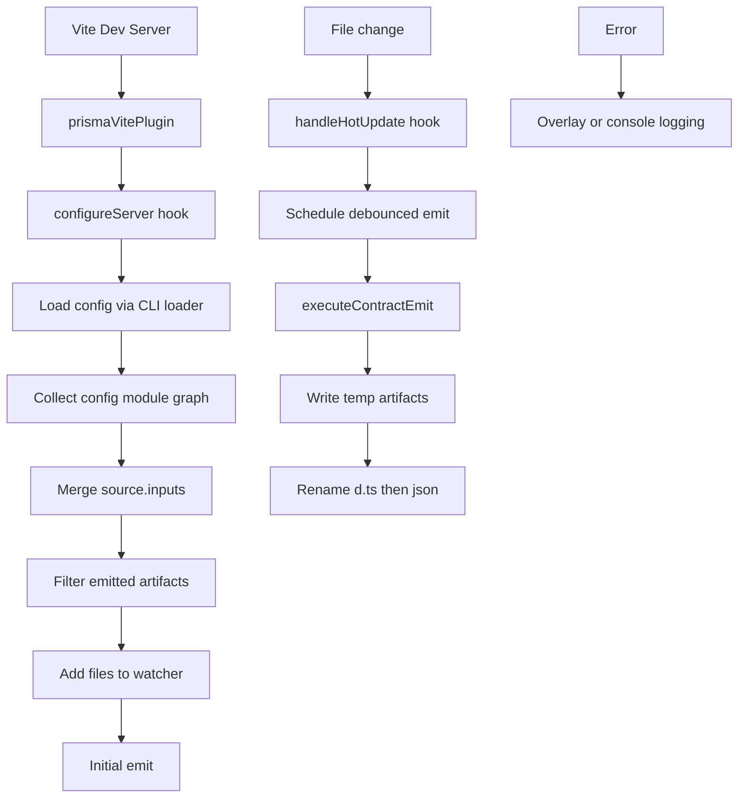

# @prisma-next/vite-plugin-contract-emit

Vite plugin for automatic Prisma Next contract artifact emission during development.

## Overview

This plugin integrates with Vite's dev server to automatically emit contract artifacts (`contract.json` and `contract.d.ts`) when you start the server and whenever your contract authoring files change.

## Support Matrix

- Supported Vite majors: 7 and 8
- Peer dependency range: `^7.0.0 || ^8.0.0`
- Validation: the repo runs `test/integration/test/vite-plugin.hmr.e2e.test.ts` against both majors
- Compatibility note: the current implementation uses the same `configureServer` and `handleHotUpdate` flow on Vite 7 and Vite 8; there is no Vite-8-specific code path today, so the support matrix exists to catch future hook or overlay regressions early

## Features

- **Emit on startup**: Emits contract artifacts when the Vite dev server starts
- **Config graph + resolved inputs**: Re-emits from the config module graph plus loader-finalized `contract.source.inputs`
- **Debounce**: Configurable debounce prevents rapid re-emission during rapid edits
- **Serialized re-emits**: Overlapping change bursts are coalesced into one follow-up emit instead of cancelling the emit already in flight
- **Ordered pair publication**: Emits stage temp artifacts, rename `contract.d.ts` before `contract.json`, and attempts to restore the last good pair if publication fails
- **Config-only fallback warning**: Falls back to watching the config path and warns when loader-resolved inputs cannot be determined
- **Error overlay**: Emission failures are surfaced via Vite's error overlay
- **Console logging**: Compact success/error messages with optional debug output

## Installation

Install the plugin alongside Vite 7 or Vite 8.

```bash
pnpm add -D @prisma-next/vite-plugin-contract-emit vite
```

## Usage

```ts
// vite.config.ts
import { defineConfig } from 'vite';
import { prismaVitePlugin } from '@prisma-next/vite-plugin-contract-emit';

export default defineConfig({
  plugins: [prismaVitePlugin('prisma-next.config.ts')],
});
```

## API

### `prismaVitePlugin(configPath, options?)`

Creates a Vite plugin configured to emit contract artifacts.

#### Parameters

- `configPath: string` — Path to your `prisma-next.config.ts` file (relative to Vite root)
- `options?: PrismaVitePluginOptions` — Optional configuration

#### Options

```ts
interface PrismaVitePluginOptions {
  debounceMs?: number;  // Debounce delay in ms (default: 150)
  logLevel?: 'silent' | 'info' | 'debug';  // Log verbosity (default: 'info')
}
```

| Option | Default | Description |
|--------|---------|-------------|
| `debounceMs` | `150` | Delay before re-emitting after file changes |
| `logLevel` | `'info'` | `'silent'`: no output, `'info'`: success/errors, `'debug'`: verbose |

## How It Works

1. **On server start**: The plugin loads `prisma-next.config.ts` via the CLI config loader
2. **Resolve paths in the loader**: The loader returns absolute `contract.source.inputs` and `contract.output`
3. **Resolve watched files**: The plugin crawls the Vite module graph from the config entrypoint
4. **Merge declared inputs**: It adds any explicit `contract.source.inputs`, and treats JS/TS inputs as additional module-graph roots
5. **Filter emitted artifacts**: Output files are removed from the watch set to avoid self-trigger loops
6. **Fallback on load failure**: If resolved inputs cannot be loaded, it watches only the config path and warns that coverage is partial
7. **Publish staged artifacts**: Emits write temp files beside the output paths, rename `contract.d.ts` first, then rename `contract.json`, and attempts to roll back to the previous pair if publication fails
8. **Initial emit**: The contract is emitted immediately on server start
9. **Queued hot updates**: When any watched file changes, a debounced re-emit is requested; if another emit is already running, the plugin runs one follow-up emit after the current one settles

## Architecture



## Canonical publish path

> **For agents/contributors**: this plugin must publish through
> `executeContractEmit` from `@prisma-next/cli/control-api`. Do NOT call
> `publishContractArtifactPair` directly, do NOT re-implement the load → emit
> → publish dance, and do NOT add a parallel "fast path" for any reason. The
> atomic-rename invariant and the per-output FIFO queue live in one place;
> bypassing them races with the CLI command and other callers.
>
> Lifecycle: track every `outputJsonPath` you publish to and call
> `disposeEmitQueue(outputJsonPath)` from your server-close cleanup hook. The
> per-output queue is module-global; not disposing leaks one entry per unique
> output path for the lifetime of the process.
>
> `ContractEmitResult.validationWarning` is the dependency-validation message
> from the operation; render it through your plugin's logger when present.

## Dependencies

- **@prisma-next/cli**: Uses the control-api `executeContractEmit` and
  `disposeEmitQueue` exports — the canonical publish path
- **vite**: Peer dependency (`^7.0.0 || ^8.0.0`)

## Examples

- `examples/prisma-next-demo` — plain Vite + React SPA, covers TS-first and PSL-first contracts. Run `pnpm dev`, edit `prisma/contract.ts`, watch the artifacts regenerate.
- `examples/react-router-demo` — React Router v7 Framework Mode (SSR). The plugin runs alongside `@react-router/dev/vite`; a `loader` and an `action` exercise the Prisma Next runtime on the server, and a smoke test proves a PSL edit re-emits the contract without a manual command. See `examples/react-router-demo/test/react-router.smoke.e2e.test.ts` for the validation flow.

## Related

- [ADR 032 — Dev Auto-Emit Integration](../../../../../docs/architecture%20docs/adrs/ADR%20032%20-%20Dev%20Auto%20Emit%20Integration.md)
- [ADR 008 — Dev Auto-Emit, CI Explicit Emit](../../../../../docs/architecture%20docs/adrs/ADR%20008%20-%20Dev%20Auto%20Emit%20CI%20Explicit%20Emit.md)
- [Subsystem: Contract Emitter & Types](../../../../../docs/architecture%20docs/subsystems/2.%20Contract%20Emitter%20&%20Types.md)
