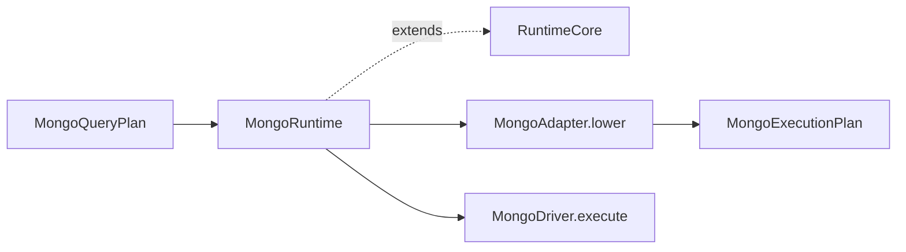

# @prisma-next/mongo-runtime

MongoDB runtime executor for Prisma Next.

## Package Classification

- **Domain**: mongo
- **Layer**: runtime
- **Plane**: runtime

## Overview

The Mongo runtime package implements the Mongo family runtime by extending the abstract `RuntimeCore` base class from `@prisma-next/framework-components/runtime` with Mongo-specific lowering and driver dispatch. It provides the public runtime API for MongoDB, layering Mongo concerns (adapter lowering and wire-command dispatch) on top of the shared middleware lifecycle.

## Usage

The runtime takes a **`MongoExecutionContext`** built from a **`MongoExecutionStack`** (target + adapter + optional driver + extension packs). The context aggregates codec contributions from each stack component into a single registry — users do not construct or thread a `MongoCodecRegistry` themselves. This mirrors the SQL pattern (see `packages/2-sql/5-runtime/src/sql-context.ts`).

Typed reads that attach a **`resultShape`** on the query plan are decoded after the driver yields each row: scalars and scalar arrays run through their `codecId` entries; `kind: 'unknown'` subtrees are passed through unchanged; plans without `resultShape` (for example raw commands) leave rows as the driver returned them.

Example:

```ts
import mongoRuntimeAdapter from '@prisma-next/adapter-mongo/runtime';
import { createMongoDriver } from '@prisma-next/driver-mongo';
import {
  createMongoExecutionContext,
  createMongoExecutionStack,
  createMongoRuntime,
} from '@prisma-next/mongo-runtime';
import mongoRuntimeTarget from '@prisma-next/target-mongo/runtime';

const stack = createMongoExecutionStack({
  target: mongoRuntimeTarget,
  adapter: mongoRuntimeAdapter,
});
const context = createMongoExecutionContext({ contract, stack });

const runtime = createMongoRuntime({
  context,
  driver: await createMongoDriver(url, dbName),
});
```

Custom or third-party codecs (encryption, vendor scalars) are contributed via an extension-pack descriptor whose `codecs` slot returns the codec descriptors; `createMongoExecutionContext` folds them into the same registry. Duplicate codec ids across contributors throw `RUNTIME.DUPLICATE_CODEC` at composition time.

## Responsibilities

- **Stack/context composition**: `createMongoExecutionStack` and `createMongoExecutionContext` mirror SQL's `createSqlExecutionStack` / `createExecutionContext`. The context aggregates codec contributions from `[stack.target, stack.adapter, ...stack.extensionPacks]` into a single `MongoCodecRegistry`.
- **Runtime executor**: `createMongoRuntime({ context, driver, ... })` composes context and driver into a `MongoRuntime` with a single `execute(plan)` entry point accepting `MongoQueryPlan<Row>` from `@prisma-next/mongo-query-ast`. The adapter is reached via `context.stack.adapter` (instantiated lazily through the stack's `create(stack)` factory). Execution lowers the plan through the adapter, runs the wire command on the driver, then **optionally decodes** each row when `plan.resultShape` is present.
- **Unified flow**: There is no separate `execute` vs `executeCommand`; all operations use `execute(plan)`.
- **Lowering**: Happens in the adapter (`lower(plan)`), wrapped by the runtime's `lower` override into a `MongoExecutionPlan`.
- **Middleware lifecycle inheritance**: `MongoRuntime` extends `RuntimeCore<MongoQueryPlan, MongoExecutionPlan, MongoMiddleware>` and inherits the `beforeExecute` / `onRow` / `afterExecute` lifecycle from the framework via `runWithMiddleware`. Mongo does **not** override `runBeforeCompile` (Mongo middleware has no `beforeCompile` hook today).
- **Lifecycle management**: Connection lifecycle via `close()`.

## Dependencies

- **Depends on**:
  - `@prisma-next/mongo-codec` (`MongoCodecRegistry` for decode)
  - `@prisma-next/mongo-lowering` (`MongoAdapter`, `MongoDriver` interfaces)
  - `@prisma-next/mongo-query-ast` (`MongoQueryPlan`, `AnyMongoCommand` — the typed plan shape)
  - `@prisma-next/framework-components` (`RuntimeCore` base class, `runWithMiddleware` helper, `RuntimeMiddleware` SPI, `AsyncIterableResult` return type, `RuntimeAdapterDescriptor` / `ExecutionStack` for the stack composition model)
- **Depended on by**:
  - Integration tests (`test/integration/test/mongo/` and `test/integration/test/cross-package/cross-family-middleware.test.ts`)

## Architecture

`MongoRuntimeImpl` extends `RuntimeCore<MongoQueryPlan, MongoExecutionPlan, MongoMiddleware>` and overrides:

- `lower(plan)` — calls the adapter's `lower(plan)` and wraps the resulting wire command into a `MongoExecutionPlan`.
- `runDriver(exec)` — dispatches the wire command to the Mongo driver via `driver.execute(exec.command)`.
- `close()` — closes the underlying driver.

`MongoRuntimeImpl` extends `RuntimeCore` but **overrides `execute`** so that after `runWithMiddleware` yields a raw driver row, the runtime can **`decodeMongoRow`** when the lowered plan carries `resultShape`, then yield the decoded row. `lower(plan)` copies `resultShape` from the query plan onto `MongoExecutionPlan`. Middleware `onRow` still sees the raw driver row (decode happens after the middleware loop for that row, before the consumer receives the value).

The execution template is: `lower` → `runWithMiddleware` (driver loop + middleware) → **per-row decode when `exec.resultShape` is set** → yield to consumer.



## Related Subsystems

- **[Runtime & Middleware Framework](../../../../docs/architecture%20docs/subsystems/4.%20Runtime%20&%20Middleware%20Framework.md)** — Runtime execution pipeline
- **[Adapters & Targets](../../../../docs/architecture%20docs/subsystems/5.%20Adapters%20&%20Targets.md)** — Adapter and driver responsibilities
