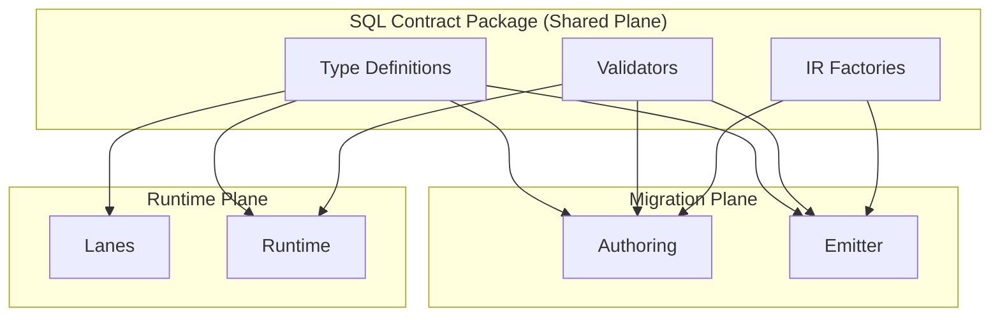

# @prisma-next/sql-contract

SQL contract types, validators, and IR factories for Prisma Next.

## Overview

This package provides TypeScript type definitions, Arktype validators, and factory functions for constructing SQL contract structures. It is located in the **shared plane**, making it available to both migration-plane (authoring, emitter) and runtime-plane (lanes, runtime) packages.

## Responsibilities

- **SQL Contract Types**: Defines SQL-specific contract types (`SqlContract`, `SqlStorage`, `StorageTable`, `SqlModelStorage`, `SqlModelFieldStorage`, `ForeignKeysConfig`) that extend framework-level contract types
- **Contract Validation**: Provides Arktype-based structural validators that the per-target `contractSerializer` SPI consumes for runtime-safe contract validation
- **IR Factories**: Provides pure factory functions for constructing contract IR structures in tests and authoring
- **Shared Plane Access**: Enables both migration-plane and runtime-plane packages to import SQL contract types without violating plane boundaries

## StorageColumn Structure

Each `StorageColumn` in SQL contracts includes both:
- **`nativeType`** (required): Native database type identifier (e.g., `'int4'`, `'text'`, `'vector'`) - used for database structure verification and migration planning
- **`codecId`** (required): Codec identifier (e.g., `'pg/int4@1'`, `'pg/text@1'`, `'pg/vector@1'`) - used for query builders and runtime codecs
- **`nullable`** (required): Whether the column is nullable
- **`default`** (optional): Uses the shared `ColumnDefault` type from `@prisma-next/contract` for db-agnostic defaults (literal or function). Client-generated defaults live in `execution.mutations.defaults`.

Both `nativeType` and `codecId` are required to ensure contracts are consumable by both the application (via codec IDs) and the database (via native types). See `docs/briefs/Sql-Contract-Native-and-Codec-Types.md` for details.

## Package Contents

- **TypeScript Types**: Type definitions for `SqlContract`, `SqlStorage`, `StorageTable`, `SqlModelStorage`, `SqlModelFieldStorage`, `ForeignKeysConfig`, and related types
- **Validators**: Arktype-based validators for structural validation of contracts, storage, and models
- **Factories**: Pure factory functions for constructing contract IR structures in tests and authoring

## Usage

### TypeScript Types

Import SQL contract types:

```typescript
import type {
  SqlContract,
  SqlStorage,
  StorageTable,
  SqlModelStorage,
  ForeignKeysConfig,
} from '@prisma-next/sql-contract/types';
```

### Foreign Keys Configuration

`SqlContract` includes an optional `foreignKeys` field of type `ForeignKeysConfig` that controls whether the planner emits foreign key constraints and their backing indexes:

```typescript
type ForeignKeysConfig = {
  readonly constraints: boolean;  // Emit FOREIGN KEY constraints
  readonly indexes: boolean;      // Emit FK-backing indexes
};
```

When omitted, defaults to `{ constraints: true, indexes: true }`. See [ADR 161](../../../docs/architecture%20docs/adrs/ADR%20161%20-%20Explicit%20foreign%20key%20constraint%20and%20index%20configuration.md) for design rationale.

### Referential Actions

`ForeignKey` supports optional `onDelete` and `onUpdate` fields of type `ReferentialAction`:

```typescript
type ReferentialAction = 'noAction' | 'restrict' | 'cascade' | 'setNull' | 'setDefault';

type ForeignKey = {
  readonly columns: readonly string[];
  readonly references: ForeignKeyReferences;
  readonly name?: string;
  readonly onDelete?: ReferentialAction;
  readonly onUpdate?: ReferentialAction;
};
```

When omitted, the database applies its default behavior (Postgres: `NO ACTION`). See [ADR 166](../../../docs/architecture%20docs/adrs/ADR%20166%20-%20Referential%20actions%20for%20foreign%20keys.md) for design rationale.

The `fk()` factory accepts referential actions via an options object:

```typescript
import { fk } from '@prisma-next/sql-contract/factories';

// Simple FK (no referential actions)
const simple = fk(['userId'], 'user', ['id']);

// FK with onDelete cascade
const cascading = fk(['userId'], 'user', ['id'], { onDelete: 'cascade' });

// FK with name and both actions
const named = fk(['userId'], 'user', ['id'], {
  name: 'post_userId_fkey',
  onDelete: 'cascade',
  onUpdate: 'noAction',
});
```

**Semantic validation:** `validateStorageSemantics()` rejects `setNull` when the FK column is `NOT NULL` (the database would fail at runtime).

### Validators

Validate contract structures using Arktype validators:

```typescript
import { validateSqlContractFully, validateStorage, validateModel } from '@prisma-next/sql-contract/validators';

// Validate a complete contract
const contract = validateSqlContractFully<Contract>(contractJson);

// Validate storage structure
const storage = validateStorage(storageJson);

// Validate model structure
const model = validateModel(modelJson);
```

Validate JSON-emitted contracts with mapping + logic checks via the
target descriptor's `contractSerializer` SPI:

```typescript
import postgresTarget from '@prisma-next/target-postgres/control';

const contract = postgresTarget.contractSerializer.deserializeContract(contractJson);
```

`deserializeContract` parses the on-disk envelope, hydrates the SQL
Contract IR class hierarchy (`SqlStorage` → `StorageTable` → `StorageColumn`
/ `PrimaryKey` / …), and validates model-to-storage cross-references in
one pass. End-user app code typically calls the canonical façade instead
(e.g. `postgres<Contract>({ contractJson, … })`), which threads the same
SPI internally.

### Factories

Use factory functions to construct contract IR structures in tests:

```typescript
import { col, table, storage, model, contract, pk, unique, index, fk } from '@prisma-next/sql-contract/factories';

// Create a column (nativeType, codecId, nullable)
const idColumn = col('int4', 'pg/int4@1', false);

// Create a table
const userTable = table(
  {
    id: col('int4', 'pg/int4@1'),
    email: col('text', 'pg/text@1'),
  },
  {
    pk: pk('id'),
    uniques: [unique('email')],
    indexes: [index('email')],
  }
);

// Create storage
const s = storage({ user: userTable });

// Create a model
const userModel = model('user', {
  id: { column: 'id' },
  email: { column: 'email' },
});

// Create a complete contract
const c = contract({
  target: 'postgres',
  storageHash: 'sha256:abc123',
  storage: s,
  models: { User: userModel },
});
```

## Exports

- `./types`: TypeScript type definitions
- `./validators`: Arktype validators for structural validation
- `./factories`: Factory functions for constructing contract IR
- `./pack-types`: Shared extension/pack typing helpers

## Architecture



## Dependencies

- **`@prisma-next/contract`**: Framework-level contract types (`ContractBase`)
- **`arktype`**: Runtime validation library

**Dependents:**
- **`@prisma-next/sql-contract-ts`**: Uses SQL contract types and validators for authoring
- **`@prisma-next/sql-contract-emitter`**: Uses SQL contract types for emission
- **`@prisma-next/sql-query`**: Uses SQL contract types for query building
- **`@prisma-next/sql-runtime`**: Uses SQL contract types for runtime execution
- **`@prisma-next/sql-lane`**: Uses SQL contract types for lane operations

## Related Packages

- `@prisma-next/contract`: Framework-level contract types (`ContractBase`)
- `@prisma-next/sql-contract-ts`: SQL contract authoring surface (uses this package)
- `@prisma-next/emitter`: Contract emission engine (uses validators)

## Related Subsystems

- **[Data Contract](../../../docs/architecture%20docs/subsystems/1.%20Data%20Contract.md)**: Detailed subsystem specification
- **[Contract Emitter & Types](../../../docs/architecture%20docs/subsystems/2.%20Contract%20Emitter%20&%20Types.md)**: Contract emission

