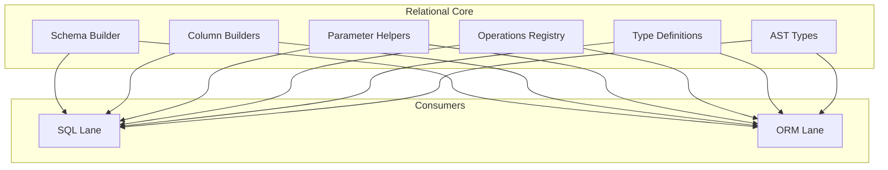

# @prisma-next/sql-relational-core

Schema and column builders, operation attachment, and AST types for Prisma Next.

## Package Classification

- **Domain**: sql
- **Layer**: lanes
- **Plane**: runtime

## Overview

The relational core package provides the foundational primitives for building relational SQL queries. It includes table/column builders, parameter helpers, operation attachment logic, and type definitions that are shared across SQL query lanes (DSL, ORM, Raw).

This package is part of the SQL lanes layer and provides the relational primitives that both the SQL DSL and ORM builder depend on.

## Purpose

Provide shared relational primitives (schema builders, column builders, parameter helpers, operations registry) that can be consumed by multiple SQL query lanes without code duplication.

## Responsibilities

- **Schema Builder**: Creates typed table and column builders from contracts
- **Column Builders**: Provides column accessors with operation methods attached based on column typeId
- **Parameter Helpers**: Creates parameter placeholders for query building
- **Operations Registry**: Attaches registered operations as methods on column builders
- **Execution Context Types**: Defines the context shape used by query lanes
- **Type Definitions**: Defines TypeScript types for column builders, operations, and projections
- **Codec Registry Types**: Defines codec interfaces and base SQL codec definitions

**Non-goals:**
- Query DSL construction (sql-lane)
- ORM lowering (orm-lane)
- Raw SQL handling (sql-lane)
- Execution or runtime behavior (runtime)

## Architecture



## Components

### Schema Builder (`schema.ts`)
- Creates a schema handle with typed table builders
- Builds column builders with operation methods attached
- Provides proxy access for convenience (e.g., `tables.user.id` in addition to `tables.user.columns.id`)

### Column Builders (`types.ts`)
- Defines `ColumnBuilder` type with operation methods based on column typeId
- Provides type inference for JavaScript types from codec types
- Supports operation chaining when operations return typeIds

### Parameter Helpers (`param.ts`)
- Creates parameter placeholders for query building
- Validates parameter names

### Operations Registry (`operations-registry.ts`)
- Attaches registered operations as methods on `ColumnBuilder` instances
- Dynamically exposes operations based on column `typeId` and contract capabilities
- Handles operation chaining when operations return typeIds

### Plan Helpers (`plan.ts`)
- Defines `SqlQueryPlan<Row>` interface for SQL query plans produced by lanes before lowering
- Per [ADR 212](../../../../docs/architecture%20docs/adrs/ADR%20212%20-%20AST-bound%20codec%20resolution.md), codec identity travels on `ParamRef.codec` (parameters) and `ProjectionItem.codec` (output) as a `CodecRef` on the AST itself, not on plan-level descriptor lists. See [DEVELOPING.md](DEVELOPING.md) for the `CodecRef` invariant.

### Codec authoring (class form)

SQL codec authors extend the framework `CodecImpl` base (and pair the codec with a `CodecDescriptorImpl` registration) per [ADR 208 — Higher-order codecs for parameterized types](../../../../docs/architecture%20docs/adrs/ADR%20208%20-%20Higher-order%20codecs%20for%20parameterized%20types.md). Each codec class declares `encode`, `decode`, `encodeJson`, and `decodeJson`. The JSON methods use the exact scalar shape produced by the corresponding database inside JSON values; include decoding calls `decodeJson`, while ordinary column decoding calls `decode`.

- Query-time methods (`encode` / `decode`) are typed as `Promise<…>`-returning at the public boundary; sync method bodies are accepted via TypeScript bivariance and the runtime always awaits.
- Build-time methods (`encodeJson` / `decodeJson` / `renderOutputType?`) stay synchronous so contract validation and client construction stay synchronous.
- Both `encode` and `decode` must be implemented — there is no identity-default fallback.

```ts
// Non-parameterized codec (P = void) — see packages/3-targets/3-targets/postgres/src/core/codecs.ts
// for the production form.
import {
  CodecDescriptorImpl,
  CodecImpl,
  voidParamsSchema,
  type CodecCallContext,
  type CodecInstanceContext,
} from '@prisma-next/framework-components/codec';

class PgTextCodec extends CodecImpl<'pg/text@1', readonly ['equality'], string, string> {
  override readonly id = 'pg/text@1';
  override readonly traits = ['equality'] as const;
  encode(v: string, _ctx: CodecCallContext): Promise<string> { return Promise.resolve(v); }
  decode(w: string, _ctx: CodecCallContext): Promise<string> { return Promise.resolve(w); }
  encodeJson(v: string) { return v; }
  decodeJson(j: unknown) { return j as string; }
}

class PgTextDescriptor extends CodecDescriptorImpl<void> {
  override readonly codecId = 'pg/text@1';
  override readonly traits = ['equality'] as const;
  override readonly targetTypes = ['text'] as const;
  override readonly paramsSchema = voidParamsSchema;
  override readonly factory = () => (_ctx: CodecInstanceContext) => new PgTextCodec();
}
```

#### Codec call context (`ctx`)

Codecs receive a second `ctx` options argument; you may ignore it. The runtime allocates one `SqlCodecCallContext` per `runtime.execute(plan, { signal })` call and threads the same reference to every codec dispatch site as a non-optional argument — when no `signal` is supplied the runtime still threads an empty `{}`, never `undefined`. The internal `Codec` interface declares the parameter as required (`encode(value, ctx: SqlCodecCallContext)` / `decode(wire, ctx: SqlCodecCallContext)`); single-arg method bodies continue to compile via TypeScript's bivariance for trailing parameters, so codec ergonomics are unchanged.

- **`ctx.signal`** — the same `AbortSignal` reference at every codec call in one execute. Forward it to network SDKs so aborted queries stop talking to the underlying service.
- **`ctx.column`** (decode-side only) — `{ table, name }` for cells the runtime can resolve to a single column ref; `undefined` for aggregate aliases, computed projections, and other unresolvable cells. Encode-side `ctx.column` is always `undefined` (encode-time column enrichment is the middleware's domain).

```ts
// Forward ctx.signal to a network call so aborted queries stop the SDK.
class PgKmsSecretCodec extends CodecImpl<'pg/kms-secret@1', readonly [], string, string> {
  override readonly id = 'pg/kms-secret@1';
  override readonly traits = [] as const;
  override async encode(v: string, ctx: SqlCodecCallContext): Promise<string> {
    return kms.encrypt({ plaintext: v }, { signal: ctx.signal });
  }
  override async decode(w: string, ctx: SqlCodecCallContext): Promise<string> {
    return kms.decrypt({ ciphertext: w }, { signal: ctx.signal });
  }
  encodeJson(v: string) { return v; }
  decodeJson(j: unknown) { return j as string; }
}
```

Codec bodies that ignore `ctx.signal` complete in the background (cooperative cancellation); aborts still surface to the caller as `RUNTIME.ABORTED` with `details.phase ∈ { 'encode', 'decode', 'stream' }`.

See [ADR 204 — Single-Path Async Codec Runtime](../../../../docs/architecture%20docs/adrs/ADR%20204%20-%20Single-Path%20Async%20Codec%20Runtime.md) and [ADR 207 — Codec call context: per-query `AbortSignal` and column metadata](../../../../docs/architecture%20docs/adrs/ADR%20207%20-%20Codec%20call%20context%20per-query%20AbortSignal%20and%20column%20metadata.md).

### AST Surface (`ast/*` via `exports/ast.ts`)
- Query roots: `SelectAst`, `InsertAst`, `UpdateAst`, `DeleteAst`
- Expressions: `ColumnRef`, `ParamRef`, `LiteralExpr`, `OperationExpr`, `ListExpression`
- Predicates: `BinaryExpr` (ops: `eq`, `neq`, `gt`, `lt`, `gte`, `lte`, `like`, `ilike`, `in`, `notIn`), `AndExpr`, `OrExpr`, `ExistsExpr`, `NullCheckExpr`
- Lane-agnostic filter interop: `WhereArg` and `ToWhereExpr` for passing filter payloads without lane-specific types
- Joins: `JoinAst`, `JoinOnExpr` (eqCol or WhereExpr)
- Inserts: `InsertAst.rows` is row-based and uses `InsertValue` cells (`ColumnRef`, `ParamRef`, or the insert-only `DefaultValueExpr` sentinel for SQL `DEFAULT`) for batched inserts
- `SelectAst.selectAllIntent` — preserves select-all intent when normalized to explicit columns
- `DeleteAst.where` and `UpdateAst.where` optional for mutation-without-WHERE lint support

### Type Definitions (`types.ts`)
- Defines TypeScript types for column builders, operations, projections
- Provides type inference utilities for extracting JavaScript types from codec types (e.g., `ExtractJsTypeFromColumnBuilder`)
- Defines projection row inference types
- Defines `AnyColumnBuilder` helper type for accepting column builders with any operation types

## Dependencies

- **`@prisma-next/contract`**: Core contract types
- **`@prisma-next/operations`**: Operation registry used by schema builders
- **`@prisma-next/sql-contract`**: SQL contract types (via `@prisma-next/sql-contract/types`)
- **`arktype`**: Parameter schema typing for codec definitions

**Note**: This package does not depend on specific adapters (e.g., `@prisma-next/adapter-postgres`). Test fixtures define `CodecTypes` inline to remain adapter-agnostic and avoid cyclic dependencies.

## Package Structure

This package follows the standard `exports/` directory pattern:

- `src/exports/schema.ts` - Re-exports schema builder
- `src/exports/param.ts` - Re-exports parameter helpers
- `src/exports/types.ts` - Re-exports type definitions
- `src/exports/operations-registry.ts` - Re-exports operations registry
- `src/exports/plan.ts` - Re-exports plan types and helpers
- `src/exports/ast.ts` - Re-exports SQL AST types
- `src/exports/errors.ts` - Re-exports error helpers (`planInvalid`, `planUnsupported`)
- `src/index.ts` - Main entry point that re-exports from `exports/`

This enables subpath imports like `@prisma-next/sql-relational-core/schema`, `@prisma-next/sql-relational-core/param`, `@prisma-next/sql-relational-core/plan`, etc.

## Related Subsystems

- **[Query Lanes](../../../../docs/architecture%20docs/subsystems/3.%20Query%20Lanes.md)**: Detailed subsystem specification
- **[Runtime & Middleware Framework](../../../../docs/architecture%20docs/subsystems/4.%20Runtime%20&%20Middleware%20Framework.md)**: Plan execution

## Related ADRs

- [ADR 140 - Package Layering & Target-Family Namespacing](../../../../docs/architecture%20docs/adrs/ADR%20140%20-%20Package%20Layering%20&%20Target-Family%20Namespacing.md)
- [ADR 005 - Thin Core, Fat Targets](../../../../docs/architecture%20docs/adrs/ADR%20005%20-%20Thin%20Core,%20Fat%20Targets.md)
