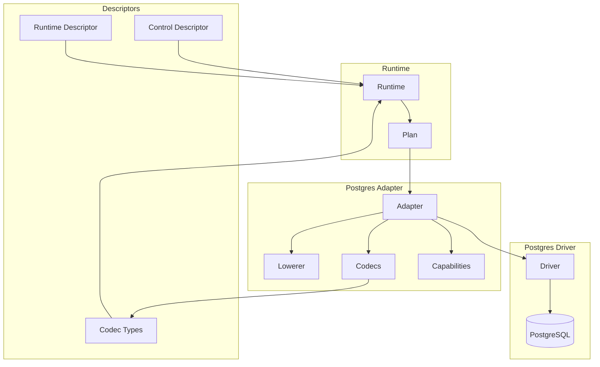

# @prisma-next/adapter-postgres

PostgreSQL adapter for Prisma Next.

## Package Classification

- **Domain**: targets
- **Layer**: adapters
- **Plane**: multi-plane (shared, migration, runtime)

## Overview

The PostgreSQL adapter implements the adapter SPI for PostgreSQL databases. It provides SQL lowering, capability discovery, codec definitions, and error mapping for PostgreSQL-specific behavior. It also exports both control-plane and runtime-plane adapter descriptors for config wiring.

## Purpose

Provide PostgreSQL-specific adapter implementation, codecs, and capabilities. Enable PostgreSQL dialect support in Prisma Next through the adapter SPI.

## Responsibilities

- **Adapter Implementation**: Implement `Adapter` SPI for PostgreSQL
  - Lower SQL ASTs to PostgreSQL dialect SQL
  - Render JSON aggregation (`json_agg`, `json_build_object`) and scalar subqueries
  - Advertise PostgreSQL capabilities (`lateral`, `jsonAgg`)
  - Normalize PostgreSQL EXPLAIN output
  - Map PostgreSQL errors to `RuntimeError` envelope
- **Codec Definitions**: Define PostgreSQL codecs for type conversion
  - Wire format to JavaScript type decoding
  - JavaScript type to wire format encoding
- **Storage Type Control Hooks**: Provide control-plane hooks for contract-defined storage types (e.g., enums)
- **Codec Types**: Export TypeScript types for PostgreSQL codecs
- **Descriptors**: Provide adapter descriptors declaring capabilities and codec type imports

**Non-goals:**
- Transport/pooling management (drivers)
- Query compilation (sql-query)
- Runtime execution (runtime)

## Architecture

This package spans multiple planes:

- **Shared plane** (`src/core/**`): Core adapter implementation, codecs, and types that can be imported by both migration and runtime planes
- **Migration plane** (`src/exports/control.ts`): Control-plane entry point that exports the adapter descriptor for config files
- **Runtime plane** (`src/exports/runtime.ts`): Runtime-plane entry point that exports the runtime adapter descriptor



## Components

### Core (`src/core/`)

**Adapter (`adapter.ts`)**
- Main adapter implementation
- Lowers SQL ASTs to PostgreSQL SQL
- Renders joins (INNER, LEFT, RIGHT, FULL, LATERAL) with ON conditions
- Renders JSON aggregation (`json_agg`, `json_build_object`) and scalar subqueries
- Renders DML operations (INSERT, UPDATE, DELETE) with RETURNING clauses
- Advertises PostgreSQL capabilities (`lateral`, `jsonAgg`, `returning`)
- Maps PostgreSQL errors to `RuntimeError`

**Codecs (`codecs.ts`)**
- PostgreSQL codec definitions
- Type conversion between wire format and JavaScript
- SQL base codecs: `sql/char`, `sql/varchar`, `sql/int`, `sql/float`
- PostgreSQL aliases for base codecs: `pg/char`, `pg/varchar`, `pg/int`, `pg/float`
- Supports PostgreSQL types: `int2`, `int4`, `int8`, `float4`, `float8`, `text`, `bool`, `enum`
- Supports PostgreSQL types: `int2`, `int4`, `int8`, `float4`, `float8`, `text`, `timestamp`, `timestamptz`, `bool`, `enum`, `json`, `jsonb`
- Parameterized types: `character(n)`, `character varying(n)`, `numeric(p,s)`, `bit(n)`, `bit varying(n)`, `timestamp(p)`, `timestamptz(p)`, `time(p)`, `timetz(p)`, `interval(p)`

**Types (`types.ts`)**
- PostgreSQL-specific types and utilities
- Re-exports SQL contract types

### Exports (`src/exports/`)

**Control Entry Point (`control.ts`)**
- Exports the control-plane adapter descriptor for CLI config
- Used by `prisma-next.config.ts` to declare the adapter

**Runtime Entry Point (`runtime.ts`)**
- Exports the runtime-plane adapter descriptor

**Adapter Export (`adapter.ts`)**
- Re-exports `createPostgresAdapter` from core

**Codec Types Export (`codec-types.ts`)**
- Exports TypeScript type definitions for PostgreSQL codecs
- Used in `contract.d.ts` generation

**Types Export (`types.ts`)**
- Re-exports PostgreSQL-specific types

**Column Types Export (`column-types.ts`)**
- Exports column descriptors for built-in types and enum helpers (`enumType`, `enumColumn(typeRef, nativeType)`)
- Parameterized helpers: `charColumn(length)`, `varcharColumn(length)`, `numericColumn(precision, scale?)`, `bitColumn(length)`, `varbitColumn(length)`, `timeColumn(precision?)`, `timetzColumn(precision?)`, `intervalColumn(precision?)`

- Exports raw JSON helpers:
  - `jsonColumn`, `jsonbColumn` — untyped raw JSON / JSONB column descriptors
  - For schema-typed JSON columns, use the per-library extension package (`@prisma-next/extension-arktype-json` for arktype). The schema-accepting `json(schema)` / `jsonb(schema)` overloads previously shipped here retired in Phase C of the codec-registry-unification project.

## Dependencies

- **`@prisma-next/sql-contract`**: SQL contract types
- **`@prisma-next/sql-relational-core`**: SQL AST types and codec registry
- **`@prisma-next/cli`**: CLI config types and extension pack manifest types

## Related Subsystems

- **[Adapters & Targets](../../../../docs/architecture%20docs/subsystems/5.%20Adapters%20&%20Targets.md)**: Detailed adapter specification
- **[Ecosystem Extensions & Packs](../../../../docs/architecture%20docs/subsystems/6.%20Ecosystem%20Extensions%20&%20Packs.md)**: Extension pack model

## Related ADRs

- [ADR 005 - Thin Core Fat Targets](../../../../docs/architecture%20docs/adrs/ADR%20005%20-%20Thin%20Core%20Fat%20Targets.md)
- [ADR 016 - Adapter SPI for Lowering](../../../../docs/architecture%20docs/adrs/ADR%20016%20-%20Adapter%20SPI%20for%20Lowering.md)
- [ADR 030 - Result decoding & codecs registry](../../../../docs/architecture%20docs/adrs/ADR%20030%20-%20Result%20decoding%20&%20codecs%20registry.md)
- [ADR 065 - Adapter capability schema & negotiation v1](../../../../docs/architecture%20docs/adrs/ADR%20065%20-%20Adapter%20capability%20schema%20&%20negotiation%20v1.md)
- [ADR 068 - Error mapping to RuntimeError](../../../../docs/architecture%20docs/adrs/ADR%20068%20-%20Error%20mapping%20to%20RuntimeError.md)
- [ADR 112 - Target Extension Packs](../../../../docs/architecture%20docs/adrs/ADR%20112%20-%20Target%20Extension%20Packs.md)
- [ADR 114 - Extension codecs & branded types](../../../../docs/architecture%20docs/adrs/ADR%20114%20-%20Extension%20codecs%20&%20branded%20types.md)
- [ADR 168 - Postgres JSON and JSONB typed columns](../../../../docs/architecture%20docs/adrs/ADR%20168%20-%20Postgres%20JSON%20and%20JSONB%20typed%20columns.md). Schema-typed JSON columns now ship from per-library extension packages (`@prisma-next/extension-arktype-json` for arktype); see [ADR 208 - Higher-order codecs for parameterized types](../../../../docs/architecture%20docs/adrs/ADR%20208%20-%20Higher-order%20codecs%20for%20parameterized%20types.md).

## Usage

### Runtime

```typescript
import { createPostgresAdapter } from '@prisma-next/adapter-postgres/adapter';
import { createRuntime } from '@prisma-next/sql-runtime';

const runtime = createRuntime({
  contract,
  adapter: createPostgresAdapter(),
  driver: postgresDriver,
});
```

### CLI Config

```typescript
import postgresAdapter from '@prisma-next/adapter-postgres/control';

export default defineConfig({
  family: sql,
  target: postgres,
  adapter: postgresAdapter,
  extensions: [],
});
```

## Capabilities

The adapter declares the following PostgreSQL capabilities:

- **`orderBy: true`** - Supports ORDER BY clauses
- **`limit: true`** - Supports LIMIT clauses
- **`lateral: true`** - Supports LATERAL joins
- **`jsonAgg: true`** - Supports JSON aggregation functions (`json_agg`)
- **`returning: true`** - Supports RETURNING clauses for DML operations (INSERT, UPDATE, DELETE)
- **`sql.enums: true`** - Supports contract-defined enum storage types

**Important**: Capabilities must be declared in **both** places:

1. **Adapter descriptor** (`src/exports/control.ts` and `src/exports/runtime.ts`): Capabilities are read during emission and included in the contract
2. **Runtime adapter code** (`src/core/adapter.ts`): The `defaultCapabilities` constant is used at runtime via `adapter.profile.capabilities`

The capabilities on the descriptor must match the capabilities in code. If they don't match, emitted contracts and runtime capability checks will diverge.

See `docs/reference/capabilities.md` and `docs/architecture docs/subsystems/5. Adapters & Targets.md` for details.

## JSON Aggregation

The renderer lowers JSON-aggregation AST nodes to PostgreSQL's `json_agg`:

- `json_agg(json_build_object(...))` aggregates a row set into a JSON array of objects
- A scalar subquery (`SubqueryExpr`) in the SELECT list correlates against the outer row through its WHERE clause
- When the subquery carries an inner `ORDER BY` and `LIMIT`, its rows are wrapped in an inner SELECT, then aggregated with `json_agg(row_to_json(sub.*))`

**Example SQL Output:**
```sql
SELECT "user"."id" AS "id", (
  SELECT json_agg(json_build_object('id', "post"."id", 'title', "post"."title")) AS "posts"
  FROM "post"
  WHERE "user"."id" = "post"."userId"
) AS "posts"
FROM "user"
```

## DML Operations with RETURNING

The adapter supports RETURNING clauses for DML operations (INSERT, UPDATE, DELETE), allowing you to return affected rows:

**Lowering Strategy:**
- Renders `RETURNING` clause after INSERT, UPDATE, or DELETE statements
- Returns specified columns from affected rows
- Supports returning multiple columns

**Capability Required:**
- `returning: true` - Enables RETURNING clause support

**Example SQL Output:**
```sql
-- INSERT with RETURNING
INSERT INTO "user" ("email", "createdAt") VALUES ($1, $2) RETURNING "user"."id", "user"."email"

-- UPDATE with RETURNING
UPDATE "user" SET "email" = $1 WHERE "user"."id" = $2 RETURNING "user"."id", "user"."email"

-- DELETE with RETURNING
DELETE FROM "user" WHERE "user"."id" = $1 RETURNING "user"."id", "user"."email"
```

**Note:** MySQL does not support RETURNING clauses. A future MySQL adapter would declare `returning: false` and either reject plans with RETURNING or provide an alternative implementation.

## JSON and JSONB support

The adapter supports PostgreSQL-native `json` and `jsonb` columns.

### Value semantics

Both `json` and `jsonb` accept any valid JSON value:

- object
- array
- string
- number
- boolean
- JSON `null` (distinct from SQL `NULL`)

`jsonb` uses normalized binary storage, so whitespace and object key order are not preserved.

### Authoring helpers

```typescript
import { jsonbColumn } from '@prisma-next/adapter-postgres/column-types';
import { arktypeJson } from '@prisma-next/extension-arktype-json/column-types';
import { type as arktype } from 'arktype';

const auditPayloadSchema = arktype({
  action: 'string',
  actorId: 'number',
});

table('event', (t) =>
  t
    // Schema-typed JSONB via the per-library extension package.
    .column('payload', { type: arktypeJson(auditPayloadSchema), nullable: false })
    // Untyped raw JSONB via the adapter's static descriptor.
    .column('raw', { type: jsonbColumn, nullable: true }),
);
```

### Typed fallback behavior

- For schema-typed columns, use a per-library extension package (e.g. `@prisma-next/extension-arktype-json`). The emit-path renderer reads the schema's `expression` from typeParams and produces a concrete TS type in `contract.d.ts`.
- For untyped columns (`jsonColumn`, `jsonbColumn`), the emitted type falls back to `JsonValue`.
- Runtime values still encode/decode as JSON-compatible values.

## Exports

- `./adapter`: Adapter implementation (`createPostgresAdapter`)
- `./codec-types`: PostgreSQL codec types (`CodecTypes`, `JsonValue`)
- `./column-types`: Column type descriptors and authoring helpers (`jsonColumn`, `jsonbColumn`, `enumType`, `enumColumn`, `textColumn`, `int4Column`, etc.)
- `./types`: PostgreSQL-specific types
- `./control`: Control-plane entry point (adapter descriptor)
- `./runtime`: Runtime-plane entry point (runtime adapter descriptor)

