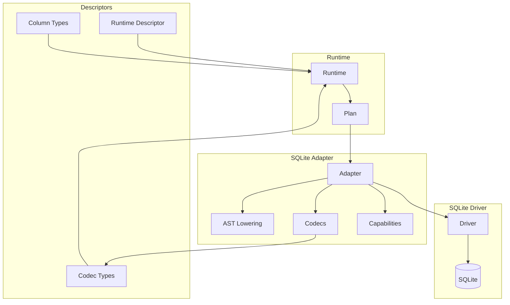

# @prisma-next/adapter-sqlite

SQLite adapter for Prisma Next.

## Package Classification

- **Domain**: targets
- **Layer**: adapters
- **Plane**: multi-plane (shared, runtime)

## Overview

The SQLite adapter implements the adapter SPI for SQLite databases. It provides AST-to-SQL lowering, capability discovery, codec definitions, and error mapping for SQLite-specific behavior. It also exports runtime-plane adapter descriptors for config wiring.

## Purpose

Provide SQLite-specific adapter implementation, codecs, and capabilities. Enable SQLite dialect support in Prisma Next through the adapter SPI.

## Responsibilities

- **Adapter Implementation**: Implement `Adapter` SPI for SQLite
  - Lower SQL ASTs to SQLite dialect SQL
  - Render JSON aggregation (`json_group_array`, `json_object`) and scalar subqueries
  - Advertise SQLite capabilities (`jsonAgg`, `returning`; no `lateral`, no `enums`)
  - Provide target-specific marker SQL via `readMarkerStatement()` on `AdapterProfile`
  - Map SQLite errors to `RuntimeError` envelope
- **Codec Definitions**: Define SQLite codecs for type conversion
  - 8 codecs: TEXT, INTEGER, REAL, BLOB, BOOLEAN (INTEGER 0/1), DATETIME (TEXT ISO8601), JSON (TEXT), BIGINT (INTEGER)
  - Wire format to JavaScript type decoding
  - JavaScript type to wire format encoding
- **Codec Types**: Export TypeScript types for SQLite codecs
- **Column Types**: Export column type descriptors with `as const` literal `codecId` types for contract authoring
- **Descriptors**: Provide adapter descriptors declaring capabilities and codec type imports

**Non-goals:**
- Transport/pooling management (drivers)
- Query compilation (sql-query)
- Runtime execution (runtime)
- Control-plane introspection and migration (future milestone)

## Architecture

This package spans multiple planes:

- **Shared plane** (`src/core/**`): Core adapter implementation, codecs, and types that can be imported by both migration and runtime planes
- **Runtime plane** (`src/exports/runtime.ts`): Runtime-plane entry point that exports the runtime adapter descriptor



## Components

### Core (`src/core/`)

**Adapter (`adapter.ts`)**
- Main adapter implementation
- Lowers SQL ASTs to SQLite SQL with `?` positional parameters
- Renders joins (INNER, LEFT, RIGHT, FULL) with ON conditions
- Renders JSON aggregation (`json_group_array`, `json_object`) and scalar subqueries
- Renders DML operations (INSERT, UPDATE, DELETE) with RETURNING clauses
- Renders ON CONFLICT (DO NOTHING / DO UPDATE SET) for upserts
- Uses `CAST(expr AS type)` instead of Postgres `::type` syntax
- Advertises SQLite capabilities (`returning`, `jsonAgg`)

**Codecs (`codecs.ts`)**
- SQLite codec definitions
- Type conversion between wire format and JavaScript
- SQL base codecs reused: `char`, `varchar`, `int`, `float`
- SQLite-specific codecs: `text`, `integer`, `real`, `blob`, `boolean` (0/1), `datetime` (ISO8601), `json` (TEXT), `bigint`

**SQL Utilities (`sql-utils.ts`)**
- Identifier quoting with double quotes
- String literal escaping with single-quote doubling
- Null byte rejection for SQL injection prevention

### Exports (`src/exports/`)

**Runtime Entry Point (`runtime.ts`)**
- Exports the runtime-plane adapter descriptor with codec registry

**Codec Types Export (`codec-types.ts`)**
- Exports TypeScript type definitions for SQLite codecs
- Used in `contract.d.ts` generation

**Column Types Export (`column-types.ts`)**
- Exports column descriptors for built-in types: `textColumn`, `integerColumn`, `realColumn`, `blobColumn`, `datetimeColumn`, `jsonColumn`, `bigintColumn`
- Uses `as const` to preserve literal `codecId` types through the type system

**Types Export (`types.ts`)**
- Re-exports SQLite-specific types

## Dependencies

- **`@prisma-next/sql-contract`**: SQL contract types
- **`@prisma-next/sql-relational-core`**: SQL AST types and codec registry
- **`@prisma-next/sql-runtime`**: Runtime adapter descriptor types
- **`@prisma-next/framework-components`**: Descriptor types

## Related Subsystems

- **[Adapters & Targets](../../../../docs/architecture%20docs/subsystems/5.%20Adapters%20&%20Targets.md)**: Detailed adapter specification

## Related ADRs

- [ADR 005 -- Thin Core Fat Targets](../../../../docs/architecture%20docs/adrs/ADR%20005%20-%20Thin%20Core%20Fat%20Targets.md)
- [ADR 016 -- Adapter SPI for Lowering](../../../../docs/architecture%20docs/adrs/ADR%20016%20-%20Adapter%20SPI%20for%20Lowering.md)
- [ADR 030 -- Result decoding & codecs registry](../../../../docs/architecture%20docs/adrs/ADR%20030%20-%20Result%20decoding%20&%20codecs%20registry.md)
- [ADR 065 -- Adapter capability schema & negotiation v1](../../../../docs/architecture%20docs/adrs/ADR%20065%20-%20Adapter%20capability%20schema%20&%20negotiation%20v1.md)

## Capabilities

The adapter declares the following SQLite capabilities:

- **`sql.orderBy: true`** -- Supports ORDER BY clauses
- **`sql.limit: true`** -- Supports LIMIT clauses
- **`sql.lateral: false`** -- No LATERAL join support
- **`sql.jsonAgg: true`** -- Supports JSON aggregation via `json_group_array()`
- **`sql.returning: true`** -- Supports RETURNING clauses for DML operations (SQLite 3.35+)
- **`sql.enums: false`** -- No native enum support

## JSON Aggregation

The renderer lowers JSON-aggregation AST nodes using SQLite's `json_group_array()` and `json_object()`:

- `json_group_array(json_object(...))` inside a scalar subquery aggregates a row set into a JSON array of objects
- The scalar subquery correlates against the outer row through its WHERE clause
- `COALESCE(..., '[]')` yields an empty array when the row set is empty

**Example SQL Output:**
```sql
SELECT "user"."id" AS "id",
  COALESCE((SELECT json_group_array(json_object('id', "post"."id", 'title', "post"."title"))
    FROM "post" WHERE "user"."id" = "post"."userId"), '[]') AS "posts"
FROM "user"
```

## DML Operations with RETURNING

The adapter supports RETURNING clauses for INSERT, UPDATE, and DELETE:

**Example SQL Output:**
```sql
-- INSERT with RETURNING
INSERT INTO "user" ("email") VALUES (?) RETURNING "user"."id", "user"."email"

-- UPDATE with RETURNING
UPDATE "user" SET "email" = ? WHERE "user"."id" = ? RETURNING "user"."id", "user"."email"

-- DELETE with RETURNING
DELETE FROM "user" WHERE "user"."id" = ? RETURNING "user"."id", "user"."email"
```

## Exports

- `./codec-types`: SQLite codec types (`CodecTypes`, `JsonValue`)
- `./column-types`: Column type descriptors (`textColumn`, `integerColumn`, `realColumn`, `blobColumn`, `datetimeColumn`, `jsonColumn`, `bigintColumn`)
- `./types`: SQLite-specific types
- `./control`: Control-plane entry point (stubbed for future migration support)
- `./runtime`: Runtime-plane entry point (runtime adapter descriptor)
