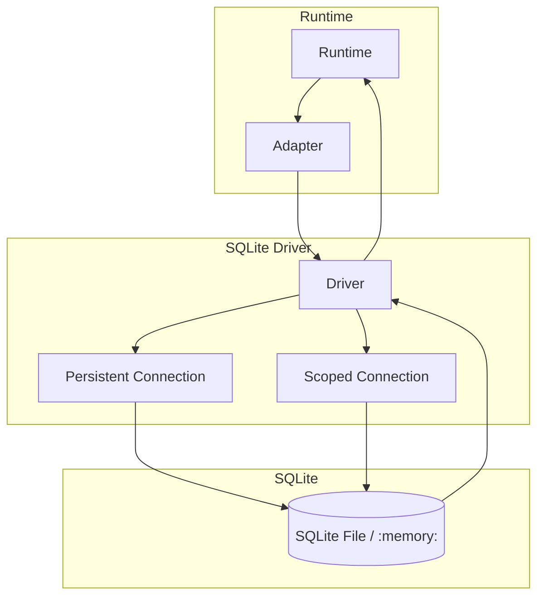

# @prisma-next/driver-sqlite

SQLite driver for Prisma Next.

## Package Classification

- **Domain**: targets
- **Layer**: drivers
- **Plane**: multi-plane (migration, runtime)

## Overview

The SQLite driver provides transport and connection management for SQLite databases using Node.js built-in `node:sqlite` module (`DatabaseSync`). It implements the `SqlDriver` interface for executing SQL statements, explaining queries, and managing connections.

In Prisma Next, "driver" refers to the Prisma Next interface (not the underlying `node:sqlite` API). Drivers own connection management and transport, but contain no dialect-specific logic. All dialect behavior lives in adapters. Instantiation is separate from connection; `create()` returns an unbound driver, `connect(binding)` binds at the boundary ([ADR 159](../../../../docs/architecture%20docs/adrs/ADR%20159%20-%20Driver%20Terminology%20and%20Lifecycle.md)).

This package spans multiple planes:
- **Migration plane** (`src/exports/control.ts`): Control plane entry point for driver descriptors
- **Runtime plane** (`src/exports/runtime.ts`): Runtime entry point for driver implementation

## Purpose

Provide SQLite transport and connection management. Execute SQL statements and manage connections without dialect-specific logic.

## Responsibilities

- **Connection Management**: Acquire and release database connections via `node:sqlite` `DatabaseSync`
- **Statement Execution**: Execute SQL statements with positional `?` parameters
- **Query Explanation**: Execute `EXPLAIN QUERY PLAN` queries for query analysis
- **Persistent Connection**: Top-level `execute()`/`query()`/`explain()` reuse a persistent connection opened at `connect()` time
- **Scoped Connections**: `acquireConnection()` opens fresh `DatabaseSync` handles for isolated scopes (transactions)
- **Transaction Support**: `BEGIN`/`COMMIT`/`ROLLBACK` via `SqliteTransactionImpl`
- **PRAGMA Configuration**: Enables `PRAGMA foreign_keys = ON` and `PRAGMA busy_timeout = 5000` on every opened connection
- **Error Normalization**: Maps SQLite extended error codes to SQL state codes (23505 unique, 23503 FK, 23502 NOT NULL) and distinguishes transient (BUSY/LOCKED) from permanent errors

**Non-goals:**
- Dialect-specific SQL lowering (adapters)
- Query compilation (sql-query)
- Runtime execution orchestration (sql-runtime)

## Architecture



## Components

### Driver (`sqlite-driver.ts`)
- `SqliteBoundDriver`: main driver implementation wrapping `DatabaseSync`
- `SqliteConnectionImpl`: connection wrapper with `execute()`, `query()`, `explain()`, `beginTransaction()`
- `SqliteTransactionImpl`: transaction wrapper adding `commit()` and `rollback()`
- `createBoundDriverFromBinding()`: factory that creates and immediately connects a driver

### Error Normalization (`normalize-error.ts`)
- Maps SQLite extended `errcode` to structured `SqlQueryError` / `SqlConnectionError`
- Handles constraint types individually (UNIQUE, FK, NOT NULL, CHECK)

## Dependencies

- **`@prisma-next/sql-relational-core`**: SQL contract types (`SqlDriver`, `SqlConnection`, `SqlTransaction`)
- **`@prisma-next/framework-components`**: Descriptor types (`RuntimeDriverDescriptor`, `ControlDriverDescriptor`)
- **`@prisma-next/errors`**: Structured error factories

## Related Subsystems

- **[Adapters & Targets](../../../../docs/architecture%20docs/subsystems/5.%20Adapters%20&%20Targets.md)**: Driver specification

## Related ADRs

- [ADR 159 -- Driver Terminology and Lifecycle](../../../../docs/architecture%20docs/adrs/ADR%20159%20-%20Driver%20Terminology%20and%20Lifecycle.md)
- [ADR 005 -- Thin Core Fat Targets](../../../../docs/architecture%20docs/adrs/ADR%20005%20-%20Thin%20Core%20Fat%20Targets.md)
- [ADR 016 -- Adapter SPI for Lowering](../../../../docs/architecture%20docs/adrs/ADR%20016%20-%20Adapter%20SPI%20for%20Lowering.md)

## Usage

Use the descriptor + connect lifecycle:

```typescript
import sqliteDriver from '@prisma-next/driver-sqlite/runtime';

const driver = sqliteDriver.create();
await driver.connect({ kind: 'path', path: ':memory:' });
// driver is now bound; use acquireConnection, query, execute, etc.
```

Binding:
- `{ kind: 'path', path: ':memory:' }`: In-memory database
- `{ kind: 'path', path: './data.db' }`: File-based database

## Exports

- `./runtime`: Runtime entry point for driver implementation
  - Default: `sqliteRuntimeDriverDescriptor` -- use `create()` for unbound driver, then `connect(binding)`
  - Types: `SqliteBinding`, `SqliteRuntimeDriver`
- `./control`: Control plane entry point for driver descriptors
  - Default: `ControlDriverDescriptor` for use in CLI config
  - `SqliteControlDriver` class for direct control-plane usage
