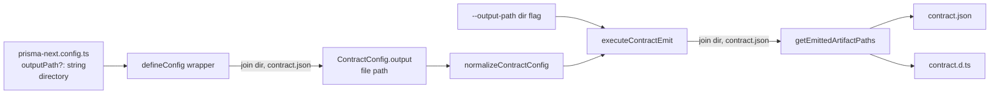

# Design notes: customize-generated-asset-output-path

> Synthesized design document for `customize-generated-asset-output-path`. Read this if you want to understand **what the project's design is**, **what principles it serves**, and **what alternatives were considered and rejected**. This document is not a chronological log of decisions — it captures the settled design, standing independently of the discussions that produced it.
>
> Owned by the Orchestrator. Authored directly (not delegated — see [`drive/roles/README.md § Orchestrator-direct authoring`](../../drive/roles/README.md)). Updated as design settles; not as decisions happen. Cross-link from the project spec; never block on a design-notes update during execution.

## Principles this design serves

- **Symmetric target surface (where surface exists)** — a config knob that exists for one first-party target's `defineConfig` wrapper exists consistently across the others' wrappers. The principle applies *to surfaces that exist*, not to surfaces that need creating. Today Mongo + Postgres ship `defineConfig` wrappers; SQLite does not (its users wire `coreDefineConfig` from the framework level directly). Adding a SQLite wrapper to satisfy this principle would be its own scope of work — tracked at [TML-2677](https://linear.app/prisma-company/issue/TML-2677/add-prisma-nextsqliteconfig-defineconfig-wrapper-at-parity-with-mongo).
- **Plumbing-first, surface-second** — the project leans on the existing `ContractConfig.output` plumbing (already threaded through provider → normalizer → CLI emit → emitter). It does not introduce a new emit pathway. The only change is exposing the override at the user-facing `defineConfig` wrappers and on the CLI.
- **Sensible defaults, escape hatches available** — the default behaviour (assets co-located with the schema source per the [`contract-space-package-layout`](../../.cursor/rules/contract-space-package-layout.mdc) convention) is unchanged. Users who don't opt in see no difference.
- **Defaults are conventions, not mandates** — the contract-space layout convention is a *recommended default for application / extension authors*. The new override is per-application; the convention itself doesn't need to be relaxed or rewritten.

## The model

### Surface: one option, one CLI flag, directory semantics

A new optional field on the two first-party `defineConfig` wrappers:

```ts
defineConfig({
  contract: './src/contract.prisma',
  outputPath: './generated',
  // ...
});
```

- **Type:** `string` (directory path).
- **Semantics:** the directory the emitter writes into. Inside it, `contract.json` and `contract.d.ts` are written with **canonical filenames**. The user picks the directory; the filenames are fixed.
- **Resolution:** relative paths resolve against the directory containing the `prisma-next.config.ts` file (consistent with how `contract` is resolved today).
- **Default:** unchanged from today — when `outputPath` is unset, the existing internal `deriveOutputPath(options.contract)` produces the file path `<schema-dir>/contract.json`, co-located with the schema source.

A matching CLI flag on `prisma-next contract emit`:

```bash
prisma-next contract emit --output-path ./generated
```

- **Precedence:** CLI `--output-path` overrides config `outputPath`, which overrides the default.
- **Validation:** none beyond `mkdir -p` for the output directory. No soft warnings on the user's directory choice. The override is a UX surface, not a safety boundary; filesystem errors (e.g. permission denied) surface naturally at emit time.

### Why directory semantics, not file-path

Two reasons make the directory shape the right surface even though the framework-level `ContractConfig.output` is a file path:

1. **The user doesn't pick the filenames.** `contract.json` and `contract.d.ts` are *protocol filenames* — downstream tooling, imports, and the emitter API all assume those exact names. Letting the user supply `./generated/foo.json` then writing `./generated/foo.json` + `./generated/foo.d.ts` (the earlier shape) created an interface where users **think** they're controlling the filename but they're actually controlling the basename of a derived pair. That's a sharp edge.
2. **Directory shape removes the validation surface.** Under file-path semantics we needed soft warnings for non-`.json` extensions, directory-shaped paths, and source-file collisions. Under directory semantics those concerns either don't apply or reduce to filesystem-level errors — no special warning logic to maintain.

The wrappers and the CLI operation convert directory → file path internally (`join(outputPath, 'contract.json')`) before crossing the framework boundary; the framework-level `ContractConfig.output` shape is unchanged. The new surface is a thin user-facing adapter, not a framework-level redesign.

### Symmetric application (Mongo + Postgres)

Both existing first-party `defineConfig` wrappers accept the option identically:

- `@prisma-next/mongo/config`
- `@prisma-next/postgres/config`

Both wrappers do the same `join(options.outputPath, 'contract.json')` conversion before crossing the framework boundary. The *surface* must be identical; the wrappers each carry an inline copy of the default-path helper (`deriveOutputPath`) that's a future extraction candidate but isn't worth lifting for this PR alone.

**SQLite is out of scope.** `@prisma-next/sqlite` has no `defineConfig` wrapper today; users wire the framework-level `coreDefineConfig` directly and explicitly pass the output path as the second argument to `typescriptContract(contract, outputPath)`. SQLite users therefore *already have* customizable output paths — they just don't have the ergonomic one-liner. Closing that ergonomic gap is tracked at [TML-2677](https://linear.app/prisma-company/issue/TML-2677/add-prisma-nextsqliteconfig-defineconfig-wrapper-at-parity-with-mongo).

### What's emitted, where



The CLI flag short-circuits the config value at `executeContractEmit` entry; the operation performs the `join(outputPath, 'contract.json')` conversion before handing to `getEmittedArtifactPaths`. The framework-level pipeline (file-path-based) is unchanged.

### Invariants

- **I-output-1.** When `outputPath` is unset (config) and `--output-path` is absent (CLI), behaviour is byte-identical to today's emit.
- **I-output-2.** When `outputPath` is set to a directory `<dir>`, the emitter writes `<dir>/contract.json` and `<dir>/contract.d.ts`. Both filenames are canonical (the user does not control them).
- **I-output-3.** The `outputPath` option's semantics, name, default, and resolution rules are identical across the Mongo + Postgres `defineConfig` wrappers.
- **I-output-4.** The CLI flag is named `--output-path`, accepts a directory, and takes precedence over the config value.

## Alternatives considered

- **File-path semantics for the user-facing option** (`output: './generated/contract.json'`, with the wrapper stripping the extension and substituting `.d.ts` for the companion file). **Considered and shipped initially; reverted during PR review.** See § Design pivot below. Rejected because: the user is offered control over a filename they can't actually pick — `contract.json` and `contract.d.ts` are protocol filenames assumed by downstream tooling. A surface that says "pick the file" but treats the basename as the only thing the user is really choosing creates a sharp edge. Directory semantics make the contract explicit: user picks the folder, framework picks the filenames.
- **File-path-or-directory polymorphism.** Accept either a `.json` file path or a directory; if a directory, derive both filenames. **Rejected because:** two semantics in one option creates ambiguity and extra validation surface for no clear ergonomic win.
- **Independent control over `.json` and `.d.ts` paths.** Lift the `getEmittedArtifactPaths` co-location constraint. **Rejected because:** co-location is the simpler mental model; no current user need motivates lifting it; downstream tooling that imports from `contract.json` and the `.d.ts` companion assumes co-location.
- **Mongo-only fix.** Resolve just the Mongo ticket; leave Postgres alone. **Rejected because:** the Mongo + Postgres wrappers are functionally identical in this area (same `deriveOutputPath` helper, same threading); users moving between targets would hit the same wall in Postgres; the symmetric-target-surface principle holds for surfaces that already exist.
- **Build a SQLite `defineConfig` wrapper to achieve full target symmetry inside this project.** Add `@prisma-next/sqlite/config` mirroring the Mongo + Postgres shape and migrate the SQLite demo. **Rejected because:** that's a new user-facing surface, not a config-knob extension. It needs its own design discussion (option shape, migration plan for existing consumers, docs) and is a substantially larger PR. Tracked separately at TML-2677.
- **Post-emit hook / formatter plugin.** Let users transform the emit output via a plugin rather than re-locate it. **Rejected because:** out of scope for this project; locating is the request, not transforming.
- **Revise the `contract-space-package-layout` rule to permit overrides.** **Rejected (as a design move).** The rule already scopes itself to "packages that emit their own `contract.json`" (extensions, internal packages, aggregate-root apps) and describes the *recommended layout* for those packages. The new override is an application-author choice — applications can opt out of the convention for their specific needs without the convention itself being weakened. The rule may pick up a one-line note at close-out clarifying the convention is the default, not a hard mandate, but it doesn't need a rewrite.
- **Calling the field `output`** (matching `ContractConfig.output`). **Rejected during PR review** in favour of `outputPath`. The framework-level field is internal-facing; the wrapper-facing field is user-facing and benefits from the more explicit `outputPath` naming (which also reads naturally with the CLI flag `--output-path`).
- **Calling the CLI control-API field `outputOverride`** (signalling that it overrides the config value). **Rejected during PR review.** Every CLI option overrides the config — calling out the override-ness is noise. Renamed to `outputPath` to match the user-facing option.
- **Soft warnings for unusual paths** (non-`.json` extension, directory-shaped path, collision with contract source). Shipped initially in d2; removed during PR review. The earlier file-path design needed these warnings to handle the "looks like a directory but I'm calling it a file" case. Directory semantics make them moot; removing them simplified the CLI command.
- **Path validation / safety rails (forbid traversal, forbid `node_modules`, refuse to overwrite tracked files).** **Rejected because:** trust the user; this is config-file UX, not multi-tenant security.

## Design pivot: file-path → directory-path

The project's first three dispatches shipped a file-path surface (`output: './generated/contract.json'`) that the wrapper accepted and threaded into `ContractConfig.output` verbatim. The framework-level pipeline operates on file paths, so the simplest user-facing shape was "match the framework: accept a `.json` file path." Soft warnings handled the cases where the user passed something that didn't look like a `.json` file.

PR review surfaced two issues with that shape:

1. The user is offered control over the filename, but `contract.json` and `contract.d.ts` are protocol filenames — downstream tooling assumes those exact names. The surface implied a choice that wasn't actually available. The operator's verbatim feedback: *"It's fucking dumb that it takes a file ending in `.json` and then strips the file extension off it."*
2. The `output` naming on the wrapper collided cognitively with the `outputOverride` naming on the control-API. Every CLI option overrides the config — calling out the override-ness is noise. The operator asked for `outputPath` everywhere.

Both issues resolved by switching to directory semantics: the user picks the folder, the framework picks (canonical) filenames. The wrapper / CLI operation converts directory → file path internally (`join(outputPath, 'contract.json')`) before crossing the framework boundary. The framework-level shape is unchanged. The user-facing shape gains a clean contract — pick a directory, get `contract.json` + `contract.d.ts` inside.

The pivot also removed the entire soft-warning surface (non-`.json` extension, directory-shape, source-collision), simplifying the CLI command and removing edge cases from the test matrix. The rename (`output` → `outputPath`, `outputOverride` → `outputPath`) made the wrapper, the control-API, the CLI flag, and the documentation consistent.

The lesson worth pinning at retro: when a config option offers control over only *part* of an artifact, name the option after what the user actually controls (the directory), not what the framework consumes (the file path). The framework's internal shape is its own concern; the user-facing surface should be the smallest honest description of the choice the user has.

## Open questions

_None blocking._

## References

- Project spec: [`./spec.md`](./spec.md)
- Project plan: [`./plan.md`](./plan.md)
- Linear ticket: [TML-2664](https://linear.app/prisma-company/issue/TML-2664/mongo-feature-request-customize-generated-asset-output-path)
- ADR 007 — Types-Only Emission (`docs/architecture docs/adrs/ADR 007 - Types Only Emission.md`)
- Rule — `contract-space-package-layout` (`.cursor/rules/contract-space-package-layout.mdc`)
- Follow-up ticket (SQLite parity): [TML-2677](https://linear.app/prisma-company/issue/TML-2677/add-prisma-nextsqliteconfig-defineconfig-wrapper-at-parity-with-mongo)
- Existing call sites to update (verified during slice spec authoring):
  - `packages/3-extensions/mongo/src/config/define-config.ts` (the Mongo gap)
  - `packages/3-extensions/postgres/src/config/define-config.ts` (the Postgres gap)
  - `packages/1-framework/3-tooling/cli/src/commands/contract-emit.ts` (CLI flag wiring)
  - `packages/1-framework/3-tooling/cli/src/control-api/operations/contract-emit.ts` (CLI override precedence)
- Existing plumbing (unchanged):
  - `packages/1-framework/1-core/config/src/config-types.ts` (`ContractConfig.output`, `normalizeContractConfig`)
  - `packages/1-framework/3-tooling/emitter/src/artifact-paths.ts` (`getEmittedArtifactPaths`)
