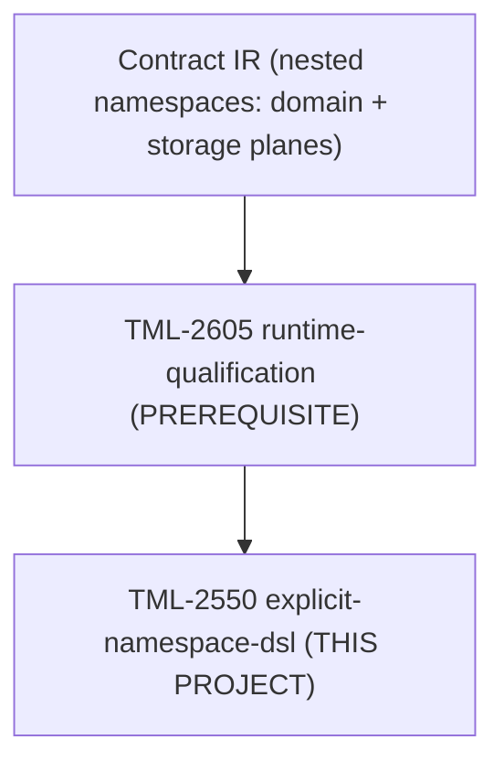

# Summary

This project adds **explicit namespace-aware DSL/ORM accessors** — `orm.<ns>.<Model>` and `sql.<ns>.<table>` — so multi-namespace contracts can navigate to any namespace by name. The builder surface is **always qualified**: there is no flat default-namespace fallback at the `orm` / `sql` layer. Ergonomic flat access (`db.<Model>`) is handled by **orchestration facades**, which alias `db` to a chosen namespace facet (e.g. `db = orm.<unboundNs>`) on targets that do not support multiple namespaces.

**Linear:** [TML-2550](https://linear.app/prisma-company/issue/TML-2550)

# Context

## At a glance

A contract spans multiple namespaces. Authoring uses PSL namespace blocks; querying uses the TS runtime:

```prisma
// app/prisma/schema.prisma — authoring (PSL)
namespace public {
  model Profile {
    id     String @id @default(uuid())
    userId String @unique

    user auth.User @relation(fields: [userId], references: [id], onDelete: Cascade)

    @@map("profile")
  }
}

namespace auth {
  model User {
    id    String @id @default(uuid())
    email String @unique

    @@map("users")
  }
}
```

```ts
// app/handlers.ts — multi-namespace target (e.g. Postgres): always qualified
import { orm, sql } from './db';

await sql.public.profile.select({ id: true }).build().execute();
await sql.auth.users.select({ id: true, email: true }).build().execute();
await orm.public.Profile.find({ where: { id: profileId } });
await orm.auth.User.find({ where: { id: userId } });
```

```ts
// app/handlers.ts — single-namespace target (e.g. SQLite): facade aliases `db`
import { db } from './db';

// `db` here is `orm.<unboundNs>` — flat shape preserved at the call site,
// but the same explicit-namespace machinery underneath.
await db.Profile.find({ where: { id: profileId } });
```

[TML-2605](../target-extensible-ir-namespaces/spec.md) provides the runtime identifier-qualification machinery (qualified SQL emission for `"auth"."users"` vs `"public"."users"`). This project consumes that machinery to build the per-namespace facets on `orm` and `sql`, and removes any flat default-namespace fallback at the builder layer — flat ergonomics become a facade concern.



- **TML-2605 — runtime-qualification (prerequisite):** runtime SQL qualifies identifiers by namespace coordinate; provides the qualification helpers explicit accessors call into.
- **TML-2550 — explicit-namespace-dsl (this project):** `orm.<ns>.<Model>` / `sql.<ns>.<table>` per-namespace facets on builders; builder surface always qualified (no flat fallback); facade aliases `db` to a namespace facet on single-namespace targets.

## Problem

**1. Non-default namespaces are unreachable without explicit accessors.** A contract that exposes `auth.User` and `public.Profile` has no way to query the `auth` namespace if the only accessor shape is `orm.<Model>` keyed off a single default namespace.

**2. A builder-level default-namespace fallback is the wrong primitive.** It conflates navigation (which namespace's table?) with ergonomics (don't make me type the namespace when there's only one). Bundling those into one fallback at the builder layer forces awkward decisions whenever both concerns appear together, and it produces a surface that is asymmetric between targets that have namespaces and targets that don't.

**3. Single-namespace ergonomics belong at the facade layer.** When a target has no concept of multiple namespaces, users still want `db.Profile.find(...)`. That shape is achievable without a builder-level fallback: the orchestration facade simply aliases `db = orm.<unboundNs>`.

## Approach

### Always-qualified builder surface

The ORM and SQL builders expose namespace facets directly: `orm.<ns>.<Model>`, `sql.<ns>.<table>`. There is no `orm.<Model>` shape and no `sql.<table>` shape at the builder layer — namespace selection is mandatory. Namespace identifiers match contract IR namespace keys (`public`, `auth`, `__unbound__`, etc.).

### Facade-layer ergonomic defaults

Orchestration facades that expose a unified `db` entry point project the builder surface based on whether the target supports multiple namespaces. The discriminator is already in each target's descriptor: `defaultNamespaceId === UNBOUND_NAMESPACE_ID` iff the target is single-namespace.

Concrete targets in this repo at the time of writing:

| Target | Package | `defaultNamespaceId` | Facade projection |
|---|---|---|---|
| **Postgres** | `packages/3-targets/3-targets/postgres` | `'public'` | `db = orm` — fully qualified shape required (`db.<ns>.<Model>`, `db.sql.<ns>.<table>`). |
| **SQLite** | `packages/3-targets/3-targets/sqlite` | `'__unbound__'` | `db = orm.__unbound__` — flat shape preserved (`db.<Model>`, `db.sql.<table>`). |
| **Mongo** | `packages/3-mongo-target/1-mongo-target` | `'__unbound__'` | `db = orm.__unbound__` — flat shape preserved. |

The ergonomic "don't make me type the namespace" decision lives in the facade, where it composes with other facade concerns (session binding, multi-tenant scoping, etc.) without distorting the builder type construction. New targets fall into the appropriate column by the same rule: a non-unbound `defaultNamespaceId` declares the target as multi-namespace and inherits the qualified projection.

### Runtime resolution

Per-namespace accessors delegate to the identifier-qualification helpers introduced for TML-2605, parameterized by namespace coordinate. There is no parallel qualification pipeline.

### Verification story

A multi-namespace fixture (two namespaces, one model in each, an FK across them) is authorable (PSL), emittable (`contract.json`), and queryable end-to-end via PGlite. A separate single-namespace fixture on a non-namespace-supporting adapter exercises the facade-alias path.

# Requirements

## Functional Requirements

### Explicit SQL accessors

- **FR1.** `sql.<namespaceId>.<tableName>` resolves to the table in that namespace and produces namespace-qualified SQL on execute (e.g. `"auth"."users"` on Postgres).
- **FR2.** Namespace identifiers exposed on `sql` match the contract's storage namespace keys. Unknown namespace ids are a compile-time error on the typed surface (or a fail-fast runtime error if the contract JSON is widened).
- **FR3.** Explicit SQL accessors support the same query-builder operations the table proxies support today (select/insert/update/delete/join paths).

### Explicit ORM accessors

- **FR4.** `orm.<namespaceId>.<ModelName>` resolves to the model accessor in that namespace (find/create/update/delete APIs on the model accessor surface).
- **FR5.** ORM namespace keys align with `contract.domain.namespaces` keys; model names align with domain model keys within each namespace.

### Builder surface is always qualified

- **FR6.** The ORM and SQL builder surfaces (`orm`, `sql`) expose no flat default-namespace accessors. `orm.<Model>` and `sql.<table>` at the builder layer are removed; namespace selection is always explicit. This is a deliberate breaking change against any pre-existing flat-fallback behaviour from TML-2605.
- **FR7.** No breaking change to emitted `contract.json` or `contract.d.ts` shape — this project only extends runtime/typing surfaces.

### Facade-layer ergonomic defaults

- **FR8.** Orchestration facades that expose `db` project the builder surface based on target capability:
  - Target supports multiple namespaces: `db = orm` (qualified shape required at call sites).
  - Target does not support multiple namespaces: `db = orm.<unboundNs>` (flat shape preserved at call sites by aliasing).
  The same projection rule applies to `db.sql`.
- **FR9.** The facade-alias path produces the same runtime behaviour as the direct namespaced path — it is a binding, not a second code path.

### Runtime resolution

- **FR10.** Runtime table/model lookup by explicit namespace uses the identifier-qualification helper(s) introduced for TML-2605, parameterized by namespace coordinate.
- **FR11.** Mis-typed namespace or table/model name fails fast with a diagnostic that names the namespace.

### Demonstration

- **FR12.** A committed multi-namespace integration test exercises: authoring a contract with two namespaces in PSL; emit contract; query both namespaces via explicit accessors in one test run.
- **FR13.** A single-namespace integration test on a non-namespace-supporting adapter exercises the facade-alias path (`db.<Model>` resolving through `orm.<unboundNs>.<Model>`).

## Non-Functional Requirements

- **NFR1.** Per-namespace facet construction adds no measurable overhead to query execution; facets are thin proxies over existing table/model accessors.
- **NFR2.** `Db<C>` inferred type size remains buildable for realistic contracts; if the per-namespace facet pattern strains TypeScript inference, mitigations are documented in the ADR.
- **NFR3.** `pnpm lint:deps` passes; namespace accessor construction lives in the existing DSL/ORM client packages without new layering violations.
- **NFR4.** Test coverage: unit tests for type-level namespace keys (negative tests for unknown `ns`), integration tests for qualified SQL text on explicit paths, integration tests for the facade-alias path on a single-namespace adapter.

## Non-goals

- **Builder-level default-namespace fallback** — removed by this project; flat ergonomics are a facade concern only.
- **PSL syntax for namespace-qualified queries** — qualification in authoring remains namespace blocks + cross-contract refs.
- **Cross-contract-space FK authoring** — separate project.
- **Per-namespace `contract.d.ts` emission redesign** — emitter may stay single-file; explicit accessors are a runtime/typing concern.

## Sequencing constraints

| Constraint | Detail |
|---|---|
| **Hard prerequisite** | [TML-2605](https://linear.app/prisma-company/issue/TML-2605) (runtime-qualification) must merge first. This project reuses its identifier-qualification path. |
| **Delivery shape** | One PR; effort sized at pickup. |

# Acceptance Criteria

- [ ] **AC1.** `sql.<ns>.<table>` works for explicit multi-namespace navigation, including the case where the same bare table name appears in more than one namespace (e.g. `auth.users` and `public.users`) within one contract.
- [ ] **AC2.** `orm.<ns>.<Model>` works for explicit multi-namespace ORM navigation with namespace keys aligned to the SQL surface.
- [ ] **AC3.** Builder-level flat accessors (`orm.<Model>`, `sql.<table>`) are removed; type-level negative tests confirm.
- [ ] **AC4.** Facade projection per concrete target matches the rule, covered by integration tests:
  - **Postgres** (`packages/3-targets/3-targets/postgres`, `defaultNamespaceId: 'public'`): `db` exposes the qualified shape (`db.<ns>.<Model>`, `db.sql.<ns>.<table>`); flat `db.<Model>` and `db.sql.<table>` are absent.
  - **SQLite** (`packages/3-targets/3-targets/sqlite`, `defaultNamespaceId: '__unbound__'`): `db` is aliased to `orm.__unbound__` (and `sql.__unbound__`); flat `db.<Model>` and `db.sql.<table>` resolve through the alias.
  - **Mongo** (`packages/3-mongo-target/1-mongo-target`, `defaultNamespaceId: '__unbound__'`): same flat-aliased projection as SQLite, against the Mongo ORM/builder surface.
- [ ] **AC5.** Facade projection is driven solely by the target descriptor's `defaultNamespaceId` (unbound ↔ flat alias; non-unbound ↔ qualified), with no per-target switch in the facade implementation. A type-level test asserts this on the three targets above.
- [ ] **AC6.** A multi-namespace fixture is authorable (PSL), emittable, and queryable end-to-end via the explicit accessor path (run on Postgres via PGlite).
- [ ] **AC7.** ADR captures the always-qualified builder surface, the facade-aliasing pattern, and the `Db<C>` per-namespace facet construction.
- [ ] **AC8.** `pnpm test:packages` and relevant integration tests green; `pnpm lint:deps` passes.

# Other Considerations

## TypeScript-only query surface

The DSL/ORM accessors are runtime TypeScript API. PSL leads for **authoring** (namespace blocks, models, policies); TS examples illustrate **query** usage only. That matches [prefer-psl-in-design-docs](../../.agents/rules/prefer-psl-in-design-docs.mdc): PSL for contract shape, TS where the capability is TS-only.

## Facade aliasing as the integration extension point

Downstream integrations (extension packs that bind sessions to roles, multi-tenant facades, etc.) compose by wrapping the facade `db` — not by reshaping the builder surface. The always-qualified builder layer plus facade-driven ergonomic projection gives integrations a stable shape to wrap.

# References

- [TML-2550](https://linear.app/prisma-company/issue/TML-2550) — this project
- [TML-2605](https://linear.app/prisma-company/issue/TML-2605) — prerequisite (runtime-qualification)
- [target-extensible-ir-namespaces](../target-extensible-ir-namespaces/spec.md) — IR + runtime-qualification
- [ADR 221 — Contract IR two planes](../../docs/architecture%20docs/adrs/ADR%20221%20-%20Contract%20IR%20two%20planes%20with%20uniform%20entity%20coordinate%20and%20pack-contributed%20entity%20kinds.md) — namespace envelope shape explicit accessors reflect

# Open Questions

## ADR scope

Confirmed: this project produces a long-lived ADR covering (a) the always-qualified builder surface, (b) the facade-aliasing pattern for ergonomic defaults on single-namespace targets, and (c) the `Db<C>` per-namespace facet construction.

## Example placement

Does the multi-namespace fixture live in this PR or in a downstream consumer? **Working assumption:** a minimal multi-namespace integration test in this PR (PGlite), plus a single-namespace integration test against a non-namespace-supporting adapter to cover the facade-alias path. Richer end-to-end example apps stay with their respective consumers.
