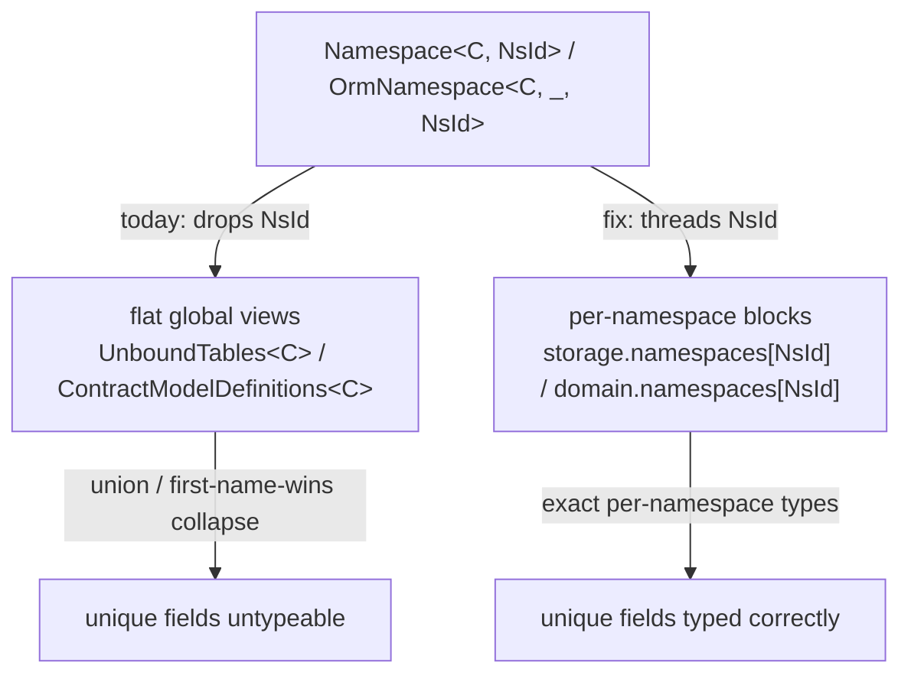
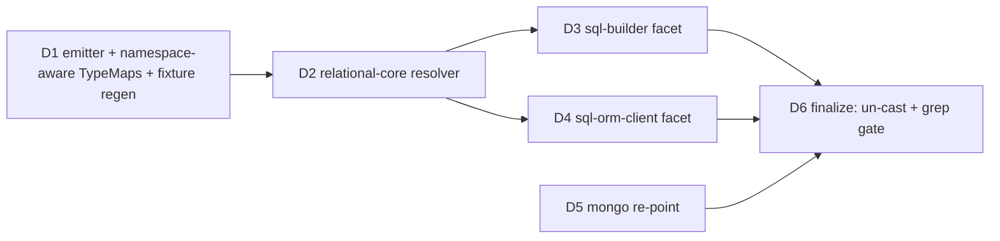

# Summary

The explicit namespaced accessors (`sql.<ns>.<table>` / `orm.<ns>.<Model>`) resolve field/column types by **bare name through the contract's flat, global model/table views**, dropping the namespace coordinate the facet already knows. When the same bare name lives in two namespaces with different fields, neither namespace's unique fields are usable at the type level — runtime works, but typechecks fail. This spec plans a type-layer fix that threads the namespace coordinate through `TableProxy` / `Collection` so field/column types resolve from the per-namespace blocks the emitter already emits.

# Context

## At a glance

The project shipped explicit namespaced accessors that are correct at runtime but lose the namespace coordinate in the type system. Concretely, given a contract with the same bare table/model name in two namespaces, each carrying a namespace-unique field:

```prisma
namespace public {
  model User { id Int @id  email String @unique  @@map("users") }
}
namespace auth {
  model User { id Int @id  token String @unique  @@map("users") }
}
```

```ts
// Runtime: both work. Types: both fail.
sql.public.users.select('id', 'email'); // ❌ TS2769: 'email' not assignable to 'id'
sql.auth.users.select('id', 'token');   // ❌ TS2769: 'token' not assignable to 'id'

await orm.public.User.first(); // ❌ row type has no `email`
await orm.auth.User.first();   // ❌ row type has no `token`
```

The two facets `Namespace<C, 'public'>['users']` and `Namespace<C, 'auth'>['users']` resolve to the **same** `TableProxy<C, 'users'>` type — the `NsId` coordinate is discarded. That proxy then resolves its columns from `UnboundTables<C>['users']`, a union of the table across **every** namespace, which collapses the selectable columns to the per-namespace intersection (`id` only). The ORM side has the analogous defect: `OrmNamespace<C, _, 'auth'>['User']` is `Collection<C, 'User', InferRootRow<C, 'User'>>`, and `InferRootRow` resolves fields through the flat `ContractModelDefinitions<C>` (`TModels`) global map, which carries no per-namespace dimension.

The fix is contained to the DSL/ORM **type layer**: the per-namespace types already exist in the emitted contract (`C['domain']['namespaces'][ns]['models']` and `C['storage']['namespaces'][ns]['entries']['table']`); the resolution machinery just needs to read from the namespace coordinate instead of the flat views. No emitter, `contract.json`, or `contract.d.ts` shape change is required. While re-anchoring the SQL surfaces, we also re-point the Mongo type layer off the same flat map (it's correct only because Mongo is single-namespace), so the end state carries one cross-family invariant: **no internal type resolution reads the flat `TModels` map**.

## Problem

Both slices of `explicit-namespace-dsl` shipped and the namespaced accessors execute correctly end-to-end (proven by `test/integration/test/namespaced-accessors-e2e.integration.test.ts`). But that integration test reaches the runtime through `blindCast` to hand-written structural views (`SqlView`, `OrmView`), so it never exercises the precise per-namespace types — which is exactly where the defect lives. The bug is invisible to the existing suite.

The defect is a single root cause surfacing in three layers:

1. **The facet types drop the coordinate.** In `packages/2-sql/4-lanes/sql-builder/src/types/db.ts`, `Namespace<C, NsId>` maps each table name to `TableProxy<C, Name>` — `TableProxy` has no namespace type parameter, so `NsId` is lost at the boundary. In `packages/3-extensions/sql-orm-client/src/orm.ts`, `OrmNamespace<C, _, NsId>` maps each model name to `Collection<C, ModelName, InferRootRow<C, ModelName>>` — again, `NsId` is not threaded into `Collection`.

2. **SQL column resolution unions across namespaces.** `TableProxy<C, Name>` (`src/types/table-proxy.ts`) derives its scope from `UnboundTables<C>[Name]` = `TableInAnyNamespace<C, Name>`, which is a union of the table across all namespaces. For a colliding bare name, `keyof (PublicUsers | AuthUsers)` is the intersection of column keys (`id`), so `select('email')` and `select('token')` are both rejected. The confirmed compiler error: `Argument of type '"token"' is not assignable to parameter of type '"id"'` against `DefaultScope<"users", TableInAnyNamespace<…>>`.

3. **ORM field resolution reads the flat model map.** `InferRootRow → DefaultModelRow → FieldsOf → ModelsOf<C> = ContractModelDefinitions<C>` reads the contract's `TModels` type parameter (`packages/3-extensions/sql-orm-client/src/types.ts`). `TModels` is a single global map: `ApplicationDomain<TModels>` (`packages/1-framework/0-foundation/contract/src/domain-envelope.ts`) types every namespace's `models` with the same `TModels`, and the emitter flattens it first-name-wins (`generateContractDts`, asserted by `generate-contract-dts.multi-namespace.test.ts`). With distinct per-namespace models the flat map degrades, so the per-namespace `User` row cannot type its own fields.

Critically, the per-namespace type information is **not missing from the emitted artifact**. `generateContractDts` omits `domain` from the flat `ContractType<storage, flatModels>` and re-adds a literal `domain: { namespaces: { <ns>: { models: <per-namespace model types> } } }` block. So `C['domain']['namespaces']['auth']['models']['User']` already carries `token`, and `C['storage']['namespaces']['auth']['entries']['table']['users']` already carries the `token` column. The DSL/ORM type machinery simply doesn't read from there.

## Approach

Thread the namespace coordinate through the two accessor surfaces and re-anchor their type resolution on the per-namespace blocks that already exist in the contract type.

The namespace coordinate is **required**, not optional: `TableProxy` / `Collection` always carry an `NsId`, and there is a single coordinate-based resolution path. `__unbound__` is not a fallback branch — it is just the coordinate a single-namespace target resolves at. This unifies single- and multi-namespace resolution into one mechanism (no dual-shape flat path to keep in sync), consistent with slice 02 having already removed the flat builder accessors.

**SQL builder (`packages/2-sql/4-lanes/sql-builder`).** Give `TableProxy` a required namespace-coordinate type parameter (e.g. `TableProxy<C, NsId, Name>`), and have `Namespace<C, NsId>` pass `NsId` when constructing each table's proxy. Inside `TableProxy`, resolve the storage table from `C['storage']['namespaces'][NsId]['entries']['table'][Name]` (a single, exact table — no cross-namespace union) instead of `UnboundTables<C>[Name]`, and resolve the model coordinate (for field→column mapping and codec output types in `ResolvedColumnTypes` / `FindModelForTable`) from `C['domain']['namespaces'][NsId]['models']` instead of the flat `ContractModelDefinitions<C>`. The runtime already passes the namespace id to `TableProxyImpl`, so this is a types-only change.

**SQL relational-core (`packages/2-sql/4-lanes/relational-core`).** `ExtractTableToModel` / `ExtractColumnToField` (consumed by `ComputeColumnJsType` — the column→JS-type resolver on the select-result path) also key off the flat `ContractModelDefinitions<C>` by bare table name, so they suffer the same multi-namespace defect and must take the namespace coordinate from the caller (`TableProxy`) and resolve table→model/column→field within `C['domain']['namespaces'][NsId]`. This package was discovered during root-causing the flat-map consumers and is in scope alongside `sql-builder`.

**ORM client (`packages/3-extensions/sql-orm-client`).** Give `Collection` (or the `OrmNamespace` mapping that builds it) a required namespace coordinate, and resolve the model's fields/storage from `C['domain']['namespaces'][NsId]['models'][ModelName]` rather than `ModelsOf<C>[ModelName]`. The resolution helpers that anchor on the flat model map (`FieldsOf`, `ModelTableName`, `FieldColumnName`, `ResolvedStorageColumn`, `InferRootRow`/`DefaultModelRow`, relation resolution) are rebuilt on the namespace-coordinate path. The runtime facet already threads `namespaceId` + per-namespace table name into the `Collection`, so this is also types-only.

**Mongo (`packages/2-mongo-family/1-foundation/mongo-contract` + `mongo-orm`).** Mongo is structurally single-namespace, so its model map is correct today — but it reaches it through the same flat `ContractModelDefinitions<C>`. Re-point `MongoModelsMap<TContract>` at the unbound namespace's `models` directly — `TContract['domain']['namespaces'][typeof UNBOUND_NAMESPACE_ID]['models']` — and route the two direct callers (`InferModelRow`, `RootModelName`) through `MongoModelsMap`. `__unbound__` is the only namespace a Mongo contract can have: both authoring paths (the PSL interpreter and TS `defineContract`) hardcode `UNBOUND_NAMESPACE_ID`, and the Mongo contract type itself keys `domain.namespaces` by `typeof UNBOUND_NAMESPACE_ID` (see `MongoContractBaseFromDefinition` in `mongo-family/2-authoring/contract-ts`). Referencing the exported sentinel (not a raw `'__unbound__'` literal) keeps it tracking the canonical constant. The returned shape is identical (`Record<modelName, modelDef>`), so every downstream Mongo consumer (`mongo-orm`'s `collection.ts`, `field-accessor.ts`) is unchanged. This removes Mongo's dependency on the flat map, establishing a single invariant across both families: **no internal type resolution reads the flat `TModels` map**. After this, `ContractModelDefinitions<C>` is referenced only by the emitter's public `export type Models` convenience export.

**Single-namespace equivalence.** The single resolution path, instantiated at a contract's sole coordinate (`public` or `__unbound__`), must reproduce today's single-namespace output exactly — so the common single-namespace case and the facade-alias ergonomics (`db = sql.__unbound__`, `db = orm.__unbound__`) are unaffected in observable behaviour, even though the underlying resolution now always goes through the coordinate. The flat global helpers (`UnboundTables`, `TableInAnyNamespace`) may remain for any non-facet consumers (see Blast radius), but the explicit facets no longer depend on them.



The two new failing type-tests added while confirming this bug are the regression proof and should go green under the fix:
- `packages/2-sql/4-lanes/sql-builder/test/types/namespace-unique-fields.types.test-d.ts`
- `packages/3-extensions/sql-orm-client/test/orm-namespace-unique-fields.types.test-d.ts`

# Requirements

## Functional Requirements

- **FR1.** `sql.<ns>.<table>.select(...)` accepts and returns exactly the columns of the table in namespace `<ns>`, including namespace-unique columns, when the same bare table name exists in another namespace with different columns.
- **FR2.** `orm.<ns>.<Model>` read rows, create inputs, update inputs, and where-filters resolve to exactly the fields of the model in namespace `<ns>`, including namespace-unique fields, under the same collision condition.
- **FR3.** The namespace coordinate is a **required** parameter on `TableProxy` and `Collection` (or their constructing mapped types) so the resolved field/column types are a function of `(NsId, Name)`, not `Name` alone. There is a single coordinate-based resolution path with no flat/`__unbound__` fallback branch; `__unbound__` is resolved as an ordinary coordinate.
- **FR4.** Field/column type resolution for the explicit facets reads from the per-namespace contract blocks (`C['domain']['namespaces'][NsId]` / `C['storage']['namespaces'][NsId]`) already present in the emitted contract type.
- **FR5.** No change to the emitted `contract.json` or `contract.d.ts` shape, the emitter, or the contract type foundation (project FR7). The fix is confined to family type layers: SQL (`sql-builder`, `sql-orm-client`, `relational-core`) and Mongo (`mongo-contract`, `mongo-orm`).
- **FR5a.** After this fix, **no internal type resolution reads the flat `ContractModelDefinitions<C>` (`TModels`) map**: the SQL surfaces resolve per-namespace coordinate, and Mongo indexes the unbound namespace directly. `ContractModelDefinitions<C>` itself is **not** removed — it remains as the backing of the emitter's public `export type Models` convenience export — but it is off every internal type-resolution path.
- **FR5b.** Mongo resolves its models by indexing the unbound namespace via the exported `UNBOUND_NAMESPACE_ID` sentinel (`namespaces[typeof UNBOUND_NAMESPACE_ID]`), not a raw `'__unbound__'` string literal. This is sound because Mongo has exactly one possible namespace — both authoring paths hardcode the sentinel and the Mongo contract type keys `domain.namespaces` by it.
- **FR6.** The single coordinate-based resolution path, instantiated at a single-namespace contract's sole coordinate (`public` or `__unbound__`), reproduces today's output exactly — no behavioural or type regression for the single-namespace common case, including the facade-alias path (`db = sql.__unbound__` / `db = orm.__unbound__`).
- **FR7.** Runtime behaviour is unchanged (the runtime already threads the coordinate); the existing `namespaced-accessors-e2e.integration.test.ts` continues to pass without modification to its runtime assertions.

## Non-Functional Requirements

- **NFR1.** `Db<C>` and the ORM client inferred type remain buildable for realistic contracts; threading `NsId` must not blow up TypeScript inference (project NFR2). If type size is strained, document the mitigation.
- **NFR2.** `pnpm typecheck`, `pnpm test:packages`, and the namespaced integration tests are green; `pnpm lint:deps` passes with no new layering violations (changes stay within `sql-builder`, `sql-orm-client`, `relational-core`, `mongo-contract`, and `mongo-orm`).
- **NFR3.** No new `as`/`blindCast` introduced in production type code to paper over the coordinate threading (repo cast policy).

## Non-goals

- **Emitter / contract-foundation redesign.** Making the flat `TModels` / `ContractModelDefinitions` itself namespace-aware (so `Models` is correct for multi-namespace) is out of scope; the explicit facets stop depending on the flat map instead. If consumers of the flat `Models` type need multi-namespace correctness, that is a separate effort.
- **Removing `ContractModelDefinitions` entirely.** Out of scope here. After this fix it has a single remaining reference — the emitter's public `export type Models = ContractModelDefinitions<Contract>` — so removing it means dropping or redefining that generated export, which changes the emitted `contract.d.ts` shape (conflicts with FR7/AC4), regenerates every committed fixture/example/app, and is a public-API break (`Models` and `ContractModelDefinitions` are both exported surface). It also wouldn't remove the underlying flat representation, since `ContractModelDefinitions` only extracts the `Contract<TStorage, TModels>` type parameter that still parameterizes `ApplicationDomain<TModels>`. **Candidate follow-up:** once nothing internal depends on it (this fix), evaluate retiring the `Models` export and the helper as a deliberate public-surface change, possibly with reconsidering the `TModels` parameter.
- **Cross-namespace nested-relation writes** — already a tracked follow-up from slice 01.
- **Runtime changes** — the runtime already resolves correctly.
- **New PSL/authoring surface** — this is purely a query-time typing fix.

# Acceptance Criteria

- [ ] **AC1.** With a two-namespace contract where `public.users` has unique column `email` and `auth.users` has unique column `token`, `sql.public.users.select('id','email')` and `sql.auth.users.select('id','token')` both typecheck and yield rows with the respective unique column; the reverse (`sql.public.users.select('token')`) is a type error. Covers FR1, FR3, FR4. (The committed `namespace-unique-fields.types.test-d.ts` goes green.)
- [ ] **AC2.** With the same contract where `public.User` has unique field `email` and `auth.User` has unique field `token`, `orm.public.User` read/create/update/where surfaces expose `email` (and reject `token`), and `orm.auth.User` exposes `token` (and rejects `email`). Covers FR2, FR3, FR4. (The committed `orm-namespace-unique-fields.types.test-d.ts` goes green.)
- [ ] **AC3.** Grep/inspection confirms the explicit facet resolution no longer reads `UnboundTables<C>` / flat `ContractModelDefinitions<C>` for column/field types; it reads the `NsId`-indexed blocks. Covers FR4, FR5.
- [ ] **AC4.** The emitted fixtures are unchanged: `pnpm fixtures:check` reports no diff, and no file under the emitter package changed. Covers FR5.
- [ ] **AC5.** A single-namespace regression (the existing `sql-builder` / `sql-orm-client` type-tests and the SQLite/Mongo facade type-tests) stays green, and the facade-alias path resolves the flat shape unchanged. Covers FR6.
- [ ] **AC5a.** Mongo type-tests (e.g. `mongo/test/mongo.types.test-d.ts`) and `mongo-orm` row/field-accessor types stay green after `MongoModelsMap` is re-pointed at the sole namespace — the resolved row/field shapes are byte-for-byte unchanged. Covers FR5b. A grep confirms no internal (non-generated) type references `ContractModelDefinitions` / `ModelsOf` for field/model resolution. Covers FR5a.
- [ ] **AC6.** `namespaced-accessors-e2e.integration.test.ts` passes unchanged on its runtime assertions, and its `blindCast` structural views (`SqlView` / `OrmView`) are removed in favour of the now-correct precise per-namespace types, so the integration layer type-checks the real surface and can no longer mask a regression. If the deserializer boundary (framework-supertype contract) cannot express the precise per-namespace literals, substitute a precisely-typed emitted fixture rather than reinstating the casts. Covers FR7.
- [ ] **AC7.** `pnpm typecheck`, `pnpm test:packages`, the namespaced integration tests, and `pnpm lint:deps` are green. Covers NFR2.

# Other Considerations

## Type-inference budget

Threading `NsId` and indexing per-namespace blocks adds depth to already-deep mapped types (`Db<C>`, the ORM collection surface). The main risk is TypeScript instantiation-depth or type-size growth on large multi-namespace contracts. Mitigation levers: resolve the per-namespace table/model once into a named intermediate alias rather than re-indexing in every helper; keep the single-namespace path on its existing (cheap) resolution where possible. Measure on the largest committed fixture before and after.

## Blast radius of the flat helpers

A grep of the flat-map consumers (`ContractModelDefinitions` / `ModelsOf` / `UnboundTables` / `TableInAnyNamespace`) at root-cause time found:

- **SQL, multi-namespace-broken → re-anchor per-namespace (in scope):** `sql-orm-client` (`ModelsOf` and the whole ORM type chain), `sql-builder` (`FindModelForTable`), and `relational-core` (`ExtractTableToModel` / `ExtractColumnToField` → `ComputeColumnJsType`).
- **Mongo, correct-by-accident → re-point at the unbound namespace (in scope):** `mongo-contract` (`MongoModelsMap`, and the `RootModelName` / `InferModelRow` direct callers). The map is correct today only because Mongo is single-namespace; indexing `namespaces[typeof UNBOUND_NAMESPACE_ID]` removes the reliance on the flat map without changing any resolved shape.
- **Public convenience export → leave as-is:** the emitter's `export type Models = ContractModelDefinitions<Contract>` in every generated `contract.d.ts`. No hand-written internal code imports it; it degrades for multi-namespace SQL contracts but is off every internal resolution path after this fix.

`UnboundTables` / `TableInAnyNamespace` are also consumed by `query-builder` and `cross-namespace-tables.types.test-d.ts`; leave those intact and only re-anchor the explicit-facet resolution to avoid a wide refactor.

# References

- Parent project: [`projects/explicit-namespace-dsl/spec.md`](../spec.md) (FR6 always-qualified surface, FR7 no emitted-shape change, NFR2 inference budget, AC1/AC2 collision cases)
- Slice 01 (additive surface): [`projects/explicit-namespace-dsl/slices/01-additive-namespaced-surface/spec.md`](../slices/01-additive-namespaced-surface/spec.md)
- Slice 02 (flat-fallback removal): [`projects/explicit-namespace-dsl/slices/02-remove-flat-fallback/spec.md`](../slices/02-remove-flat-fallback/spec.md)
- Project learnings (ORM single-namespace assumption threaded layer-by-layer): [`projects/explicit-namespace-dsl/learnings.md`](../learnings.md)
- Failing regression tests added with this spec:
  - `packages/2-sql/4-lanes/sql-builder/test/types/namespace-unique-fields.types.test-d.ts`
  - `packages/3-extensions/sql-orm-client/test/orm-namespace-unique-fields.types.test-d.ts`
- Linear: [TML-2550](https://linear.app/prisma-company/issue/TML-2550) (parent project)

# Resolved Decisions

- **D1 — Required coordinate, no fallback (was Open Question 1).** `NsId` is a **required** parameter on `TableProxy` / `Collection`; resolution always goes through the coordinate, with no flat/`__unbound__` fallback branch. Folded into Approach, FR3, and FR6.
- **D2 — Drop the integration `blindCast` views (was Open Question 2).** The e2e integration test's `SqlView` / `OrmView` casts are removed so it type-checks the real per-namespace surface. Folded into AC6.
- **D3 — Don't drop the flat `ContractModelDefinitions` map; take it off every internal resolution path (was Open Question 3).** Investigation of every internal consumer settled this: the flat map backs the public generated `export type Models`, so it is **not** removed — but it is taken off every internal type-resolution path. The SQL surfaces that use it (`sql-orm-client`, `sql-builder`, and — newly found — `relational-core`) are incorrect for multi-namespace and are re-anchored onto the per-namespace coordinate. The discovery that `relational-core` is a third SQL consumer (not just `sql-builder` + `sql-orm-client`) is the material scope change from this investigation.
- **D4 — Fold Mongo in: re-point `MongoModelsMap` at the unbound namespace (operator-confirmed).** Rather than leave Mongo on the flat map (correct only because Mongo is single-namespace), Mongo resolves its models by indexing `namespaces[typeof UNBOUND_NAMESPACE_ID]` — Mongo's only possible namespace, hardcoded by both authoring paths and the Mongo contract type. (An earlier draft proposed the `ExactlyOneNamespace` pattern; rejected as over-engineered since Mongo has no authoring path to a second namespace, and it would resolve to a confusing `never` in that impossible case.) Cheap and behaviorally identical; yields a single cross-family invariant: no internal type resolution reads the flat `TModels` map. Widens scope to `mongo-contract` + `mongo-orm`. Folded into Approach, FR5/FR5a/FR5b, NFR2, AC5a, and Blast radius.

- **D5 (emitter-first / namespace-aware TypeMaps) — operator-confirmed; supersedes the codec-base pin.** The per-namespace `domain`/`storage` blocks already exist, but the refined (typeParam-applied) output/input types live only in the flat, first-name-wins `FieldOutputTypes` map. Resolving from the per-namespace storage column's codec alone (the `df443ba` approach) loses typeParam refinement (`Vector<N>` becomes `number[]`) — an FR6 regression even for single-namespace contracts — and the flat `FieldOutputTypes` can't be trusted per-namespace for collisions. Decision: **emit the output/input TypeMaps nested by namespace** (`FieldOutputTypes[ns][model][field]`), mirroring `domain.namespaces`. Per-namespace resolution becomes correct AND refined for all cases, and the flat maps become fully vestigial internally. **This deliberately reopens FR5 (emitter changes) and FR7 (emitted `contract.d.ts` shape changes; the TypeMaps nest by namespace and all SQL fixtures regenerate), and flips AC4 from "fixtures unchanged" to "fixtures regenerated; the only delta is the TypeMaps nesting."** Scope grows to the emitter + `sql-contract` TypeMaps types + all SQL fixtures. Rejected: codec-base outputs (precision regression); a type-level codec-output applicator (keeps FR7 but a cross-cutting codec-system addition). The matching flat `TModels`/`ContractModelDefinitions` redesign and the `Models`-export retirement remain follow-ups. Reflected in the revised emitter-first Dispatch plan (6 dispatches). `df443ba` is a superseded stepping-stone reworked by the new D2.

# Open Questions

_None — all open questions resolved (see Resolved Decisions). Remaining latitude is implementer's choice (exact helper names, how the coordinate is threaded through the mapped types)._

# Dispatch plan

_Revised for Decision D5 (emitter-first / namespace-aware TypeMaps). 6 dispatches, mostly sequential: D1 (emitter + TypeMaps) → D2 (relational-core resolver) → {D3 sql-builder, D4 sql-orm-client} → D6 finalize. D5 (Mongo) is independent and parallelisable throughout. `df443ba` (the codec-base relational-core stepping-stone) is reworked by D2._



### Dispatch 1: emitter emits namespace-aware `FieldOutputTypes` / `FieldInputTypes`

- **Outcome:** the emitter nests the output/input type maps by namespace — `FieldOutputTypes` / `FieldInputTypes` become `{ [ns]: { [model]: { [field]: <refined-output> } } }` (reusing the existing per-model `renderOutputTypeFor` refinement, just iterated per namespace, mirroring how `domain.namespaces[ns]` is already emitted). `sql-contract`'s `TypeMaps` / `ContractWithTypeMaps` / `ExtractFieldOutputTypes` / `ExtractFieldInputTypes` are updated to the nested shape (they take the namespace coordinate). Every SQL `contract.d.ts` fixture/example/app is regenerated so the new shape is the committed shape.
- **Builds on:** Decision D5 (this reopens FR5/FR7 deliberately).
- **Hands to:** namespace-aware, typeParam-refined output/input maps reachable at `FieldOutputTypes[NsId][Model][Field]`; the regenerated fixtures are the new baseline. Mongo's separate `ExtractMongoFieldOutputTypes` is untouched (single-namespace).
- **Focus:** `packages/1-framework/3-tooling/emitter/src/domain-type-generation.ts` + `generate-contract-dts.ts` (nest the two maps by namespace); `packages/2-sql/1-core/contract/src/**` (`TypeMaps` / `ContractWithTypeMaps` / `ExtractFieldOutputTypes` / `ExtractFieldInputTypes`); `pnpm fixtures:emit` to regenerate. Not in scope: the consumers (D2–D4); Mongo (D5).

### Dispatch 2: relational-core resolves refined output per-namespace

- **Outcome:** `ComputeColumnJsType` (and `ExtractTableToModel` / `ExtractColumnToField`) resolve within a required namespace coordinate and read the refined output from `FieldOutputTypes[NsId][Model][Field]` (the D1 map) — reworking the interim codec-base form from `df443ba`. The relational-core namespace type-test is extended to assert a **parameterized** column keeps its refined type per-namespace (e.g. `Vector<N>`, not `number[]`) and that collisions resolve each namespace's own field.
- **Builds on:** D1's namespace-aware `FieldOutputTypes`.
- **Hands to:** a coordinate-keyed, typeParam-refined column-JS-type resolver both SQL facets call into. `df443ba`'s codec-base path is superseded.
- **Focus:** `packages/2-sql/4-lanes/relational-core/src/types.ts` + the relational-core type-test; update `packages/2-sql/9-family/test/compute-column-js-type.test-d.ts` (the direct test of this helper, broken by `df443ba`'s signature change) to the namespace-aware signature + refined expectations. Not in scope: `sql-builder` / `sql-orm-client` (D3/D4).

### Dispatch 3: `sql.<ns>.<table>` resolves per-namespace (SQL builder facet)

- **Outcome:** `TableProxy` carries a **required** namespace coordinate (`TableProxy<C, NsId, Name>`); `Namespace<C, NsId>` threads `NsId`; `TableProxy` resolves its storage table from `C['storage']['namespaces'][NsId]['entries']['table'][Name]` and its column types via the D2 resolver / `FieldOutputTypes[NsId]`. The committed `sql-builder/test/types/namespace-unique-fields.types.test-d.ts` goes green; single-namespace `sql-builder` type-tests stay green (now with refined outputs).
- **Builds on:** D2's resolver + D1's namespace-aware maps.
- **Hands to:** an always-qualified SQL builder surface whose per-namespace facets type each namespace's own columns with refined types; `UnboundTables` / `TableInAnyNamespace` no longer feed the facet's column resolution.
- **Focus:** `sql-builder/src/types/db.ts` (`Namespace`), `src/types/table-proxy.ts` (`TableProxy`, `ResolvedColumnTypes`, `FindModelForTable`, `ContractToQC`), `src/runtime/sql.ts` if the proxy constructor signature needs the coordinate. Not in scope: ORM client (D4); leaving `UnboundTables`/`TableInAnyNamespace` intact for `query-builder`.

### Dispatch 4: `orm.<ns>.<Model>` resolves per-namespace (SQL ORM client facet)

- **Outcome:** `Collection` (or the `OrmNamespace` mapping that builds it) carries a **required** namespace coordinate; the ORM resolution chain (`ModelDef`/`FieldsOf`/`ModelTableName`/`FieldColumnName`/`NamespaceTableDef`/`ResolvedStorageColumn`/`InferRootRow`/`DefaultModelRow` + relation resolution) reads `C['domain']['namespaces'][NsId]['models'][ModelName]` + `FieldOutputTypes[NsId]` (via the D2 resolver), not the flat `ModelsOf<C>`. The committed `sql-orm-client/test/orm-namespace-unique-fields.types.test-d.ts` goes green; single-namespace `sql-orm-client` type-tests stay green.
- **Builds on:** D2's resolver + D1's namespace-aware maps.
- **Hands to:** a namespaced ORM surface whose per-namespace facets type each namespace's own model fields; `ModelsOf<C>` no longer feeds field/model resolution.
- **Focus:** `sql-orm-client/src/orm.ts` (`OrmNamespace`, `ModelCollection`), `src/collection.ts` (`Collection` type params), `src/types.ts` (the `ModelsOf`-anchored helpers). Not in scope: SQL builder (D3); the runtime metadata path in `collection-contract.ts` (already namespace-aware).

### Dispatch 5: Mongo resolves models from its unbound namespace

- **Outcome:** `MongoModelsMap<TContract>` resolves `TContract['domain']['namespaces'][typeof UNBOUND_NAMESPACE_ID]['models']` (via the exported sentinel), and `InferModelRow` / `RootModelName` route through `MongoModelsMap`. Mongo type-tests + `mongo-orm` row/field-accessor types stay byte-for-byte green; no Mongo type references `ContractModelDefinitions` directly.
- **Builds on:** Decision D4. Independent of D1–D4 — Mongo's TypeMaps are separate and single-namespace.
- **Hands to:** a Mongo type layer off the flat `ContractModelDefinitions` map.
- **Focus:** `packages/2-mongo-family/1-foundation/mongo-contract/src/contract-types.ts` (`MongoModelsMap`, `RootModelName`, `InferModelRow`). Not in scope: `mongo-orm` consumers (unchanged shape); any runtime change.

### Dispatch 6: finalize — un-cast the integration test + cross-family grep gate

- **Outcome:** `test/integration/test/namespaced-accessors-e2e.integration.test.ts` drops its `blindCast` `SqlView` / `OrmView` views and type-checks the real per-namespace surface, and a grep gate confirms no internal (non-generated) type resolves field/model/column types through `ContractModelDefinitions` / `ModelsOf` / `UnboundTables`-union. `pnpm typecheck`, `pnpm test:packages`, the namespaced integration tests, `pnpm fixtures:check` (clean **against the D1-regenerated baseline**), and `pnpm lint:deps` are all green.
- **Builds on:** D3 + D4 (SQL facets correct) **and** D5 (grep gate spans both families). The D1 fixture regen is part of the baseline this verifies against.
- **Hands to:** slice-DoD met — regression tests green, integration layer un-cast, flat map off every internal resolution path, fixtures stable against the new namespace-aware baseline.
- **Focus:** the integration test file + a repo-wide grep gate + the slice-close gates. Not in scope: removing `ContractModelDefinitions` itself (still a follow-up; the public `Models` export keeps it).
