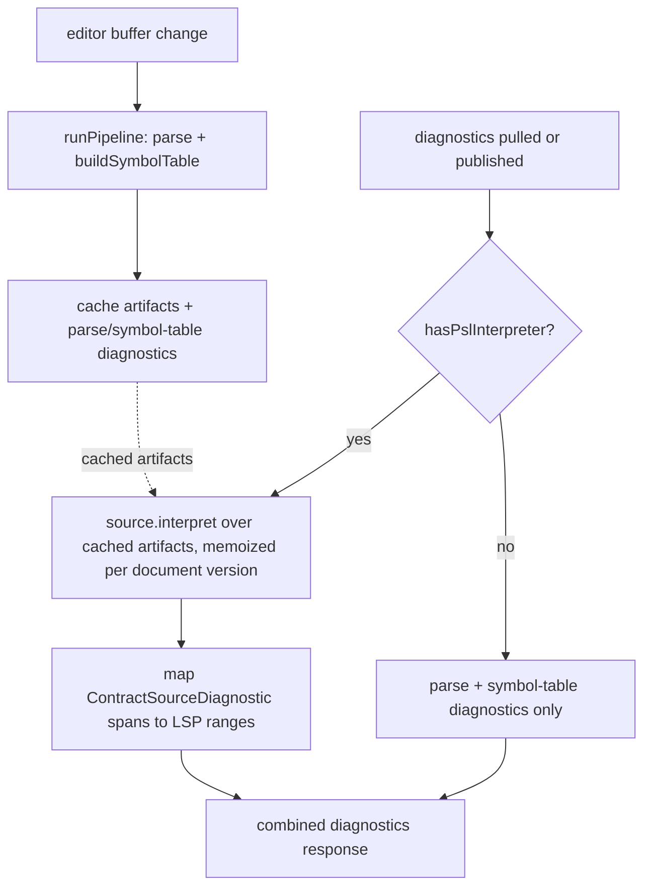

# lsp-interpreter-diagnostics

## Purpose

Editors surface the full verdict of the PSL toolchain as the user types, not just the
front half: today the language server publishes parse + symbol-table diagnostics, while
interpreter diagnostics (relation resolution, type/codec binding, extension-block
semantics) only appear at `contract emit` time. This project makes the interpreter
reachable from a loaded config so the LSP — and any future format-aware tooling — can
report interpretation errors live, without re-doing work or forking the build's pipeline.

## At a glance

The interpreter is trapped inside the provider's `load` closure. `prismaContract()`
(`packages/2-sql/2-authoring/contract-psl/src/provider.ts`) returns a
`ContractSourceProvider` whose only entry point reads the schema from **disk**, parses,
builds the symbol table, then interprets — an opaque all-or-nothing path built for emit.
The LSP (`packages/1-framework/3-tooling/language-server/`) already parses and builds
symbol tables incrementally from editor buffers (`project-artifacts.ts` caches
`document`/`sourceFile`/`symbolTable` per open document) but has no way to hand those
artifacts to the interpreter.

The chosen design is a **capability intersection**: the provider object gains an
`interpret` method, but the method's type is declared at the layer that owns the
artifact vocabulary (psl-parser, authoring layer) — never in `config` (core layer),
which cannot name `SymbolTable`/`SourceFile`/`DocumentAst` (upward type-only imports are
forbidden; `tsPreCompilationDeps: true`).

```ts
// psl-parser (authoring) — owns the capability type, fully typed, no erasure:
export interface PslInterpretInput {
  readonly document: DocumentAst;
  readonly sourceFile: SourceFile;
  readonly symbolTable: SymbolTable;
  readonly sourceId: string;
}
export interface PslInterpretCapable {
  readonly sourceFormat: 'psl';
  interpret(input: PslInterpretInput, context: ContractSourceContext): Result<Contract, ContractSourceDiagnostics>;
}
/** Prepends seeds; forces failure when seeds exist on an ok result (uniform headline). */
export function withSeedDiagnostics(
  result: Result<Contract, ContractSourceDiagnostics>,
  seedDiagnostics: readonly ContractSourceDiagnostic[],
): Result<Contract, ContractSourceDiagnostics>;
export function hasPslInterpreter(
  source: ContractSourceProvider,
): source is ContractSourceProvider & PslInterpretCapable;
```

- `config` (core) declares **no** `interpret` slot. `ContractSourceProvider` becomes a
  union on `sourceFormat`: `PslContractSourceProvider` (`'psl'`),
  `TypeScriptContractSourceProvider` (`'typescript'`), and
  `OpaqueContractSourceProvider` (**open `sourceFormat?: string`** — admits third-party
  formats the toolchain doesn't know). Because the open `string` overlaps the literals,
  TypeScript will not narrow on a bare `sourceFormat === 'psl'` check — narrowing flows
  exclusively through `hasPslInterpreter`, which is the intended single seam anyway. The
  arktype schema ignores undeclared keys, so the extra method passes validation
  untouched.
- `prismaContract()` (and the mongo twin) *genuinely implements* the typed signature
  from the same closure that holds `target` / `createNamespace` / `enumInferenceCodecs`
  — zero casts, zero brands. `load` is refactored to share the same inner
  interpretation function, so build and editor cannot drift.
- The LSP narrows with `hasPslInterpreter(config.contract.source)` (discriminant +
  method-presence check — a runtime-evidence guard, not faith) and feeds its **cached**
  artifacts. No re-parse, no symbol-table rebuild.
- **Interpretation is lazy: it runs only when diagnostics are pulled.** `runPipeline`
  stays parse + symbol-table (it also feeds semantic tokens, folding, and completion,
  which must never pay the interpreter's cost). `interpret` executes at
  diagnostic-assembly time — the pull handler (`connection.languages.diagnostics.on`,
  `server.ts:511`) and the push publication path — with the result cached per document
  version so repeated pulls don't re-interpret unchanged content.
- **Failure surfacing covers both failure classes** (LSP diagnostics require a range;
  there is no span-less diagnostic in the protocol, so both classes get synthetic
  anchors — the same convention as VS Code's own tsserver client, which falls back to
  `new vscode.Range(0, 0, 0, 1)` for span-less config diagnostics):
  - *Span-less interpreter diagnostics* (`ContractSourceDiagnostic.span` is optional and
    real producers omit it) anchor at the start of the schema document.
  - *Config/context-assembly failures* (`loadConfig` / `createControlStack` throwing —
    opaque runtime errors from executed TypeScript, no spans available) surface as
    diagnostics **on the config-file URI** at range (0,0)–(0,1), via the push channel
    unconditionally (the config file belongs to the TypeScript language service, so
    pull never reaches us for it), cleared on successful reload. Precedent: tsserver's
    dedicated `configFileDiag` event anchored on `tsconfig.json`.
- **Last-good project retention.** On config *reload* failure the server keeps serving
  from the last successfully loaded project instead of dropping it and silently
  clearing all schema diagnostics (today's `stopManagingProject` behavior); the config
  diagnostic appears alongside. Precedent: rust-analyzer's `switch_workspaces` — "it
  only makes sense to switch to a partially broken workspace if we don't have any
  workspace at all yet."

Data flow after the change:



## Non-goals

- **No control-stack promotion of the interpreter** (the "Option C" design). Re-homing
  `createNamespace` / `enumInferenceCodecs` / pack refs from provider options into
  target control descriptors, and giving `AuthoringContributions` exactly-one-contribution
  semantics, is a separate project if ever wanted. This project leaves
  `PrismaContractOptions` and the extension `defineConfig` wrappers untouched.
- **No hoisting of parser types into core.** `SymbolTable`/`DocumentAst`/`SourceFile`
  stay in `psl-parser`; core's separate PSL vocabulary
  (`framework-components/control/psl-ast.ts`) is not merged or extended.
- **No cross-file / multi-input interpretation.** The LSP's existing single-input
  symbol-table model (`project-artifacts.ts`) is inherited as-is.
- **No new diagnostics.** The interpreters' existing diagnostic output is surfaced, not
  extended or re-worded.
- **No TypeScript-source (`contract-ts`) analysis.** The capability is PSL-only;
  `sourceFormat: 'typescript'` providers gain nothing.
- **No debounce/scheduling framework beyond lazy pull-time evaluation.** Interpretation
  runs only when diagnostics are assembled (see At a glance); no further debouncing,
  cancellation, or background scheduling is introduced by this project.
- **No custom protocol extensions.** Config health rides standard `publishDiagnostics`
  on the config-file URI; a rust-analyzer-style `serverStatus` notification (custom
  capability + bespoke client support per editor) is explicitly out of scope — this
  server stays portable across stock LSP clients.
- **No spans into the config file.** The config is executed TypeScript; pointing at the
  offending config line would require static analysis of user code. Config diagnostics
  anchor at (0,0)–(0,1) with precision carried in the message.

## Place in the larger world

- **Layering law** (`architecture.config.json` + `dependency-cruiser.config.mjs`):
  framework layer order is `foundation → core → authoring → tooling`, upward imports
  forbidden, type-only imports counted (`tsPreCompilationDeps: true`). The design exists
  precisely to respect this: capability type in authoring, silent core, narrowing in
  tooling. `pnpm lint:deps` is the arbiter.
- **Config plane** (`packages/1-framework/1-core/config/`): `ContractSourceProvider`,
  `ContractSourceContext`, `ContractSourceDiagnostic` live here and are imported
  downward by psl-parser for the capability signature.
- **Capability home**: a new `@prisma-next/psl-parser/interpret` export path (settled),
  mirroring the existing `psl-parser/syntax` / `psl-parser/format` export split.
- **Providers**: `@prisma-next/sql-contract-psl` (`packages/2-sql/2-authoring/contract-psl/`)
  and `@prisma-next/mongo-contract-psl` (`packages/2-mongo-family/2-authoring/contract-psl/`)
  both follow the same parse → symbol-table → interpret shape and both implement the
  capability. Both interpreters already accept exactly the artifacts the LSP caches
  (`symbolTable`, `sourceFile`, `sourceId`); `document` is included in
  `PslInterpretInput` as cheap future-proofing even though neither consumes it today
  (symbols embed their AST nodes).
- **CLI emit path** (`packages/1-framework/3-tooling/cli/src/control-api/operations/contract-emit.ts`
  lines 196–225): assembles a `ContractSourceContext` (control stack +
  `toExtensionInputs`-derived `composedExtensionContracts`). _Corrected during slice
  02 (falsified assumption, 2026-07-10): this was **not** the only assembly site — a
  byte-identical twin lived in the CLI's `client.ts` (`ControlClient.emit`); both
  were collapsed._ Rather
  than extracting that assembly into a shared helper, the root cause is fixed:
  `ControlStack` exposes `extensionContracts: ReadonlyMap<string, Contract>`, built
  inside `createControlStack` beside its existing structural read of
  `contractSpace.contractJson` (`control-stack.ts:409–417`). Context construction
  becomes pure property-picking at every consumer — typecheck-policed, no shared
  module needed; the CLI's inline blindCasts are deleted and the one unavoidable
  `contractJson → Contract` cast lives in framework-components only (settled by
  operator, 2026-07-09).
- **Contract-space declaration lift** _(scope addition, operator-authorized 2026-07-10)_:
  `ContractSpace<TContract>` is already a framework-level type
  (`framework-components/control/control-spaces.ts:77`, "contract-space identity is a
  framework concept"), yet core's `ControlExtensionDescriptor` never declared the
  member — both families declare identical `contractSpace?: ContractSpace<…>` overrides,
  and every consumer bridges the gap with structural casts. The core descriptor gains
  `contractSpace?: ContractSpace`; family overrides stay as covariant narrowings; the
  `assembleExtensionContracts` blindCast and `control-stack.ts` structural views are
  deleted (typed access). Verify in-slice: descriptors' shipped migrations satisfy
  `MigrationPackage`; whether the load-order dependency view can go typed.
- **Language server** (`packages/1-framework/3-tooling/language-server/`): consumes the
  guard + capability; `config-resolution.ts` grows the context construction (property
  picks off the control stack), `pipeline.ts` grows the interpret stage,
  `diagnostic-mapping.ts` grows a span-based mapper (`ContractSourceDiagnostic.span`
  is line/column, unlike parser ranges).
- **LSP playground** (`apps/lsp-playground/`): downstream beneficiary; its config uses
  `prismaContract` and should light up without changes.

## Cross-cutting requirements

- **Build/editor parity by construction.** `interpret(input, context)` IS the
  interpretation code path: it returns the full
  `Result<Contract, ContractSourceDiagnostics>`. `load` literally delegates to
  `this.interpret`, then merges its parse/symbol-table findings **externally** via the
  shared `withSeedDiagnostics(result, seeds)` helper (exported beside the capability):
  seeds prepend on failure; seeds force failure on an ok result; the helper authors a
  uniform headline (operator: users don't care which pipeline stage produced an
  error). A diagnostic produced by `contract emit` for a given schema is produced by
  the LSP for the same buffer content, and vice versa (parse + symbol-table
  diagnostics excluded — the LSP owns those, never calls the helper, and unwraps
  `notOk → diagnostics`, `ok → none`; no double-reporting). _(Shape settled through
  PR #971 review, 2026-07-14: "use `this.interpret`" → Result-returning capability →
  external seed merge with helper-authored headline.)_
- **Zero re-work on the live path.** The LSP never re-parses or rebuilds a symbol table
  to obtain interpreter diagnostics; `interpret` consumes the artifacts the LSP already
  caches.
- **Lazy interpretation.** `interpret` runs only when a diagnostics response or
  publication is being built; non-diagnostic features (semantic tokens, folding ranges,
  completion) never trigger it. Its result is memoized per document version alongside
  the existing `DocumentArtifacts` invalidation (`documentChanged`/`documentClosed`).
- **Zero new casts.** The design admits no `blindCast`/`castAs` at any seam (the
  cast-ratchet must not move); narrowing happens only via the `hasPslInterpreter` type
  guard backed by runtime evidence.
- **Graceful degradation.** A config whose provider lacks the capability (older
  provider, `typescript` source, hand-rolled provider) keeps today's LSP behavior
  exactly: parse + symbol-table diagnostics, no errors, no warnings.
- **No silent vanishing.** Every failure the server can detect is visible somewhere
  appropriate: interpreter diagnostics on the schema document (synthetic anchor when
  span-less), config/assembly failures on the config-file URI, and a failed reload
  never wipes previously published schema diagnostics (last-good retention).
- **Interpreters never throw on recovered input.** Malformed-but-parseable buffers are
  the LSP's steady state; `interpret` must return diagnostics, not raise (matching the
  documented no-throw discipline of `parse` and `buildSymbolTable`).

## Contract impact

None on emitted artifacts: `contract.json` / `contract.d.ts` shape, the Contract IR,
and `Result`-shape of `load` are unchanged. The config-plane change is the
`ContractSourceProvider` type becoming a `sourceFormat`-keyed union whose opaque member
carries an **open `sourceFormat?: string`** — i.e. `ContractSourceFormat` stops being a
closed `'psl' | 'typescript'` enum at the provider boundary; unknown format strings are
admitted and treated as opaque. The arktype schema widens `sourceFormat` to `'string'`
and gains no new required keys, so existing configs validate unchanged. Downstream
consumers that matched exhaustively on the closed enum must treat unknown strings as
opaque (the existing documented behavior for an absent `sourceFormat`); codepaths that
never read `sourceFormat` are unaffected.

## Adapter impact

None. No target adapter (`packages/3-targets/**`) or extension `defineConfig` wrapper
changes; the target-intrinsic options remain where they are, inside
`prismaContract(...)` call sites.

## ADR pointer

The capability-intersection pattern (higher-layer capability type + structural
attachment at the factory + evidence-based guard at the consumer, as the sanctioned
alternative to type erasure across the core/authoring frontier) is architecturally
durable and reusable. Commit: author an ADR (or a pattern doc under
`docs/architecture docs/patterns/`) as part of close-out.

## Transitional-shape constraints

- Every slice keeps `pnpm lint:deps`, `pnpm typecheck`, and `pnpm test:packages` green
  on `main`; the config union change must land either with all in-repo
  `ContractSourceProvider` consumers adapted in the same slice or in a
  backwards-assignable form.
- The LSP must never ship an intermediate state where interpreter diagnostics are
  published without position mapping (a diagnostic with a wrong range is worse than
  none).
- Provider slices (sql, mongo) may land in either order; the LSP slice must degrade
  gracefully until both have landed.

## Project Definition of Done

- [ ] Team-DoD floor items (inherited; see [`drive/calibration/dod.md`](../../drive/calibration/dod.md)).
- [ ] Opening `apps/lsp-playground` (or an editor via `prisma-next lsp`) on a config
      using `prismaContract` shows an interpreter diagnostic (e.g. an unresolvable
      relation) live in the editor, positioned on the offending span, and the
      diagnostic disappears when the schema is fixed — without restarting the server.
- [ ] A config whose provider lacks `interpret` reproduces today's LSP behavior
      byte-for-byte (regression test).
- [ ] Non-diagnostic requests (semantic tokens, folding ranges, completion) do not
      invoke `interpret`; repeated diagnostic pulls on unchanged content interpret at
      most once (verified by test).
- [ ] `ControlStack` exposes `extensionContracts`; `ContractSourceContext`
      construction is pure property-picking at both the CLI emit path and the LSP
      (grep gate: no `contractJson` casts outside framework-components).
- [ ] `pnpm lint:deps` passes with the capability type in psl-parser importing config
      types downward; no new cast-ratchet entries.
- [ ] Both `@prisma-next/sql-contract-psl` and `@prisma-next/mongo-contract-psl`
      implement `interpret`, and each provider's `load` delegates to the same internal
      interpretation function as its `interpret` (no forked pipeline).
- [ ] A span-less interpreter diagnostic (no `span` on `ContractSourceDiagnostic`)
      surfaces anchored at the start of the schema document, not dropped (test).
- [ ] Breaking the config (e.g. a throwing `createControlStack`) surfaces a diagnostic
      on the config-file URI at (0,0)–(0,1); fixing the config clears it — demonstrated
      in the playground or an editor.
- [ ] A failed config *reload* keeps the last-good project serving schema diagnostics
      (they do not vanish), with the config diagnostic shown alongside (regression
      test).
- [ ] ADR / pattern doc for the capability-intersection pattern authored and linked
      from `docs/architecture docs/`.
- [ ] Core `ControlExtensionDescriptor` declares `contractSpace?: ContractSpace`;
      family overrides compile as narrowings; zero `contractJson` casts remain
      anywhere in the repo (grep gate tightened accordingly). _(Scope addition,
      operator-authorized 2026-07-10.)_

## Open Questions

None.

_Settled by operator (2026-07-09): capability interface lives at a new
`@prisma-next/psl-parser/interpret` export path; `interpret` executes lazily at
diagnostics-pull time only; union member names as listed in At a glance, with
`OpaqueContractSourceProvider.sourceFormat` typed as open `string` (not absent);
config/context-assembly failures surface as diagnostics on the config-file URI at
(0,0)–(0,1) via push (tsserver precedent), with last-good project retention on reload
failure (rust-analyzer precedent), rather than being swallowed._

_Settled by operator (2026-07-09, plan refinement): no shared context-assembly
module — the original "exactly one shared module" DoD item was cast-hygiene dressed
as architecture. Root-cause fix instead: `ControlStack` gains `extensionContracts`
(built in `createControlStack`, where the structural read of
`contractSpace.contractJson` already lives), making `ContractSourceContext`
construction pure property-picking everywhere; alternatives rejected: shared
function in `@prisma-next/config`, helper in config-loader, inline-in-both (adds a
Also settled: tracked as Linear issue TML-2984 (not a Linear Project);
done when merged to `main`, no release cut._

_Settled by operator (2026-07-14, PR #971 review, two steps): `interpret` returns the
full `Result<Contract, ContractSourceDiagnostics>` so `load` delegates to
`this.interpret` literally (supersedes the diagnostics-only return settled
2026-07-09); then the transitional `seedDiagnostics?` parameter was dropped — seeds
merge externally in `load` via a shared `withSeedDiagnostics` helper that also
authors a uniform failure headline ("users don't care what part of the pipeline
errors come from"). The capability is two-parameter; the LSP unwraps the failure side
and discards the ok value._

_Settled by operator (2026-07-10, mid-flight): scope addition — lift the
`contractSpace` member declaration to core `ControlExtensionDescriptor`. Triggered by
the operator's design challenge ("contract spaces should be framework-level"); code
review confirmed `ContractSpace` already lives in core and only the declaration site
was family-level — the orchestrator's earlier "hoisting family shape into core"
framing during OF1 was overstated and is corrected. Runs as its own slice stacked on
slice 02; `extensionContracts` (M2) remains the consumer surface — the lift makes its
construction cast-free._

_Settled by operator (2026-07-09, plan refinement): the end-to-end parity-test DoD
item ("LSP diagnostic set equals `contract emit` diagnostic set, demonstrated by a
parity test") is dropped. Build/editor parity remains a cross-cutting requirement
held by construction — one shared inner interpretation function per provider,
pinned by provider-level tests (`interpret` returns exactly `load`'s
interpreter-stage findings) — with span mapping unit-tested and the end-to-end story
covered by playground manual QA._

## References

- Linear: issue [TML-2984](https://linear.app/prisma-company/issue/TML-2984) (team
  Terminal, project "Language Tools Support Prisma Next PSL"; operator settled
  issue-not-project, 2026-07-09) — working branch
  `tml-2984-lsp-interpreter-diagnostics`. Done when merged to `main`; no release cut.
- Design-discussion record: operator design session, 2026-07-09 (this spec is its
  settlement; alternatives considered and rejected: opaque brand on the request type,
  single function-type `blindCast`, module augmentation, provider generics, hoisting
  parser types into core, control-stack promotion — the last recorded as explicit
  non-goal).
- Key code surfaces:
  - `packages/1-framework/1-core/config/src/contract-source-types.ts` — provider union
  - `packages/1-framework/2-authoring/psl-parser/` — capability home
  - `packages/2-sql/2-authoring/contract-psl/src/provider.ts` — sql implementation
  - `packages/2-mongo-family/2-authoring/contract-psl/src/provider.ts` — mongo implementation
  - `packages/1-framework/3-tooling/cli/src/control-api/operations/contract-emit.ts` —
    context-assembly extraction source
  - `packages/1-framework/3-tooling/language-server/src/{pipeline,config-resolution,diagnostic-mapping,project-artifacts}.ts`
    — LSP consumption
- Prior art (config-failure surfacing research, 2026-07-09):
  - tsserver `configFileDiag` event + VS Code client anchoring on the tsconfig URI with
    span-less fallback `new vscode.Range(0, 0, 0, 1)` —
    `extensions/typescript-language-features/src/typeScriptServiceClientHost.ts`
    (`configFileDiagnosticsReceived`) in microsoft/vscode.
  - rust-analyzer workspace-load failure handling — `crates/rust-analyzer/src/reload.rs`
    (`current_status`, `fetch_workspace_error`, `switch_workspaces` last-good retention)
    in rust-lang/rust-analyzer; its custom `experimental/serverStatus` channel was
    considered and rejected here (see Non-goals).
- Rules honored: `.agents/rules/` cast doctrine (zero new casts), layering law
  (`architecture.config.json`, `pnpm lint:deps`).
