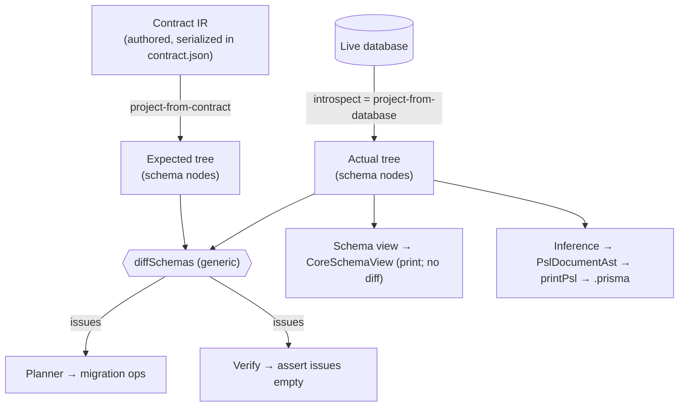

# Design reference: the schema-diff architecture

Companion to [`spec.md`](spec.md). The spec says **what to build** in this slice; this doc is the durable map of the **design components** the slice touches, so they are not re-derived. Where a boundary has been crossed repeatedly, § "What this is NOT" states the rule.

Related project-level design: [`adr-schema-diff-over-structured-ir.md`](../../specs/adr-schema-diff-over-structured-ir.md), [`design-generic-schema-differ.md`](../../specs/design-generic-schema-differ.md).

## The shape in one picture

The schema IR is a **tree of nodes**. Two trees (one derived from the contract, one from the live DB) are **diffed** by a generic walker; the resulting issues feed the **planner** (→ migration) and **verify** (→ assert empty). The same actual tree is independently **printed** (schema view) and **inferred to PSL** (contract infer). Nothing reads a flat table map.

## Components

### 1. The schema node tree

- A schema is a tree: **database → namespace → table → policy**; **roles** are leaves at the **database** level (cluster-scoped — never under a table).
- Every node implements `DiffableNode` (`id`, `isEqualTo`, `children()`).
- Three-layer polymorphic IR (the repo's standard pattern): framework node base → family (`SqlSchemaIRNode`) → target (Postgres adds policies on tables, roles on the root).
- The node **is** the representation. There is no parallel flat structure.

### 2. Contract IR entities ≠ schema nodes

Two distinct class families:

| | Contract IR entity | Schema node |
| --- | --- | --- |
| Examples | `StorageTable`, `PostgresRlsPolicy`, `PostgresRole` | `Postgres{Database,Namespace,Table,Policy,Role}SchemaNode` |
| Authored / serialized into `contract.json`? | Yes (entity kinds, extend `SqlNode`) | No |
| Walked by the differ (`DiffableNode`)? | No | Yes |
| Built by | the author (PSL/TS) | project-from-contract / introspection |

A class is **one or the other, never both**. Tables already model this (`StorageTable` contract vs `PostgresTableIR` node); policies/roles now match.

### 3. Two derivations produce the tree

- **project-from-contract** — contract IR → schema tree (the *expected* side).
- **project-from-database (introspection)** — live DB → schema tree (the *actual* side). Returns the **target's node**.
- Both produce the same node shape, so the differ compares like with like.

### 4. The generic differ

- `diffSchemas(expected, actual)` walks two `DiffableNode` trees and emits `{ path, outcome }` issues.
- It is **generic** — it knows nothing about RLS, tables, policies, or any target kind. It lives in the framework. Per-kind meaning lives in the nodes' `isEqualTo` and in how the planner maps issues.

### 5. `introspect()` returns a node

- Its declared return type is **a node** (generic), **not** `SqlSchemaIR`.
- To *use* it, you pass it to a method that knows the target-specific node type, which `ensure`s and walks it — the pattern the planner already uses: `options.schema: unknown` → `ensurePostgresDatabaseSchemaNode(...)`.
- SQLite returns its own node from the same family method. There is no shared flat schema type and nothing branches on a "uniform view".

### 6. The consumers of a schema — two operations, nothing else

Everything done with a schema is one of these. None reads a flat `.tables` off the root.

- **Diff** — derive two trees, run the generic differ. Two endings:
  - **Planner**: issues → migration ops.
  - **Verify**: ask the differ/planner for issues and assert they're empty. Verify does **not** walk the tree itself.
- **Print** — the **schema view** walks a generic tree of printable nodes into a `CoreSchemaView` through its own output interface. It is agnostic to the schema-IR structure and does not diff.

Only the **diff machinery** (differ + planner) is structure-aware — it `ensure`s the concrete target node and walks the tree. Verify consumes its issues; the view walks printable nodes. Neither verify nor the view interrogates the tree.

### 7. The legacy relational diff (side-by-side)

- The relational table/column comparison still runs its own pre-generic-differ logic, retired by **follow-on A** (the relational port), not here.
- It is part of the **diff machinery** — like the generic differ and the planner, it `ensure`s the target node and walks the tree. It is **not** a separate consumer that flat-reads `.tables`, and **verify** does not interrogate it — verify only asks for the combined issues and asserts them empty.
- The new tree path emits only new native structures; the legacy diff keeps working until follow-on A ports it onto the generic differ.

### 8. Inference (DB → PSL) is target logic

- Walks the tree → `PslDocumentAst` → `printPsl` → `.prisma`. Used by `contract infer`.
- It lives on the **target descriptor** (`stack.target`, beside `contractSerializer`); the family instance's `inferPslContract` **delegates** to it. It is **not** on the control adapter (no DB I/O) and **not** family-resident (that is the current layering violation: `sql-schema-ir-to-psl-ast.ts` hardcodes `createPostgresTypeMap`/`createPostgresDefaultMapping`).
- **Framework owns** the view (`PslDocumentAst`) and the printer (`printPsl` / `@prisma-next/psl-printer`) — reuse, do not reinvent.
- **Target owns** the dialect knowledge — the type map (`int4 → Int`, `varchar → String @db.VarChar`) and default map (`now() → @default(now())`). The shape-neutral helpers (name transforms, relation inference, generic `mapDefault`) are plain utilities the target imports.
- The target walks its **own tree** — there is no flat document builder. Emitting top-level entities (policies/roles → PSL extension blocks) is a later slice; this slice emits relational-only PSL, byte-identical to today.
- **TS contract inference** does not exist yet (only `PslContractInferCapable`). It is a future **sibling** capability of the same shape — target-owned, walks the same tree, its own `printTs`. The PSL-specific name (`inferPslContract`) already anticipates it.

### 9. Where logic lives — the three target surfaces

| Surface | Holds | Examples |
| --- | --- | --- |
| **Target descriptor** (`stack.target`) | target **logic** — pure transforms | contract serializer, **inference**, entity kinds, authoring |
| **Control adapter** (`stack.adapter`) | DB **communication** — I/O | **introspect** (reads the DB), markers, ledger, query lowering |
| **Family instance** | shared **behavior**, generic over the node type | delegates logic → descriptor, I/O → adapter |

`introspect` is on the adapter because it reads the database. Inference is on the descriptor because it is a pure tree→PSL transform. That distinction is the whole reason they live in different places.

### 10. Package / layer placement

- **Framework** (`1-framework`): `DiffableNode` + `diffSchemas`; `PslDocumentAst` + `printPsl`.
- **Family** (`2-sql`): `SqlSchemaIRNode` base; the generic PSL-infer **utilities**; `verifySqlSchema` (legacy relational verify, shared with SQLite).
- **Target** (`3-targets/postgres`): the schema-node tree (`schema-ir/`); the Postgres **contract-IR entities**; **inference** + the dialect maps; the differ/planner wiring.
- `schema-ir/` holds **only** the five `…SchemaNode` classes — the only `DiffableNode` implementors in the target.

## Naming

- Diff nodes carry the **`…SchemaNode`** suffix (bare `…IR` is dropped — the repo has several IRs).
- **Generic machinery is generic** — never RLS-prefixed. It is *the* differ, *the* planner — they handle any entity kind.
- Node guards are **static methods**: `PostgresTableSchemaNode.is(node)` / `.assert(node)` / `.ensure(node)`.

## What this is NOT — the boundaries we keep crossing

- `introspect()` does **not** return a flat `SqlSchemaIR`. It returns **a node**; consumers `ensure` the target type and walk it.
- The differ and planner are **not** RLS-specific. They are **generic**. RLS is one entity kind among many.
- **Verify** does **not** walk the tree — it asks the differ/planner for issues and asserts them empty. The **schema view** walks printable nodes and is agnostic to the schema-IR structure. Neither is a structure-aware consumer; only the differ + planner are.
- The DB **driver** and the control **adapter** are **not** involved in diffing, verifying, or printing — those are pure logic over nodes; the driver/adapter are DB I/O.
- Inference is **not** on the adapter (that is DB I/O) and **not** in the family (that hardcodes dialect). It is **target logic**, on the target descriptor.
- Schema nodes do **not** expose a flat `.tables` / merged view for legacy consumers. The **namespace node is** the per-schema shape; the diff machinery walks to it like the planner. No shim, no `toLegacyFlat*` adapter, no dual representation.
- The family `SqlSchemaIR` does **not** need to become a tree. The namespace node satisfies the per-schema shape; the family methods are typed to a node and downcast on use.
- The policy/role **schema nodes are not** the policy/role **contract entities**. They are separate classes built by the projection.
