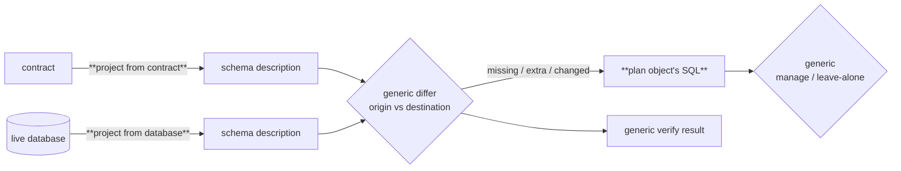

# Contributing a new schema-object type to the migration system

**Status:** Design seed · **Date:** 2026-06-18

> This is an orientation-level design seed. The full treatment — the schema-IR
> currency and interfaces, the diff-engine algorithm (matching, equality,
> nesting, cross-kind dependency ordering), the contribution-registration API,
> and the accompanying ADRs — is the design work for the slice that builds this
> seam. This note fixes the model and the shape of the problem so that slice has
> a foundation to expand.

## Purpose

The migration system understands a fixed set of universal schema objects —
tables, columns, indexes, constraints. But a database target, or an extension
built on one, often needs schema objects the generic engine has never heard of:
PostgreSQL row-level security (RLS) policies and roles, materialised views,
publications, and so on.

This note describes how a target or extension contributes such an object type so
that it participates **fully** in migrations — authored in the schema, planned
into generated SQL, applied to the database, and checked by verify — using the
framework's generic mechanisms. The target supplies only the parts that are
genuinely specific to its object; everything else is shared machinery it plugs
into. RLS policies are used throughout as the worked example.

## What the migration system does

The planner has exactly one job: find the path from an **origin** schema IR to a
**destination** schema IR. Both are *schema descriptions* — one uniform in-memory
shape — and the planner is **provenance-agnostic**: it never knows or cares how
either side was produced. A generic **differ** aligns the two and reports, per
object, what is *missing*, *extra*, or *changed*; that output drives the
generated SQL and the verify result.

A schema description is produced by a **derivation**, of which there are two:

- **from a contract**, and
- **from a live database** (introspection).

A command chooses which derivation feeds each side. Generating a migration
offline derives both sides from contracts; reconciling derives the origin from a
database and the destination from a contract; comparing two databases would
derive both from databases. The planner sees none of this — only two schema IRs.

The consequence for a contributed object type: it must be **representable in the
schema IR and derivable into it from every source**. If a derivation can't
produce it, that object is simply absent from the resulting schema IR, and the
(correctly provenance-agnostic) planner never sees it — no error, just a silent
hole. So the derivations are where a contributed type must plug in.

## The contribution model

To add a new object type, a target plugs into a fixed set of extension points.
Most of the pipeline is generic and shared; the target supplies only the
object-specific pieces (shown in bold).

The extension points, and who owns each:

1. **Authoring → contract** *(target-supplied, via a generic mechanism).* How
   the object is written in the schema language and lowered into the contract as
   a first-class object. The framework provides a generic registration mechanism
   keyed by the object's kind; the target supplies the parser block, the
   in-memory class, and the lowering. *(RLS: a `policy_select` block becomes a
   policy object stored in the contract under its model's namespace.)*

2. **Project from a contract → schema description** *(target-supplied).* Convert
   the object, as written in a contract, into the schema description. This builds
   the destination of every operation, and both sides when generating offline.
   *(RLS: read the contract's policies into policy nodes.)*

3. **Project from a live database → schema description** *(target-supplied).*
   Read the object from the database catalog into the same schema description.
   This builds the origin when reconciling against a live database. *(RLS: query
   the catalog for policies into the same policy nodes.)*

4. **Diff** *(generic).* The shared differ aligns the two descriptions by each
   object's identity and reports missing / extra / changed. It names nothing
   target-specific; it only needs each object to answer "what is your identity?"
   and "are you equal to this other one?"

5. **Plan the object's SQL** *(target-supplied).* Turn each difference into the
   target's DDL: missing → create, extra → drop, changed → alter (or
   drop-and-recreate). *(RLS: missing → enable row security + create policy;
   extra → drop policy.)*

6. **Verify** *(generic).* Any unresolved difference becomes part of the verify
   verdict — verify fails and names the drifted object. The target writes no
   verify logic of its own.

7. **Decide what's ours to manage** *(generic, reused).* A shared policy decides
   whether a given object is the contract's to manage (reconcile it) or belongs
   to someone else (leave it untouched). The target reuses this; it does not
   reinvent it.

The framework owns 4, 6, and 7 and never learns what the object is. The target
owns 1, 2, 3, and 5 — the only places where "this is an RLS policy" is allowed
to be known.

## Both derivations are required

Project-from-contract and project-from-database are peers, not a primary and a
fallback. A command wires either one to either side:

| Operation | Origin (from) | Destination (to) |
|---|---|---|
| Generate a migration offline | a contract | a contract |
| Reconcile / apply to a database | a live database | a contract |
| Verify against a database | a live database | a contract |
| Compare two databases | a live database | a live database |

(The last row isn't a command today, but nothing in the planner forbids it —
that's what provenance-agnostic means.)

A contributed object type needs **both** derivations: if a command feeds either
side from a source the type can't be derived from, the type vanishes from that
schema IR and the planner silently omits it. Concretely —

- with only project-from-database, the type is invisible whenever a side is
  contract-derived (the destination of every reconcile, and both sides offline);
- with only project-from-contract, the type is invisible whenever a side is
  database-derived (the origin of every reconcile).

Both derivations must also emit the **same** schema-IR shape, so the generic
differ compares like with like. If a code path hands the differ a raw contract in
place of a projected schema IR, the comparison stops being generic and the object
type leaks back out of the shared machinery.

## Worked example: RLS policies

A Postgres RLS policy is a target-specific object. Mapped onto the model:

1. **Authoring:** `policy_select profile_owner_read { ... }` lowers into the
   contract as a policy object on the `Profile` model's namespace.
2. **Project from contract:** read those policy objects from the contract into
   policy nodes in the schema description.
3. **Project from database:** query the catalog for the table's policies and emit
   the same policy nodes.
4. **Diff:** a policy's identity is its name; two policies with the same name are
   compared for equality. The differ reports created / dropped / changed
   policies with no knowledge that they are policies.
5. **Plan SQL:** missing → `ENABLE ROW LEVEL SECURITY` + `CREATE POLICY`; extra →
   `DROP POLICY`.
6. **Verify:** a policy present in the database but not the contract (or vice
   versa) fails verify, naming the policy.
7. **Manage / leave-alone:** a table the contract manages has its policies
   reconciled; a table the contract doesn't own is left untouched.

## Implementation status

The generic machinery exists and is used:

- **Authoring (point 1)** — implemented as a generic, kind-keyed contribution
  mechanism; RLS authoring rides it.
- **Diff (point 4), verify (point 6), manage/leave-alone (point 7)** —
  implemented and generic; RLS reuses them unchanged.
- **Plan SQL (point 5)** — implemented for RLS.

The two projections are not yet first-class contribution points:

- **Project from a database (point 3)** exists for RLS but is **hardcoded** into
  the Postgres database reader rather than registered as a contribution. Adding
  another introspected object kind today means editing that reader.
- **Project from a contract (point 2)** does **not** exist for target-specific
  objects — the contract→schema conversion is generic and only handles universal
  objects, so it drops the rest. So RLS is absent from any schema IR derived from
  a contract; it works at all only because the diff is currently fed the contract
  directly in place of a projected schema IR. Generating a migration offline,
  which derives both sides from contracts, cannot emit RLS at all.

Closing the design means making points 2 and 3 a registered pair of converters,
the same way authoring (point 1) is registered — so a target adds an object kind
that works across every command, and the generic engine stays free of any
target-specific knowledge.

## Appendix — where this lives in the code

- Contract → schema conversion (generic; handles only universal objects):
  `packages/2-sql/9-family/src/core/migrations/contract-to-schema-ir.ts`, reached
  via the `contractToSchema` hook in
  `packages/1-framework/1-core/framework-components/src/control/control-migration-types.ts`.
- Database reader (RLS introspection hardcoded here):
  `packages/3-targets/6-adapters/postgres/src/core/control-adapter.ts`
  (`introspect`).
- Generic differ:
  `packages/1-framework/1-core/framework-components/src/control/schema-diff.ts`.
- Schema description and policy/role objects:
  `packages/3-targets/3-targets/postgres/src/core/postgres-schema-ir.ts`,
  `postgres-rls-policy.ts`, `postgres-role.ts`.
- Planning and the current contract-fed diff:
  `packages/3-targets/3-targets/postgres/src/core/migrations/planner.ts`,
  `verify-postgres-rls-policies.ts`.
- Authoring contribution mechanism (point 1), the model points 2 and 3 should
  mirror: the entity-kind registration used by the Postgres target's authoring.
</content>
