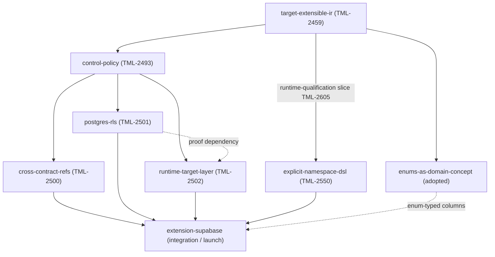

# Supabase integration — umbrella project

> **Status: umbrella tracker.** This directory no longer carries a single project spec/plan. The Supabase integration is decomposed into six framework-primitive projects plus an integration project. Each constituent has its own `spec.md` + `plan.md` and its own Linear ticket. The umbrella retains shared artefacts that don't belong to any single constituent: the canonical decisions log, the design-artifact example app, the deferred-items list, and the long-form overview.

## Decomposition

The Supabase integration is delivered through six framework-primitive projects + one integration project. The framework primitives are independent of each other; all depend on the target-extensible IR foundation (TML-2459) — `explicit-namespace-dsl` specifically on its runtime-qualification slice (TML-2605). The integration project depends on all of them.

Status reflects the state as of the last planning pass (2026-06-11); keep it current as constituents land. The bottom row (`enums-as-domain-concept`) is a separate Terminal framework project adopted into this list because Supabase relies on enums — see the note below the table.

| Project | Concern | Status | Linear |
|---|---|---|---|
| target-extensible-ir-namespaces | Polymorphic Contract IR + Schema IR; `Namespace` framework concept; within-contract cross-namespace FKs | ✅ **Done & closed** (incl. runtime-qualification TML-2605; project dir removed) | [TML-2459](https://linear.app/prisma-company/issue/TML-2459) |
| control-policy | Framework primitive: `control` field + `ControlPolicy` enum (`managed`/`tolerated`/`external`/`observed`); verifier/planner dispatch tables | ✅ **Done & closed** (fully landed incl. `@@control` PSL; design in ADR 224; project dir removed) | [TML-2493](https://linear.app/prisma-company/issue/TML-2493) |
| [cross-contract-refs](../../docs/architecture%20docs/subsystems/6.%20Ecosystem%20Extensions%20%26%20Packs.md) | FK references across contract-space boundaries; brand machinery; `supabase:auth.AuthUser` PSL grammar; dependency graph + namespace ownership | ✅ **Done & closed** (M1 #745, M2 #752, M3a #756, M3b #765; project dir removed) | [TML-2500](https://linear.app/prisma-company/issue/TML-2500) |
| [postgres-rls](../postgres-rls/spec.md) | RLS policies + Postgres roles as target-only IR; `.rls(...)` TS surface + `policy <name> { ... }` PSL surface; content-addressed wire names; verifier + planner | 🚧 **In progress (Will)** — fully unblocked (cross-contract-refs + PSL-block substrate both landed) | [TML-2501](https://linear.app/prisma-company/issue/TML-2501) |
| [runtime-target-layer](../../docs/architecture%20docs/adrs/ADR%20230%20-%20Runtime%20target%20layer%20session-coupled%20connections.md) | Abstract `SqlRuntimeBase` family seam + `*RuntimeImpl` concretions behind bare-name interfaces; role binding via session-coupled connections (`set_config(role/claims)` + `RESET ALL`); **also shipped the `SupabaseRuntime` + `supabase()` façade** (`asUser`/`asAnon`/`asServiceRole`). Design in ADR 230. | ✅ **Done & closed** (project dir removed; proven independently against a raw-SQL RLS policy) | [TML-2502](https://linear.app/prisma-company/issue/TML-2502) |
| [explicit-namespace-dsl](../explicit-namespace-dsl/spec.md) | Namespace-aware DSL/ORM query surface (`db.sql.<ns>.<table>`, `db.<ns>.<Model>`); disambiguates colliding cross-namespace names (`auth.users` vs `public.users`); additive on the default-namespace fallback | 🚧 **In progress (Serhii)** — **launch blocker** | [TML-2550](https://linear.app/prisma-company/issue/TML-2550) |
| [extension-supabase](../extension-supabase/spec.md) | `@prisma-next/extension-supabase` package: shipped contract, typed handles, pack descriptor, example app. (The `SupabaseRuntime` + `supabase()` façade already shipped under runtime-target-layer / ADR 230 — this project's remaining scope is the contract/pack/handles/example surface.) | 🚧 **M1 + skeleton in progress** ([TML-2834](https://linear.app/prisma-company/issue/TML-2834)) | [TML-2503](https://linear.app/prisma-company/issue/TML-2503) |
| [enums-as-domain-concept](../enums-as-domain-concept/spec.md) | Enum as a domain-plane entity — a name→value `valueSet` restriction layered on the column's codec (not a native `CREATE TYPE`); Postgres realizes it as a value-set + check constraint, Mongo as a `$jsonSchema` validator; typed reads + `db.enums.<ns>.<Name>` + declaration-order `ORDER BY`. **Adopted into the list** — `auth.*` and typical app schemas lean on Postgres enums. | 🚧 **In progress** (separate Terminal project) — substrate (TML-2850) + Postgres enforcement (TML-2851) + read surface (TML-2852) landed; PSL authoring (TML-2882), member defaults (TML-2855), native-enum cutover (TML-2853), Mongo vertical (TML-2884) remain | [Enums project](https://linear.app/prisma-company/project/enums-as-a-domain-concept-696d6b36cb89) |

The PSL-block substrate `target-contributed-psl-blocks` ([TML-2537](https://linear.app/prisma-company/issue/TML-2537)) is not a constituent but was on the critical path: ✅ **landed** (substrate + close-out; project dir removed), so `postgres-rls`'s PSL `policy {}` surface is now unblocked. Note: the substrate uses **per-operation keywords** (`policy_select` / `policy_insert` / …) rather than a single conditional `policy { operation = … }` block — postgres-rls's PSL grammar must align with that shape.

`enums-as-domain-concept` is likewise a separate Terminal framework project (its own [Linear project](https://linear.app/prisma-company/project/enums-as-a-domain-concept-696d6b36cb89), not one of the original six), tracked here because enums are central to Supabase: the `auth.*` schema declares Postgres enum types and typical app schemas use them heavily, so faithfully modelling enum-typed columns in the Supabase contract — and giving Supabase apps first-class enums — depends on it. It is **in flight**: the contract substrate, Postgres check-constraint enforcement, and the typed read surface (`db.enums`) have landed; PSL authoring, member defaults, the native-enum cutover, and the Mongo vertical remain. It is not a hard blocker for the minimal walking skeleton, but it is required for faithful enum-typed `auth.*` columns and the v0.1 enum story. (Design choice worth noting: the Postgres realization is a text column + value-set + check constraint, **not** a native `CREATE TYPE … AS ENUM`.)

### Dependency graph

`runtime-target-layer` shipped **independently** of `postgres-rls`: its end-to-end proof (below-middleware role binding actually filtering rows) is demonstrated against a **raw-SQL RLS policy** authored in the test fixture, so it needed neither RLS-policy authoring nor roles-as-IR to land. `postgres-rls` later swaps its authored policies onto that same runtime substrate, but the two were never sequence-coupled.

`cross-contract-refs`, `postgres-rls`, and `runtime-target-layer` could ship in any order once `target-extensible-ir` and `control-policy` landed. `explicit-namespace-dsl` runs on a parallel track: it depends only on the runtime-qualification slice of `target-extensible-ir`, not on `control-policy`, so it can be built alongside them. `extension-supabase` consumes all four — and it **cannot ship without `explicit-namespace-dsl`**, because a Supabase app addresses tables in `auth.*` and `public.*` that collide by bare name (both schemas have a `users` table); without the namespace-aware query surface there is no way to reach `auth.users`, and everything collapses into a single namespace. That is the user-facing fudge the integration must not ship.

## Walking skeleton — the incremental example

The integration is delivered against a **walking skeleton**: a single *runnable* example app, stood up early and grown one feature at a time, that serves as the continuous integration surface across all the independent lanes. Rather than building the canonical example as a big-bang at the end of `extension-supabase`, we stand it up at the start and make "wire your feature into the running example" a **definition-of-done clause on every constituent**. A seam mismatch between two projects then surfaces the day it's introduced, not at integration time.

- **Location:** `examples/supabase` (top-level, alongside the other example apps — *not* under the package). The package itself stays at `packages/3-extensions/supabase/`.
- **Stood up by:** `extension-supabase` **M1**, which only needs the already-landed foundation + `control-policy`. M1 ships `/pack` + the **PSL-authored** Supabase contract (`defaultControl: 'external'`); the skeleton runs on the stock `@prisma-next/postgres/runtime` factory. **No `/contract` typed-handles subpath in M1** (re-cut 2026-06-05): it has no consumer in the skeleton, and cross-space model refs + roles are settled inside `cross-contract-refs` / `postgres-rls` — the hand-shipped `ModelHandle`/`RoleRef` export may not exist in its sketched form (see [C5](decisions.md)/[C13](decisions.md)). The Supabase `/runtime` subpath (`SupabaseRuntime`, `asUser`/`asAnon`/`asServiceRole`) is deferred to M2 — the skeleton does not need it to be runnable.
- **Grows as each constituent lands:**

  | Constituent lands | The running example gains |
  |---|---|
  | `extension-supabase` M1 | Loads the Supabase contract and proves the **`external`** machinery end-to-end: migrates the composed contract against a DB seeded with the `auth.*`/`storage.*` tables, asserting the planner emits no DDL for them and the verifier confirms them present (not just a bare `public.*` query). |
  | `runtime-target-layer` | ✅ `/runtime` runs on `SupabaseRuntime` via the `supabase()` façade; role binding enforced through session-coupled connections (ADR 230). |
  | `cross-contract-refs` | `Profile.userId → auth.User.id` FK with cascade; planner emits qualified `REFERENCES "auth"."users"`. |
  | `postgres-rls` | `.rls([…])` / `policy {}` policies on `Profile`; verifier diffs `pg_policies`. Enforcement proven via manual `SET ROLE` until the runtime lands. |
  | `explicit-namespace-dsl` | Query reaches `auth.users` explicitly alongside `public.users`. |
  | `extension-supabase` M2/M3 | `asUser`/`asAnon`/`asServiceRole` role binding; the live-query RLS e2e (anon denied / user sees own rows / service_role bypasses) lights up. |

  Each constituent's plan carries the matching one-line DoD: *"the `examples/supabase` app exercises this feature."*

### How it's tested

Two lanes, deliberately split:

- **Hermetic (every-PR CI): PGlite + a hand-authored Supabase shim.** PGlite is real Postgres in WASM, so roles, `SET ROLE`, RLS, and `current_setting('request.jwt.claims')` all work in-process with no Docker. A `bootstrapSupabaseShim(client)` helper (mirroring [`test/integration/test/postgres-bootstrap.ts`](../../test/integration/test/postgres-bootstrap.ts)) seeds the roles (`anon`/`authenticated`/`service_role`/`authenticator`), the `auth` schema + `auth.users`, and `auth.uid()`/`auth.jwt()`/`auth.role()` as SQL functions reading the session GUCs — exactly how real Supabase implements them. This lane covers the FK, RLS enforcement (manual `SET ROLE` for policy correctness), the verifier, and namespace queries.
- **Acceptance (manual / nightly, not per-PR): real Supabase.** Either the Supabase CLI via the `supabase/setup-cli` GitHub Action + `supabase start` (full Docker stack) or a real cloud project behind secrets. This is the ground truth for GoTrue-issued JWTs and the [C8](decisions.md) round-trip property (introspect → emit → re-introspect → diff empty). Docker stays off the hot path; it only runs here.

This separation also answers "how do we test RLS before the runtime exists": **policy correctness** (does an emitted `CREATE POLICY` filter rows when a role is active?) is tested now by setting the role by hand; **automatic role binding** (does `asUser(jwt)` bind the role below middleware?) is what the runtime project + M2 add, and its live-query e2e arrives with them. See [`decisions.md` C13/C14](decisions.md).

## Running order (current sequencing)

The foundation, `control-policy`, `cross-contract-refs`, and the PSL-block substrate are all done, so the remaining work is highly parallel. Capacity: Will runs ~2 concurrent lanes (currently on `postgres-rls`); Serhii owns `explicit-namespace-dsl`.

**Done:**

- ✅ **`cross-contract-refs`.** Landed the contract-aggregate/brand machinery and the headline `Profile → auth.User` cross-contract FK. (Was deliberately sequenced before `postgres-rls`: fully unblocked end-to-end while RLS's PSL surface was still gated on the substrate below, and it lands machinery the rest leans on.)
- ✅ **`target-contributed-psl-blocks` (TML-2537).** The PSL-block extensibility substrate that lets the Postgres pack contribute `policy_*` keywords. It was the pivot that unblocks `postgres-rls`'s PSL surface — now landed, so RLS can run TS + PSL in one pass.

**Active / remaining:**

1. **Lane — `postgres-rls`** (Will, in progress). Now fully unblocked (both its dependencies above landed), so it runs TS + PSL together. Its PSL grammar must align with the substrate's **per-operation keyword** shape (`policy_select` / `policy_insert` / …), not a single conditional `policy { operation = … }` block.
2. **✅ `runtime-target-layer` — shipped (ADR 230).** Landed independently of `postgres-rls`: below-middleware role binding is proven against a raw-SQL RLS policy in the test fixture, so it needed no RLS-authoring to demonstrate. It delivered the abstract `SqlRuntimeBase` seam, the `*RuntimeImpl`/interface scheme, the session-coupled-connection role binding, **and** the `SupabaseRuntime` + `supabase()` façade — so `extension-supabase` consumes the façade rather than building it.
3. **In parallel throughout — `explicit-namespace-dsl` (Serhii).** The launch blocker; depends only on the landed TML-2605.
4. **Lane 1 / integration — `extension-supabase`.** M1 + walking skeleton in progress ([TML-2834](https://linear.app/prisma-company/issue/TML-2834)); then M2→M4: role binding (`asUser`/`asAnon`/`asServiceRole`), the live-query RLS e2e, real-Supabase acceptance, close-out.

With the substrate landed, `postgres-rls` already holds its own lane — the "longest pole" now simply runs to completion in parallel with Serhii's launch blocker and the `extension-supabase` skeleton.

## What's in the umbrella directory

| File | Purpose |
|---|---|
| [`decisions.md`](decisions.md) | **Canonical decision log.** A1–A8, B1–B6, C1–C12 + offcuts OC1–OC4. The single source of truth that constituent specs cite. |
| [`overview.md`](overview.md) | End-to-end user story — what a Supabase-using Prisma Next app looks like across all the constituent projects. Read this for the integration narrative. |
| [`deferred.md`](deferred.md) | Items explicitly deferred from v0.1 (visibility/encapsulation, introspection-based emit, realtime, etc.). Umbrella-level — items deferred from a specific constituent live in that constituent's spec under Non-goals. |
| [`developer-experience.md`](developer-experience.md) | Roadmap material on the DX surface beyond v0.1 — the `prisma-next init --supabase` scaffold, getting-started docs, migration patterns. Not in any constituent's v0.1 scope; tracked here until the next shaping pass. |
| [`example/`](example/) | **Design artefact.** TypeScript written against the design as it stood during shaping. Surfaces concrete design holes; informed every constituent project. The `extension-supabase` project ships a related-but-distinct *working* example app in its own M3. |

## What's been retired

Three component docs were migrated into the constituent project specs and removed from the umbrella:

- `cross-contract-refs.md` → [`cross-contract-refs/spec.md`](../cross-contract-refs/spec.md).
- `rls.md` → [`postgres-rls/spec.md`](../postgres-rls/spec.md).
- `extension-package.md` → [`extension-supabase/spec.md`](../extension-supabase/spec.md).

Two ADR drafts were migrated alongside:

- `specs/adr-content-addressed-policy-names.md` → [`postgres-rls/specs/`](../postgres-rls/specs/adr-content-addressed-policy-names.md).
- Runtime target-layer design → promoted to [ADR 230](../../docs/architecture%20docs/adrs/ADR%20230%20-%20Runtime%20target%20layer%20session-coupled%20connections.md) (the `runtime-target-layer` project closed; its dir was removed).

The `decisions.md` log retains the canonical record of all decisions reached during umbrella shaping; constituent specs cite it rather than re-stating its content.

## How to read this as a fresh contributor

1. Read [`decisions.md`](decisions.md) first — at-a-glance state of what's settled across the whole integration.
2. Read [`overview.md`](overview.md) for the end-to-end narrative — how the constituent projects compose into a Supabase-using Prisma Next app.
3. Skim [`example/`](example/) — the design-artifact example app. It's intentionally not implementation-ready; it informed the design surface.
4. Identify which constituent project is closest to your work. Read its `spec.md`. The spec is self-contained except for references back to `decisions.md` and to sibling specs.
5. Read the corresponding `plan.md` for the slice structure.
6. [`deferred.md`](deferred.md) is short — worth skimming so you don't propose deferred work.

## Close-out

When all constituent projects land:

- The umbrella `decisions.md` is promoted into a Supabase-integration retrospective doc under `docs/architecture docs/` (or its content is folded into the relevant ADRs / subsystem docs that came out of the constituent close-outs, whichever the team prefers).
- The umbrella `overview.md` may migrate into a `docs/` reference doc on multi-extension architecture, depending on how durable the integration narrative turns out to be.
- The `example/` design artefact is deleted; the *working* example app shipped by the `extension-supabase` project becomes the canonical reference.
- This `projects/supabase-integration/` directory is deleted alongside the constituent project directories per the project workflow rule.
