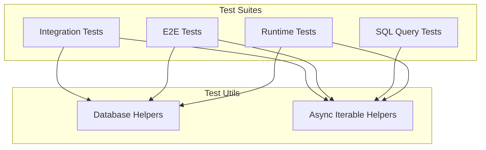

# @prisma-next/test-utils

Shared test utilities for Prisma Next test suites.

## Location

This package is located at `test/utils/` (not in `packages/`) as it is a test utility package, not a source package.

## Overview

The test-utils package provides shared generic test helpers used across multiple test suites in Prisma Next. It centralizes common testing patterns to reduce duplication and ensure consistency.

## Purpose

Provide reusable generic test utilities that DRY up common testing patterns across packages. Centralize database setup/teardown and async iterable utilities. This package has zero dependencies on other `@prisma-next/*` packages to avoid circular dependencies.

## Responsibilities

- **Database Management**: Create dev databases, manage connections, setup/teardown schemas
- **Async Iterable Utilities**: Collect and drain async iterables

**Non-goals:**
- Test-specific business logic
- Package-specific test utilities (those belong in package test directories)
- Runtime-specific utilities (see `@prisma-next/runtime/test/utils`)
- Contract-related utilities (see `test/e2e/framework/test/utils.ts`)

## Architecture



**Note**: Runtime-specific utilities are in `@prisma-next/runtime/test/utils`, and contract-related utilities are in `test/e2e/framework/test/utils.ts`.

## Components

### Database Helpers

- `createDevDatabase(options?)`: Creates a dev database instance
- `withDevDatabase(fn, options?)`: Executes a function with a dev database, auto-cleanup
- `withClient(connectionString, fn)`: Executes a function with a database client, auto-cleanup
- `teardownTestDatabase(client, tables?)`: Tears down test database

### Async Iterable Helpers

- `collectAsync(iterable)`: Collects all values from an async iterable
- `drainAsyncIterable(iterable)`: Drains an async iterable without collecting

### Column Descriptors

Adapter-agnostic column type descriptors for test fixtures. These match common PostgreSQL types but don't depend on `@prisma-next/adapter-postgres` or any target-specific packages. Use these in test fixtures to avoid adapter/target dependencies.

**Available descriptors:**
- `int4Column`, `int2Column`, `int8Column`: Integer types
- `textColumn`: Text type
- `boolColumn`: Boolean type
- `float4Column`, `float8Column`: Floating-point types
- `timestampColumn`, `timestamptzColumn`: Timestamp types

**Usage:**
```typescript
import { int4Column, textColumn } from '@prisma-next/test-utils/column-descriptors';
import type { TargetPackRef } from '@prisma-next/contract/framework-components';
import sqlFamily from '@prisma-next/family-sql/pack';
import { defineContract, field, model } from '@prisma-next/sql-contract-ts/contract-builder';

const postgresPack: TargetPackRef<'sql', 'postgres'> = {
  kind: 'target',
  id: 'postgres',
  familyId: 'sql',
  targetId: 'postgres',
  version: '0.0.1',
  capabilities: {},
};

const contract = defineContract({
  family: sqlFamily,
  target: postgresPack,
  models: {
    User: model('User', {
      fields: {
        id: field.column(int4Column).id(),
        email: field.column(textColumn),
      },
    }).sql({ table: 'user' }),
  },
});
```

**Note**: The descriptor shape mirrors `ColumnTypeDescriptor` from `@prisma-next/framework-components/codec` but is defined locally to keep `test-utils` dependency-free (avoids a turbo build cycle through packages that devDepend on it).

### Operation Descriptors

Adapter-agnostic operation type descriptors for type-level test fixtures. These match common PostgreSQL operation patterns but don't depend on any target-specific packages. Use these in type-level tests to avoid duplication.

**Available types:**
- `PgVectorOperations`: Operations for `pg/vector@1` (cosineDistance, l2Distance)
- `PgTextOperations`: Operations for `pg/text@1` (length)
- `CombinedTestOperations`: Combined type with both vector and text operations
- `OperationTypeSignature`: Base type for operation signatures

**Usage:**
```typescript
import type { PgVectorOperations, CombinedTestOperations } from '@prisma-next/test-utils/operation-descriptors';
import type { ColumnBuilder, OperationsForTypeId } from '@prisma-next/sql-relational-core/types';

// Use in type-level tests
type TestColumnBuilder = ColumnBuilder<
  'vector',
  { nativeType: 'vector'; codecId: 'pg/vector@1'; nullable: false },
  unknown,
  PgVectorOperations
>;

// Test operation type extraction
type VectorOps = OperationsForTypeId<'pg/vector@1', CombinedTestOperations>;
```

**Note**: These types are dependency-free and match the `OperationTypes` shape from `@prisma-next/sql-relational-core/types`, but are defined locally to keep test-utils dependency-free.

### Timeout Configuration

Centralized timeout values with environment variable support. All timeouts respect the `TEST_TIMEOUT_MULTIPLIER` environment variable (CI typically sets `2`; see `.github/workflows/ci.yml`).

- `timeouts.spinUpPpgDev`: Timeout for hooks that spin up ppg-dev (PostgreSQL dev server). Base: 30000ms
- `timeouts.typeScriptCompilation`: Timeout for tests that perform TypeScript compilation. Base: 8000ms
- `timeouts.default`: Default timeout for general tests. Base: 100ms (per-test `it(..., timeouts.default)` stays intentionally tight — use semantic timeouts instead of raising this broadly)
- `timeouts.vitestPackageDefault`: Base 500ms, meant for Vitest package-level `testTimeout` / `hookTimeout` after `timeouts.default × multiplier` proved too aggressive on CI (200ms failures)

**Usage:**
```typescript
import { timeouts } from '@prisma-next/test-utils';

beforeAll(async () => {
  // Database setup
}, timeouts.spinUpPpgDev);

it('compiles TypeScript', async () => {
  // TypeScript compilation
}, timeouts.typeScriptCompilation);
```

**Note**: For runtime-specific utilities (plan execution, runtime creation, contract markers), see `@prisma-next/runtime/test/utils`. For contract-related utilities (contract loading, emission verification), see `test/e2e/framework/test/utils.ts`.

### Typed Expectations

Type-safe assertion helpers that wrap Vitest's `expect` API.

**Available helpers:**
- `expectDefined<T>(value)`: Asserts that a value is defined (not `undefined`)
- `expectNarrowedType(value, message?)`: Asserts truthiness and narrows the type. Use as a replacement for `if`-based type narrowing in tests.

**Usage:**
```typescript
import { expectDefined, expectNarrowedType } from '@prisma-next/test-utils/typed-expectations';

it('handles defined values', () => {
  const value: string | undefined = getValue();
  expectDefined(value);
  // TypeScript now knows value is string, not undefined
  const length = value.length; // Type-safe!
});

it('narrows discriminated unions', () => {
  const result = planner.plan({ ... });
  expectNarrowedType(result.kind === 'success', 'expected planner success');
  // result is now narrowed to the success branch
  expect(result.plan.operations).toHaveLength(2);
});

it('narrows optional properties', () => {
  expectNarrowedType(hooks.introspectTypes, 'introspectTypes missing');
  // hooks.introspectTypes is now narrowed to non-nullable
  const types = await hooks.introspectTypes({ driver, schemaName: 'public' });
});
```

**Important**: This utility must be imported from the separate `./typed-expectations` export path, not from the main export. See "Vitest Import Pattern" below for details.

## Vitest Import Pattern

**CRITICAL**: Test utilities that import `vitest` directly (e.g., `typed-expectations`) must be exported via a separate path in `package.json` and must NOT be re-exported from `src/exports/index.ts`.

### Why?

When Vitest loads a `vitest.config.ts` file, it imports the config module. If the config imports from the main `@prisma-next/test-utils` export, and that export includes utilities that import `vitest`, it creates a circular dependency:

1. Vitest tries to load `vitest.config.ts`
2. Config imports from `@prisma-next/test-utils` (main export)
3. Main export includes utilities that import `vitest`
4. This causes "Vitest failed to access its internal state" error

### Solution

1. **Separate export path**: Add a dedicated export path in `package.json`:
   ```json
   {
     "exports": {
       "./typed-expectations": {
         "types": "./dist/exports/typed-expectations.d.ts",
         "import": "./dist/exports/typed-expectations.js"
       }
     }
   }
   ```

2. **Build configuration**: Add the utility as a separate entry point in `tsdown.config.ts`:
   ```typescript
   entry: {
     'typed-expectations': 'src/typed-expectations.ts',
   },
   external: ['vitest', ...], // Mark vitest as external
   ```

3. **Do NOT re-export**: Do not include the utility in `src/exports/index.ts`:
   ```typescript
   // ❌ WRONG: Don't do this
   export * from '../typed-expectations';
   ```

4. **Import from separate path**: Test files import from the separate path:
   ```typescript
   // ✅ CORRECT
   import { expectDefined } from '@prisma-next/test-utils/typed-expectations';
   
   // ❌ WRONG: Don't import from main export
   import { expectDefined } from '@prisma-next/test-utils';
   ```

### When to Use This Pattern

Use this pattern for any utility that:
- Imports `vitest` directly (e.g., `import { expect } from 'vitest'`)
- Is used in `vitest.config.ts` files
- Would create a circular dependency if included in the main export

Utilities that don't import `vitest` (e.g., `timeouts`, database helpers) can safely be included in the main export.

## Dependencies

**Zero dependencies on other `@prisma-next/*` packages** - This allows test-utils to be used by all packages without circular dependencies.

**External dependencies (devDependencies only):**
- `@prisma/dev`: Dev database server (one connection at a time; attempts to open a second connection while the first is active will fail, and ports are auto-assigned per server)
- `pg`: PostgreSQL client

## Usage

### Integration Tests

```typescript
import {
  withDevDatabase,
  withClient,
  teardownTestDatabase,
  collectAsync,
  drainAsyncIterable,
} from '@prisma-next/test-utils';

// Use with dev database
await withDevDatabase(async ({ connectionString }) => {
  await withClient(connectionString, async (client) => {
    // ... test code ...

    // Collect async iterable
    const results = await collectAsync(someAsyncIterable);

    // Or drain without collecting
    await drainAsyncIterable(someAsyncIterable);

    await teardownTestDatabase(client);
  });
});
```

**For runtime-specific utilities**, import from `@prisma-next/runtime/test/utils`:
```typescript
import {
  executePlanAndCollect,
  drainPlanExecution,
  setupTestDatabase,
  createTestRuntime,
  createTestRuntimeFromClient,
} from '@prisma-next/sql-runtime/test/utils';
```

**For contract-related utilities in E2E tests**, import from local `./utils`:
```typescript
import { loadContractFromDisk, emitAndVerifyContract } from './utils';
```

## Exports

- `.`: All test utilities (database helpers, async iterable helpers, column descriptors, operation descriptors, timeouts). **Note**: Does not include utilities that import `vitest` directly - see separate export paths below.
- `./column-descriptors`: Adapter-agnostic column type descriptors for test fixtures
- `./operation-descriptors`: Adapter-agnostic operation type descriptors for type-level test fixtures
- `./timeouts`: Centralized timeout values (also available from main export)
- `./typed-expectations`: Type-safe assertion helpers that wrap Vitest's `expect` API. **Must be imported from this path, not from the main export** (see "Vitest Import Pattern" above)
